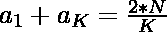
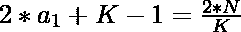

# 求 K 个连续整数，使其和为 N

> 原文:[https://www . geesforgeks . org/find-k-continuous-integer-so-these-these-sum-is-n/](https://www.geeksforgeeks.org/find-k-consecutive-integers-such-that-their-sum-is-n/)

给定两个整数 **N** 和 **K** ，任务是找到 **K** 个连续的整数，使得它们的和 if **N** 。
**注:**如果没有这样的 K 个整数打印-1。
**举例:**

> **输入:** N = 15，K = 5
> **输出:** 1 2 3 4 5
> **说明:**
> N 可以表示为 5 个连续整数之和如下–
> =>N =>1+2+3+4+5 = 15
> **输入:** N = 33， K = 6
> **输出:** 3 4 5 6 7 8
> **说明:**
> N 可以表示为 6 个连续整数之和如下–
> =>N =>3+4+5+6+7+8 = 33

**天真方法:**一个简单的解决方案是运行一个从 i = 0 到 N –( K–1)的循环，以检查从 I 开始的 K 个连续整数是否有和 N.
**有效方法:**想法是使用[算术级数](https://www.geeksforgeeks.org/arithmetic-progression/)来解决这个问题，其中具有公共差的算术级数的 K 个项的和是 1，可以定义如下–

1.  K 项之和–
    =>

2.  进一步求解方程得到第一项可能
    = > 

3.  这里 a <sub>K</sub> 是 K <sup>第</sup>个术语，可以写成<sub>1</sub>+K–1
    =>
    =>

4.  最后，检查计算的第一项是否为整数，如果是，则存在 K 个连续数，其和为 n

以下是上述方法的实现:

## C++

```
// C++ implementation to check if
// a number can be expressed as
// sum of K consecutive integer

#include <bits/stdc++.h>
using namespace std;

// Function to check if a number can be
// expressed as the sum of k consecutive
void checksum(int n, int k)
{
    // Finding the first
    // term of AP
    float first_term = ((2 * n) / k
                        + (1 - k))
                       / 2.0;

    // Checking if first
    // term is an integer
    if (first_term - int(first_term) == 0) {

        // Loop to print the K
        // consecutive integers
        for (int i = first_term;
             i <= first_term + k - 1; i++) {
            cout << i << " ";
        }
    }
    else
        cout << "-1";
}

// Driver Code
int main()
{
    int n = 33, k = 6;
    checksum(n, k);
    return 0;
}
```

## Java 语言(一种计算机语言，尤用于创建网站)

```
// Java implementation to check if
// a number can be expressed as
// sum of K consecutive integer
class GFG{

// Function to check if a number can be
// expressed as the sum of k consecutive
static void checksum(int n, int k)
{

    // Finding the first
    // term of AP
    float first_term = (float) (((2 * n) / k +
                                 (1 - k)) / 2.0);

    // Checking if first
    // term is an integer
    if (first_term - (int)(first_term) == 0)
    {

        // Loop to print the K
        // consecutive integers
        for(int i = (int)first_term;
            i <= first_term + k - 1; i++)
        {
           System.out.print(i + " ");
        }
    }
    else
        System.out.print("-1");
}

// Driver Code
public static void main(String[] args)
{
    int n = 33, k = 6;

    checksum(n, k);
}
}

// This code is contributed by 29AjayKumar
```

## 蟒蛇 3

```
# Python3 implementation to check 
# if a number can be expressed as
# sum of K consecutive integer

# Function to check if a number can be
# expressed as the sum of k consecutive
def checksum(n, k):

    # Finding the first
    # term of AP
    first_term = ((2 * n) / k + (1 - k)) / 2.0

    # Checking if first
    # term is an integer
    if (first_term - int(first_term) == 0):

        # Loop to print the K
        # consecutive integers
        for i in range(int(first_term),
                       int(first_term) + k):
            print(i, end = ' ')
    else:
        print('-1')

# Driver Code
if __name__=='__main__':

    (n, k) = (33, 6)
    checksum(n, k)

# This code is contributed by rutvik_56
```

## C#

```
// C# implementation to check if
// a number can be expressed as
// sum of K consecutive integer
using System;
class GFG{

// Function to check if a number can be
// expressed as the sum of k consecutive
static void checksum(int n, int k)
{

    // Finding the first
    // term of AP
    float first_term = (float)(((2 * n) / k +
                                (1 - k)) / 2.0);

    // Checking if first
    // term is an integer
    if (first_term - (int)(first_term) == 0)
    {

        // Loop to print the K
        // consecutive integers
        for(int i = (int)first_term;
                i <= first_term + k - 1; i++)
        {
            Console.Write(i + " ");
        }
    }
    else
        Console.Write("-1");
}

// Driver Code
public static void Main(String[] args)
{
    int n = 33, k = 6;

    checksum(n, k);
}
}

// This code is contributed by sapnasingh4991
```

## java 描述语言

```
<script>

// javascript implementation to check if
// a number can be expressed as
// sum of K consecutive integer   

// Function to check if a number can be
// expressed as the sum of k consecutive
    function checksum(n , k)
    {
        // Finding the first
        // term of AP
        var first_term =  (((2 * n) / k + (1 - k)) / 2.0);

        // Checking if first
        // term is an integer
        if (first_term - parseInt( (first_term)) == 0) {

            // Loop to prvar the K
            // consecutive integers
            for (i = parseInt( first_term); i <= first_term + k - 1; i++) {
                document.write(i + " ");
            }
        } else
            document.write("-1");
    }

    // Driver Code

        var n = 33, k = 6;

        checksum(n, k);

// This code contributed by Rajput-Ji

</script>
```

**Output:** 

```
3 4 5 6 7 8
```