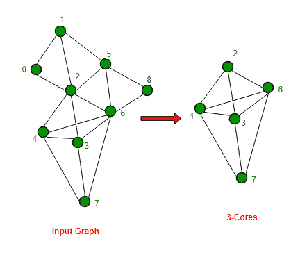

# 求无向图的 k 核

> 原文:[https://www.geeksforgeeks.org/find-k-cores-graph/](https://www.geeksforgeeks.org/find-k-cores-graph/)

给定一个图 G 和一个整数 K，图的 K 核是所有小于 K 度的顶点都被移除后剩下的连通分量(来源 [wiki](https://en.wikipedia.org/wiki/Degeneracy_%28graph_theory%29) )

**示例:**

```
Input : Adjacency list representation of graph shown
        on left side of below diagram
Output: K-Cores : 
[2] -> 3 -> 4 -> 6
[3] -> 2 -> 4 -> 6 -> 7
[4] -> 2 -> 3 -> 6 -> 7
[6] -> 2 -> 3 -> 4 -> 7
[7] -> 3 -> 4 -> 6
```



**我们强烈建议你尽量减少浏览器，先自己试试这个。**
寻找 K 核图的标准算法是从输入图中移除所有度数小于“-K”的顶点。我们必须小心，移除一个顶点会降低与其相邻的所有顶点的度，因此相邻顶点的度也会降到-K 以下。因此，我们可能也需要移除这些顶点。这个过程可能会/可能不会进行，直到图中没有剩余的顶点。

为了实现上述算法，我们对输入图进行改进的离散傅立叶变换，删除所有度数小于“K”的顶点，然后更新所有相邻顶点的度数，如果它们的度数低于“K”，我们也会删除它们。

下面是上述想法的实现。请注意，下面的程序只打印 k 个核心的顶点，但它可以很容易地扩展到打印完整的 k 个核心，因为我们已经修改了邻接表。

## C++14

```
// C++ program to find K-Cores of a graph
#include<bits/stdc++.h>
using namespace std;

// This class represents a undirected graph using adjacency
// list representation
class Graph
{
    int V; // No. of vertices

    // Pointer to an array containing adjacency lists
    list<int> *adj;
public:
    Graph(int V); // Constructor

    // function to add an edge to graph
    void addEdge(int u, int v);

    // A recursive function to print DFS starting from v
    bool DFSUtil(int, vector<bool> &, vector<int> &, int k);

    // prints k-Cores of given graph
    void printKCores(int k);
};

// A recursive function to print DFS starting from v.
// It returns true if degree of v after processing is less
// than k else false
// It also updates degree of adjacent if degree of v
// is less than k. And if degree of a processed adjacent
// becomes less than k, then it reduces of degree of v also,
bool Graph::DFSUtil(int v, vector<bool> &visited,
                    vector<int> &vDegree, int k)
{
    // Mark the current node as visited and print it
    visited[v] = true;

    // Recur for all the vertices adjacent to this vertex
    list<int>::iterator i;
    for (i = adj[v].begin(); i != adj[v].end(); ++i)
    {
        // degree of v is less than k, then degree of adjacent
        // must be reduced
        if (vDegree[v] < k)
            vDegree[*i]--;

        // If adjacent is not processed, process it
        if (!visited[*i])
        {
            // If degree of adjacent after processing becomes
            // less than k, then reduce degree of v also.
            DFSUtil(*i, visited, vDegree, k);
        }
    }

    // Return true if degree of v is less than k
    return (vDegree[v] < k);
}

Graph::Graph(int V)
{
    this->V = V;
    adj = new list<int>[V];
}

void Graph::addEdge(int u, int v)
{
    adj[u].push_back(v);
    adj[v].push_back(u);
}

// Prints k cores of an undirected graph
void Graph::printKCores(int k)
{
    // INITIALIZATION
    // Mark all the vertices as not visited and not
    // processed.
    vector<bool> visited(V, false);
    vector<bool> processed(V, false);

    int mindeg = INT_MAX;
    int startvertex;

    // Store degrees of all vertices
    vector<int> vDegree(V);
    for (int i=0; i<V; i++)
    {
        vDegree[i] = adj[i].size();

        if (vDegree[i] < mindeg)
        {
            mindeg = vDegree[i];
            startvertex=i;
        }
    }

    DFSUtil(startvertex, visited, vDegree, k);

    // If Graph is disconnected.
    for (int i=0; i<V; i++)
        if (visited[i] == false)
            DFSUtil(i, visited, vDegree, k);

    // PRINTING K CORES
    cout << "K-Cores : \n";
    for (int v=0; v<V; v++)
    {
        // Only considering those vertices which have degree
        // >= K after BFS
        if (vDegree[v] >= k)
        {
            cout << "\n[" << v << "]";

            // Traverse adjacency list of v and print only
            // those adjacent which have vDegree >= k after
            // BFS.
            list<int>::iterator itr;
            for (itr = adj[v].begin(); itr != adj[v].end(); ++itr)
                if (vDegree[*itr] >= k)
                    cout << " -> " << *itr;
        }
    }
}

// Driver program to test methods of graph class
int main()
{
    // Create a graph given in the above diagram
    int k = 3;
    Graph g1(9);
    g1.addEdge(0, 1);
    g1.addEdge(0, 2);
    g1.addEdge(1, 2);
    g1.addEdge(1, 5);
    g1.addEdge(2, 3);
    g1.addEdge(2, 4);
    g1.addEdge(2, 5);
    g1.addEdge(2, 6);
    g1.addEdge(3, 4);
    g1.addEdge(3, 6);
    g1.addEdge(3, 7);
    g1.addEdge(4, 6);
    g1.addEdge(4, 7);
    g1.addEdge(5, 6);
    g1.addEdge(5, 8);
    g1.addEdge(6, 7);
    g1.addEdge(6, 8);
    g1.printKCores(k);

    cout << endl << endl;

    Graph g2(13);
    g2.addEdge(0, 1);
    g2.addEdge(0, 2);
    g2.addEdge(0, 3);
    g2.addEdge(1, 4);
    g2.addEdge(1, 5);
    g2.addEdge(1, 6);
    g2.addEdge(2, 7);
    g2.addEdge(2, 8);
    g2.addEdge(2, 9);
    g2.addEdge(3, 10);
    g2.addEdge(3, 11);
    g2.addEdge(3, 12);
    g2.printKCores(k);

    return 0;
}
```

## Java 语言(一种计算机语言，尤用于创建网站)

```
// Java program to find K-Cores of a graph
import java.util.*;

class GFG
{

    // This class represents a undirected graph using adjacency
    // list representation
    static class Graph
    {
        int V; // No. of vertices

        // Pointer to an array containing adjacency lists
        Vector<Integer>[] adj;

        @SuppressWarnings("unchecked")
        Graph(int V)
        {
            this.V = V;
            this.adj = new Vector[V];

            for (int i = 0; i < V; i++)
                adj[i] = new Vector<>();
        }

        // function to add an edge to graph
        void addEdge(int u, int v)
        {
            this.adj[u].add(v);
            this.adj[v].add(u);
        }

        // A recursive function to print DFS starting from v.
        // It returns true if degree of v after processing is less
        // than k else false
        // It also updates degree of adjacent if degree of v
        // is less than k. And if degree of a processed adjacent
        // becomes less than k, then it reduces of degree of v also,
        boolean DFSUtil(int v, boolean[] visited, int[] vDegree, int k)
        {

            // Mark the current node as visited and print it
            visited[v] = true;

            // Recur for all the vertices adjacent to this vertex
            for (int i : adj[v])
            {

                // degree of v is less than k, then degree of adjacent
                // must be reduced
                if (vDegree[v] < k)
                    vDegree[i]--;

                // If adjacent is not processed, process it
                if (!visited[i])
                {

                    // If degree of adjacent after processing becomes
                    // less than k, then reduce degree of v also.
                    DFSUtil(i, visited, vDegree, k);
                }
            }

            // Return true if degree of v is less than k
            return (vDegree[v] < k);
        }

        // Prints k cores of an undirected graph
        void printKCores(int k)
        {

            // INITIALIZATION
            // Mark all the vertices as not visited and not
            // processed.
            boolean[] visited = new boolean[V];
            boolean[] processed = new boolean[V];
            Arrays.fill(visited, false);
            Arrays.fill(processed, false);

            int mindeg = Integer.MAX_VALUE;
            int startvertex = 0;

            // Store degrees of all vertices
            int[] vDegree = new int[V];
            for (int i = 0; i < V; i++)
            {
                vDegree[i] = adj[i].size();

                if (vDegree[i] < mindeg)
                {
                    mindeg = vDegree[i];
                    startvertex = i;
                }
            }
            DFSUtil(startvertex, visited, vDegree, k);

            // DFS traversal to update degrees of all
            // vertices.
            for (int i = 0; i < V; i++)
                if (!visited[i])
                    DFSUtil(i, visited, vDegree, k);

            // PRINTING K CORES
            System.out.println("K-Cores : ");
            for (int v = 0; v < V; v++)
            {

                // Only considering those vertices which have degree
                // >= K after BFS
                if (vDegree[v] >= k)
                {
                    System.out.printf("\n[%d]", v);

                    // Traverse adjacency list of v and print only
                    // those adjacent which have vDegree >= k after
                    // BFS.
                    for (int i : adj[v])
                        if (vDegree[i] >= k)
                            System.out.printf(" -> %d", i);
                }
            }
        }
    }

    // Driver Code
    public static void main(String[] args)
    {

        // Create a graph given in the above diagram
        int k = 3;
        Graph g1 = new Graph(9);
        g1.addEdge(0, 1);
        g1.addEdge(0, 2);
        g1.addEdge(1, 2);
        g1.addEdge(1, 5);
        g1.addEdge(2, 3);
        g1.addEdge(2, 4);
        g1.addEdge(2, 5);
        g1.addEdge(2, 6);
        g1.addEdge(3, 4);
        g1.addEdge(3, 6);
        g1.addEdge(3, 7);
        g1.addEdge(4, 6);
        g1.addEdge(4, 7);
        g1.addEdge(5, 6);
        g1.addEdge(5, 8);
        g1.addEdge(6, 7);
        g1.addEdge(6, 8);
        g1.printKCores(k);

        System.out.println();

        Graph g2 = new Graph(13);
        g2.addEdge(0, 1);
        g2.addEdge(0, 2);
        g2.addEdge(0, 3);
        g2.addEdge(1, 4);
        g2.addEdge(1, 5);
        g2.addEdge(1, 6);
        g2.addEdge(2, 7);
        g2.addEdge(2, 8);
        g2.addEdge(2, 9);
        g2.addEdge(3, 10);
        g2.addEdge(3, 11);
        g2.addEdge(3, 12);
        g2.printKCores(k);
    }
}

// This code is contributed by
// sanjeev2552
```

## 计算机编程语言

```
#saurabh_jain861
# Python program to find K-Cores of a graph
from collections import defaultdict

# This class represents a undirected graph using adjacency
# list representation

class Graph:

    def __init__(self):

        # default dictionary to store graph
        self.graph = defaultdict(list)

    # function to add an edge to undirected graph
    def addEdge(self, u, v):
        self.graph[u].append(v)
        self.graph[v].append(u)

    # A recursive function to call DFS starting from v.
    # It returns true if vDegree of v after processing is less
    # than k else false
    # It also updates vDegree of adjacent if vDegree of v
    # is less than k. And if vDegree of a processed adjacent
    # becomes less than k, then it reduces of vDegree of v also,
    def DFSUtil(self, v, visited, vDegree, k):

        # Mark the current node as visited
        visited.add(v)

        # Recur for all the vertices adjacent to this vertex
        for i in self.graph[v]:

            # vDegree of v is less than k, then vDegree of
            # adjacent must be reduced
            if vDegree[v] < k:
                vDegree[i] = vDegree[i] - 1

            # If adjacent is not processed, process it
            if i not in visited:

                # If vDegree of adjacent after processing becomes
                # less than k, then reduce vDegree of v also
                self.DFSUtil(i, visited, vDegree, k)

    def PrintKCores(self, k):

        visit = set()
        degree = defaultdict(lambda: 0)

        for i in list(self.graph):
            degree[i] = len(self.graph[i])

        for i in list(self.graph):

            if i not in visit:
                self.DFSUtil(i, visit, degree, k)

        # print(degree)
        # print(self.graph)

        for i in list(self.graph):

            if degree[i] >= k:
                print(str("\n [ ") + str(i) + str(" ]"), end=" ")

                for j in self.graph[i]:
                    if degree[j] >= k:
                        print("-> " + str(j), end=" ")

                print()

k = 3
g1 = Graph()
g1.addEdge(0, 1)
g1.addEdge(0, 2)
g1.addEdge(1, 2)
g1.addEdge(1, 5)
g1.addEdge(2, 3)
g1.addEdge(2, 4)
g1.addEdge(2, 5)
g1.addEdge(2, 6)
g1.addEdge(3, 4)
g1.addEdge(3, 6)
g1.addEdge(3, 7)
g1.addEdge(4, 6)
g1.addEdge(4, 7)
g1.addEdge(5, 6)
g1.addEdge(5, 8)
g1.addEdge(6, 7)
g1.addEdge(6, 8)
g1.PrintKCores(k)
```

## C#

```
// C# program to find K-Cores of a graph
using System;
using System.Collections.Generic;

class GFG{

// This class represents a undirected
// graph using adjacency list
// representation
public class Graph
{

    // No. of vertices
    int V;

    // Pointer to an array containing
    // adjacency lists
    List<int>[] adj;

    public Graph(int V)
    {
        this.V = V;
        this.adj = new List<int>[V];

        for(int i = 0; i < V; i++)
            adj[i] = new List<int>();
    }

    // Function to add an edge to graph
    public void addEdge(int u, int v)
    {
        this.adj[u].Add(v);
        this.adj[v].Add(u);
    }

    // A recursive function to print DFS
    // starting from v. It returns true
    // if degree of v after processing
    // is less than k else false
    // It also updates degree of adjacent
    // if degree of v is less than k. And
    // if degree of a processed adjacent
    // becomes less than k, then it reduces
    // of degree of v also,
    bool DFSUtil(int v, bool[] visited,
                 int[] vDegree, int k)
    {

        // Mark the current node as
        // visited and print it
        visited[v] = true;

        // Recur for all the vertices
        // adjacent to this vertex
        foreach (int i in adj[v])
        {

            // Degree of v is less than k,
            // then degree of adjacent
            // must be reduced
            if (vDegree[v] < k)
                vDegree[i]--;

            // If adjacent is not
            // processed, process it
            if (!visited[i])
            {

                // If degree of adjacent after
                // processing becomes less than
                // k, then reduce degree of v also.
                DFSUtil(i, visited, vDegree, k);
            }
        }

        // Return true if degree of
        // v is less than k
        return (vDegree[v] < k);
    }

    // Prints k cores of an undirected graph
    public void printKCores(int k)
    {

        // INITIALIZATION
        // Mark all the vertices as not
        // visited and not processed.
        bool[] visited = new bool[V];
        //bool[] processed = new bool[V];

        int mindeg = int.MaxValue;
        int startvertex = 0;

        // Store degrees of all vertices
        int[] vDegree = new int[V];

        for(int i = 0; i < V; i++)
        {
            vDegree[i] = adj[i].Count;

            if (vDegree[i] < mindeg)
            {
                mindeg = vDegree[i];
                startvertex = i;
            }
        }
        DFSUtil(startvertex, visited, vDegree, k);

        // DFS traversal to update degrees of all
        // vertices.
        for(int i = 0; i < V; i++)
            if (!visited[i])
                DFSUtil(i, visited, vDegree, k);

        // PRINTING K CORES
        Console.WriteLine("K-Cores : ");

        for(int v = 0; v < V; v++)
        {

            // Only considering those vertices
            // which have degree >= K after BFS
            if (vDegree[v] >= k)
            {
                Console.Write("\n " + v);

                // Traverse adjacency list of v
                // and print only those adjacent
                // which have vDegree >= k after
                // BFS.
                foreach(int i in adj[v])
                    if (vDegree[i] >= k)
                        Console.Write(" -> " + i);
            }
        }
    }
}

// Driver Code
public static void Main(String[] args)
{

    // Create a graph given in the
    // above diagram
    int k = 3;

    Graph g1 = new Graph(9);
    g1.addEdge(0, 1);
    g1.addEdge(0, 2);
    g1.addEdge(1, 2);
    g1.addEdge(1, 5);
    g1.addEdge(2, 3);
    g1.addEdge(2, 4);
    g1.addEdge(2, 5);
    g1.addEdge(2, 6);
    g1.addEdge(3, 4);
    g1.addEdge(3, 6);
    g1.addEdge(3, 7);
    g1.addEdge(4, 6);
    g1.addEdge(4, 7);
    g1.addEdge(5, 6);
    g1.addEdge(5, 8);
    g1.addEdge(6, 7);
    g1.addEdge(6, 8);
    g1.printKCores(k);

    Console.WriteLine();

    Graph g2 = new Graph(13);
    g2.addEdge(0, 1);
    g2.addEdge(0, 2);
    g2.addEdge(0, 3);
    g2.addEdge(1, 4);
    g2.addEdge(1, 5);
    g2.addEdge(1, 6);
    g2.addEdge(2, 7);
    g2.addEdge(2, 8);
    g2.addEdge(2, 9);
    g2.addEdge(3, 10);
    g2.addEdge(3, 11);
    g2.addEdge(3, 12);

    g2.printKCores(k);
}
}

// This code is contributed by Princi Singh
```

**输出:**

```
K-Cores : 

[2] -> 3 -> 4 -> 6
[3] -> 2 -> 4 -> 6 -> 7
[4] -> 2 -> 3 -> 6 -> 7
[6] -> 2 -> 3 -> 4 -> 7
[7] -> 3 -> 4 -> 6

K-Cores : 
```

**上述解的时间复杂度**为 O(V + E)，其中 V 为顶点数，E 为边数。

**相关概念:**
简并度:图的简并度是最大值 k，使得图具有 k 核。例如，上面显示的图表有 3 个内核，没有 4 个或更多内核。因此，上面的图是 3-退化的。
图的退化性用来衡量图有多稀疏。

**参考:**
https://en.wikipedia.org/wiki/Degeneracy_%28graph_theory%29
本文由 **Rachit Belwariar** 供稿。如果你发现任何不正确的地方，或者你想分享更多关于上面讨论的话题的信息，请写评论。