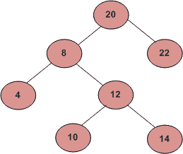

# 查找 BST 中的第 k 个最小元素(BST 中的顺序统计)

> 原文:[https://www . geesforgeks . org/find-k-th-最小元素-in-BST-order-statistics-in-BST/](https://www.geeksforgeeks.org/find-k-th-smallest-element-in-bst-order-statistics-in-bst/)

给定一个二叉查找树的根和 K 作为输入，在 BST 中找到第 K 个最小的元素。
比如下面的 BST，如果 k = 3，那么输出应该是 10，如果 k = 5，那么输出应该是 14。



**方法 1:使用有序遍历(O(n)时间和 O(h)辅助空间)**
一个 [BST](https://www.geeksforgeeks.org/binary-search-tree-set-1-search-and-insertion/) 的[有序遍历](http://www.geeksforgeeks.org/tree-traversals-inorder-preorder-and-postorder/)以递增的顺序遍历节点。所以我们的想法是在 Inorder 中遍历树。遍历时，记录访问的节点数。如果计数变成 k，打印节点。

## C++

```
// A simple inorder traversal based C++ program
// to find k-th smallest element in a BST.
#include <iostream>
using namespace std;

// A BST node
struct Node {
    int data;
    Node *left, *right;
    Node(int x)
    {
        data = x;
        left = right = NULL;
    }
};

// Recursive function to insert an key into BST
Node* insert(Node* root, int x)
{
    if (root == NULL)
        return new Node(x);
    if (x < root->data)
        root->left = insert(root->left, x);
    else if (x > root->data)
        root->right = insert(root->right, x);
    return root;
}

// Function to find k'th smallest element in BST
// Here count denotes the number of nodes processed so far
Node* kthSmallest(Node* root, int& k)
{
    // base case
    if (root == NULL)
        return NULL;

    // search in left subtree
    Node* left = kthSmallest(root->left, k);

    // if k'th smallest is found in left subtree, return it
    if (left != NULL)
        return left;

    // if current element is k'th smallest, return it
    k--;
    if (k == 0)
        return root;

    // else search in right subtree
    return kthSmallest(root->right, k);
}

// Function to print k'th smallest element in BST
void printKthSmallest(Node* root, int k)
{
    // maintain index to count number of nodes processed so far
    int count = 0;
    Node* res = kthSmallest(root, k);
    if (res == NULL)
        cout << "There are less than k nodes in the BST";
    else
        cout << "K-th Smallest Element is " << res->data;
}

// main function
int main()
{
    Node* root = NULL;
    int keys[] = { 20, 8, 22, 4, 12, 10, 14 };

    for (int x : keys)
        root = insert(root, x);

    int k = 3;
    printKthSmallest(root, k);
    return 0;
}
```

## Java 语言(一种计算机语言，尤用于创建网站)

```
// A simple inorder traversal based Java program
// to find k-th smallest element in a BST.

import java.io.*;
// A BST node
class Node {
    int data;
    Node left, right;
    Node(int x)
    {
        data = x;
        left = right = null;
    }
}

class GFG {

    static int count = 0;
    // Recursive function to insert an key into BST
    public static Node insert(Node root, int x)
    {
        if (root == null)
            return new Node(x);
        if (x < root.data)
            root.left = insert(root.left, x);
        else if (x > root.data)
            root.right = insert(root.right, x);
        return root;
    }

    // Function to find k'th largest element in BST
    // Here count denotes the number
    // of nodes processed so far
    public static Node kthSmallest(Node root, int k)
    {
        // base case
        if (root == null)
            return null;

        // search in left subtree
        Node left = kthSmallest(root.left, k);

        // if k'th smallest is found in left subtree, return it
        if (left != null)
            return left;

        // if current element is k'th smallest, return it
        count++;
        if (count == k)
            return root;

        // else search in right subtree
        return kthSmallest(root.right, k);
    }

    // Function to find k'th largest element in BST
    public static void printKthSmallest(Node root, int k)
    {
        // maintain an index to count number of
        // nodes processed so far
        count = 0;

        Node res = kthSmallest(root, k);
        if (res == null)
            System.out.println("There are less "
                        + "than k nodes in the BST");
        else
            System.out.println("K-th Smallest"
                    + " Element is " + res.data);
    }

    public static void main (String[] args) {

        Node root = null;
        int keys[] = { 20, 8, 22, 4, 12, 10, 14 };

        for (int x : keys)
            root = insert(root, x);

        int k = 3;
        printKthSmallest(root, k);

    }
}
```

## 蟒蛇 3

```
# A simple inorder traversal based Python3
# program to find k-th smallest element
# in a BST.

# A BST node
class Node:

    def __init__(self, key):

        self.data = key
        self.left = None
        self.right = None

# Recursive function to insert an key into BST
def insert(root, x):

    if (root == None):
        return Node(x)
    if (x < root.data):
        root.left = insert(root.left, x)
    elif (x > root.data):
        root.right = insert(root.right, x)
    return root

# Function to find k'th largest element
# in BST. Here count denotes the number
# of nodes processed so far
def kthSmallest(root):

    global k

    # Base case
    if (root == None):
        return None

    # Search in left subtree
    left = kthSmallest(root.left)

    # If k'th smallest is found in
    # left subtree, return it
    if (left != None):
        return left

    # If current element is k'th
    # smallest, return it
    k -= 1
    if (k == 0):
        return root

    # Else search in right subtree
    return kthSmallest(root.right)

# Function to find k'th largest element in BST
def printKthSmallest(root):

    # Maintain index to count number
    # of nodes processed so far
    count = 0
    res = kthSmallest(root)

    if (res == None):
        print("There are less than k nodes in the BST")
    else:
        print("K-th Smallest Element is ", res.data)

# Driver code
if __name__ == '__main__':

    root = None
    keys = [ 20, 8, 22, 4, 12, 10, 14 ]

    for x in keys:
        root = insert(root, x)

    k = 3

    printKthSmallest(root)

# This code is contributed by mohit kumar 29
```

## C#

```
// A simple inorder traversal
// based C# program to find
// k-th smallest element in a BST.
using System;

// A BST node
class Node{

public int data;
public Node left, right;
public Node(int x)
{
  data = x;
  left = right = null;
}
}

class GFG{

static int count = 0;

// Recursive function to 
// insert an key into BST
public static Node insert(Node root,
                          int x)
{
  if (root == null)
    return new Node(x);
  if (x < root.data)
    root.left = insert(root.left, x);
  else if (x > root.data)
    root.right = insert(root.right, x);
  return root;
}

// Function to find k'th largest
// element in BST. Here count
// denotes the number of nodes
// processed so far
public static Node kthSmallest(Node root,
                               int k)
{
  // base case
  if (root == null)
    return null;

  // search in left subtree
  Node left = kthSmallest(root.left, k);

  // if k'th smallest is found
  // in left subtree, return it
  if (left != null)
    return left;

  // if current element is
  // k'th smallest, return it
  count++;
  if (count == k)
    return root;

  // else search in right subtree
  return kthSmallest(root.right, k);
}

// Function to find k'th largest
// element in BST
public static void printKthSmallest(Node root,
                                    int k)
{
  // Maintain an index to
  // count number of nodes
  // processed so far
  count = 0;

  Node res = kthSmallest(root, k);

  if (res == null)
    Console.WriteLine("There are less " +
                      "than k nodes in the BST");
  else
    Console.WriteLine("K-th Smallest" +
                      " Element is " + res.data);
}

// Driver code
public static void Main(String[] args)
{

  Node root = null;
  int []keys = {20, 8, 22, 4,
                12, 10, 14};

  foreach (int x in keys)
    root = insert(root, x);

  int k = 3;
  printKthSmallest(root, k);
}
}

// This code is contributed by gauravrajput1
```

## java 描述语言

```
<script>
// A simple inorder traversal based Javascript program
// to find k-th smallest element in a BST.

    // A BST node
    class Node
    {
        constructor(x) {
            this.data = x;
            this.left = null;
            this.right = null;
          }
    }

    let count = 0;

    // Recursive function to insert an key into BST
    function insert(root,x)
    {
        if (root == null)
            return new Node(x);
        if (x < root.data)
            root.left = insert(root.left, x);
        else if (x > root.data)
            root.right = insert(root.right, x);
        return root;
    }

    // Function to find k'th largest element in BST
    // Here count denotes the number
    // of nodes processed so far
    function kthSmallest(root,k)
    {
        // base case
        if (root == null)
            return null;

        // search in left subtree
        let left = kthSmallest(root.left, k);

        // if k'th smallest is found in left subtree, return it
        if (left != null)
            return left;

        // if current element is k'th smallest, return it
        count++;
        if (count == k)
            return root;

        // else search in right subtree
        return kthSmallest(root.right, k);
    }

    // Function to find k'th largest element in BST
    function printKthSmallest(root,k)
    {
        // maintain an index to count number of
        // nodes processed so far
        count = 0;

        let res = kthSmallest(root, k);
        if (res == null)
            document.write("There are less "
                        + "than k nodes in the BST");
        else
            document.write("K-th Smallest"
                    + " Element is " + res.data);
    }

    let root=null;
    let key=[20, 8, 22, 4, 12, 10, 14 ];
    for(let i=0;i<key.length;i++)
    {
        root = insert(root, key[i]);
    }

    let k = 3;
    printKthSmallest(root, k);

    // This code is contributed by unknown2108
</script>
```

**Output:** 

```
K-th Smallest Element is 10
```