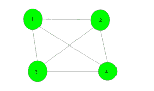
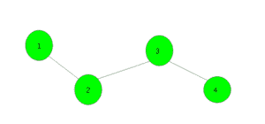

# 找出图中与至少一个剩余顶点相连的 K 个顶点

> 原文:[https://www . geeksforgeeks . org/find-k-图中与至少一个剩余顶点相连的顶点/](https://www.geeksforgeeks.org/find-k-vertices-in-the-graph-which-are-connected-to-at-least-one-of-remaining-vertices/)

给定一个有 **N 个**顶点的连通图。任务是从图中选择 k 个(k 必须小于或等于 n/2，不一定是最小值)顶点，使得所有这些选择的顶点都连接到至少一个未选择的顶点。如果有多个答案，打印其中任何一个。

**示例:**

> **输入:**
> 
> 
> 
> **输出:** 1
> 顶点 1 连接到所有其他未选择的顶点。这里
> {1，2}、{2，3}、{3，4}、{1，3}、{1，4}、{2，4}也是有效答案
> 
> **输入:**
> 
> 
> 
> **输出:** 1 3
> 顶点 1、3 连接到所有其他未选择的顶点。{2，4}也是一个有效的答案。

**高效方法**:一种高效的方法是使用简单的 [dfs](https://www.geeksforgeeks.org/depth-first-traversal-for-a-graph/) 或 [bfs](https://www.geeksforgeeks.org/breadth-first-traversal-for-a-graph/) 函数来寻找偶数级和奇数级的顶点。然后，如果奇数层的顶点少于偶数层的顶点，则打印奇数层的顶点。否则，打印偶数层顶点。

下面是上述方法的实现:

## C++

```
// C++ program to find K vertices in
// the graph which are connected to at
// least one of remaining vertices
#include <bits/stdc++.h>
using namespace std;
#define N 200005

// To store graph
int n, m, vis[N];
vector<int> gr[N];
vector<int> v[2];

// Function to add edge
void add_edges(int x, int y)
{
    gr[x].push_back(y);
    gr[y].push_back(x);
}

// Function to find level of each node
void dfs(int x, int state)
{
    // Push the vertex in respected level
    v[state].push_back(x);

    // Make vertex visited
    vis[x] = 1;

    // Traverse for all it's child nodes
    for (auto i : gr[x])
        if (vis[i] == 0)
            dfs(i, state ^ 1);
}

// Function to print vertices
void Print_vertices()
{
    // If odd level vertices are less
    if (v[0].size() < v[1].size()) {
        for (auto i : v[0])
            cout << i << " ";
    }
    // If even level vertices are less
    else {
        for (auto i : v[1])
            cout << i << " ";
    }
}

// Driver code
int main()
{
    int n = 4, m = 3;

    // Add edges
    add_edges(1, 2);
    add_edges(2, 3);
    add_edges(3, 4);

    // Function call
    dfs(1, 0);

    Print_vertices();

    return 0;
}
```

## Java 语言(一种计算机语言，尤用于创建网站)

```
// Java program to find K vertices in
// the graph which are connected to at
// least one of remaining vertices
import java.util.*;

class GFG
{

    static final int N = 200005;

    // To store graph
    static int n, m;
    static int[] vis = new int[N];
    static Vector<Integer>[] gr = new Vector[N];
    static Vector<Integer>[] v = new Vector[2];

    // Function to add edge
    static void add_edges(int x, int y)
    {
        gr[x].add(y);
        gr[y].add(x);
    }

    // Function to find level of each node
    static void dfs(int x, int state)
    {
        // Push the vertex in respected level
        v[state].add(x);

        // Make vertex visited
        vis[x] = 1;

        // Traverse for all it's child nodes
        for (int i : gr[x])
        {
            if (vis[i] == 0)
            {
                dfs(i, state ^ 1);
            }
        }
    }

    // Function to print vertices
    static void Print_vertices()
    {
        // If odd level vertices are less
        if (v[0].size() < v[1].size())
        {
            for (int i : v[0])
            {
                System.out.print(i + " ");
            }
        }

        // If even level vertices are less
        else
        {
            for (int i : v[1])
            {
                System.out.print(i + " ");
            }
        }
    }

    // Driver code
    public static void main(String[] args)
    {
        n = 4;
        m = 3;
        for (int i = 0; i < N; i++)
        {
            gr[i] = new Vector<Integer>();
        }
        for (int i = 0; i < 2; i++)
        {
            v[i] = new Vector<Integer>();
        }

        // Add edges
        add_edges(1, 2);
        add_edges(2, 3);
        add_edges(3, 4);

        // Function call
        dfs(1, 0);

        Print_vertices();
    }
}

// This code is contributed by 29AjayKumar
```

## 蟒蛇 3

```
# Python3 program to find K vertices in
# the graph which are connected to at
# least one of remaining vertices

N = 200005

# To store graph
n, m, =0,0
vis=[0 for i in range(N)]
gr=[[] for i in range(N)]
v=[[] for i in range(2)]

# Function to add edge
def add_edges(x, y):
    gr[x].append(y)
    gr[y].append(x)

# Function to find level of each node
def dfs(x, state):

    # Push the vertex in respected level
    v[state].append(x)

    # Make vertex visited
    vis[x] = 1

    # Traverse for all it's child nodes
    for i in gr[x]:
        if (vis[i] == 0):
            dfs(i, state ^ 1)

# Function to prvertices
def Print_vertices():

    # If odd level vertices are less
    if (len(v[0]) < len(v[1])):
        for i in v[0]:
            print(i,end=" ")
    # If even level vertices are less
    else:
        for i in v[1]:
            print(i,end=" ")

# Driver code

n = 4
m = 3

# Add edges
add_edges(1, 2)
add_edges(2, 3)
add_edges(3, 4)

# Function call
dfs(1, 0)

Print_vertices()

# This code is contributed by mohit kumar 29
```

## C#

```
    // C# program to find K vertices in
// the graph which are connected to at
// least one of remaining vertices
using System;
using System.Collections.Generic;

class GFG
{
    static readonly int N = 200005;

    // To store graph
    static int n, m;
    static int[] vis = new int[N];
    static List<int>[] gr = new List<int>[N];
    static List<int>[] v = new List<int>[2];

    // Function to add edge
    static void add_edges(int x, int y)
    {
        gr[x].Add(y);
        gr[y].Add(x);
    }

    // Function to find level of each node
    static void dfs(int x, int state)
    {
        // Push the vertex in respected level
        v[state].Add(x);

        // Make vertex visited
        vis[x] = 1;

        // Traverse for all it's child nodes
        foreach (int i in gr[x])
        {
            if (vis[i] == 0)
            {
                dfs(i, state ^ 1);
            }
        }
    }

    // Function to print vertices
    static void Print_vertices()
    {
        // If odd level vertices are less
        if (v[0].Count < v[1].Count)
        {
            foreach (int i in v[0])
            {
                Console.Write(i + " ");
            }
        }

        // If even level vertices are less
        else
        {
            foreach (int i in v[1])
            {
                Console.Write(i + " ");
            }
        }
    }

    // Driver code
    public static void Main(String[] args)
    {
        n = 4;
        m = 3;
        for (int i = 0; i < N; i++)
        {
            gr[i] = new List<int>();
        }
        for (int i = 0; i < 2; i++)
        {
            v[i] = new List<int>();
        }

        // Add edges
        add_edges(1, 2);
        add_edges(2, 3);
        add_edges(3, 4);

        // Function call
        dfs(1, 0);

        Print_vertices();
    }
}

// This code is contributed by Rajput-Ji
```

## java 描述语言

```
<script>

// Javascript program to find K vertices in
// the graph which are connected to at
// least one of remaining vertices
let N = 200005;

// To store graph
let n, m;
let vis = new Array(N);
for(let i = 0; i < N; i++)
{
    vis[i] = 0;
}

let gr = new Array(N);
let  v = new Array(2);

// Function to add edge
function add_edges(x, y)
{
    gr[x].push(y);
    gr[y].push(x);
}

// Function to find level of each node   
function dfs(x, state)
{

    // Push the vertex in respected level
    v[state].push(x);

    // Make vertex visited
    vis[x] = 1;

    // Traverse for all it's child nodes
    for(let i = 0; i < gr[x].length; i++)
    {
        if (vis[gr[x][i]] == 0)
        {
            dfs(gr[x][i], (state ^ 1));
        }
    }
}

// Function to print vertices
function Print_vertices()
{

    // If odd level vertices are less
    if (v[0].length < v[1].length)
    {
        for(let i = 0; i < v[0].length; i++)
        {
            document.write(v[0][i] + " ");
        }
    }

    // If even level vertices are less
    else
    {
        for(let i = 0; i < v[1].length; i++)
        {
            document.write(v[1][i] + " ");
        }
    }
}

// Driver code
n = 4;
m = 3;
for(let i = 0; i < N; i++)
{
    gr[i] = [];
}
for(let i = 0; i < 2; i++)
{
    v[i] = [];
}

// Add edges
add_edges(1, 2);
add_edges(2, 3);
add_edges(3, 4);

// Function call
dfs(1, 0);

Print_vertices();

// This code is contributed by unknown2108

</script>
```

**Output:** 

```
2 4
```

**时间复杂度:** O(V+E)
其中 V 是图中的顶点数，E 是图中的边数。