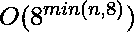

# 找到长度为 N 的第 k 个字典序数值串，每个子串有不同的乘积

> 原文:[https://www . geesforgeks . org/find-kth-字典序-长度为 n 的数字串-每个子串的不同乘积/](https://www.geeksforgeeks.org/find-kth-lexicographical-ordered-numeric-string-of-length-n-with-distinct-products-of-each-substring/)

给定两个整数 **N** 和 **K** ，任务是找到长度为 N 的[**Kth** 字典序字符串，它具有每个子字符串的不同乘积，如果这样的字符串不存在，则返回-1。](https://www.geeksforgeeks.org/k-th-lexicographical-string-of-given-length/)

**例**:

> **输入:** N = 3，K = 4
> **输出:** 238
> **说明:**有效字符串系列为“234”、“235”、“237”、“238”。系列中的第四个字符串是“238”，其所有子字符串{2，3，8，6，24，48}的乘积是不同的。
> 
> **输入:** N = 1，K = 11
> **输出:** -1
> **说明:**长度 1 的有效字符串只有 10 个:“0”、“1”、“2”、“3”、“4”、“5”、“6”、“7”、“8”、“9”。

**方法:**这个问题可以用[递归来解决。](https://www.geeksforgeeks.org/recursion/)递归检查长度为 **N** 的所有可能的数字串，并找到每个子串具有不同乘积的 **Kth** 有效数字串。

按照以下步骤解决问题:

*   请注意，当任意两个字符在字符串中重复时，它将不是有效的字符串，因为长度为 1 的两个子字符串将是相同的乘积。
*   所有长度为 N > 10 的字符串都没有答案，因为至少会重复一个字符。
*   对于长度大于 1 的字符串，其中包含“1”或“0”的字符串将无效，因为与这些字符相乘的任何数字都将相同或转换为 0。
*   维护一个递归函数来计算字符为“0”->“1”的所有可能的字符串。
*   跟踪到目前为止的所有产品，如果产品重复，则立即退出该功能。
*   从 0->9 开始一个接一个，如果得到一个有效的字符串，那么减少 K。对于任何字符串 S，如果 K 变成 0，这个字符串将是最终的答案。

下面是上述方法的实现:

## C++

```
// C++ program for the above approach
#include <bits/stdc++.h>
using namespace std;

// Function to find the required string
void getString(int curlen, string& ans,
               string& s, int N,
               int& K, vector<int>& prod)
{
    // If the current length is
    // equal to n exit from here only
    if (curlen == N) {
        K--;
        if (K == 0)
            ans = s;
        return;
    }

    char ch;
    int ok, t, i;

    // Iterate for all the characters
    for (ch = '2'; ch <= '9'; ch++) {
        s += ch;
        ok = 1;
        t = 1;
        for (i = curlen; i >= 0; i--) {
            t *= s[i] - 48;

            // Check if the product
            // is present before
            if (prod[t])
                ok = 0;
            prod[t]++;
        }

        // If the current string is good
        // then recurse for
        // the next character
        if (ok)
            getString(curlen + 1, ans,
                      s, N, K, prod);
        t = 1;

        // Decrease all the products back
        // to their original state
        for (i = curlen; i >= 0; i--) {
            t *= s[i] - 48;
            prod[t]--;
        }

        // Erase the last character
        s.erase(s.length() - 1);
    }
}

// Function to calculate
// kth ordered valid string
string kthValidString(int N, int K)
{
    // Check for the base cases
    if (N > 10) {
        return "-1";
    }
    if (N == 1) {
        // There are atmost 10
        // valid strings for n = 1
        if (K > 10) {
            return "-1";
        }
        string s = "";
        K--;
        s += (K + '0');
        return s;
    }

    string ans = "-1";
    string s = "";

    // Vector to keep a check on
    // number of occurences of products
    vector<int> prod(10005, 0);

    // Recursively construct the strings
    getString(0, ans, s, N, K, prod);
    return ans;
}

// Driver Code
int main()
{
    int N = 3, K = 4;
    cout << kthValidString(N, K);
}
```

## Java 语言(一种计算机语言，尤用于创建网站)

```
// Java program for the above approach

import java.util.*;

class GFG{
    static String ans,s;
    static int  K;
// Function to find the required String
static void getString(int curlen, int N, int[] prod)
{
    // If the current length is
    // equal to n exit from here only
    if (curlen == N) {
        K--;
        if (K == 0)
            ans = s;
        return;
    }

    char ch;
    int ok, t, i;

    // Iterate for all the characters
    for (ch = '2'; ch <= '9'; ch++) {
        s += ch;
        ok = 1;
        t = 1;
        for (i = curlen ; i >= 0 && s.length()>i; i--) {
            t *= s.charAt(i) - 48;

            // Check if the product
            // is present before
            if (prod[t]!=0)
                ok = 0;
            prod[t]++;
        }

        // If the current String is good
        // then recurse for
        // the next character
        if (ok!=0)
            getString(curlen + 1, N, prod);
        t = 1;

        // Decrease all the products back
        // to their original state
        for (i = curlen; i >= 0&& s.length()>i; i--) {
            t *= s.charAt(i) - 48;
            prod[t]--;
        }

        // Erase the last character
        if(s.length()>0)
        s=s.substring(0,s.length() - 1);
    }
}

// Function to calculate
// kth ordered valid String
static String kthValidString(int N)
{
    // Check for the base cases
    if (N > 10) {
        return "-1";
    }
    if (N == 1) {
        // There are atmost 10
        // valid Strings for n = 1
        if (K > 10) {
            return "-1";
        }
        String s = "";
        K--;
        s += (K + '0');
        return s;
    }

    ans = "-1";
    s = "";

    // Vector to keep a check on
    // number of occurences of products
    int []prod = new int[10005];

    // Recursively construct the Strings
    getString(0, N, prod);
    return ans;
}

// Driver Code
public static void main(String[] args)
{
    int N = 3;
    K = 4;
    System.out.print(kthValidString(N));
}
}
// This code contributed by shikhasingrajput
```

## C#

```
// C# program for the above approach
using System;

class GFG{

static String ans,s;
static int  K;

// Function to find the required String
static void getString(int curlen, int N, int[] prod)
{

    // If the current length is
    // equal to n exit from here only
    if (curlen == N)
    {
        K--;

        if (K == 0)
            ans = s;

        return;
    }

    char ch;
    int ok, t, i;

    // Iterate for all the characters
    for(ch = '2'; ch <= '9'; ch++)
    {
        s += ch;
        ok = 1;
        t = 1;

        for(i = curlen ; i >= 0 && s.Length>i; i--)
        {
            t *= s[i] - 48;

            // Check if the product
            // is present before
            if (prod[t] != 0)
                ok = 0;

            prod[t]++;
        }

        // If the current String is good
        // then recurse for
        // the next character
        if (ok != 0)
            getString(curlen + 1, N, prod);

        t = 1;

        // Decrease all the products back
        // to their original state
        for(i = curlen; i >= 0 && s.Length>i; i--)
        {
            t *= s[i] - 48;
            prod[t]--;
        }

        // Erase the last character
        if (s.Length > 0)
            s = s.Substring(0,s.Length - 1);
    }
}

// Function to calculate
// kth ordered valid String
static String kthValidString(int N)
{
    String s = "";

    // Check for the base cases
    if (N > 10)
    {
        return "-1";
    }
    if (N == 1)
    {

        // There are atmost 10
        // valid Strings for n = 1
        if (K > 10)
        {
            return "-1";
        }
        s = "";
        K--;
        s += (K + '0');
        return s;
    }

    ans = "-1";
    s = "";

    // List to keep a check on
    // number of occurences of products
    int []prod = new int[10005];

    // Recursively construct the Strings
    getString(0, N, prod);
    return ans;
}

// Driver Code
public static void Main(String[] args)
{
    int N = 3;
    K = 4;

    Console.Write(kthValidString(N));
}
}

// This code is contributed by 29AjayKumar
```

## 蟒蛇 3

```
# Java program for the above approach
s = ''
K = 0

# Function to find the required String
def getString(curlen, N, prod):
    global s, K
    # If the current length is
    # equal to n exit from here only
    if (curlen == N):
        K -= 1
        if (K == 0):
            ans = s
        return

    # Iterate for all the characters
    ch = '2'
    while(ch <= '9'):
        s = chr(ord(s)+ ord(ch))
        ok = 1
        t = 1
        i = curlen
        ch = chr(ord(ch) + 1)
        while(i >= 0 and len(s)) :
            t *= ord(s[i]) - 48

            # Check if the product
            # is present before
            if (prod[t] != 0):
                ok = 0
            prod[t] += 1
            i -= 1

        # If the current String is good
        # then recurse for
        # the next character
        if (ok != 0):
            getString(curlen + 1, N, prod)
        t = 1

        # Decrease all the products back
        # to their original state
        i = curlen
        while(i >= 0 and len(s)>i):
            i-=1
            t *= ord(s[i]) - 48
            prod[t] -= 1

        # Erase the last character
        if(len(s)>0):
            s = s[0: len(s) - 1]

# Function to calculate
# kth ordered valid String
def kthValidString(N):

    # Check for the base cases
    if (N > 10):
        return "-1"

    if (N == 1):
        # There are atmost 10
        # valid Strings for n = 1
        if (K > 10):
            return "-1"

        s = ""
        K-=1
        s += (K + '0')
        return s

    ans = "-1"
    s = ""

    # Vector to keep a check on
    # number of occurences of products
    prod = [0]*10005

    # Recursively construct the Strings
    getString(0, N, prod)
    return ans

# Driver Code
N = 3
K = 4
print(kthValidString(N))

# This code is contributed by shikhasingrajput
```

## java 描述语言

```
<script>
// JavaScript program for the above approach
    var ans,s;
    var  K;

// Function to find the required String
function getString(curlen, N, prod)
{

    // If the current length is
    // equal to n exit from here only
    if (curlen == N) {
        K--;
        if (K == 0)
            ans = s;
        return;
    }

    var ch;
    var ok, t, i;

    // Iterate for all the characters
    for (ch = '2'; ch <= '9'; ch++) {
        s += ch;
        ok = 1;
        t = 1;
        for (i = curlen ; i >= 0 && s.length > i; i--) {
            t *= s.charAt(i) - 48;

            // Check if the product
            // is present before
            if (prod[t] != 0)
                ok = 0;
            prod[t]++;
        }

        // If the current String is good
        // then recurse for
        // the next character
        if (ok!=0)
            getString(curlen + 1, N, prod);
        t = 1;

        // Decrease all the products back
        // to their original state
        for (i = curlen; i >= 0&& s.length > i; i--) {
            t *= s.charAt(i) - 48;
            prod[t]--;
        }

        // Erase the last character
        if(s.length>0)
        s = s.substring(0,s.length - 1);
    }
}

// Function to calculate
// kth ordered valid String
function kthValidString(N)
{

    // Check for the base cases
    if (N > 10) {
        return "-1";
    }
    if (N == 1)
    {

        // There are atmost 10
        // valid Strings for n = 1
        if (K > 10) {
            return "-1";
        }
        var s = "";
        K--;
        s += (K + '0');
        return s;
    }

    var ans = "1";
    var s = "";

    // Vector to keep a check on
    // number of occurences of products
    var prod = new Array(10005);

    // Recursively construct the Strings
    getString(0, N, prod);
    return ans;
}

// Driver Code
    var N = 3;
    var K = 4;
    document.write(kthValidString(N));

// This code is contributed by shivanisinghss2110

</script>
```

**Output**

```
238
```

**时间复杂度:** 

**辅助空间:** 