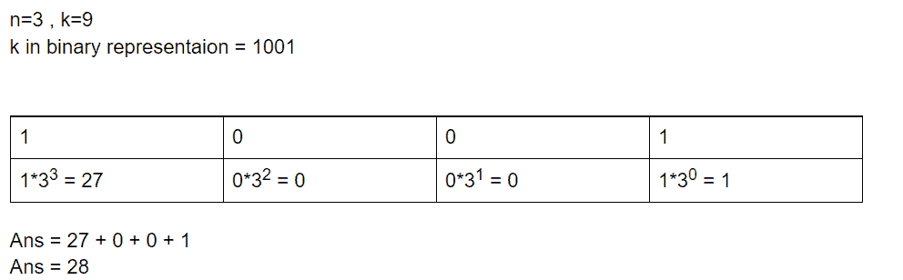

# 求可以写成 N 的不同次方之和的第 k 个数

> 原文:[https://www . geesforgeks . org/find-kth-number-可写成 n 的不同幂的和/](https://www.geeksforgeeks.org/find-kth-number-that-can-be-written-as-sum-of-different-powers-of-n/)

给定两个正整数 **N** 和 **K** 。任务是找到可以写成 **N** 不同非负幂之和的 **Kth** 数。

**示例:**

> **输入:** N = 3， K = 4
> **输出:** 9
> **说明:**
> 第一个可以写成 3 次幂和的数是【1 = 3<sup>0</sup>】
> 第二个可以写成 3 次幂和的数是【3 = 3<sup>1</sup>
> 第三个可以写成 3 次幂和的数是【4 = 3 <sup>0</sup> + 3 <sup>1</sup>
> 第四个可以写成 3 的幂和的数是【9 = 3】<sup>2</sup>
> 所以答案是 9。
> 
> **输入:** N = 2，K = 12
> **输出:** 12

**方法:**这个问题可以用[十进制到二进制转换](https://www.geeksforgeeks.org/program-decimal-binary-conversion/)的概念来解决。其思想是找到 K 的二进制表示，并开始从最低有效位迭代到最高有效位。如果设置了当前位，则在答案中包含相应的 N 次方，否则跳过该位。参考下图更好理解。



举例:当 N = 3，K = 9 时

下面是上述方法的实现:

## C++

```
// C++ program for the above approach
#include <bits/stdc++.h>
using namespace std;

// Function to find Kth number that can be
// represented as sum of different
// non-negative powers of N
int FindKthNum(int n, int k)
{
    // To store the ans
    int ans = 0;

    // Value of current power of N
    int currPowOfN = 1;

    // Iterating through bits of K
    // from LSB to MSB
    while (k) {
        // If the current bit is 1 then include
        // corresponding power of n into ans
        if (k & 1) {
            ans = ans + currPowOfN;
        }

        currPowOfN = currPowOfN * n;
        k = k / 2;
    }

    // Return the result
    return ans;
}

// Driver Code
int main()
{
    int N = 3;
    int K = 4;

    cout << FindKthNum(N, K);
}
```

## Java 语言(一种计算机语言，尤用于创建网站)

```
// Java program for the above approach
class GFG
{

  // Function to find Kth number that can be
  // represented as sum of different
  // non-negative powers of N
  static int FindKthNum(int n, int k)
  {

      // To store the ans
      int ans = 0;

      // Value of current power of N
      int currPowOfN = 1;

      // Iterating through bits of K
      // from LSB to MSB
      while (k > 0)
      {

          // If the current bit is 1 then include
          // corresponding power of n into ans
          if ((k & 1) == 1) {
              ans = ans + currPowOfN;
          }

          currPowOfN = currPowOfN * n;
          k = k / 2;
      }

      // Return the result
      return ans;
  }

  // Driver Code
  public static void main(String []args)
  {
      int N = 3;
      int K = 4;

      System.out.println(FindKthNum(N, K));
  }

}

// This Code is contributed by ihritik
```

## 蟒蛇 3

```
# Python program for the above approach

# Function to find Kth number that can be
# represented as sum of different
# non-negative powers of N
def FindKthNum(n, k):

  # To store the ans
  ans = 0

  # value of current power of N
  currPowOfN = 1

  # Iterating through bits of K
  # from LSB to MSB
  while (k > 0):

    # If the current bit is 1 then include
    # corresponding power of n into ans
    if ((k & 1) == 1) :
      ans = ans + currPowOfN

    currPowOfN = currPowOfN * n
    k = k // 2

  # Return the result
  return ans

# Driver Code

N = 3
K = 4
print(FindKthNum(N, K));

# This Code is contributed by ihritik
```

## C#

```
// C# program for the above approach
using System;
class GFG
{

  // Function to find Kth number that can be
  // represented as sum of different
  // non-negative powers of N
  static int FindKthNum(int n, int k)
  {

      // To store the ans
      int ans = 0;

      // Value of current power of N
      int currPowOfN = 1;

      // Iterating through bits of K
      // from LSB to MSB
      while (k > 0)
      {

          // If the current bit is 1 then include
          // corresponding power of n into ans
          if ((k & 1) == 1) {
              ans = ans + currPowOfN;
          }

          currPowOfN = currPowOfN * n;
          k = k / 2;
      }

      // Return the result
      return ans;
  }

  // Driver Code
  public static void Main()
  {
      int N = 3;
      int K = 4;

      Console.WriteLine(FindKthNum(N, K));
  }

}

// This Code is contributed by ihritik
```

## java 描述语言

```
<script>
// JavaScript program for the above approach

// Function to find Kth number that can be
// represented as sum of different
// non-negative powers of N
function FindKthNum(n, k)
{

    // To store the ans
    let ans = 0;

    // Value of current power of N
    let currPowOfN = 1;

    // Iterating through bits of K
    // from LSB to MSB
    while (k)
    {

        // If the current bit is 1 then include
        // corresponding power of n into ans
        if (k & 1)
        {
            ans = ans + currPowOfN;
        }

        currPowOfN = currPowOfN * n;
        k = Math.floor(k / 2);
    }

    // Return the result
    return ans;
}

// Driver Code
let N = 3;
let K = 4;
document.write(FindKthNum(N, K));

// This code is contributed by rohitsingh07052.
</script>
```

**Output:** 

```
9
```

**时间复杂度:** O(log <sub>2</sub> K)

**空间复杂度:** O(1)