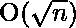
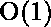

# 求一个数的最大质因数

> 原文:[https://www . geesforgeks . org/find-最大-质因数-数字/](https://www.geeksforgeeks.org/find-largest-prime-factor-number/)

给定正整数‘n’(1<= n <= 10<sup>15</sup>)。求一个数的最大质因数。

```
Input: 6
Output: 3
Explanation
Prime factor of 6 are- 2, 3
Largest of them is '3'

Input: 15
Output: 5
```

方法很简单，只需用一个数的除数对给定的数进行因子分解，并不断更新最大质因数。详见[本](https://www.geeksforgeeks.org/print-all-prime-factors-of-a-given-number/)了解更多。

## C++

```
// C++ Program to find largest prime
// factor of number
#include <iostream>
#include<bits/stdc++.h>
using namespace std;

// A function to find largest prime factor
long long maxPrimeFactors(long long n)
{
    // Initialize the maximum prime factor
    // variable with the lowest one
    long long maxPrime = -1;

    // Print the number of 2s that divide n
    while (n % 2 == 0) {
        maxPrime = 2;
        n >>= 1; // equivalent to n /= 2
    }
  // n must be odd at this point
     while (n % 3 == 0) {
        maxPrime = 3;
        n=n/3;
    }

    // now we have to iterate only for integers
    // who does not have prime factor 2 and 3
    for (int i = 5; i <= sqrt(n); i += 6) {
        while (n % i == 0) {
            maxPrime = i;
            n = n / i;
        }
      while (n % (i+2) == 0) {
            maxPrime = i+2;
            n = n / (i+2);
        }
    }

    // This condition is to handle the case
    // when n is a prime number greater than 4
    if (n > 4)
        maxPrime = n;

    return maxPrime;
}

// Driver program to test above function
int main()
{
    long long n = 15;
    cout << maxPrimeFactors(n) << endl;

    n = 25698751364526;
    cout <<  maxPrimeFactors(n);

}
```

## C

```
// C Program to find largest prime
// factor of number
#include <math.h>
#include <stdio.h>

// A function to find largest prime factor
long long maxPrimeFactors(long long n)
{
    // Initialize the maximum prime factor
    // variable with the lowest one
    long long maxPrime = -1;

    // Print the number of 2s that divide n
    while (n % 2 == 0) {
        maxPrime = 2;
        n >>= 1; // equivalent to n /= 2
    }
    // n must be odd at this point
    while (n % 3 == 0) {
        maxPrime = 3;
        n = n / 3;
    }

    // now we have to iterate only for integers
    // who does not have prime factor 2 and 3
    for (int i = 5; i <= sqrt(n); i += 6) {
        while (n % i == 0) {
            maxPrime = i;
            n = n / i;
        }
        while (n % (i + 2) == 0) {
            maxPrime = i + 2;
            n = n / (i + 2);
        }
    }

    // This condition is to handle the case
    // when n is a prime number greater than 4
    if (n > 4)
        maxPrime = n;

    return maxPrime;
}

// Driver program to test above function
int main()
{
    long long n = 15;
    printf("%lld\n", maxPrimeFactors(n));

    n = 25698751364526;
    printf("%lld", maxPrimeFactors(n));

    return 0;
}
```

## Java 语言(一种计算机语言，尤用于创建网站)

```
// Java Program to find largest
// prime factor of number
import java.io.*;
import java.util.*;

class GFG {

    // function to find largest prime factor
    static long maxPrimeFactors(long n)
    {
        // Initialize the maximum prime
        // factor variable with the
        // lowest one
        long maxPrime = -1;

        // Print the number of 2s
        // that divide n
        while (n % 2 == 0) {
            maxPrime = 2;

            // equivalent to n /= 2
            n >>= 1;
        }
        // n must be odd at this point
        while (n % 3 == 0) {
            maxPrime = 3;
            n = n / 3;
        }

        // now we have to iterate only for integers
        // who does not have prime factor 2 and 3
        for (int i = 5; i <= Math.sqrt(n); i += 6) {
            while (n % i == 0) {
                maxPrime = i;
                n = n / i;
            }
            while (n % (i + 2) == 0) {
                maxPrime = i + 2;
                n = n / (i + 2);
            }
        }

        // This condition is to handle the case
        // when n is a prime number greater than 4
        if (n > 4)
            maxPrime = n;

        return maxPrime;
    }

    // Driver code
    public static void main(String[] args)
    {
        Long n = 15l;
        System.out.println(maxPrimeFactors(n));

        n = 25698751364526l;
        System.out.println(maxPrimeFactors(n));
    }
}
```

## 蟒蛇 3

```
# Python3 code to find largest prime
# factor of number
import math

# A function to find largest prime factor
def maxPrimeFactors (n):

    # Initialize the maximum prime factor
    # variable with the lowest one
    maxPrime = -1

    # Print the number of 2s that divide n
    while n % 2 == 0:
        maxPrime = 2
        n >>= 1     # equivalent to n /= 2

    # n must be odd at this point
    while n % 3 == 0:
        maxPrime = 3
        n=n/3

    # now we have to iterate only for integers
    # who does not have prime factor 2 and 3
    for i in range(5, int(math.sqrt(n)) + 1, 6):
        while n % i == 0:
            maxPrime = i
            n = n / i
        while n % (i+2) == 0:
            maxPrime = i+2
            n = n / (i+2)

    # This condition is to handle the
    # case when n is a prime number
    # greater than 4
    if n > 4:
        maxPrime = n

    return int(maxPrime)

# Driver code to test above function
n = 15
print(maxPrimeFactors(n))

n = 25698751364526
print(maxPrimeFactors(n))
```

## C#

```
// C# program to find largest
// prime factor of number
using System;

class GFG {

    // function to find largest prime factor
    static long maxPrimeFactors(long n)
    {
        // Initialize the maximum prime
        // factor variable with the
        // lowest one
        long maxPrime = -1;

        // Print the number of 2s
        // that divide n
        while (n % 2 == 0) {
            maxPrime = 2;

            // equivalent to n /= 2
            n >>= 1;
        }
        // n must be odd at this point
        while (n % 3 == 0) {
            maxPrime = 3;
            n = n / 3;
        }
        // now we have to iterate only for integers
        // who does not have prime factor 2 and 3
        for (int i = 5; i <= Math.Sqrt(n); i += 6) {
            while (n % i == 0) {
                maxPrime = i;
                n = n / i;
            }
            while (n % (i + 2) == 0) {
                maxPrime = i + 2;
                n = n / (i + 2);
            }
        }

        // This condition is to handle the case
        // when n is a prime number greater than 4
        if (n > 4)
            maxPrime = n;

        return maxPrime;
    }

    // Driver code
    public static void Main()
    {
        long n = 15L;
        Console.WriteLine(maxPrimeFactors(n));

        n = 25698751364526L;
        Console.WriteLine(maxPrimeFactors(n));
    }
}
```

## 服务器端编程语言（Professional Hypertext Preprocessor 的缩写）

```
<?php
// PHP Program to find
// largest prime factor
// of number

// A function to find
// largest prime factor
function maxPrimeFactors($n)
{

    // Initialize the maximum
    // prime factor variable
    // with the lowest one
    $maxPrime = -1;

    // Print the number of
    // 2s that divide n
    while ($n % 2 == 0)
    {
        $maxPrime = 2;

        // equivalent to n /= 2
        $n >>= 1;
    }
    // n must be odd at this point
    while ($n % 3 == 0) {
        $maxPrime = 3;
        $n=$n/3;
    }
    // now we have to iterate only for integers
    // who does not have prime factor 2 and 3
    for ($i = 3; $i <= sqrt($n); $i += 2)
    {
        while ($n % $i == 0)
        {
            $maxPrime = $i;
            $n = $n / $i;
        }
        while ($n % ($i+2) == 0) {
            $maxPrime = $i+2;
            $n = $n / ($i+2);
        }
    }

    // This condition is
    // to handle the case
    // when n is a prime
    // number greater than 4
    if ($n > 4)
        $maxPrime = $n;

    return $maxPrime;
}

    // Driver Code
    $n = 15;
    echo maxPrimeFactors($n), "\n";

    $n = 25698751364526;
    echo maxPrimeFactors($n), "\n";

?>
```

**Output**

```
5
328513
```

**时间复杂度:** 
**辅助空间:** 