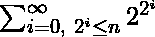
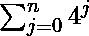

# 找到给定序列的最后一位数字

> 原文:[https://www.geeksforgeeks.org/find-last-digit-given-series/](https://www.geeksforgeeks.org/find-last-digit-given-series/)

给定一个整数 n，求这个序列的最后一位数字，
即 F(n)从 i = 0 到 2 的和 <sup>i</sup> ≤ n，其中 F(n)是 2 <sup>2 <sup>i</sup> +2j</sup> 其中 j 从 0 到 n 变化 **n 可以从 0 到 10 变化 <sup>17</sup>**
**例:**

```
Input: 2
Output: 6
Explanation:
After computing the above expression, the value
obtained is 216\. Hence the last digit is 6.

Input: 3
Output: 0

```

一种**简单的方法**是运行两个循环，一个用于“I”，另一个用于“j”，并在对每个计算值取(模 10)后计算值。但是这种方法对于大的 n 值肯定会超时。

一种**有效的**方法是以易于计算的一般形式扩展上述表达式。


1.  第一个表达式可以通过对所有值“I”迭代一个循环直到 2 <sup> i </sup> ≤ n 来直接计算。
2.  第二个表达式可以使用几何级数公式即
    很容易计算出来
3.  Final answer will be the product of both these calculated result in both the steps. But after performing any calculation part of these expression, we have to take modulo with 10 to avoid overflow.

    **看下面的节目了解更多。**

    ## C++

    ```
    // C++ program to calculate to find last
    // digit of above expression
    #include <bits/stdc++.h>
    using namespace std;

    /* Iterative Function to calculate (x^y)%p in O(log y) */
    long long powermod(long long x, long long y, long long p)
    {
        long long res = 1; // Initialise result

        x = x % p; // Update x if it is more than or
                  // equal to p

        while (y > 0) {

            // If y is odd, multiply x with result
            if (y & 1LL)
                res = (res * x) % p;

            // y must be even now
            y = y >> 1LL; // y = y/2
            x = (x * x) % p;
        }
        return res;
    }

    // Returns modulo inverse of a with respect to m 
    // using extended Euclid Algorithm
    long long modInverse(long long a, long long m)
    {
        long long m0 = m, t, q;
        long long x0 = 0, x1 = 1;

        if (m == 1)
            return 0;

        while (a > 1) {

            // q is quotient
            q = a / m;

            t = m;

            // m is remainder now, process same as
            // Euclid's algo
            m = a % m, a = t;

            t = x0;

            x0 = x1 - q * x0;

            x1 = t;
        }

        // Make x1 positive
        if (x1 < 0)
            x1 += m0;

        return x1;
    }

    // Function to calculate the above expression
    long long evaluteExpression(long long& n)
    {
        // Initialize the result
        long long firstsum = 0, mod = 10;

        // Compute first part of expression
        for (long long i = 2, j = 0; (1LL << j) <= n; i *= i, ++j)
            firstsum = (firstsum + i) % mod;

        // Compute second part of expression
        // i.e., ((4^(n+1) - 1) / 3) mod 10
        // Since division of 3 in modulo can't
        // be performed directly therefore we
        // need to find it's modulo Inverse
        long long secondsum = (powermod(4LL, n + 1, mod) - 1) * 
                               modInverse(3LL, mod);

        return (firstsum * secondsum) % mod;
    }

    // Driver code
    int main()
    {
        long long n = 3;
        cout << evaluteExpression(n) << endl;

        n = 10;
        cout << evaluteExpression(n);

        return 0;
    }
    ```

    ## Java 语言(一种计算机语言，尤用于创建网站)

    ```
    // Java program to calculate to find last 
    // digit of above expression 

    class GFG{
    /* Iterative Function to calculate (x^y)%p in O(log y) */
    static long powermod(long x, long y, long p) 
    { 
        long res = 1; // Initialise result 

        x = x % p; // Update x if it is more than or 
                // equal to p 

        while (y > 0) { 

            // If y is odd, multiply x with result 
            if ((y & 1L)>0) 
                res = (res * x) % p; 

            // y must be even now 
            y = y >> 1L; // y = y/2 
            x = (x * x) % p; 
        } 
        return res; 
    } 

    // Returns modulo inverse of a with respect to m 
    // using extended Euclid Algorithm 
    static long modInverse(long a, long m) 
    { 
        long  m0 = m, t, q; 
        long  x0 = 0, x1 = 1; 

        if (m == 1) 
            return 0; 

        while (a > 1) { 

            // q is quotient 
            q = a / m; 

            t = m; 

            // m is remainder now, process same as 
            // Euclid's algo 
            m = a % m;
            a = t; 

            t = x0; 

            x0 = x1 - q * x0; 

            x1 = t; 
        } 

        // Make x1 positive 
        if (x1 < 0) 
            x1 += m0; 

        return x1; 
    } 

    // Function to calculate the above expression 
    static long evaluteExpression(long n) 
    { 
        // Initialize the result 
        long firstsum = 0, mod = 10; 

        // Compute first part of expression 
        for (long i = 2, j = 0; (1L << j) <= n; i *= i, ++j) 
            firstsum = (firstsum + i) % mod; 

        // Compute second part of expression 
        // i.e., ((4^(n+1) - 1) / 3) mod 10 
        // Since division of 3 in modulo can't 
        // be performed directly therefore we 
        // need to find it's modulo Inverse 
        long secondsum = (powermod(4L, n + 1, mod) - 1) * 
                            modInverse(3L, mod); 

        return (firstsum * secondsum) % mod; 
    } 

    // Driver code 
    public static void main(String[] args) 
    { 
        long n = 3; 
        System.out.println(evaluteExpression(n)); 

        n = 10; 
        System.out.println(evaluteExpression(n)); 

    } 
    }
    // This code is contributed by mits
    ```

    ## 蟒蛇 3

    ```
    # Python3 program to calculate to find last 
    # digit of above expression 

    # Iterative Function to calculate (x^y)%p in O(log y) 
    def powermod(x, y, p): 

        res = 1; # Initialise result 

        x = x % p; # Update x if it is more than or 
                # equal to p 

        while (y > 0):

            # If y is odd, multiply x with result 
            if ((y & 1)>0): 
                res = (res * x) % p; 

            # y must be even now 
            y = y >> 1; # y = y/2 
            x = (x * x) % p;

        return res; 

    # Returns modulo inverse of a with respect to m 
    # using extended Euclid Algorithm 
    def modInverse(a, m):

        m0 = m; 
        x0 = 0;
        x1 = 1; 

        if (m == 1): 
            return 0; 

        while (a > 1): 

            # q is quotient 
            q = int(a / m); 

            t = m; 

            # m is remainder now, process same as 
            # Euclid's algo 
            m = a % m;
            a = t; 

            t = x0; 

            x0 = x1 - q * x0; 

            x1 = t; 

        # Make x1 positive 
        if (x1 < 0): 
            x1 += m0; 

        return x1; 

    # Function to calculate the above expression 
    def evaluteExpression(n): 

        # Initialize the result 
        firstsum = 0;
        mod = 10; 

        # Compute first part of expression
        i=2;
        j=0;
        while ((1 << j) <= n): 
            firstsum = (firstsum + i) % mod;
            i *= i;
            j+=1;

        # Compute second part of expression 
        # i.e., ((4^(n+1) - 1) / 3) mod 10 
        # Since division of 3 in modulo can't 
        # be performed directly therefore we 
        # need to find it's modulo Inverse 
        secondsum = (powermod(4, n + 1, mod) - 1) * modInverse(3, mod); 

        return (firstsum * secondsum) % mod; 

    # Driver code 

    n = 3; 
    print(evaluteExpression(n)); 

    n = 10; 
    print(evaluteExpression(n)); 

    # This code is contributed by mits
    ```

    ## C#

    ```
    // C# program to calculate to find last 
    // digit of above expression 

    class GFG{
    /* Iterative Function to calculate (x^y)%p in O(log y) */
    static long powermod(long x, long y, long p) 
    { 
        long res = 1; // Initialise result 

        x = x % p; // Update x if it is more than or 
                // equal to p 

        while (y > 0) { 

            // If y is odd, multiply x with result 
            if ((y & 1)>0) 
                res = (res * x) % p; 

            // y must be even now 
            y = y >> 1; // y = y/2 
            x = (x * x) % p; 
        } 
        return res; 
    } 

    // Returns modulo inverse of a with respect to m 
    // using extended Euclid Algorithm 
    static long modInverse(long a, long m) 
    { 
        long  m0 = m, t, q; 
        long  x0 = 0, x1 = 1; 

        if (m == 1) 
            return 0; 

        while (a > 1) { 

            // q is quotient 
            q = a / m; 

            t = m; 

            // m is remainder now, process same as 
            // Euclid's algo 
            m = a % m;
            a = t; 

            t = x0; 

            x0 = x1 - q * x0; 

            x1 = t; 
        } 

        // Make x1 positive 
        if (x1 < 0) 
            x1 += m0; 

        return x1; 
    } 

    // Function to calculate the above expression 
    static long evaluteExpression(long n) 
    { 
        // Initialize the result 
        long firstsum = 0, mod = 10; 

        // Compute first part of expression 
        for (int i = 2, j = 0; (1 << j) <= n; i *= i, ++j) 
            firstsum = (firstsum + i) % mod; 

        // Compute second part of expression 
        // i.e., ((4^(n+1) - 1) / 3) mod 10 
        // Since division of 3 in modulo can't 
        // be performed directly therefore we 
        // need to find it's modulo Inverse 
        long secondsum = (powermod(4L, n + 1, mod) - 1) * 
                            modInverse(3L, mod); 

        return (firstsum * secondsum) % mod; 
    } 

    // Driver code 
    public static void Main() 
    { 
        long n = 3; 
        System.Console.WriteLine(evaluteExpression(n)); 

        n = 10; 
        System.Console.WriteLine(evaluteExpression(n)); 

    } 
    }
    // This code is contributed by mits
    ```

    ## 服务器端编程语言（Professional Hypertext Preprocessor 的缩写）

    ```
    <?php
    // PHP program to calculate to find 
    // last digit of above expression 

    /* Iterative Function to calculate
       (x^y)%p in O(log y) */
    function powermod($x, $y, $p) 
    { 
        $res = 1; // Initialise result 

        $x = $x % $p; // Update x if it is more 
                      // than or equal to p 

        while ($y > 0)
        { 

            // If y is odd, multiply 
            // x with result 
            if (($y & 1) > 0) 
                $res = ($res * $x) % $p; 

            // y must be even now 
            $y = $y >> 1; // y = y/2 
            $x = ($x * $x) % $p; 
        } 
        return $res; 
    } 

    // Returns modulo inverse of a 
    // with respect to m using 
    // extended Euclid Algorithm 
    function modInverse($a, $m) 
    { 
        $m0 = $m; 
        $x0 = 0;
        $x1 = 1; 

        if ($m == 1) 
            return 0; 

        while ($a > 1) 
        { 

            // q is quotient 
            $q = (int)($a / $m); 

            $t = $m; 

            // m is remainder now, process 
            // same as Euclid's algo 
            $m = $a % $m;
            $a = $t; 

            $t = $x0; 

            $x0 = $x1 - $q * $x0; 

            $x1 = $t; 
        } 

        // Make x1 positive 
        if ($x1 < 0) 
            $x1 += $m0; 

        return $x1; 
    } 

    // Function to calculate the
    // above expression 
    function evaluteExpression($n) 
    { 
        // Initialize the result 
        $firstsum = 0;
        $mod = 10; 

        // Compute first part of expression 
        for ($i = 2, $j = 0; (1 << $j) <= $n;
                              $i *= $i, ++$j) 
            $firstsum = ($firstsum + $i) % $mod; 

        // Compute second part of expression 
        // i.e., ((4^(n+1) - 1) / 3) mod 10 
        // Since division of 3 in modulo can't 
        // be performed directly therefore we 
        // need to find it's modulo Inverse 
        $secondsum = (powermod(4, $n + 1, $mod) - 1) * 
                      modInverse(3, $mod); 

        return ($firstsum * $secondsum) % $mod; 
    } 

    // Driver code 
    $n = 3; 
    echo evaluteExpression($n) . "\n"; 

    $n = 10; 
    echo evaluteExpression($n); 

    // This code is contributed by mits
    ?>
    ```

    **输出:**

    ```
    0
    8

    ```

    **时间复杂度:** O(log(n))
    **辅助空间:** O(1)

    **注:*TCS 码维塔大赛*中问。**

    本文由 [Shubham Bansal](https://www.quora.com/profile/Shubham-Bansal-209) 供稿。如果你喜欢 GeeksforGeeks 并想投稿，你也可以使用[contribute.geeksforgeeks.org](http://www.contribute.geeksforgeeks.org)写一篇文章或者把你的文章邮寄到 contribute@geeksforgeeks.org。看到你的文章出现在极客博客主页上，帮助其他极客。