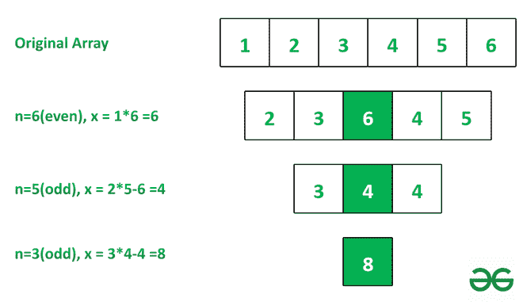

# 根据给定的规则通过边界元素相乘找到最后剩余的数组元素

> 原文:[https://www . geesforgeks . org/find-最后剩余-数组-元素乘-边界-元素-基于给定规则/](https://www.geeksforgeeks.org/find-last-remaining-array-element-by-multiplying-boundary-elements-based-on-given-rules/)

给定一个数组 **arr[]** ，任务是在应用以下操作后找到数组中唯一剩余的元素，直到数组中只剩下一个元素。在运算中，将此数组的边界元素相乘，如果数组的大小为:

*   偶数:将产品插入数组中间，并移除边界元素
*   奇数:从乘积中减去中间元素，用绝对差替换中间元素，去掉边界元素。

**示例:**

> **输入:** arr[] = [ 1，2，3，4，5，6 ]
> **输出:** 8
> **说明:**见下图说明。
> 
> 
> 
> **输入:** arr[] = [ 3，5，1，8，9]
> **输出:** 14

**进场:**解决方案基于[贪婪进场。](https://www.geeksforgeeks.org/greedy-algorithms/)删除数组末端的元素，将数据插入数组中间。现在按照以下步骤解决这个问题:

1.  运行一个 while 循环，直到数组**arr【】**的大小大于 1。在这个循环的每次迭代中:
    *   取第一个和最后一个元素的乘积，然后弹出它们。
    *   如果数组大小为偶数，则在数组中间插入乘积 **arr[]** 。
    *   如果是奇数，则从乘积中减去中间元素，并用中间元素替换它。
2.  循环结束后，打印数组中唯一剩余的元素。

## 蟒蛇 3

```
# Python program for the baove approach

# Function to reduce array
def PSarray(A):
    while len(A) != 1:

        # If size of array is Even
        if len(A) % 2 == 0:

            # Product of boundary element
            x = A.pop(0)*A.pop()
            n = len(A)

            # Insert product in middle of element
            A.insert(n//2, x)

        # Else if size of array is Odd
        else:
            x = A.pop(0)*A.pop()
            n = len(A)

            # Subtract middle element from product and
            # replace middle element
            A[n//2] = x-A[n//2]

    # Print the last remaining array element
    print(A[0])

# Driver Code
if __name__ == "__main__":
  A = [1, 2, 3, 4, 5, 6]
  PSarray(A)
```

## java 描述语言

```
<script>

// JavaScript program for the baove approach

// Function to reduce array
function PSarray(A)
{
    while (A.length != 1)
    {

        // If size of array is Even
        if (A.length % 2 == 0)
        {

            // Product of boundary element
            let x = A.shift() * A.pop()

            let n = A.length

            // Insert product in middle of element
            let p1 = A.slice(0, Math.floor(A.length / 2))
            p1.push(x)
            let p2 = A.slice(Math.floor(A.length / 2))
            A = p1.concat(p2)
        }

        // Else if size of array is Odd
        else
        {
            let x = A.shift() * A.pop()
            let n = A.length

            // Subtract middle element from product and
            // replace middle element
            A[Math.floor(n / 2)] = x - A[Math.floor(n / 2)]
        }

        // Print the last remaining array element
    }
    document.write(A[0])
}

// Driver Code
let A = [ 1, 2, 3, 4, 5, 6 ]

PSarray(A)

// This code is contributed by Potta Lokesh

</script>
```

**Output**

```
8
```

***时间复杂度:*****O(N<sup>2</sup>)
***辅助空间:*** O(1)**