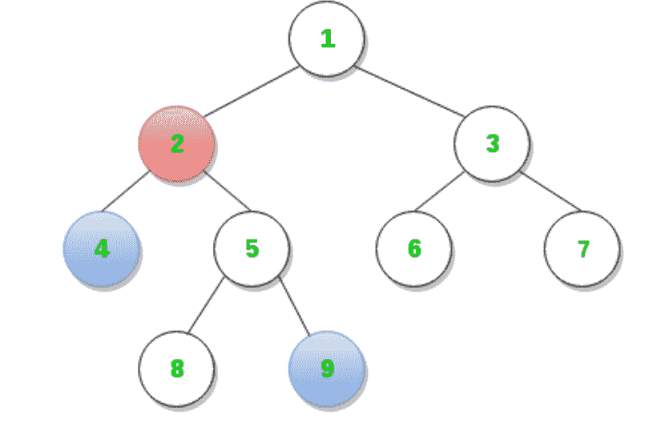
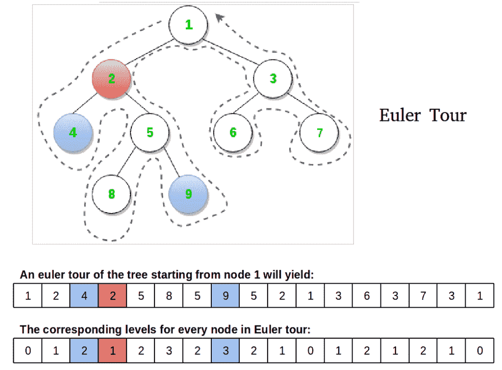
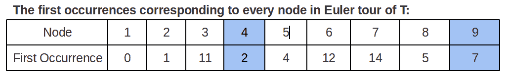

# 使用 RMQ 在二叉树中找到生命周期评价

> 原文:[https://www . geesforgeks . org/find-LCA-in-binary-tree-using-rmq/](https://www.geeksforgeeks.org/find-lca-in-binary-tree-using-rmq/)

本文描述了一种方法，通过将其简化为 RMQ 问题来解决寻找树中两个节点的生命周期评价问题。

[**有根树 T 中两个节点 u 和 v 的最低共同祖先(LCA)**](https://www.geeksforgeeks.org/lowest-common-ancestor-binary-tree-set-1/)**被定义为离根最远的节点，该节点同时具有 u 和 v 作为后代。
例如下图中，节点 4 和节点 9 的 LCA 为节点 2。**

****

**可以有许多方法来解决生命周期评价问题。这些方法在时间和空间上的复杂性不同。[这里](https://www.geeksforgeeks.org/lowest-common-ancestor-binary-tree-set-1/)是其中几个的链接(这些不涉及还原到 RMQ)。**

**[**【范围最小查询(RMQ)**](https://www.geeksforgeeks.org/segment-tree-set-1-range-minimum-query/) 用于数组，以找到两个指定索引之间具有最小值的元素的位置。解决 RMQ 问题的不同方法已经在这里和这里讨论过了。本文讨论了基于分段树的方法。对于段树，预处理时间为 0(n)，范围最小查询的时间为 0(Logn)。存储段树所需的额外空间为 0(n)。**

****LCA 到 RMQ 的约简:**
思想是通过欧拉巡线(不举铅笔的遍历)从根开始遍历树，这是一种具有前序遍历特性的 DFS 类型的遍历。** 

****

****观察**:节点 4 和 9 的 LCA 为节点 2，在 t 的 DFS 过程中，4 和 9 的访问之间遇到的所有节点中，节点 2 恰好是离根最近的节点，这个观察是约简的关键。让我们换一种说法:我们的节点是最小级别的节点，也是在 T2 欧拉巡回赛中 u 和 v 连续出现(任意)之间的所有节点中该级别唯一的节点。我们需要三个数组来实现:**

1.  **按照欧拉巡回赛的顺序访问的节点**
2.  **欧拉巡回赛中访问的每个节点的级别**
3.  **T 的欧拉游中第一个**节点的第一个**出现的索引(因为任何出现都是好的，让我们跟踪第一个)**

****

****算法:****

1.  **在树上做一个欧拉游，填充欧拉，水平和第一个出现数组。**
2.  **使用第一个出现数组，获取对应于两个节点的索引，这两个节点将是级别数组中范围的角，该级别数组被馈送给 RMQ 算法以获得最小值。**
3.  **一旦算法返回该范围内的最小级别的索引，我们就使用它来确定使用欧拉巡回阵列的 LCA。**

**下面是上述算法的实现。**

## **C++**

```
/* C++ Program to find LCA of u and v by reducing the problem to RMQ */
#include<bits/stdc++.h>
#define V 9               // number of nodes in input tree

int euler[2*V - 1];       // For Euler tour sequence
int level[2*V - 1];       // Level of nodes in tour sequence
int firstOccurrence[V+1]; // First occurrences of nodes in tour
int ind;                  // Variable to fill-in euler and level arrays

// A Binary Tree node
struct Node
{
    int key;
    struct Node *left, *right;
};

// Utility function creates a new binary tree node with given key
Node * newNode(int k)
{
    Node *temp = new Node;
    temp->key = k;
    temp->left = temp->right = NULL;
    return temp;
}

// log base 2 of x
int Log2(int x)
{
    int ans = 0 ;
    while (x>>=1) ans++;
    return ans ;
}

/*  A recursive function to get the minimum value in a given range
     of array indexes. The following are parameters for this function.

    st    --> Pointer to segment tree
    index --> Index of current node in the segment tree. Initially
              0 is passed as root is always at index 0
    ss & se  --> Starting and ending indexes of the segment represented
                  by current node, i.e., st[index]
    qs & qe  --> Starting and ending indexes of query range */
int RMQUtil(int index, int ss, int se, int qs, int qe, int *st)
{
    // If segment of this node is a part of given range, then return
    //  the min of the segment
    if (qs <= ss && qe >= se)
        return st[index];

    // If segment of this node is outside the given range
    else if (se < qs || ss > qe)
        return -1;

    // If a part of this segment overlaps with the given range
    int mid = (ss + se)/2;

    int q1 = RMQUtil(2*index+1, ss, mid, qs, qe, st);
    int q2 = RMQUtil(2*index+2, mid+1, se, qs, qe, st);

    if (q1==-1) return q2;

    else if (q2==-1) return q1;

    return (level[q1] < level[q2]) ? q1 : q2;
}

// Return minimum of elements in range from index qs (query start) to
// qe (query end).  It mainly uses RMQUtil()
int RMQ(int *st, int n, int qs, int qe)
{
    // Check for erroneous input values
    if (qs < 0 || qe > n-1 || qs > qe)
    {
        printf("Invalid Input");
        return -1;
    }

    return RMQUtil(0, 0, n-1, qs, qe, st);
}

// A recursive function that constructs Segment Tree for array[ss..se].
// si is index of current node in segment tree st
void constructSTUtil(int si, int ss, int se, int arr[], int *st)
{
    // If there is one element in array, store it in current node of
    // segment tree and return
    if (ss == se)st[si] = ss;

    else
    {
        // If there are more than one elements, then recur for left and
        // right subtrees and store the minimum of two values in this node
        int mid = (ss + se)/2;
        constructSTUtil(si*2+1, ss, mid, arr, st);
        constructSTUtil(si*2+2, mid+1, se, arr, st);

        if (arr[st[2*si+1]] < arr[st[2*si+2]])
            st[si] = st[2*si+1];
        else
            st[si] = st[2*si+2];
    }
}

/* Function to construct segment tree from given array. This function
   allocates memory for segment tree and calls constructSTUtil() to
   fill the allocated memory */
int *constructST(int arr[], int n)
{
    // Allocate memory for segment tree

    // Height of segment tree
    int x = Log2(n)+1;

    // Maximum size of segment tree
    int max_size = 2*(1<<x) - 1;  //  2*pow(2,x) -1

    int *st = new int[max_size];

    // Fill the allocated memory st
    constructSTUtil(0, 0, n-1, arr, st);

    // Return the constructed segment tree
    return st;
}

// Recursive version of the Euler tour of T
void eulerTour(Node *root, int l)
{
    /* if the passed node exists */
    if (root)
    {
        euler[ind] = root->key; // insert in euler array
        level[ind] = l;         // insert l in level array
        ind++;                  // increment index

        /* if unvisited, mark first occurrence */
        if (firstOccurrence[root->key] == -1)
            firstOccurrence[root->key] = ind-1;

        /* tour left subtree if exists, and remark euler
           and level arrays for parent on return */
        if (root->left)
        {
            eulerTour(root->left, l+1);
            euler[ind]=root->key;
            level[ind] = l;
            ind++;
        }

        /* tour right subtree if exists, and remark euler
           and level arrays for parent on return */
        if (root->right)
        {
            eulerTour(root->right, l+1);
            euler[ind]=root->key;
            level[ind] = l;
            ind++;
        }
    }
}

// Returns LCA of nodes n1, n2 (assuming they are
//  present in the tree)
int findLCA(Node *root, int u, int v)
{
    /* Mark all nodes unvisited.  Note that the size of
        firstOccurrence is 1 as node values which vary from
        1 to 9 are used as indexes */
    memset(firstOccurrence, -1, sizeof(int)*(V+1));

    /* To start filling euler and level arrays from index 0 */
    ind = 0;

    /* Start Euler tour with root node on level 0 */
    eulerTour(root, 0);

    /* construct segment tree on level array */
    int *st = constructST(level, 2*V-1);

    /* If v before u in Euler tour.  For RMQ to work, first
       parameter 'u' must be smaller than second 'v' */
    if (firstOccurrence[u]>firstOccurrence[v])
       std::swap(u, v);

    // Starting and ending indexes of query range
    int qs = firstOccurrence[u];
    int qe = firstOccurrence[v];

    // query for index of LCA in tour
    int index = RMQ(st, 2*V-1, qs, qe);

    /* return LCA node */
    return euler[index];
}

// Driver program to test above functions
int main()
{
    // Let us create the Binary Tree as shown in the diagram.
    Node * root = newNode(1);
    root->left = newNode(2);
    root->right = newNode(3);
    root->left->left = newNode(4);
    root->left->right = newNode(5);
    root->right->left = newNode(6);
    root->right->right = newNode(7);
    root->left->right->left = newNode(8);
    root->left->right->right = newNode(9);

    int u = 4, v = 9;
    printf("The LCA of node %d and node %d is node %d.\n",
            u, v, findLCA(root, u, v));
    return 0;
}
```

## **Java 语言(一种计算机语言，尤用于创建网站)**

```
// Java program to find LCA of u and v by reducing problem to RMQ

import java.util.*;

// A binary tree node
class Node
{
    Node left, right;
    int data;

    Node(int item)
    {
        data = item;
        left = right = null;
    }
}

class St_class
{
    int st;
    int stt[] = new int[10000];
}

class BinaryTree
{
    Node root;
    int v = 9; // v is the highest value of node in our tree
    int euler[] = new int[2 * v - 1]; // for euler tour sequence
    int level[] = new int[2 * v - 1]; // level of nodes in tour sequence
    int f_occur[] = new int[2 * v - 1]; // to store 1st occurrence of nodes
    int fill; // variable to fill euler and level arrays
    St_class sc = new St_class();

    // log base 2 of x
    int Log2(int x)
    {
        int ans = 0;
        int y = x >>= 1;
        while (y-- != 0)
            ans++;
        return ans;
    }

    int swap(int a, int b)
    {
        return a;
    }

    /*  A recursive function to get the minimum value in a given range
     of array indexes. The following are parameters for this function.

     st    --> Pointer to segment tree
     index --> Index of current node in the segment tree. Initially
     0 is passed as root is always at index 0
     ss & se  --> Starting and ending indexes of the segment represented
     by current node, i.e., st[index]
     qs & qe  --> Starting and ending indexes of query range */
    int RMQUtil(int index, int ss, int se, int qs, int qe, St_class st)
    {
        // If segment of this node is a part of given range, then return
        //  the min of the segment
        if (qs <= ss && qe >= se)
            return st.stt[index];

        // If segment of this node is outside the given range
        else if (se < qs || ss > qe)
            return -1;

        // If a part of this segment overlaps with the given range
        int mid = (ss + se) / 2;

        int q1 = RMQUtil(2 * index + 1, ss, mid, qs, qe, st);
        int q2 = RMQUtil(2 * index + 2, mid + 1, se, qs, qe, st);

        if (q1 == -1)
            return q2;
        else if (q2 == -1)
            return q1;

        return (level[q1] < level[q2]) ? q1 : q2;
    }

    // Return minimum of elements in range from index qs (query start) to
    // qe (query end).  It mainly uses RMQUtil()
    int RMQ(St_class st, int n, int qs, int qe)
    {
        // Check for erroneous input values
        if (qs < 0 || qe > n - 1 || qs > qe)
        {
            System.out.println("Invalid input");
            return -1;
        }

        return RMQUtil(0, 0, n - 1, qs, qe, st);
    }

    // A recursive function that constructs Segment Tree for array[ss..se].
    // si is index of current node in segment tree st
    void constructSTUtil(int si, int ss, int se, int arr[], St_class st)
    {
        // If there is one element in array, store it in current node of
        // segment tree and return
        if (ss == se)
            st.stt[si] = ss;
        else
        {
            // If there are more than one elements, then recur for left and
            // right subtrees and store the minimum of two values in this node
            int mid = (ss + se) / 2;
            constructSTUtil(si * 2 + 1, ss, mid, arr, st);
            constructSTUtil(si * 2 + 2, mid + 1, se, arr, st);

            if (arr[st.stt[2 * si + 1]] < arr[st.stt[2 * si + 2]])
                st.stt[si] = st.stt[2 * si + 1];
            else
                st.stt[si] = st.stt[2 * si + 2];
        }
    }

    /* Function to construct segment tree from given array. This function
     allocates memory for segment tree and calls constructSTUtil() to
     fill the allocated memory */
    int constructST(int arr[], int n)
    {
        // Allocate memory for segment tree
        // Height of segment tree
        int x = Log2(n) + 1;

        // Maximum size of segment tree
        int max_size = 2 * (1 << x) - 1;  //  2*pow(2,x) -1

        sc.stt = new int[max_size];

        // Fill the allocated memory st
        constructSTUtil(0, 0, n - 1, arr, sc);

        // Return the constructed segment tree
        return sc.st;
    }

    // Recursive version of the Euler tour of T
    void eulerTour(Node node, int l)
    {
        /* if the passed node exists */
        if (node != null)
        {
            euler[fill] = node.data; // insert in euler array
            level[fill] = l;         // insert l in level array
            fill++;                  // increment index

            /* if unvisited, mark first occurrence */
            if (f_occur[node.data] == -1)
                f_occur[node.data] = fill - 1;

            /* tour left subtree if exists, and remark euler
               and level arrays for parent on return */
            if (node.left != null)
            {
                eulerTour(node.left, l + 1);
                euler[fill] = node.data;
                level[fill] = l;
                fill++;
            }

            /* tour right subtree if exists, and remark euler
               and level arrays for parent on return */
            if (node.right != null)
            {
                eulerTour(node.right, l + 1);
                euler[fill] = node.data;
                level[fill] = l;
                fill++;
            }
        }
    }

    // returns LCA of node n1 and n2 assuming they are present in tree
    int findLCA(Node node, int u, int v)
    {
        /* Mark all nodes unvisited.  Note that the size of
           firstOccurrence is 1 as node values which vary from
           1 to 9 are used as indexes */
        Arrays.fill(f_occur, -1);

        /* To start filling euler and level arrays from index 0 */
        fill = 0;

        /* Start Euler tour with root node on level 0 */
        eulerTour(root, 0);

        /* construct segment tree on level array */
        sc.st = constructST(level, 2 * v - 1);

        /* If v before u in Euler tour.  For RMQ to work, first
         parameter 'u' must be smaller than second 'v' */
        if (f_occur[u] > f_occur[v])
            u = swap(u, u = v);

        // Starting and ending indexes of query range
        int qs = f_occur[u];
        int qe = f_occur[v];

        // query for index of LCA in tour
        int index = RMQ(sc, 2 * v - 1, qs, qe);

        /* return LCA node */
        return euler[index];

    }

    // Driver program to test above functions
    public static void main(String args[])
    {
        BinaryTree tree = new BinaryTree();

        // Let us create the Binary Tree as shown in the diagram.
        tree.root = new Node(1);
        tree.root.left = new Node(2);
        tree.root.right = new Node(3);
        tree.root.left.left = new Node(4);
        tree.root.left.right = new Node(5);
        tree.root.right.left = new Node(6);
        tree.root.right.right = new Node(7);
        tree.root.left.right.left = new Node(8);
        tree.root.left.right.right = new Node(9);

        int u = 4, v = 9;
        System.out.println("The LCA of node " + u + " and " + v + " is "
                + tree.findLCA(tree.root, u, v));
    }

}

// This code has been contributed by Mayank Jaiswal
```

## **蟒蛇 3**

```
# Python3 program to find LCA of u and v by
# reducing the problem to RMQ
from math import log2, floor
from typing import List

class Node:

    def __init__(self, val: int):

        self.val, self.left, self.right = val, None, None

class BinaryTree:

    def __init__(self, root: Node):

        self.root = root
        self.val_max = self._get_max_val()
        self.euler = [0] * (2 * self.val_max - 1)
        self.level = [0] * (2 * self.val_max - 1)
        self.f_occur = [-1] * (self.val_max + 1)
        self.fill = 0
        self.segment_tree = []

    def _get_max_val(self):

        stack = [self.root]
        max_val = -1

        while stack:
            x = stack.pop()
            if x.val > max_val:
                max_val = x.val
            if x.left:
                stack.append(x.left)
            if x.right:
                stack.append(x.right)

        return max_val
    ''' A recursive function to get the minimum value in a given range
     of array indexes. The following are parameters for this function.

    st    --> Pointer to segment tree
    index --> Index of current node in the segment tree. Initially
              0 is passed as root is always at index 0
    ss & se  --> Starting and ending indexes of the segment represented
                  by current node, i.e., st[index]
    qs & qe  --> Starting and ending indexes of query range '''
    def rmq_util(self, index, ss, se, qs, qe) -> int:

        # If segment of this node is part of given range
        # then return the min of the segment
        if qs <= ss and qe >= se:
            return self.segment_tree[index]

        # If segment of this node is outside
        # the given range
        elif se < qs or ss > qe:
            return -1

        # If part of this segment overlaps with
        # given range
        mid = (ss + se) // 2

        q1 = self.rmq_util(2 * index + 1,
                           ss, mid, qs, qe)
        q2 = self.rmq_util(2 * index + 2, mid + 1,
                           se, qs, qe)

        if q1 == -1:
            return q2
        if q2 == -1:
            return q1
        return (q1 if self.level[q1] <
                      self.level[q2] else q2)

    # Return minimum of elements in range from
    # index qs (query start) to  qe (query end). 
    # It mainly uses rmq_util()
    def rmq(self, n: int, qs: int, qe: int) -> int:

        if qs < 0 or qe > n - 1 or qs > qe:
            print('invalid input')
            return -1

        return self.rmq_util(0, 0, n - 1, qs, qe)

    # A recursive function that constructs Segment
    # Tree for array[ss..se]. si is index of
    # current node in segment tree st
    def construct_segment_tree_util(self, si, ss,
                                    se, arr):

        # If  there is one element in array,
        # store it in current node of segment tree
        # and return
        if ss == se:
            self.segment_tree[si] = ss
        else:

            # If there are more than one elements,
            # then recur for left and right subtrees and
            # store the min of two values in this node
            mid = (ss + se) // 2
            index_left, index_right = si * 2 + 1, si * 2 + 2
            self.construct_segment_tree_util(
                index_left, ss, mid, arr)
            self.construct_segment_tree_util(
                index_right, mid+1, se, arr)

            if (arr[self.segment_tree[index_left]] <
                arr[self.segment_tree[index_right]]):
                self.segment_tree[si] = self.segment_tree[index_left]
            else:
                self.segment_tree[si] = self.segment_tree[index_right]

    # Function to construct segment tree from given
    # array. This function allocates memory for segment
    # tree and calls construct_segment_tree_util()
    # to fill the allocated memory
    def construct_segment_tree(self, arr: List, n: int):

        # Height of segment tree
        x = floor(log2(n) + 1)

        # Maximum size of segment tree
        max_size = 2 * (1 << x) - 1      # 2*pow(2,x) -1

        self.segment_tree = [0] * max_size

        # Fill the allocated memory st
        self.construct_segment_tree_util(
            0, 0, n - 1, arr)

    # Recursive version of the Euler tour of T
    def euler_tour(self, node: Node, lev: int):

        # If the passed node exists
        if node is not None:
            self.euler[self.fill] = node.val
            self.level[self.fill] = lev
            self.fill += 1

            # If unvisited, mark first occurence
            if self.f_occur[node.val] == -1:
                self.f_occur[node.val] = self.fill - 1

            # Tour left subtree if exists and remark
            # euler and level arrays for parent on
            # return
            if node.left is not None:
                self.euler_tour(node.left, lev + 1)
                self.euler[self.fill] = node.val
                self.level[self.fill] = lev
                self.fill += 1

            # Tour right subtree if exists and
            # remark euler and level arrays for
            # parent on return
            if node.right is not None:
                self.euler_tour(node.right, lev + 1)
                self.euler[self.fill] = node.val
                self.level[self.fill] = lev
                self.fill += 1

    # Returns LCA of nodes n1, n2 (assuming they are
    # present in the tree)
    def find_lca(self, u: int, v: int):

        # Start euler tour with root node on level 0
        self.euler_tour(self.root, 0)

        # Construct segment tree on level array
        self.construct_segment_tree(self.level,
                                2 * self.val_max - 1)

        # For rmq to work, u must be smaller than v
        if self.f_occur[u] > self.f_occur[v]:
            u, v = v, u

        # Start and end of query range
        qs = self.f_occur[u]
        qe = self.f_occur[v]

        # Query for index of lca in tour
        index = self.rmq(2 * self.val_max - 1, qs, qe)

        # Return lca node
        return self.euler[index]

# Driver code
if __name__ == "__main__":

    root = Node(1)
    root.left = Node(2)
    root.right = Node(3)
    root.left.left = Node(4)
    root.left.right = Node(5)
    root.right.left = Node(6)
    root.right.right = Node(7)
    root.left.right.left = Node(8)
    root.left.right.right = Node(9)

    tree = BinaryTree(root)
    u, v = 4, 9
    print('The lca of node {} and {} is node {}'.format(
        u, v, tree.find_lca(u, v)))

# This code is contributed by Rajat Srivastava
```

## **C#**

```
// C# program to find LCA of u and
// v by reducing problem to RMQ
using System;

// A binary tree node
class Node
{
    public Node left, right;
    public int data;

    public Node(int item)
    {
        data = item;
        left = right = null;
    }
}

class St_class
{
    public int st;
    public int []stt = new int[10000];
}

public class BinaryTree
{
    Node root;
    static int v = 9; // v is the highest value of node in our tree
    int []euler = new int[2 * v - 1]; // for euler tour sequence
    int []level = new int[2 * v - 1]; // level of nodes in tour sequence
    int []f_occur = new int[2 * v - 1]; // to store 1st occurrence of nodes
    int fill; // variable to fill euler and level arrays
    St_class sc = new St_class();

    // log base 2 of x
    int Log2(int x)
    {
        int ans = 0;
        int y = x >>= 1;
        while (y-- != 0)
            ans++;
        return ans;
    }

    int swap(int a, int b)
    {
        return a;
    }

    /* A recursive function to get
    the minimum value in a given range
    of array indexes. The following
    are parameters for this function.

    st --> Pointer to segment tree
    index --> Index of current node
    in the segment tree. Initially
    0 is passed as root is always at index 0
    ss & se --> Starting and ending
    indexes of the segment represented
    by current node, i.e., st[index]
    qs & qe --> Starting and ending
    indexes of query range */
    int RMQUtil(int index, int ss, int se,
                    int qs, int qe, St_class st)
    {
        // If segment of this node is a part
        // of given range, then return
        // the min of the segment
        if (qs <= ss && qe >= se)
            return st.stt[index];

        // If segment of this node is
        // outside the given range
        else if (se < qs || ss > qe)
            return -1;

        // If a part of this segment
        // overlaps with the given range
        int mid = (ss + se) / 2;

        int q1 = RMQUtil(2 * index + 1,
                        ss, mid, qs, qe, st);
        int q2 = RMQUtil(2 * index + 2,
                        mid + 1, se, qs, qe, st);

        if (q1 == -1)
            return q2;
        else if (q2 == -1)
            return q1;

        return (level[q1] < level[q2]) ? q1 : q2;
    }

    // Return minimum of elements in
    // range from index qs (query start) to
    // qe (query end). It mainly uses RMQUtil()
    int RMQ(St_class st, int n, int qs, int qe)
    {
        // Check for erroneous input values
        if (qs < 0 || qe > n - 1 || qs > qe)
        {
            Console.WriteLine("Invalid input");
            return -1;
        }

        return RMQUtil(0, 0, n - 1, qs, qe, st);
    }

    // A recursive function that constructs
    // Segment Tree for array[ss..se].
    // si is index of current node in segment tree st
    void constructSTUtil(int si, int ss, int se,
                        int []arr, St_class st)
    {
        // If there is one element in array,
        // store it in current node of
        // segment tree and return
        if (ss == se)
            st.stt[si] = ss;
        else
        {
            // If there are more than one elements,
            // then recur for left and right subtrees
            // and store the minimum of two values in this node
            int mid = (ss + se) / 2;
            constructSTUtil(si * 2 + 1, ss, mid, arr, st);
            constructSTUtil(si * 2 + 2, mid + 1, se, arr, st);

            if (arr[st.stt[2 * si + 1]] < arr[st.stt[2 * si + 2]])
                st.stt[si] = st.stt[2 * si + 1];
            else
                st.stt[si] = st.stt[2 * si + 2];
        }
    }

    /* Function to construct segment tree
    from given array. This function
    allocates memory for segment tree
    and calls constructSTUtil() to
    fill the allocated memory */
    int constructST(int []arr, int n)
    {
        // Allocate memory for segment tree
        // Height of segment tree
        int x = Log2(n) + 1;

        // Maximum size of segment tree
        int max_size = 2 * (1 << x) - 1; // 2*pow(2,x) -1

        sc.stt = new int[max_size];

        // Fill the allocated memory st
        constructSTUtil(0, 0, n - 1, arr, sc);

        // Return the constructed segment tree
        return sc.st;
    }

    // Recursive version of the Euler tour of T
    void eulerTour(Node node, int l)
    {
        /* if the passed node exists */
        if (node != null)
        {
            euler[fill] = node.data; // insert in euler array
            level[fill] = l;         // insert l in level array
            fill++;                 // increment index

            /* if unvisited, mark first occurrence */
            if (f_occur[node.data] == -1)
                f_occur[node.data] = fill - 1;

            /* tour left subtree if exists,
                and remark euler and level
                arrays for parent on return */
            if (node.left != null)
            {
                eulerTour(node.left, l + 1);
                euler[fill] = node.data;
                level[fill] = l;
                fill++;
            }

            /* tour right subtree if exists, and remark euler
            and level arrays for parent on return */
            if (node.right != null)
            {
                eulerTour(node.right, l + 1);
                euler[fill] = node.data;
                level[fill] = l;
                fill++;
            }
        }
    }

    // returns LCA of node n1 and n2
    // assuming they are present in tree
    int findLCA(Node node, int u, int v)
    {
        /* Mark all nodes unvisited. Note
         that the size of firstOccurrence
         is 1 as node values which
         vary from 1 to 9 are used as indexes */
        //Arrays.fill(f_occur, -1);
        for(int i = 0; i < f_occur.Length; i++)
            f_occur[i] = -1;

        /* To start filling euler and
        level arrays from index 0 */
        fill = 0;

        /* Start Euler tour with
        root node on level 0 */
        eulerTour(root, 0);

        /* construct segment tree on level array */
        sc.st = constructST(level, 2 * v - 1);

        /* If v before u in Euler tour.
        For RMQ to work, first parameter
        'u' must be smaller than
         second 'v' */
        if (f_occur[u] > f_occur[v])
            u = swap(u, u = v);

        // Starting and ending indexes of query range
        int qs = f_occur[u];
        int qe = f_occur[v];

        // query for index of LCA in tour
        int index = RMQ(sc, 2 * v - 1, qs, qe);

        /* return LCA node */
        return euler[index];

    }

    // Driver program to test above functions
    public static void Main(String []args)
    {
        BinaryTree tree = new BinaryTree();

        // Let us create the Binary Tree
        // as shown in the diagram.
        tree.root = new Node(1);
        tree.root.left = new Node(2);
        tree.root.right = new Node(3);
        tree.root.left.left = new Node(4);
        tree.root.left.right = new Node(5);
        tree.root.right.left = new Node(6);
        tree.root.right.right = new Node(7);
        tree.root.left.right.left = new Node(8);
        tree.root.left.right.right = new Node(9);

        int u = 4, v = 9;
        Console.WriteLine("The LCA of node " + u + " and " + v + " is "
                + tree.findLCA(tree.root, u, v));
    }
}

// This code is contributed by 29AjayKumar
```

## **java 描述语言**

```
<script>

// JavaScript program to find LCA of u and v
// by reducing problem to RMQ

// A binary tree node
class Node
{
    constructor(item)
    {
        this.data=item;
        this.left = this.right = null;
    }
}

class St_class
{
    st;
    stt=new Array(10000);
}

let root;
// v is the highest value of node in our tree
let v = 9;
// for euler tour sequence
let euler = new Array(2 * v - 1);
// level of nodes in tour sequence
let level = new Array(2 * v - 1);
// to store 1st occurrence of nodes
let f_occur = new Array(2 * v - 1);

let fill; // variable to fill euler and level arrays
let sc = new St_class();

 // log base 2 of x
function Log2(x)
{
    let ans = 0;
        let y = x >>= 1;
        while (y-- != 0)
            ans++;
        return ans;
}

function swap(a,b)
{
    return a;
}

/*  A recursive function to get the
    minimum value in a given range
     of array indexes. The following
     are parameters for this function.

     st    --> Pointer to segment tree
     index --> Index of current node in
     the segment tree. Initially
     0 is passed as root is always at index 0
     ss & se  --> Starting and ending indexes
     of the segment represented
     by current node, i.e., st[index]
     qs & qe  --> Starting and ending indexes of query range */
function RMQUtil(index,ss,se,qs,qe,st)
{
    // If segment of this node is a part
    // of given range, then return
        //  the min of the segment
        if (qs <= ss && qe >= se)
            return st.stt[index];

        // If segment of this node is
        // outside the given range
        else if (se < qs || ss > qe)
            return -1;

        // If a part of this segment overlaps
        // with the given range
        let mid = Math.floor((ss + se) / 2);

        let q1 = RMQUtil(2 * index + 1, ss, mid, qs, qe, st);
        let q2 = RMQUtil(2 * index + 2, mid + 1, se, qs, qe, st);

        if (q1 == -1)
            return q2;
        else if (q2 == -1)
            return q1;

        return (level[q1] < level[q2]) ? q1 : q2;
}

// Return minimum of elements in range
// from index qs (query start) to
    // qe (query end).  It mainly uses RMQUtil()
function RMQ(st,n,qs,qe)
{
     // Check for erroneous input values
        if (qs < 0 || qe > n - 1 || qs > qe)
        {
            document.write("Invalid input");
            return -1;
        }

        return RMQUtil(0, 0, n - 1, qs, qe, st);
}

// A recursive function that constructs
// Segment Tree for array[ss..se].
    // si is index of current node in segment tree st
function constructSTUtil(si,ss,se,arr,st)
{
    // If there is one element in array,
    // store it in current node of
        // segment tree and return
        if (ss == se)
            st.stt[si] = ss;
        else
        {
            // If there are more than one elements,
            // then recur for left and
            // right subtrees and store the minimum
            // of two values in this node
            let mid = Math.floor((ss + se) / 2);
            constructSTUtil(si * 2 + 1, ss, mid, arr, st);
            constructSTUtil(si * 2 + 2, mid + 1, se, arr, st);

            if (arr[st.stt[2 * si + 1]] < arr[st.stt[2 * si + 2]])
                st.stt[si] = st.stt[2 * si + 1];
            else
                st.stt[si] = st.stt[2 * si + 2];
        }
}

/* Function to construct segment tree
     from given array. This function
     allocates memory for segment tree and
     calls constructSTUtil() to
     fill the allocated memory */
function constructST(arr,n)
{
    // Allocate memory for segment tree
        // Height of segment tree
        let x = Log2(n) + 1;

        // Maximum size of segment tree
        let max_size = 2 * (1 << x) - 1;  //  2*pow(2,x) -1

        sc.stt = new Array(max_size);

        // Fill the allocated memory st
        constructSTUtil(0, 0, n - 1, arr, sc);

        // Return the constructed segment tree
        return sc.st;
}

// Recursive version of the Euler tour of T
function eulerTour(node,l)
{
    /* if the passed node exists */
        if (node != null)
        {
            euler[fill] = node.data; // insert in euler array
            level[fill] = l;         // insert l in level array
            fill++;                  // increment index

            /* if unvisited, mark first occurrence */
            if (f_occur[node.data] == -1)
                f_occur[node.data] = fill - 1;

            /* tour left subtree if exists, and remark euler
               and level arrays for parent on return */
            if (node.left != null)
            {
                eulerTour(node.left, l + 1);
                euler[fill] = node.data;
                level[fill] = l;
                fill++;
            }

            /* tour right subtree if exists, and remark euler
               and level arrays for parent on return */
            if (node.right != null)
            {
                eulerTour(node.right, l + 1);
                euler[fill] = node.data;
                level[fill] = l;
                fill++;
            }
        }
}

// returns LCA of node n1 and n2
// assuming they are present in tree
function findLCA(node,u,v)
{
    /* Mark all nodes unvisited.  Note that the size of
           firstOccurrence is 1 as node values which vary from
           1 to 9 are used as indexes */
           for(let i=0;i<f_occur.length;i++)
           {
               f_occur[i]=-1;
           }

        /* To start filling euler and
        level arrays from index 0 */
        fill = 0;

        /* Start Euler tour with root node on level 0 */
        eulerTour(root, 0);

        /* construct segment tree on level array */
        sc.st = constructST(level, 2 * v - 1);

        /* If v before u in Euler tour.  For RMQ to work, first
         parameter 'u' must be smaller than second 'v' */
        if (f_occur[u] > f_occur[v])
            u = swap(u, u = v);

        // Starting and ending indexes of query range
        let qs = f_occur[u];
        let qe = f_occur[v];

        // query for index of LCA in tour
        let index = RMQ(sc, 2 * v - 1, qs, qe);

        /* return LCA node */
        return euler[index];
}

 // Driver program to test above functions

// Let us create the Binary Tree as shown in the diagram.
root = new Node(1);
root.left = new Node(2);
root.right = new Node(3);
root.left.left = new Node(4);
root.left.right = new Node(5);
root.right.left = new Node(6);
root.right.right = new Node(7);
root.left.right.left = new Node(8);
root.left.right.right = new Node(9);

u = 4, v = 9;
document.write("The LCA of node " + u +
" and node " + v + " is node "
+ findLCA(root, u, v));

// This code is contributed by rag2127

</script>
```

****输出:****

```
The LCA of node 4 and node 9 is node 2.
```

****注:****

1.  **我们假设查询的节点存在于树中。**
2.  **我们还假设如果树中有 V 个节点，那么这些节点的键(或数据)在 1 到 V 的范围内。**

****时间复杂度:****

1.  **欧拉游:节点数为 V，对于一棵树，E = V-1。欧拉之旅(DFS)将采取 O(V+E)，这是 O(2*V)，可以写成 O(V)。**
2.  **段树构造:O(n)，其中 n = V+E = 2 * V–1。**
3.  **最小范围查询:0(对数(n))**

**总的来说，这个方法需要 O(n)个时间进行预处理，但是需要 O(n)个时间进行查询。因此，当我们有一棵要在其上执行大量 LCA 查询的树时，这可能会很有用(请注意，LCA 对于查找二叉树的两个节点之间的最短路径很有用)**

****辅助空间:****

1.  **欧拉巡回赛数组:O(n)，其中 n = 2 * V–1**
2.  **节点级别数组:0(n)**
3.  **首次出现数组:0(伏)**
4.  **段树:0(n)**

**总的来说:O(n)
另一个观察是级数组中相邻元素相差 1。这可用于将 RMQ 问题转换为生命周期评价问题。
本文由**雅什·瓦亚尼**供稿。如果你发现任何不正确的地方，请写评论，或者你想分享更多关于上面讨论的话题的信息**