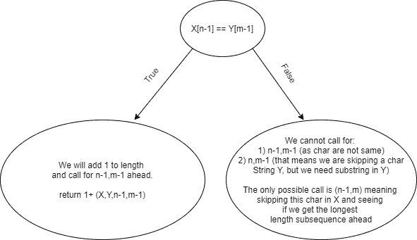
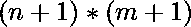

# 求一个字符串的最长子序列的长度，该子序列是另一个字符串的子串

> 原文:[https://www . geesforgeks . org/find-length-最长-子序列-一个字符串-子字符串-另一个字符串/](https://www.geeksforgeeks.org/find-length-longest-subsequence-one-string-substring-another-string/)

给定两根弦 **X** 和 **Y** 。任务是找出序列 y 中最长的子串 X 的长度
**例:**

```
Input : X = "ABCD",  Y = "BACDBDCD"
Output : 3
"ACD" is longest subsequence of X which
is substring of Y.

Input : X = "A",  Y = "A"
Output : 1
```

**先决条件:最长公共子序列问题将帮助您快速理解这个问题🙂**

**方法 1(蛮力):**
使用蛮力找到 X 的所有子序列，对于每个子序列，检查它是否是 Y 的子串。如果是 Y 的子串，维护一个最大长度变量，比较它的长度。

时间复杂性:O(2^n)

**方法二:(递归):**

假设 n 是 X 的长度，m 是 y 的长度。我们将建立一个递归函数，如下所示，有 4 个参数，返回类型是 int，因为我们将得到 X 的最大可能子序列的长度，这是 y 的子串。我们将使用 n-1 和 m-1 根据字符串中的最后一个字符进行判断，以便进一步处理。

```
int maxSubsequenceSubstring(string &X,string &Y,int n,int m)
{
    ....
    return ans;
}
```

对于递归，我们需要做两件事，第一件是基本情况，第二件是对较小输入的调用(为此，我们将看到选择图)。

基本案例:

通过查看函数的参数，我们可以看到只有两个参数会在递归调用时发生变化，即两个字符串的长度。所以对于基本情况，考虑我们能给出的最小输入。您将看到最小的输入为 0，即空长度。因此，当 n == 0 或 m == 0 是基本情况时。n 和 m 不能小于零。现在我们知道了条件，我们需要根据问题返回子序列的长度。如果长度是 0，那么意味着其中一个字符串是空的，并且没有可能的公共子序列，所以我们必须返回 0。

```
int maxSubsequenceSubstring(string &X,string &Y,int n,int m)
{
    if (n==0 || m==0) return 0;
    ....
    return ans;
}
```

儿童电话:



选择图

我们可以通过查看两个字符串的最后一个字符是否相同来了解如何进行调用。我们可以看到这与 LCS(最长公共子序列)问题有什么不同。

```
int maxSubsequenceSubstring(string &X,string &Y,int n,int m)
{
    // Base Case
    if (n==0 || m==0) return 0;

    // Calls on smaller inputs

    // if the last char of both strings are equal
    if(X[n-1] == Y[m-1])
    {
        return  1 + maxSubsequenceSubstring(X,Y,n-1,m-1);
    }

    // if the last char of both strings are not equal
    else
    {
        return maxSubsequenceSubstring(X,Y,n-1,m);    
    }
}
```

现在这里是问题的主要症结，我们可以看到我们在呼唤 X[0..n]和 Y[0..m]，在我们的递归函数中，它将返回 X 的子序列和 Y 的子串的最大长度的答案(**和 Y 的子串的结束字符在长度 m 处结束**)。这是非常重要的，因为我们也想找到所有的中间子字符串。因此，我们需要使用一个 for 循环，在这个循环中，我们将对从 Y 的 *0 到 m* 的所有长度调用上述函数，并在那里返回答案的最大值。下面是 C++的最终代码。

## C++

```
#include<bits/stdc++.h>
using namespace std;

int maxSubsequenceSubstring(string &X,string &Y,int n,int m)
{
    // Base Case
    if (n==0 || m==0) return 0;

    // Calls on smaller inputs

    // if the last char of both strings are equal
    if(X[n-1] == Y[m-1])
    {
        return  1 + maxSubsequenceSubstring(X,Y,n-1,m-1);
    }

    // if the last char of both strings are not equal
    else
    {
        return maxSubsequenceSubstring(X,Y,n-1,m);   
    }
}

int main()
{
     string X = "abcd";
      string Y = "bacdbdcd";
      int n = X.size(),m = Y.size();
      int maximum_length = 0; //as minimum length can be 0 only.
      for(int i = 0;i<=m;i++) // traversing for every length of Y.
    {
        int temp_ans = maxSubsequenceSubstring(X,Y,n,i);
          if(temp_ans > maximum_length) maximum_length = temp_ans;
    }
      cout<<"Length for maximum possible Subsequence of string X which is Substring of Y -> "<<maximum_length;
      return 0;
}
```

## Java 语言(一种计算机语言，尤用于创建网站)

```
import java.util.*;
class GFG {

    static int maxSubsequenceSubString(String X, String Y,
                                       int n, int m)
    {

        // Base Case
        if (n == 0 || m == 0)
            return 0;

        // Calls on smaller inputs

        // if the last char of both Strings are equal
        if (X.charAt(n - 1) == Y.charAt(m - 1)) {
            return 1
                + maxSubsequenceSubString(X, Y, n - 1,
                                          m - 1);
        }

        // if the last char of both Strings are not equal
        else {
            return maxSubsequenceSubString(X, Y, n - 1, m);
        }
    }

  // Driver code
    public static void main(String[] args)
    {
        String X = "abcd";
        String Y = "bacdbdcd";
        int n = X.length(), m = Y.length();
        int maximum_length
            = 0; // as minimum length can be 0 only.
        for (int i = 0; i <= m;
             i++) // traversing for every length of Y.
        {
            int temp_ans
                = maxSubsequenceSubString(X, Y, n, i);
            if (temp_ans > maximum_length)
                maximum_length = temp_ans;
        }
        System.out.print(
            "Length for maximum possible Subsequence of String X which is SubString of Y->"
            + maximum_length);
    }
}

// This code is contributed by gauravrajput1
```

## C#

```
using System;

public class GFG {

    static int maxSubsequenceSubString(String X, String Y,
                                       int n, int m)
    {

        // Base Case
        if (n == 0 || m == 0)
            return 0;

        // Calls on smaller inputs

        // if the last char of both Strings are equal
        if (X[n - 1] == Y[m - 1]) {
            return 1
                + maxSubsequenceSubString(X, Y, n - 1,
                                          m - 1);
        }

        // if the last char of both Strings are not equal
        else {
            return maxSubsequenceSubString(X, Y, n - 1, m);
        }
    }

    // Driver code
    public static void Main(String[] args)
    {
        String X = "abcd";
        String Y = "bacdbdcd";
        int n = X.Length, m = Y.Length;
        int maximum_length
            = 0; // as minimum length can be 0 only.
        for (int i = 0; i <= m;
             i++) // traversing for every length of Y.
        {
            int temp_ans
                = maxSubsequenceSubString(X, Y, n, i);
            if (temp_ans > maximum_length)
                maximum_length = temp_ans;
        }
        Console.Write(
            "Length for maximum possible Subsequence of String X which is SubString of Y->"
            + maximum_length);
    }
}

// This code is contributed by gauravrajput1
```

**Output**

```
Length for maximum possible Subsequence of string X which is Substring of Y -> 3
```

时间复杂度:O(n*m)(对于递归函数中的每一次调用，我们都减少 n，因此我们将在 n 次调用后精确到达基本情况，对于不同长度的字符串 Y，我们使用 m 次循环)。

空间复杂度:O(n)(对于递归调用，我们对每个调用都使用堆栈)。

**方法三:(动态规划):**

<u>子方法 1:记忆</u>

<u>注:</u>必须看到上面的递归解，才能将其优化理解为记忆化

从上面的递归解，有多个调用，而且，我们在 for 循环中使用递归，很可能我们已经解决了一个调用的答案。因此，为了优化我们的递归解决方案，我们将使用？(见我们只有 2 个参数，在整个调用过程中变化，因此数组的维数是 2，大小是，因为我们需要存储从 0 开始的所有可能调用的答案..n 和 0..m)。因此它是一个 2D 阵列。

我们可以将 vector 用于数组的相同或动态分配。

```
// initialise a vector like this
vector<vector<int>> dp(n+1,vector<int>(m+1,-1));

// or Dynamic allocation
int **dp = new int*[n+1];
for(int i = 0;i<=n;i++)
{
    dp[i] = new int[m+1];
    for(int j = 0;j<=m;j++)
    {
        dp[i][j] = -1;
    }
}
```

通过初始化 2D 向量，我们将使用这个数组作为递归中的第五个参数，并存储我们的答案。此外，我们用-1 填充它，这意味着我们还没有解决这个调用，因此对它使用传统的递归，如果任何调用的 dp[n][m]不是-1，意味着我们已经解决了这个调用，因此使用 dp[n][m]的答案。

```
// In recursion calls we will check for if we have solved the answer for the call or not
if(dp[n][m] != -1) return dp[n][m];

// Else we will store the result and return that back from this call
if(X[n-1] == Y[m-1]) 
    return dp[n][m] = 1 + maxSubsequenceSubstring(X,Y,n-1,m-1,dp);
else 
    return dp[n][m] = maxSubsequenceSubstring(X,Y,n-1,m,dp);
```

记忆的代码在这里:

## C++

```
#include<bits/stdc++.h>
using namespace std;

int maxSubsequenceSubstring(string &X,string &Y,int n,int m,vector<vector<int>>& dp)
{
    // Base Case
    if (n==0 || m==0) return 0;

      // check if we have already solved it?
      if(dp[n][m] != -1) return dp[n][m];

    // Calls on smaller inputs

    // if the last char of both strings are equal
    if(X[n-1] == Y[m-1])
    {
        return  dp[n][m] = 1 + maxSubsequenceSubstring(X,Y,n-1,m-1,dp);
    }

    // if the last char of both strings are not equal
    else
    {
        return dp[n][m] = maxSubsequenceSubstring(X,Y,n-1,m,dp);   
    }
}

int main()
{
     string X = "abcd";
      string Y = "bacdbdcd";
      int n = X.size(),m = Y.size();
      int maximum_length = 0; //as minimum length can be 0 only.

      vector<vector<int>> dp(n+1,vector<int>(m+1,-1));
      for(int i = 0;i<=m;i++) // traversing for every length of Y.
    {
        int temp_ans = maxSubsequenceSubstring(X,Y,n,i,dp);
          if(temp_ans > maximum_length) maximum_length = temp_ans;
    }
      cout<<"Length for maximum possible Subsequence of string X which is Substring of Y -> "<<maximum_length;
      return 0;
}
```

**Output**

```
Length for maximum possible Subsequence of string X which is Substring of Y -> 3
```

时间复杂度:O(n*m)(肯定会比递归解好，最坏的情况只有在字符串 X 的字符都不在字符串 y 中的情况下才有可能)

空间复杂度:O(n * m+n)(Dp 数组的大小和递归的栈调用大小)

<u>子方法 2:制表</u>

设 n 为 X 的长度，m 为 y 的长度，创建一个 m + 1 行 n + 1 列的 2D 数组“dp[][]”。值 **dp[i][j]** 是 X[0…]的子序列的最大长度。j]是 Y[0…的子串。我】。现在对于 dp[][]的每个单元格，填充值为:

```
for (i = 1 to m)
  for (j = 1 to n)
    if (x[i-1] == y[j - 1])
      dp[i][j] = dp[i-1][j-1] + 1;
    else
      dp[i][j] = dp[i][j-1];
```

最后，作为 y 的子串的 x 的最长子序列的长度是 max(dp[i][n])，其中 1 <= i <= m.
下面是该方法的实现:

C/C++

```
// C++ program to find maximum length of
// subsequence of a string X such it is
// substring in another string Y.
#include <bits/stdc++.h>
#define MAX 1000
using namespace std;

// Return the maximum size of substring of
// X which is substring in Y.
int maxSubsequenceSubstring(char x[], char y[],
                            int n, int m)
{
    int dp[MAX][MAX];

    // Initialize the dp[][] to 0.
    for (int i = 0; i <= m; i++)
        for (int j = 0; j <= n; j++)
            dp[i][j] = 0;

    // Calculating value for each element.
    for (int i = 1; i <= m; i++) {
        for (int j = 1; j <= n; j++) {

            // If alphabet of string X and Y are
            // equal make dp[i][j] = 1 + dp[i-1][j-1]
            if (x[j - 1] == y[i - 1])
                dp[i][j] = 1 + dp[i - 1][j - 1];

            // Else copy the previous value in the
            // row i.e dp[i-1][j-1]
            else
                dp[i][j] = dp[i][j - 1];
        }
    }

    // Finding the maximum length.
    int ans = 0;
    for (int i = 1; i <= m; i++)
        ans = max(ans, dp[i][n]);

    return ans;
}

// Driver Program
int main()
{
    char x[] = "ABCD";
    char y[] = "BACDBDCD";
    int n = strlen(x), m = strlen(y);
    cout << maxSubsequenceSubstring(x, y, n, m);
    return 0;
}
```

时间复杂度:O(n*m)(填充 Dp 数组所需的时间)

空间复杂度:O(n * m+n)(Dp 数组的大小)

## Java 语言(一种计算机语言，尤用于创建网站)

```
// Java program to find maximum length of
// subsequence of a string X such it is
// substring in another string Y.

public class GFG
{
    static final int MAX = 1000;

    // Return the maximum size of substring of
    // X which is substring in Y.
    static int maxSubsequenceSubstring(char x[], char y[],
                                int n, int m)
    {
        int dp[][] = new int[MAX][MAX];

        // Initialize the dp[][] to 0.
        for (int i = 0; i <= m; i++)
            for (int j = 0; j <= n; j++)
                dp[i][j] = 0;

        // Calculating value for each element.
        for (int i = 1; i <= m; i++) {
            for (int j = 1; j <= n; j++) {

                // If alphabet of string X and Y are
                // equal make dp[i][j] = 1 + dp[i-1][j-1]
                if (x[j - 1] == y[i - 1])
                    dp[i][j] = 1 + dp[i - 1][j - 1];

                // Else copy the previous value in the
                // row i.e dp[i-1][j-1]
                else
                    dp[i][j] = dp[i][j - 1];
            }
        }

        // Finding the maximum length.
        int ans = 0;
        for (int i = 1; i <= m; i++)
            ans = Math.max(ans, dp[i][n]);

        return ans;
    }

    // Driver Method
    public static void main(String[] args)
    {
        char x[] = "ABCD".toCharArray();
        char y[] = "BACDBDCD".toCharArray();
        int n = x.length, m = y.length;
        System.out.println(maxSubsequenceSubstring(x, y, n, m));
    }
}
```

## 蟒蛇 3

```
# Python3 program to find maximum
# length of subsequence of a string
# X such it is substring in another
# string Y.

MAX = 1000

# Return the maximum size of
# substring of X which is
# substring in Y.
def maxSubsequenceSubstring(x, y, n, m):
    dp = [[0 for i in range(MAX)]
             for i in range(MAX)]

    # Initialize the dp[][] to 0.

    # Calculating value for each element.
    for i in range(1, m + 1):
        for j in range(1, n + 1):

            # If alphabet of string
            # X and Y are equal make
            # dp[i][j] = 1 + dp[i-1][j-1]
            if(x[j - 1] == y[i - 1]):
                dp[i][j] = 1 + dp[i - 1][j - 1]

            # Else copy the previous value
            # in the row i.e dp[i-1][j-1]
            else:
                dp[i][j] = dp[i][j - 1]

    # Finding the maximum length
    ans = 0
    for i in range(1, m + 1):
        ans = max(ans, dp[i][n])
    return ans

# Driver Code
x = "ABCD"
y = "BACDBDCD"
n = len(x)
m = len(y)
print(maxSubsequenceSubstring(x, y, n, m))

# This code is contributed
# by sahilshelangia
```

## C#

```
// C# program to find maximum length of
// subsequence of a string X such it is
// substring in another string Y.
using System;

public class GFG
{
    static int MAX = 1000;

    // Return the maximum size of substring of
    // X which is substring in Y.
    static int maxSubsequenceSubstring(string x, string y,
                                            int n, int m)
    {
        int[ ,]dp = new int[MAX, MAX];

        // Initialize the dp[][] to 0.
        for (int i = 0; i <= m; i++)
            for (int j = 0; j <= n; j++)
                dp[i, j] = 0;

        // Calculating value for each element.
        for (int i = 1; i <= m; i++) {
            for (int j = 1; j <= n; j++) {

                // If alphabet of string X and Y are
                // equal make dp[i][j] = 1 + dp[i-1][j-1]
                if (x[j - 1] == y[i - 1])
                    dp[i, j] = 1 + dp[i - 1, j - 1];

                // Else copy the previous value in the
                // row i.e dp[i-1][j-1]
                else
                    dp[i, j] = dp[i, j - 1];
            }
        }

        // Finding the maximum length.
        int ans = 0;

        for (int i = 1; i <= m; i++)
            ans = Math.Max(ans, dp[i,n]);

        return ans;
    }

    // Driver Method
    public static void Main()
    {
        string x = "ABCD";
        string y = "BACDBDCD";
        int n = x.Length, m = y.Length;

        Console.WriteLine(maxSubsequenceSubstring(x,
                                            y, n, m));
    }
}

// This code is contributed by vt_m.
```

## 服务器端编程语言（Professional Hypertext Preprocessor 的缩写）

```
<?php
// PHP program to find maximum length of
// subsequence of a string X such it is
// substring in another string Y.

// Return the maximum size of substring of
// X which is substring in Y.
function maxSubsequenceSubstring($x, $y,
                                 $n, $m)
{
    $dp;

    // Initialize the dp[][] to 0.
    for ($i = 0; $i <= $m; $i++)
        for ($j = 0; $j <= $n; $j++)
            $dp[$i][$j] = 0;

    // Calculating value for each element.
    for ($i = 1; $i <= $m; $i++) {
        for ( $j = 1; $j <= $n; $j++) {

            // If alphabet of string
            // X and Y are equal make
            // dp[i][j] = 1 + dp[i-1][j-1]
            if ($x[$j - 1] == $y[$i - 1])
                $dp[$i][$j] = 1 + $dp[$i - 1][$j - 1];

            // Else copy the previous
            // value in the
            // row i.e dp[i-1][j-1]
            else
                $dp[$i][$j] = $dp[$i][$j - 1];
        }
    }

    // Finding the maximum length.
    $ans = 0;
    for ( $i = 1; $i <= $m; $i++)
        $ans = max($ans, $dp[$i][$n]);

    return $ans;
}

// Driver Code
{
    $x = "ABCD";
    $y = "BACDBDCD";
    $n = strlen($x); $m = strlen($y);
    echo maxSubsequenceSubstring($x, $y, $n, $m);
    return 0;
}

// This code is contributed by nitin mittal
?>
```

## java 描述语言

```
<script>

// Javascript program to find maximum length of
// subsequence of a string X such it is
// substring in another string Y.
var MAX = 1000;

// Return the maximum size of substring of
// X which is substring in Y.
function maxSubsequenceSubstring(x, y, n, m)
{
    var dp = Array.from(Array(MAX), ()=> Array(MAX));

    // Initialize the dp[][] to 0.
    for (var i = 0; i <= m; i++)
        for (var j = 0; j <= n; j++)
            dp[i][j] = 0;

    // Calculating value for each element.
    for (var i = 1; i <= m; i++) {
        for (var j = 1; j <= n; j++) {

            // If alphabet of string X and Y are
            // equal make dp[i][j] = 1 + dp[i-1][j-1]
            if (x[j - 1] == y[i - 1])
                dp[i][j] = 1 + dp[i - 1][j - 1];

            // Else copy the previous value in the
            // row i.e dp[i-1][j-1]
            else
                dp[i][j] = dp[i][j - 1];
        }
    }

    // Finding the maximum length.
    var ans = 0;
    for (var i = 1; i <= m; i++)
        ans = Math.max(ans, dp[i][n]);

    return ans;
}

// Driver Program
var x = "ABCD";
var y = "BACDBDCD";
var n = x.length, m = y.length;
document.write( maxSubsequenceSubstring(x, y, n, m));

</script>
```

**Output**

```
3
```

本文由 **Anuj Chauhan** 供稿。如果你喜欢 GeeksforGeeks 并想投稿，你也可以使用[write.geeksforgeeks.org](https://write.geeksforgeeks.org)写一篇文章或者把你的文章邮寄到 review-team@geeksforgeeks.org。看到你的文章出现在极客博客主页上，帮助其他极客。
如果你发现任何不正确的地方，请写评论，或者分享更多关于上述话题的信息。