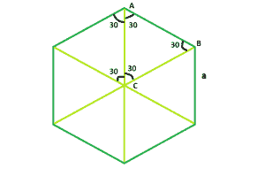

# 求六边形对角线长度

> 原文:[https://www . geesforgeks . org/find-六边形对角线长度/](https://www.geeksforgeeks.org/find-length-of-diagonal-of-hexagon/)

给定一个边长为 **a** 的正六边形，任务是找出它对角线的长度。
**示例** :

```
Input : a = 4
Output : 8

Input : a = 7
Output : 14
```



从图中可以清楚的看到，三角形 ABC 是一个等边三角形，所以
**AB = AC = BC = a** 。
也很明显，对角线= **2*AC** 或 **2*BC**
所以六边形的对角线长度= **2*a**
下面是上述方法的实现:

## C++

```
// C++ Program to find the diagonal
// of the hexagon
#include <bits/stdc++.h>
using namespace std;

// Function to find the diagonal
// of the hexagon
float hexadiagonal(float a)
{
    // side cannot be negative
    if (a < 0)
        return -1;

    // diagonal of the hexagon
    return 2 * a;
}

// Driver code
int main()
{
    float a = 4;

    cout << hexadiagonal(a) << endl;

    return 0;
}
```

## Java 语言(一种计算机语言，尤用于创建网站)

```
// Java Program to find the diagonal
// of the hexagon

import java.io.*;

class GFG {

// Function to find the diagonal
// of the hexagon
static float hexadiagonal(float a)
{
    // side cannot be negative
    if (a < 0)
        return -1;

    // diagonal of the hexagon
    return 2 * a;
}

// Driver code

    public static void main (String[] args) {
            float a = 4;

    System.out.print( hexadiagonal(a));
}
}

// This code is contributed
// by shs
```

## 蟒蛇 3

```
# Python3 Program to find the diagonal
# of the hexagon

# Function to find the diagonal
# of the hexagon
def hexadiagonal(a):

    # side cannot be negative
    if (a < 0):
        return -1

    # diagonal of the hexagon
    return 2 * a

# Driver code
if __name__=='__main__':
    a = 4
    print(hexadiagonal(a))

# This code is contributed by
# Shivi_Aggarwal
```

## C#

```
// C# Program to find the diagonal
// of the hexagon
using System;

class GFG {

    // Function to find the diagonal
    // of the hexagon
    static float hexadiagonal(float a)
    {
        // side cannot be negative
        if (a < 0)
            return -1;

        // diagonal of the hexagon
        return 2 * a;
    }

// Driver code
public static void Main()
{
   float a = 4;
   Console.WriteLine( hexadiagonal(a));
}
}

// This code is contributed
// by anuj_67..
```

## 服务器端编程语言（Professional Hypertext Preprocessor 的缩写）

```
<?php
// PHP Program to find the diagonal
// of the hexagon

// Function to find the diagonal
// of the hexagon
function hexadiagonal($a)
{
    // side cannot be negative
    if ($a < 0)
        return -1;

    // diagonal of the hexagon
    return 2 * $a;
}

// Driver code
    $a = 4;

    echo hexadiagonal($a);
    // This code is contributed
// by anuj_67..

?>
```

## java 描述语言

```
<script>
// javascript Program to find the diagonal
// of the hexagon

// Function to find the diagonal
// of the hexagon
function hexadiagonal(a)
{

    // side cannot be negative
    if (a < 0)
        return -1;

    // diagonal of the hexagon
    return 2 * a;
}

// Driver code

var a = 4;
document.write( hexadiagonal(a));

// This code is contributed by 29AjayKumar
</script>
```

**Output:** 

```
8
```