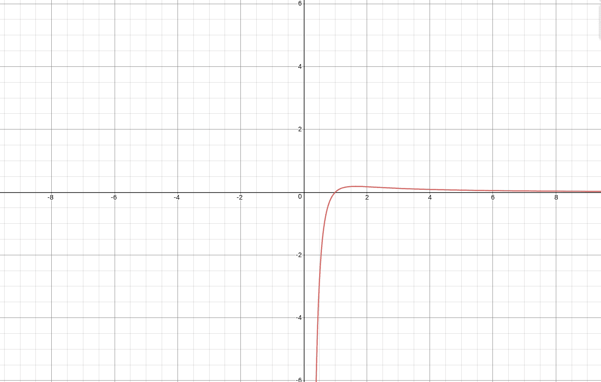

# 在给出 x 和 y 的 x^(y^2)或 y^(x^2)中找到最大值

> 原文:[https://www . geesforgeks . org/find-maximum-in-xy2-or-yx2-其中-x-和-y-被赋予/](https://www.geeksforgeeks.org/find-maximum-among-xy2-or-yx2-where-x-and-y-are-given/)

给定 X 和 Y 的值大于 2，任务是找出其中的最大值

> x^(y^2)和 y^(x^2)

考虑 **x** 大于 **y** 或者 **y** 大于 **x** 。所以，如果 *x^(y^2)* 更大，打印 1；如果 *y^(x^2)* 更大，打印 2。
**示例:**

```
Input: X = 4, Y = 9
Output: 1

Input: X = 4, Y = 3
Output: 2
```

**方法:**假设

```
*** QuickLaTeX cannot compile formula:

*** Error message:
Error: Nothing to show, formula is empty

```

，然后在两边取 ln 并除以

```
*** QuickLaTeX cannot compile formula:

*** Error message:
Error: Nothing to show, formula is empty

```

我们可以得到

```
*** QuickLaTeX cannot compile formula:

*** Error message:
Error: Nothing to show, formula is empty

```

。
取

```
*** QuickLaTeX cannot compile formula:

*** Error message:
Error: Nothing to show, formula is empty

```

。对于，此函数是单调递减的

```
*** QuickLaTeX cannot compile formula:

*** Error message:
Error: Nothing to show, formula is empty

```

。



```
If x > y, then F(x) < F(y)
```

## C++

```
// C++ program to find the greater value
#include <bits/stdc++.h>
using namespace std;

// Function to find maximum
bool findGreater(int x, int y)
{
    // Case 1
    if (x > y) {
       return false;
    }

    // Case 2
    else {
        return true;
    }
}

// Driver Code
int main()
{
    int x = 4;
    int y = 9;

    findGreater(x, y) ? cout << "1\n"
                      : cout << "2\n";

   return 0;
}
```

## Java 语言(一种计算机语言，尤用于创建网站)

```
// Java program to find
// the greater value
import java.io.*;

class GFG
{

// Function to find maximum
static boolean findGreater(int x,  
                           int y)
{
    // Case 1
    if (x > y)
    {
        return false;
    }

    // Case 2
    else
    {
        return true;
    }
}

// Driver Code
public static void main (String[] args)
{
    int x = 4;
    int y = 9;

    if(findGreater(x, y))
    System.out.println("1");
    else
    System.out.println("2");
}
}

// This code is contributed
// by inder_verma.
```

## 蟒蛇 3

```
# Python3 program to find
# the greater value

# Function to find maximum
def findGreater(x, y):

    # Case 1
    if (x > y):
        return False;

    # Case 2
    else:
        return True;

# Driver Code
x = 4;
y = 9;
if(findGreater(x, y)):
    print("1");
else:
    print("2");

# This code is contributed
# by mits
```

## C#

```
// C# program to find
// the greater value
using System;

class GFG
{

// Function to find maximum
static bool findGreater(int x,
                        int y)
{
    // Case 1
    if (x > y)
    {
        return false;
    }

    // Case 2
    else
    {
        return true;
    }
}

// Driver Code
public static void Main ()
{
    int x = 4;
    int y = 9;

    if(findGreater(x, y))
        Console.WriteLine("1");
    else
        Console.WriteLine("2");
}
}

// This code is contributed
// by inder_verma.
```

## 服务器端编程语言（Professional Hypertext Preprocessor 的缩写）

```
<?php
// PHP program to find the greater value

// Function to find maximum
function findGreater($x, $y)
{
    // Case 1
    if ($x > $y)
    {
        return false;
    }

    // Case 2
    else
    {
        return true;
    }
}

// Driver Code
$x = 4;
$y = 9;
if(findGreater($x, $y) == true)
    echo("1\n");
else
    echo("2\n");

// This code is contributed
// by inder_verma
?>
```

## java 描述语言

```
<script>

// JavaScript program to find
// the greater value

// Function to find maximum
function findGreater(x,y)
{
    // Case 1
    if (x > y)
    {
        return false;
    }

    // Case 2
    else
    {
        return true;
    }
}

// Driver Code
var x = 4;
var y = 9;

if(findGreater(x, y))
document.write("1");
else
document.write("2");

// This code is contributed by 29AjayKumar

</script>
```

**Output:** 

```
1
```