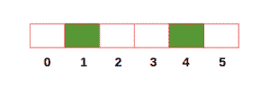
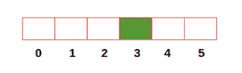
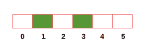

# 查找任意城市与车站的最大距离

> 原文:[https://www . geesforgeks . org/find-任意城市与车站之间的最大距离/](https://www.geeksforgeeks.org/find-maximum-distance-between-any-city-and-station/)

给定从 0 到 n-1 编号的城市 **n** 的数量以及站点所在的城市，任务是找到任何城市与其最近站点之间的最大距离。请注意，有车站的城市可以以任何顺序给出。
**例:**

```
Input: numOfCities = 6, stations = [1, 4]
Output: 1

Input: numOfCities = 6, stations = [3]
Output: 3

Input: numOfCities = 6, stations = [3, 1]
Output: 2
```

1.  下图表示包含 6 个城市的第一个示例，以及以绿色突出显示车站的城市。在这种情况下，距离最近站点最远的城市分别是 0、2、3 和 5，距离为 1。因此，最大距离为 1。
    
2.  在第二个例子中，距离最近站点最远的城市是 0，距离为 3。因此，最大距离为 3。
3.  在第三个例子中，距离最近站点最远的城市是 5，距离是 2。因此，最大距离是 2。

**方法:**这个问题有三种可能的情况:

1.  最远的城市在两个车站之间。
2.  当最远的城市在第一站的左边。
3.  当最远的城市在最后一站的右边。

下面是解决上述问题的算法:

*   用**假**初始化一个大小为 **n** (城市数)的布尔数组。然后将有站点的城市值标记为**真**
*   用 0 初始化变量**距离**。初始化另一个变量 **maxDist** ，其值等于第一个有车站的城市(用于案例 2)。
*   开始一个接一个地遍历所有城市。
*   如果当前城市有车站，则将最大值( **dist** +1)//2 和 **maxDist** 分配给 **maxDist** (用于案例 1)。此外，将 0 分配给 **dist** 。
*   否则，增加**距离**。
*   最后，返回 **dist** 和 **maxDist** 的最大值(用于情况 3)。

以下是上述方法的实现:

## C++

```
// C++ program to calculate the maximum 
// distance between any city
// and its nearest station
#include<bits/stdc++.h>

using namespace std;

// Function to calculate the maximum 
// distance between any city and its nearest station
int findMaxDistance(int numOfCities,int station[],int n)
{ 
    // Initialize boolean list
    bool hasStation[numOfCities + 1] = {false};

    // Assign True to cities containing station
    for (int city = 0; city < n; city++)
    {
        hasStation[station[city]] = true;
    }

    int dist = 0;
    int maxDist = INT_MAX;

    for(int i = 0; i < n; i++)
    {
        maxDist = min(station[i],maxDist);
    }

    for (int city = 0; city < numOfCities; city++)
    {
        if (hasStation[city] == true)
        {
            maxDist = max((dist + 1) / 2, maxDist);
            dist = 0;
        }
        else
            dist += 1;
    }
    return max(maxDist, dist);
} 

//Driver code
int main()
{ 
    int numOfCities = 6;
    int station[] = {3, 1};
    int n = sizeof(station)/sizeof(station[0]);

    cout << "Max Distance:" << findMaxDistance(numOfCities,
                                                station, n);
}

//This code is contributed by Mohit Kumar 29
```

## Java 语言(一种计算机语言，尤用于创建网站)

```
// Java program to calculate the maximum 
// distance between any city
// and its nearest station
import java.util.*;

class GFG
{

// Function to calculate the maximum 
// distance between any city and its nearest station
static int findMaxDistance(int numOfCities,
                            int station[],int n)
{ 
    // Initialize boolean list
    boolean hasStation[] = new boolean[numOfCities + 1];

    // Assign True to cities containing station
    for (int city = 0; city < n; city++)
    {
    hasStation[station[city]] = true;
    }

    int dist = 0;
    int maxDist = Integer.MAX_VALUE;

    for(int i = 0; i < n; i++)
    {
        maxDist = Math.min(station[i],maxDist);
    }

    for (int city = 0; city < numOfCities; city++)
    {
        if (hasStation[city] == true)
        {
            maxDist = Math.max((dist + 1) / 2, maxDist);
            dist = 0;
        }
        else
            dist += 1;
    }
    return Math.max(maxDist, dist);
} 

//Driver code
public static void main(String args[])
{ 
    int numOfCities = 6;
    int station[] = {3, 1};
    int n = station.length;

    System.out.println("Max Distance:"+
        findMaxDistance(numOfCities,station, n));
}
}

// This code is contributed by
// Surendra_Gnagwar
```

## 计算机编程语言

```
# Python3 code to calculate the maximum 
# distance between any city and its nearest station

# Function to calculate the maximum 
# distance between any city and its nearest station
def findMaxDistance(numOfCities, station):

    # Initialize boolean list
    hasStation = [False] * numOfCities
    # Assign True to cities containing station
    for city in station:
        hasStation[city] = True

    dist, maxDist = 0, min(station)

    for city in range(numOfCities):
        if hasStation[city] == True:
            maxDist = max((dist + 1) // 2, maxDist)
            dist = 0

        else:
            dist += 1

    return max(maxDist, dist)

numOfCities = 6
station = [3, 1]
print("Max Distance:", findMaxDistance(numOfCities, station))
```

## C#

```
// C# program to calculate the maximum 
// distance between any city 
// and its nearest station 
using System;

class GFG 
{ 

// Function to calculate the maximum 
// distance between any city and its nearest station 
static int findMaxDistance(int numOfCities, 
                            int []station,int n) 
{ 
    // Initialize boolean list 
    bool []hasStation = new bool[numOfCities + 1]; 

    // Assign True to cities containing station 
    for (int city = 0; city < n; city++) 
    { 
        hasStation[station[city]] = true; 
    } 

    int dist = 0; 
    int maxDist = int.MaxValue; 

    for(int i = 0; i < n; i++) 
    { 
        maxDist = Math.Min(station[i],maxDist); 
    } 

    for (int city = 0; city < numOfCities; city++) 
    { 
        if (hasStation[city] == true) 
        { 
            maxDist = Math.Max((dist + 1) / 2, maxDist); 
            dist = 0; 
        } 
        else
            dist += 1; 
    } 
    return Math.Max(maxDist, dist); 
} 

// Driver code 
public static void Main(String []args) 
{ 
    int numOfCities = 6; 
    int []station = {3, 1}; 
    int n = station.Length; 

    Console.WriteLine("Max Distance:"+ 
        findMaxDistance(numOfCities,station, n)); 
} 
} 

// This code has been contributed by 29AjayKumar
```

## 服务器端编程语言（Professional Hypertext Preprocessor 的缩写）

```
<?php
// PHP program to calculate the maximum 
// distance between any city
// and its nearest station

// Function to calculate the maximum 
// distance between any city and 
// its nearest station
function findMaxDistance($numOfCities, 
                         $station, $n)
{ 
    // Initialize boolean list
    $hasStation = array_fill(0, $numOfCities + 1, 
                                          false);

    // Assign True to cities containing station
    for ($city = 0; $city < $n; $city++)
    {
        $hasStation[$station[$city]] = true;
    }

    $dist = 0;
    $maxDist = PHP_INT_MAX;

    for($i = 0; $i < $n; $i++)
    {
        $maxDist = min($station[$i], $maxDist);
    }

    for ($city = 0; 
         $city < $numOfCities; $city++)
    {
        if ($hasStation[$city] == true)
        {
            $maxDist = max((int)(($dist + 1) / 2), 
                                        $maxDist);
            $dist = 0;
        }
        else
            $dist += 1;
    }
    return max($maxDist, $dist);
} 

// Driver code
$numOfCities = 6;
$station = array(3, 1);
$n = count($station);

echo "Max Distance: ".findMaxDistance($numOfCities,
                                      $station, $n);

// This code is contributed by mits
?>
```

## java 描述语言

```
<script>

// Javascript program to calculate the maximum 
// distance between any city
// and its nearest station

// Function to calculate the maximum 
// distance between any city and its nearest station
function findMaxDistance(numOfCities,station,n)
{ 
    // Initialize boolean list
    var hasStation = Array(numOfCities+1).fill(false);

    // Assign True to cities containing station
    for (var city = 0; city < n; city++)
    {
        hasStation[station[city]] = true;
    }

    var dist = 0;
    var maxDist = 1000000000;

    for(var i = 0; i < n; i++)
    {
        maxDist = Math.min(station[i],maxDist);
    }

    for (var city = 0; city < numOfCities; city++)
    {
        if (hasStation[city] == true)
        {
            maxDist = Math.max((dist + 1) / 2, maxDist);
            dist = 0;
        }
        else
            dist += 1;
    }
    return Math.max(maxDist, dist);
} 

//Driver code
var numOfCities = 6;
var station = [3, 1];
var n = station.length;
document.write( "Max Distance: " + findMaxDistance(numOfCities,
                                            station, n));

</script>    
```

**Output:** 

```
Max Distance: 2
```

**时间复杂度:**O(n)
T3】空间复杂度: O(n)