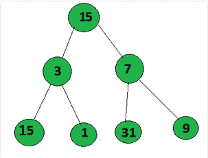
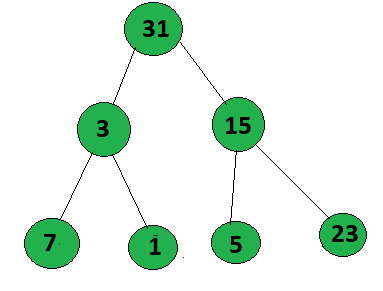

# 求二叉树中从根到叶的最大 GCD 值

> 原文:[https://www . geeksforgeeks . org/find-maximum-gcd-value-从二叉树的根到叶/](https://www.geeksforgeeks.org/find-maximum-gcd-value-from-root-to-leaf-in-a-binary-tree/)

给定一棵 [**二叉树**](https://www.geeksforgeeks.org/binary-tree-data-structure/) ，任务是从根节点到叶节点的任意[路径中找到 **GCD** 的最大值。](https://www.geeksforgeeks.org/given-a-binary-tree-print-all-root-to-leaf-paths/)

**示例:**

> **输入:**下面是给定的树:
> 
> [](https://media.geeksforgeeks.org/wp-content/uploads/20200719121304/Annotation20200719120926.png)
> 
> **输出:** 3
> **解释:**
> 路径 1: 15- > 3- > 5 = gcd(15，3，15) =3
> 路径 2: 15- > 3- > 1 =gcd(15，3，1) = 1
> 路径 3: 15- > 7- > 31=gcd(15，7，31)= 1
> 路径 4
> 
> **输入:**下面是给定的树:
> 
> [](https://media.geeksforgeeks.org/wp-content/uploads/20200709135802/Untitled.png)
> 
> **输出:** 1

**方法:**思路是遍历从根节点到叶节点的所有路径，计算该路径中发生的所有节点的 GCD。以下是步骤:

1.  在给定的二叉树上执行[前序遍历。](https://www.geeksforgeeks.org/tree-traversals-inorder-preorder-and-postorder/)
2.  迭代所有路径并跟踪数组中的所有路径值。
3.  每当遇到一个叶值，然后找到一个数组中所有值的 GCD。
4.  将 GCD 更新为最大值。

下面是上述方法的实现:

## C++

```
// C++ program for the above approach
#include <bits/stdc++.h>
using namespace std;

// Initialise to update the maximum
// gcd value from all the path
int maxm = 0;

// Node structure
struct Node {
    int val;

    // Left & right child of the node
    Node *left, *right;

    // Initialize constructor
    Node(int x)
    {
        val = x;
        left = NULL;
        right = NULL;
    }
};

// Function to find gcd of a and b
int gcd(int a, int b)
{
    if (b == 0)
        return a;
    return gcd(b, a % b);
}

// function to find the gcd of a path
int find_gcd(vector<int> arr)
{
    if (arr.size() == 1)
        return arr[0];

    int g = arr[0];

    for (int i = 1; i < arr.size(); i++) {
        g = gcd(g, arr[i]);
    }

    return g;
}

// Function to find the maximum value
// of gcd from root to leaf
// in a Binary tree
void maxm_gcd(Node* root, vector<int> ans)
{
    // Check if root is not null
    if (!root)
        return;

    if (root->left == NULL
        and root->right == NULL) {
        ans.push_back(root->val);

        // Find the maximum gcd of
        // path value and store in
        // global maxm variable
        maxm = max(find_gcd(ans),
                   maxm);

        return;
    }

    // Traverse left of binary tree
    ans.push_back(root->val);
    maxm_gcd(root->left, ans);

    // Traverse right of the binary tree
    maxm_gcd(root->right, ans);
}

// Driver Code
int main()
{
    // Given Tree
    Node* root = new Node(15);
    root->left = new Node(3);
    root->right = new Node(7);
    root->left->left = new Node(15);
    root->left->right = new Node(1);
    root->right->left = new Node(31);
    root->right->right = new Node(9);

    // Function Call
    maxm_gcd(root, {});

    // Print the maximum AND value
    cout << maxm << endl;

    return 0;
}
```

## Java 语言(一种计算机语言，尤用于创建网站)

```
// Java program for the above approach
import java.util.*;

class GFG{

// Initialise to update the maximum
// gcd value from all the path
static int maxm = 0;

// Node structure
static class Node
{
    int val;

    // Left & right child of the node
    Node left, right;

    // Initialize constructor
    Node(int x)
    {
        val = x;
        left = null;
        right = null;
    }
};

// Function to find gcd of a and b
static int gcd(int a, int b)
{
    if (b == 0)
        return a;
    return gcd(b, a % b);
}

// Function to find the gcd of a path
static int find_gcd(Vector<Integer> arr)
{
    if (arr.size() == 1)
        return arr.get(0);

    int g = arr.get(0);

    for(int i = 1; i < arr.size(); i++)
    {
        g = gcd(g, arr.get(1));
    }
    return g;
}

// Function to find the maximum value
// of gcd from root to leaf
// in a Binary tree
static void maxm_gcd(Node root,
                     Vector<Integer> ans)
{

    // Check if root is not null
    if (root == null)
        return;

    if (root.left == null &&
        root.right == null)
    {
        ans.add(root.val);

        // Find the maximum gcd of
        // path value and store in
        // global maxm variable
        maxm = Math.max(find_gcd(ans),
                        maxm);

        return;
    }

    // Traverse left of binary tree
    ans.add(root.val);
    maxm_gcd(root.left, ans);

    // Traverse right of the binary tree
    maxm_gcd(root.right, ans);
}

// Driver Code
public static void main(String[] args)
{

    // Given Tree
    Node root = new Node(15);
    root.left = new Node(3);
    root.right = new Node(7);
    root.left.left = new Node(15);
    root.left.right = new Node(1);
    root.right.left = new Node(31);
    root.right.right = new Node(9);

    // Function call
    maxm_gcd(root, new Vector<>());

    // Print the maximum AND value
    System.out.print(maxm + "\n");
}
}

// This code is contributed by Rajput-Ji
```

## 蟒蛇 3

```
# Python3 implementation of
# the above approach

# Initialise to update the maximum
# gcd value from all the path
global maxm
maxm = 0

# Node structure
class Node:

    # Initialize constructor
    def __init__(self, x):

        self.val = x
        self.left = None
        self.right = None

# Function to find gcd of a and b
def gcd(a, b):

    if(b == 0):
        return a
    return gcd(b, a % b)

# Function to find the gcd of a path
def find_gcd(arr):

    if(len(arr) == 1):
        return arr[0]

    g = arr[0]

    for i in range(1, len(arr)):
        g = gcd(g, arr[i])

    return g

# Function to find the maximum value
# of gcd from root to leaf
# in a Binary tree
def maxm_gcd(root, ans):

    global maxm

    # Check if root is not null
    if(not root):
        return

    if(root.left == None and
       root.right == None):
        ans.append(root.val)

        # Find the maximum gcd of
        # path value and store in
        # global maxm variable
        maxm = max(find_gcd(ans), maxm)

        return

    # Traverse left of binary tree
    ans.append(root.val)
    maxm_gcd(root.left, ans)

    # Traverse right of the binary tree
    maxm_gcd(root.right, ans)

# Driver Code
if __name__ == '__main__':

    # Given Tree
    root = Node(15)
    root.left = Node(3)
    root.right = Node(7)
    root.left.left = Node(15)
    root.left.right = Node(1)
    root.right.left = Node(31)
    root.right.right = Node(9)

    # Function call
    maxm_gcd(root, [])

    # Print the maximum AND value
    print(maxm)

# This code is contributed by Shivam Singh
```

## C#

```
// C# program for the above approach
using System;
using System.Collections.Generic;
class GFG{

// Initialise to update the maximum
// gcd value from all the path
static int maxm = 0;

// Node structure
class Node
{
    public int val;

    // Left & right child of the node
    public Node left, right;

    // Initialize constructor
    public Node(int x)
    {
        val = x;
        left = null;
        right = null;
    }
};

// Function to find gcd of a and b
static int gcd(int a, int b)
{
    if (b == 0)
        return a;
    return gcd(b, a % b);
}

// Function to find the gcd of a path
static int find_gcd(List<int> arr)
{
    if (arr.Count == 1)
        return arr[0];

    int g = arr[0];

    for(int i = 1; i < arr.Count; i++)
    {
        g = gcd(g, arr[1]);
    }
    return g;
}

// Function to find the maximum value
// of gcd from root to leaf
// in a Binary tree
static void maxm_gcd(Node root,
                     List<int> ans)
{

    // Check if root is not null
    if (root == null)
        return;

    if (root.left == null &&
        root.right == null)
    {
        ans.Add(root.val);

        // Find the maximum gcd of
        // path value and store in
        // global maxm variable
        maxm = Math.Max(find_gcd(ans),
                                 maxm);

        return;
    }

    // Traverse left of binary tree
    ans.Add(root.val);
    maxm_gcd(root.left, ans);

    // Traverse right of the binary tree
    maxm_gcd(root.right, ans);
}

// Driver Code
public static void Main(String[] args)
{

    // Given Tree
    Node root = new Node(15);
    root.left = new Node(3);
    root.right = new Node(7);
    root.left.left = new Node(15);
    root.left.right = new Node(1);
    root.right.left = new Node(31);
    root.right.right = new Node(9);

    // Function call
    maxm_gcd(root, new List<int>());

    // Print the maximum AND value
    Console.Write(maxm + "\n");
}
}

// This code is contributed by sapnasingh4991
```

## java 描述语言

```
<script>

// JavaScript program for the above approach

// Initialise to update the maximum
// gcd value from all the path
let maxm = 0;

// Node structure
class Node
{

    // Initialize constructor
    constructor(x)
    {
        this.val = x;
        this.left = null;
        this.right = null;
    }
}

var root;

// Function to find gcd of a and b
function gcd(a, b)
{
    if (b == 0)
        return a;

    return gcd(b, a % b);
}

// Function to find the gcd of a path
function find_gcd(arr)
{
    if (arr.length == 1)
        return arr[0];

    let g = arr[0];

    for(let i = 1; i < arr.length; i++)
    {
        g = gcd(g, arr[1]);
    }
    return g;
}

// Function to find the maximum value
// of gcd from root to leaf
// in a Binary tree
function maxm_gcd(root, ans)
{

    // Check if root is not null
    if (root == null)
        return;

    if (root.left == null &&
        root.right == null)
    {
        ans.push(root.val);

        // Find the maximum gcd of
        // path value and store in
        // global maxm variable
        maxm = Math.max(find_gcd(ans),
                        maxm);

        return;
    }

    // Traverse left of binary tree
    ans.push(root.val);
    maxm_gcd(root.left, ans);

    // Traverse right of the binary tree
    maxm_gcd(root.right, ans);
}

// Driver Code

// Given Tree
root = new Node(15);
root.left = new Node(3);
root.right = new Node(7);
root.left.left = new Node(15);
root.left.right = new Node(1);
root.right.left = new Node(31);
root.right.right = new Node(9);

// Function call
let arr = [];
maxm_gcd(root, arr);

// Print the maximum AND value
document.write(maxm);

// This code is contributed by Dharanendra L V.

</script>
```

**Output:** 

```
3
```

**时间复杂度**:*O(N<sup>2</sup>)*
**辅助空间:** *O(N)*