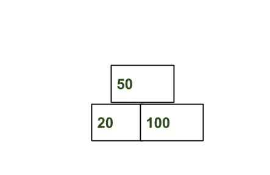

# 从给定的对象数组中找到最大高度金字塔

> 原文:[https://www . geeksforgeeks . org/find-最大高度-给定对象数组的金字塔/](https://www.geeksforgeeks.org/find-maximum-height-pyramid-from-the-given-array-of-objects/)

给定 **n** 个物体，每个物体有宽度**w<sub>I</sub>T5。我们需要以金字塔的方式排列它们，例如:** 

1.  i <sup>th</sup> 的总宽度小于(i + 1) <sup>th</sup> 。
2.  第 i <sup>个</sup>中的对象总数小于第(i + 1) <sup>个</sup>。



任务是找到给定物体能达到的最大高度。
**例:**

```
Input : arr[] = {40, 100, 20, 30}
Output : 2
Top level : 30.
Lower (or bottom) level : 20, 40 and 100
Other possibility can be placing
20 on the top, and at second level any
other 4 objects. Another possibility is
to place 40 at top and other three at the
bottom.

Input : arr[] = {10, 20, 30, 50, 60, 70}
Output : 3
```

这个想法是使用贪婪的方法，将宽度最小的对象放在顶部，下一个对象放在正下方，以此类推。
求最大层数，给定数组排序，尝试自上而下形成金字塔。找到数组的最小元素，即排序后数组的第一个元素，将其放在顶部。然后尝试在它下面建造更多的物体和更大的宽度。
以下是本办法的实施:

## C++

```
// C++ program to find maximum height pyramid
// from the given object width.
#include<bits/stdc++.h>
using namespace std;

// Returns maximum number of pyramidcal levels
// n boxes of given widths.
int maxLevel(int boxes[], int n)
{
    // Sort objects in increasing order of widths
    sort(boxes, boxes + n);

    int ans = 1;  // Initialize result

    // Total width of previous level and total
    // number of objects in previous level
    int prev_width = boxes[0];
    int prev_count = 1;

    // Number of object in current level.
    int curr_count = 0;

    // Width of current level.
    int curr_width = 0;
    for (int i=1; i<n; i++)
    {
        // Picking the object. So increase current
        // width and number of object.
        curr_width += boxes[i];
        curr_count += 1;

        // If current width and number of object
        // are greater than previous.
        if (curr_width > prev_width &&
            curr_count > prev_count)
        {
            // Update previous width, number of
            // object on previous level.
            prev_width = curr_width;
            prev_count = curr_count;

            // Reset width of current level, number
            // of object on current level.
            curr_count = 0;
            curr_width = 0;

            // Increment number of level.
            ans++;
        }
    }

    return ans;
}

// Driver Program
int main()
{
    int boxes[] = {10, 20, 30, 50, 60, 70};
    int n = sizeof(boxes)/sizeof(boxes[0]);
    cout << maxLevel(boxes, n) << endl;
    return 0;
}
```

## Java 语言(一种计算机语言，尤用于创建网站)

```
// Java program to find maximum height pyramid
// from the given object width.
import java.io.*;
import java.util.Arrays;

class GFG {

    // Returns maximum number of pyramidcal
    // levels n boxes of given widths.
    static int maxLevel(int []boxes, int n)
    {

        // Sort objects in increasing order
        // of widths
        Arrays.sort(boxes);

        int ans = 1; // Initialize result

        // Total width of previous level 
        // and total number of objects in
        // previous level
        int prev_width = boxes[0];
        int prev_count = 1;

        // Number of object in current
        // level.
        int curr_count = 0;

        // Width of current level.
        int curr_width = 0;
        for (int i = 1; i < n; i++)
        {
            // Picking the object. So
            // increase current width
            // and number of object.
            curr_width += boxes[i];
            curr_count += 1;

            // If current width and 
            // number of object
            // are greater than previous.
            if (curr_width > prev_width &&
                curr_count > prev_count)
            {

                // Update previous width,
                // number of object on 
                // previous level.
                prev_width = curr_width;
                prev_count = curr_count;

                // Reset width of current
                // level, number of object 
                // on current level.
                curr_count = 0;
                curr_width = 0;

                // Increment number of
                // level.
                ans++;
            }
        }

        return ans;
    }

    // Driver Program
    static public void main (String[] args)
    {
        int []boxes = {10, 20, 30, 50, 60, 70};
        int n = boxes.length;
        System.out.println(maxLevel(boxes, n));
    }
}

// This code is contributed by anuj_67.
```

## 蟒蛇 3

```
# Python 3 program to find 
# maximum height pyramid from 
# the given object width.

# Returns maximum number 
# of pyramidcal levels n 
# boxes of given widths.
def maxLevel(boxes, n):

    # Sort objects in increasing
    # order of widths
    boxes.sort()

    ans = 1 # Initialize result

    # Total width of previous 
    # level and total number of 
    # objects in previous level
    prev_width = boxes[0]
    prev_count = 1

    # Number of object in
    # current level.
    curr_count = 0

    # Width of current level.
    curr_width = 0
    for i in range(1, n):

        # Picking the object. So 
        # increase current width 
        # and number of object.
        curr_width += boxes[i]
        curr_count += 1

        # If current width and 
        # number of object are 
        # greater than previous.
        if (curr_width > prev_width and
            curr_count > prev_count):

            # Update previous width, 
            # number of object on 
            # previous level.
            prev_width = curr_width
            prev_count = curr_count

            # Reset width of current 
            # level, number of object 
            # on current level.
            curr_count = 0
            curr_width = 0

            # Increment number of level.
            ans += 1
    return ans

# Driver Code
if __name__ == "__main__":
    boxes= [10, 20, 30, 50, 60, 70]
    n = len(boxes)
    print(maxLevel(boxes, n))

# This code is contributed 
# by ChitraNayal
```

## C#

```
// C# program to find maximum height pyramid
// from the given object width.
using System;

public class GFG {

    // Returns maximum number of pyramidcal
    // levels n boxes of given widths.
    static int maxLevel(int []boxes, int n)
    {
        // Sort objects in increasing order
        // of widths
        Array.Sort(boxes);

        int ans = 1; // Initialize result

        // Total width of previous level 
        // and total number of objects in
        // previous level
        int prev_width = boxes[0];
        int prev_count = 1;

        // Number of object in current
        // level.
        int curr_count = 0;

        // Width of current level.
        int curr_width = 0;
        for (int i=1; i<n; i++)
        {
            // Picking the object. So
            // increase current width
            // and number of object.
            curr_width += boxes[i];
            curr_count += 1;

            // If current width and 
            // number of object
            // are greater than previous.
            if (curr_width > prev_width &&
                   curr_count > prev_count)
            {

                // Update previous width,
                // number of object on 
                // previous level.
                prev_width = curr_width;
                prev_count = curr_count;

                // Reset width of current
                // level, number of object 
                // on current level.
                curr_count = 0;
                curr_width = 0;

                // Increment number of
                // level.
                ans++;
            }
        }

        return ans;
    }

    // Driver Program
    static public void Main ()
    {
        int []boxes = {10, 20, 30, 50, 60, 70};
        int n = boxes.Length;
        Console.WriteLine(maxLevel(boxes, n));
    }
}

// This code is contributed by anuj_67.
```

## 服务器端编程语言（Professional Hypertext Preprocessor 的缩写）

```
<?php
// PHP program to find maximum 
// height pyramid from the
// given object width.

// Returns maximum number of 
// pyramidcal levels n boxes 
// of given widths.
function maxLevel($boxes, $n)
{
    // Sort objects in increasing 
    // order of widths
    sort($boxes);

    // Initialize result
    $ans = 1; 

    // Total width of previous 
    // level and total number 
    // of objects in previous level
    $prev_width = $boxes[0];
    $prev_count = 1;

    // Number of object 
    // in current level.
    $curr_count = 0;

    // Width of current level.
    $curr_width = 0;
    for ( $i = 1; $i < $n; $i++)
    {
        // Picking the object. So 
        // increase current width 
        // and number of object.
        $curr_width += $boxes[$i];
        $curr_count += 1;

        // If current width and number
        // of object are greater 
        // than previous.
        if ($curr_width > $prev_width and
            $curr_count > $prev_count)
        {
            // Update previous width, number 
            // of object on previous level.
            $prev_width = $curr_width;
            $prev_count = $curr_count;

            // Reset width of current
            // level, number of object
            // on current level.
            $curr_count = 0;
            $curr_width = 0;

            // Increment number of level.
            $ans++;
        }
    }
    return $ans;
}

// Driver Code
$boxes = array(10, 20, 30, 50, 60, 70);
$n = count($boxes);
echo maxLevel($boxes, $n) ;

// This code is contributed by anuj_67.
?>
```

## java 描述语言

```
<script>

// JavaScript program for the above approach

    // Returns maximum number of pyramidcal
    // levels n boxes of given widths.
    function maxLevel(boxes, n)
    {

        // Sort objects in increasing order
        // of widths
        boxes.sort();

        let ans = 1; // Initialize result

        // Total width of previous level 
        // and total number of objects in
        // previous level
        let prev_width = boxes[0];
        let prev_count = 1;

        // Number of object in current
        // level.
        let curr_count = 0;

        // Width of current level.
        let curr_width = 0;
        for (let i = 1; i < n; i++)
        {
            // Picking the object. So
            // increase current width
            // and number of object.
            curr_width += boxes[i];
            curr_count += 1;

            // If current width and 
            // number of object
            // are greater than previous.
            if (curr_width > prev_width &&
                curr_count > prev_count)
            {

                // Update previous width,
                // number of object on 
                // previous level.
                prev_width = curr_width;
                prev_count = curr_count;

                // Reset width of current
                // level, number of object 
                // on current level.
                curr_count = 0;
                curr_width = 0;

                // Increment number of
                // level.
                ans++;
            }
        }

        return ans;
    }

// Driver Code
    let boxes = [10, 20, 30, 50, 60, 70];
    let n = boxes.length;
    document.write(maxLevel(boxes, n));

// This code is contributed by susmitakundugoaldanga.
</script>
```

**输出:**

```
3
```

**时间复杂度:** O(n log n)。
请参见下面的文章，了解更高效的解决方案。
[阵值三角形排列的最大高度](https://www.geeksforgeeks.org/maximum-height-of-triangular-arrangement-of-array-values/)
本文由 [**Anuj Chauhan**](https://www.facebook.com/anuj0503) 供稿。如果你喜欢 GeeksforGeeks 并想投稿，你也可以使用[write.geeksforgeeks.org](http://www.write.geeksforgeeks.org)写一篇文章或者把你的文章邮寄到 review-team@geeksforgeeks.org。看到你的文章出现在极客博客主页上，帮助其他极客。
如果发现有不正确的地方，或者想分享更多关于上述话题的信息，请写评论。