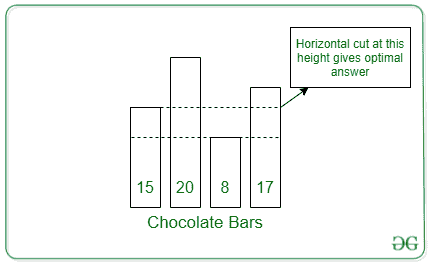
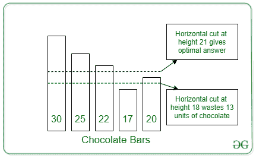

# 找到水平切割所有巧克力的最大高度，这样至少剩下 K 量

> 原文:[https://www . geesforgeks . org/find-最大高度-切割所有巧克力-水平-这样-至少-k-数量-剩余/](https://www.geeksforgeeks.org/find-maximum-height-to-cut-all-chocolates-horizontally-such-that-at-least-k-amount-remains/)

给定一个由高度为 **N** 的巧克力条组成的[数组](https://www.geeksforgeeks.org/introduction-to-arrays/)**arr【】**，任务是找到对所有巧克力进行水平切割的最大高度，使得巧克力的总剩余量至少为**K**。

**示例:**

> **输入:** K = 7，arr[] = [15，20，8，17]
> **输出:** 15
> **解释:**
> 
> 
> 
> 如果在高度 8 处进行切割，取出的巧克力总量为 24 块，浪费的巧克力为 24–7 = 17 块。如果在高度 15 处进行切割，则巧克力被去除 7，并且没有巧克力被浪费。因此 15 是答案。
> 
> **输入:** K = 12 arr[] = [30，25，22，17，20]
> **输出:** 21
> **解释:**
> 
> 
> 
> 在高度 18 处切开后，取出的巧克力为 25 个，巧克力损耗为(25–12)= 13 个单位。但是，如果在高度 21 处进行切割，那么 14 个单位的巧克力被移除，并且损耗是(14–12)= 2，这是最小的，因此 21 是答案

**方法:**给定问题可以基于[二分搜索法](https://www.geeksforgeeks.org/binary-search/)求解。其思想是在当时的范围内执行二分搜索法**【0，** [**数组的最大元素**](https://www.geeksforgeeks.org/c-program-find-largest-element-array/)**】**并在范围内找到该值，例如 **M** ，使得在 **M** 进行水平切割后剩余巧克力的总和与 **K** 给出最小差异。按照以下步骤解决给定的问题:

*   初始化两个变量，分别说**低**和**高**为 **0** 和最大数组元素。
*   重复直到**低< =高**并执行以下步骤:
    *   求**中间**的值为**(低+高)/2** 。
    *   求在高度**中间**水平切割后剩余巧克力的总和为 **M** 。
    *   如果 **M** 的值小于 **K** ，则将**高**的值更新为**(中间–1)**。否则，将**低位**的值更新为**(中+ 1)** 。
*   执行上述步骤后，将值打印为**高**作为必须切割的最大高度。

下面是上述方法的实现:

## C++

```
// C++ program for the above approach
#include<bits/stdc++.h>
using namespace std;

// Function to find the sum of remaining
// chocolate after making the horizontal
// cut at height mid
int cal(vector<int> arr, int mid)
{

      // Stores the sum of chocolates
    int chocolate = 0;

    // Traverse the array arr[]
    for(auto i : arr){

          // If the height is at least mid
        if(i >= mid)
          chocolate += i - mid;
    }

    // Return the possible sum
    return chocolate;
}

// Function to find the maximum horizontal
// cut made to all the chocolates such that
// the sum of the remaining element is
// at least K
int maximumCut(vector<int> arr, int K){

      // Ranges of Binary Search
    int low = 0;
    int high = *max_element(arr.begin(),arr.end());

    // Perform the Binary Search
    while(low <= high){
        int mid = (low + high) / 2;

        // Find the sum of removed after
        // making cut at height mid
        int chocolate = cal(arr,mid);

        // If the chocolate removed is
        // same as the chocolate needed
        // then return the height
        if (chocolate == K)
            return mid;

        // If the chocolate removed is
        // less than chocolate needed
        // then shift to the left range
        else if(chocolate < K)
            high = mid - 1;

        // Otherwise, shift to the right
        // range
        else{
            low = mid + 1;
            if(mid > high)
                high = mid;
        }
    }    

    // Return the possible cut
    return high;
}

// Driver Code
int main(){
   int N = 4;
   int K = 7;
   vector<int> arr{15, 20, 8, 17};
   cout<<(maximumCut(arr, K));
}

// This code is contributed by ipg2016107.
```

## Java 语言(一种计算机语言，尤用于创建网站)

```
// Java program for the above approach
import java.util.*;
import java.util.Arrays;
class GFG {

    // Function to find the sum of remaining
    // chocolate after making the horizontal
    // cut at height mid
    static int cal(int arr[], int mid)
    {

        // Stores the sum of chocolates
        int chocolate = 0;

        // Traverse the array arr[]
        for (int i = 0; i < arr.length; i++) {

            // If the height is at least mid
            if (arr[i] >= mid)
                chocolate += arr[i] - mid;
        }

        // Return the possible sum
        return chocolate;
    }

    // Function to find the maximum horizontal
    // cut made to all the chocolates such that
    // the sum of the remaining element is
    // at least K
    static int maximumCut(int arr[], int K)
    {

        // Ranges of Binary Search
        int low = 0;
        int high = Arrays.stream(arr).max().getAsInt();

        // Perform the Binary Search
        while (low <= high) {
            int mid = (low + high) / 2;

            // Find the sum of removed after
            // making cut at height mid
            int chocolate = cal(arr, mid);

            // If the chocolate removed is
            // same as the chocolate needed
            // then return the height
            if (chocolate == K)
                return mid;

            // If the chocolate removed is
            // less than chocolate needed
            // then shift to the left range
            else if (chocolate < K)
                high = mid - 1;

            // Otherwise, shift to the right
            // range
            else {
                low = mid + 1;
                if (mid > high)
                    high = mid;
            }
        }

        // Return the possible cut
        return high;
    }

    // Driver Code
    public static void main(String[] args)
    {
        int K = 7;
        int arr[] = { 15, 20, 8, 17 };
        System.out.println(maximumCut(arr, K));
    }
}

// This code is contributed by ukasp.
```

## 蟒蛇 3

```
# Python program for the above approach

# Function to find the sum of remaining
# chocolate after making the horizontal
# cut at height mid
def cal(arr, mid):

      # Stores the sum of chocolates
    chocolate = 0

    # Traverse the array arr[]
    for i in arr:

          # If the height is at least mid
        if i >= mid:
            chocolate += i - mid

    # Return the possible sum
    return chocolate

# Function to find the maximum horizontal
# cut made to all the chocolates such that
# the sum of the remaining element is
# at least K
def maximumCut(arr, K):

      # Ranges of Binary Search
    low = 0
    high = max(arr)

    # Perform the Binary Search
    while low <= high:
        mid = (low + high) // 2

        # Find the sum of removed after
        # making cut at height mid
        chocolate = cal(arr, mid)

        # If the chocolate removed is
        # same as the chocolate needed
        # then return the height
        if chocolate == K:
            return mid

        # If the chocolate removed is
        # less than chocolate needed
        # then shift to the left range
        elif chocolate < K:
            high = mid - 1

        # Otherwise, shift to the right
        # range
        else:
            low = mid + 1
            if mid > high:
                high = mid

    # Return the possible cut
    return high

# Driver Code
N, K = 4, 7
arr = [15, 20, 8, 17]

print(maximumCut(arr, K))
```

## C#

```
// C# program for the above approach
using System;
using System.Collections.Generic;
using System.Linq;

class GFG{

// Function to find the sum of remaining
// chocolate after making the horizontal
// cut at height mid
static int cal(List<int> arr, int mid)
{

      // Stores the sum of chocolates
    int chocolate = 0;

    // Traverse the array arr[]
    foreach (int i in arr){

          // If the height is at least mid
        if(i >= mid)
          chocolate += i - mid;
    }

    // Return the possible sum
    return chocolate;
}

// Function to find the maximum horizontal
// cut made to all the chocolates such that
// the sum of the remaining element is
// at least K
static int maximumCut(List<int> arr, int K){

      // Ranges of Binary Search
    int low = 0;
    int high = arr.Max();

    // Perform the Binary Search
    while(low <= high){
        int mid = (low + high) / 2;

        // Find the sum of removed after
        // making cut at height mid
        int chocolate = cal(arr,mid);

        // If the chocolate removed is
        // same as the chocolate needed
        // then return the height
        if (chocolate == K)
            return mid;

        // If the chocolate removed is
        // less than chocolate needed
        // then shift to the left range
        else if(chocolate < K)
            high = mid - 1;

        // Otherwise, shift to the right
        // range
        else{
            low = mid + 1;
            if(mid > high)
                high = mid;
        }
    }    

    // Return the possible cut
    return high;
}

// Driver Code
public static void Main(){
   int K = 7;
   List<int> arr = new List<int>(){15, 20, 8, 17};
   Console.Write(maximumCut(arr, K));
}

}

// This code is contributed by SURENDRA_GANGWAR.
```

## java 描述语言

```
<script>
        // JavaScript Program to implement
        // the above approach

        // Function to find the sum of remaining
        // chocolate after making the horizontal
        // cut at height mid
        function cal(arr, mid) {

            // Stores the sum of chocolates
            let chocolate = 0

            // Traverse the array arr[]
            for (let i = 0; i < arr.length; i++) {

                // If the height is at least mid
                if (arr[i] >= mid)
                    chocolate += arr[i] - mid
            }

            // Return the possible sum
            return chocolate
        }

        // Function to find the maximum horizontal
        // cut made to all the chocolates such that
        // the sum of the remaining element is
        // at least K
        function maximumCut(arr, K) {

            // Ranges of Binary Search
            let low = 0
            let high = arr[0];

            for (let i = 1; i < arr.length; i++) {
                high = Math.max(high, arr[i]);
            }

            // Perform the Binary Search
            while (low <= high) {
                mid = Math.floor((low + high) / 2);

                // Find the sum of removed after
                // making cut at height mid
                chocolate = cal(arr, mid)

                // If the chocolate removed is
                // same as the chocolate needed
                // then return the height
                if (chocolate == K) {
                    return mid
                }
                // If the chocolate removed is
                // less than chocolate needed
                // then shift to the left range
                else if (chocolate < K) {
                    high = mid - 1
                }

                // Otherwise, shift to the right
                // range
                else {
                    low = mid + 1
                    if (mid > high)
                        high = mid
                }
            }

            // Return the possible cut
            return high
        }

        // Driver Code
        let N = 4;
        let K = 7;
        let arr = [15, 20, 8, 17];

        document.write(maximumCut(arr, K))

     // This code is contributed by Potta Lokesh
    </script>
```

**Output:** 

```
15
```

***时间复杂度:** O(N*log N)*
***辅助空间:** O(1)*