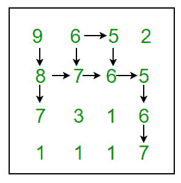

# 找到最大长度蛇序列

> 原文:[https://www . geesforgeks . org/find-最大长度-snake-sequence/](https://www.geeksforgeeks.org/find-maximum-length-snake-sequence/)

给定一个数字网格，找到最大长度的 Snake 序列并打印出来。如果存在最大长度的多个 snake 序列，请打印其中任何一个。
蛇序列由网格中相邻的数字组成，因此对于每个数字，右边的数字或下面的数字是其值的+1 或-1。例如，如果您位于网格中的位置(x，y)，如果该数字为 1，您可以向右移动(即 x，y+1)，如果该数字为 1，您可以向下移动(即 x+1，y)。
例如
**9** 、6、5、2
**8、7、6、5**
7、3、1、 **6**
1、1、1、 **7**
在上面的网格中，最长的蛇序列是:(9、8、7、6、5、6、7)
下图显示了所有可能的路径–



**我们强烈建议你尽量减少浏览器，先自己试试这个。**
思路是用动态规划。对于矩阵的每个单元，我们保留以当前单元结束的蛇的最大长度。最大长度蛇序列将具有最大值。最大值单元格将对应于蛇尾。为了打印蛇，我们需要从尾巴一直回溯到蛇的头。
让 **T[i][i]** 表示结束于单元(I，j)的蛇的最大长度，那么对于给定的矩阵 M，DP 关系被定义为–
T[0][0]= 0
T[I][j]= max(T[I][j]，T[I][j–1]+1)如果 M[I][j]= M[I][j–1]1
T[I][j]= max(T[I][j]，T[I–1][1]

## C++

```
// C++ program to find maximum length
// Snake sequence and print it
#include <bits/stdc++.h>
using namespace std;
#define M 4
#define N 4

struct Point
{
    int x, y;
};

// Function to find maximum length Snake sequence path
// (i, j) corresponds to tail of the snake
list<Point> findPath(int grid[M][N], int mat[M][N],
                     int i, int j)
{
    list<Point> path;

    Point pt = {i, j};
    path.push_front(pt);

    while (grid[i][j] != 0)
    {
       if (i > 0 &&
           grid[i][j] - 1 == grid[i - 1][j])
       {
           pt = {i - 1, j};
           path.push_front(pt);
           i--;
       }
       else if (j > 0 &&
                grid[i][j] - 1 == grid[i][j - 1])
       {
           pt = {i, j - 1};
           path.push_front(pt);
           j--;
       }
    }

    return path;
}

// Function to find maximum length Snake sequence
void findSnakeSequence(int mat[M][N])
{
    // table to store results of subproblems
    int lookup[M][N];

    // initialize by 0
    memset(lookup, 0, sizeof lookup);

    // stores maximum length of Snake sequence
    int max_len = 0;

    // store coordinates to snake's tail
    int max_row = 0;
    int max_col = 0;

    // fill the table in bottom-up fashion
    for (int i = 0; i < M; i++)
    {
        for (int j = 0; j < N; j++)
        {
            // do except for (0, 0) cell
            if (i || j)
            {
                // look above
                if (i > 0 &&
                    abs(mat[i - 1][j] - mat[i][j]) == 1)
                {
                    lookup[i][j] = max(lookup[i][j],
                               lookup[i - 1][j] + 1);

                    if (max_len < lookup[i][j])
                    {
                        max_len = lookup[i][j];
                        max_row = i, max_col = j;
                    }
                }

                // look left
                if (j > 0 &&
                    abs(mat[i][j - 1] - mat[i][j]) == 1)
                {
                    lookup[i][j] = max(lookup[i][j],
                                       lookup[i][j - 1] + 1);
                    if (max_len < lookup[i][j])
                    {
                        max_len = lookup[i][j];
                        max_row = i, max_col = j;
                    }
                }
            }
        }
    }

    cout << "Maximum length of Snake sequence is: "
         << max_len << endl;

    // find maximum length Snake sequence path
    list<Point> path = findPath(lookup, mat, max_row,
                                             max_col);

    cout << "Snake sequence is:";
    for (auto it = path.begin(); it != path.end(); it++)
        cout << endl << mat[it->x][it->y] << " ("
             << it->x << ", " << it->y << ")" ;
}

// Driver code
int main()
{
    int mat[M][N] =
    {
        {9, 6, 5, 2},
        {8, 7, 6, 5},
        {7, 3, 1, 6},
        {1, 1, 1, 7},
    };

    findSnakeSequence(mat);

    return 0;
}
```

## Java 语言(一种计算机语言，尤用于创建网站)

```
// Java program to find maximum length
// Snake sequence and print it
import java.util.*;

class GFG
{

static int M = 4;
static int N = 4;

static class Point
{
    int x, y;

    public Point(int x, int y)
    {
        this.x = x;
        this.y = y;
    }
};

// Function to find maximum length Snake sequence path
// (i, j) corresponds to tail of the snake
static List<Point> findPath(int grid[][],  
                            int mat[][],
                            int i, int j)
{
    List<Point> path = new LinkedList<>();

    Point pt = new Point(i, j);
    path.add(0, pt);

    while (grid[i][j] != 0)
    {
        if (i > 0 &&
            grid[i][j] - 1 == grid[i - 1][j])
        {
            pt = new Point(i - 1, j);
            path.add(0, pt);
            i--;
        }
        else if (j > 0 && grid[i][j] - 1 ==
                          grid[i][j - 1])
        {
            pt = new Point(i, j - 1);
            path.add(0, pt);
            j--;
        }
    }
    return path;
}

// Function to find maximum length Snake sequence
static void findSnakeSequence(int mat[][])
{
    // table to store results of subproblems
    int [][]lookup = new int[M][N];

    // initialize by 0

    // stores maximum length of Snake sequence
    int max_len = 0;

    // store coordinates to snake's tail
    int max_row = 0;
    int max_col = 0;

    // fill the table in bottom-up fashion
    for (int i = 0; i < M; i++)
    {
        for (int j = 0; j < N; j++)
        {
            // do except for (0, 0) cell
            if (i != 0 || j != 0)
            {
                // look above
                if (i > 0 &&
                    Math.abs(mat[i - 1][j] -
                             mat[i][j]) == 1)
                {
                    lookup[i][j] = Math.max(lookup[i][j],
                                            lookup[i - 1][j] + 1);

                    if (max_len < lookup[i][j])
                    {
                        max_len = lookup[i][j];
                        max_row = i; max_col = j;
                    }
                }

                // look left
                if (j > 0 &&
                    Math.abs(mat[i][j - 1] -
                             mat[i][j]) == 1)
                {
                    lookup[i][j] = Math.max(lookup[i][j],
                                            lookup[i][j - 1] + 1);
                    if (max_len < lookup[i][j])
                    {
                        max_len = lookup[i][j];
                        max_row = i; max_col = j;
                    }
                }
            }
        }
    }
    System.out.print("Maximum length of Snake " +
                     "sequence is: " + max_len + "\n");

    // find maximum length Snake sequence path
    List<Point> path = findPath(lookup, mat, max_row,
                                             max_col);

    System.out.print("Snake sequence is:");
    for (Point it : path)
        System.out.print("\n" + mat[it.x][it.y] + " (" +
                                    it.x + ", " + it.y + ")");
}

// Driver code
public static void main(String[] args)
{
    int mat[][] = {{9, 6, 5, 2},
                   {8, 7, 6, 5},
                   {7, 3, 1, 6},
                   {1, 1, 1, 7}};

    findSnakeSequence(mat);
}
}

// This code is contributed by 29AjayKumar
```

蟒蛇 3]

```
 // C# program to find maximum length
// Snake sequence and print it
using System;
using System.Collections.Generic;

class GFG 
{
static int M = 4;
static int N = 4;

public class Point
{
    public int x, y;

    public Point(int x, int y) 
    {
        this.x = x;
        this.y = y;
    }
};

// Function to find maximum length Snake sequence path
// (i, j) corresponds to tail of the snake
static List<Point> findPath(int [,]grid, 
                            int [,]mat, 
                            int i, int j)
{
    List<Point> path = new List<Point>();

    Point pt = new Point(i, j);
    path.Insert(0, pt);

    while (grid[i, j] != 0)
    {
        if (i > 0 &&
            grid[i, j] - 1 == grid[i - 1, j])
        {
            pt = new Point(i - 1, j);
            path.Insert(0, pt);
            i--;
        }
        else if (j > 0 && grid[i, j] - 1 == 
                          grid[i, j - 1])
        {
            pt = new Point(i, j - 1);
            path.Insert(0, pt);
            j--;
        }
    }
    return path;
}

// Function to find maximum length Snake sequence
static void findSnakeSequence(int [,]mat)
{
    // table to store results of subproblems
    int [,]lookup = new int[M, N];

    // initialize by 0

    // stores maximum length of Snake sequence
    int max_len = 0;

    // store coordinates to snake's tail
    int max_row = 0;
    int max_col = 0;

    // fill the table in bottom-up fashion
    for (int i = 0; i < M; i++)
    {
        for (int j = 0; j < N; j++)
        {
            // do except for (0, 0) cell
            if (i != 0 || j != 0)
            {
                // look above
                if (i > 0 &&
                    Math.Abs(mat[i - 1, j] - 
                             mat[i, j]) == 1)
                {
                    lookup[i, j] = Math.Max(lookup[i, j],
                                            lookup[i - 1, j] + 1);

                    if (max_len < lookup[i,j])
                    {
                        max_len = lookup[i, j];
                        max_row = i; max_col = j;
                    }
                }

                // look left
                if (j > 0 &&
                    Math.Abs(mat[i, j - 1] - 
                             mat[i, j]) == 1)
                {
                    lookup[i, j] = Math.Max(lookup[i, j],
                                            lookup[i, j - 1] + 1);
                    if (max_len < lookup[i, j])
                    {
                        max_len = lookup[i, j];
                        max_row = i; max_col = j;
                    }
                }
            }
        }
    }
    Console.Write("Maximum length of Snake " + 
                  "sequence is: " + max_len + "\n");

    // find maximum length Snake sequence path
    List<Point> path = findPath(lookup, mat, max_row,
                                             max_col);

    Console.Write("Snake sequence is:");
    foreach (Point it in path)
        Console.Write("\n" + mat[it.x,it.y] + 
                      " (" + it.x + ", " + it.y + ")");
}

// Driver code
public static void Main(String[] args)
{
    int [,]mat = {{9, 6, 5, 2},
                  {8, 7, 6, 5},
                  {7, 3, 1, 6},
                  {1, 1, 1, 7}};

    findSnakeSequence(mat);
}
}

// This code is contributed by Princi Singh 
```

**输出:**

```
Maximum length of Snake sequence is: 6
Snake sequence is:
9 (0, 0)
8 (1, 0)
7 (1, 1)
6 (1, 2)
5 (1, 3)
6 (2, 3)
7 (3, 3)
```

上述解的时间复杂度为 O(M*N)。上述解使用的辅助空间为 O(M*N)。如果我们不需要打印蛇，空间可以进一步减少到 0(N)，因为我们只使用最后一行的结果。
参考:[叠加溢出](http://stackoverflow.com/questions/25095198/finding-snake-sequence-in-xy-graph-java)
本文由**阿迪蒂亚·戈埃尔**供稿。如果你喜欢极客博客并想投稿，你也可以写一篇文章并把你的文章邮寄到 review-team@geeksforgeeks.org。看到你的文章出现在极客博客主页上，帮助其他极客。
如果发现有不正确的地方，请写评论，或者想分享更多关于以上讨论话题的信息