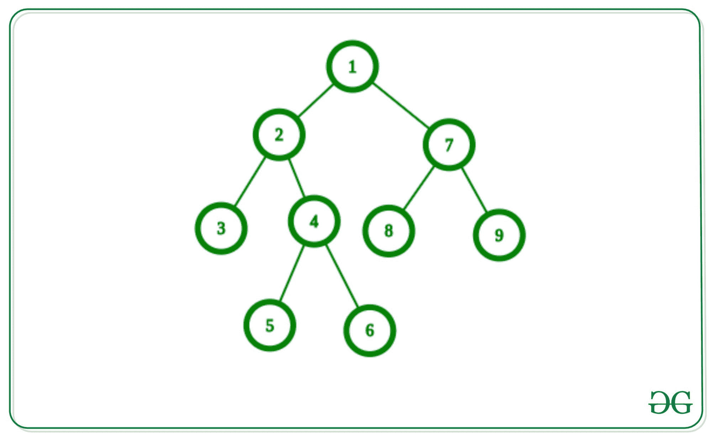
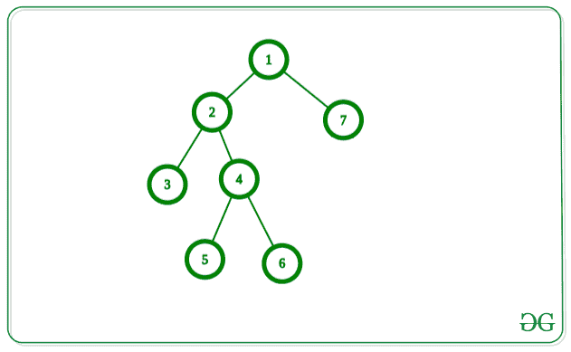

# 在给定的二叉树中找到最大匹配

> 原文:[https://www . geesforgeks . org/find-给定二叉树中的最大匹配/](https://www.geeksforgeeks.org/find-maximum-matching-in-a-given-binary-tree/)

给定一棵具有从 **1 到**N 和**N–1**边的 **N** 节点值的[树。任务是在给定的树中找到最大匹配。](https://www.geeksforgeeks.org/binary-tree-data-structure/)

> 树中的[匹配是边的集合，因此没有一对边共享一个公共节点。与最边缘的匹配被称为**最大匹配**。](https://www.geeksforgeeks.org/mathematics-matching-graph-theory/)

**示例:**

> **输入:**下面是给定的图形:
> 
> [](https://media.geeksforgeeks.org/wp-content/uploads/20200418030628/graph14.jpg)
> 
> **输出:** 3
> **说明:**
> 上图中最大匹配的边集:
> (4，5)，(1，2)，(7，8)
> 
> **输入:**下面是给定的图表:
> 
> [](https://media.geeksforgeeks.org/wp-content/cdn-uploads/20200807145550/graphExample22.png)
> 
> **输出:** 3
> **说明:**
> 上图中最大匹配的边集:
> (4，5)、(2，3)、(1，7)

**逼近:**这个问题可以用[贪婪逼近](https://www.geeksforgeeks.org/greedy-algorithms/)来解决，思路是在树中使用[后序遍历](https://www.geeksforgeeks.org/tree-traversals-inorder-preorder-and-postorder/)，从叶子边缘开始，向上排序。以下是步骤:

1.  在给定的根节点为 1 的树上执行 [DFS 遍历](https://www.geeksforgeeks.org/depth-first-search-or-dfs-for-a-graph/)，将父节点设为 0，并在递归 DFS 遍历中将当前节点作为该节点的父节点传递。
2.  执行遍历时，对于每个节点 **U** 及其父节点 **P** ，如果这些节点未被访问，则将这些节点标记为已访问，并将最大匹配计数增加 1。
3.  在 DFS 遍历之后，打印上面步骤中最大匹配的计数。

贪婪算法是重复获取任何一个叶子边。

```
TreeMatch(F:forest)
M <- []
while F nonempty do {
     select any leaf-edge e
     M <- M + [e]
     F <- F - both ends of e
  }
```

**为什么贪婪算法工作正常？**
我们假设 **E** 是一片叶子边缘，考虑任何最大匹配 **N** 。假设 **N** 不包含 **E** 。那么如果我们把 **E** 加到 **N** 上，现在只有一个顶点有两条边与之相交。所以我们可以删除 **N** 的一条边，得到包含 **E** 的最大匹配。

下面是上述方法的实现:

## C++

```
// C++ program for the above approach
#include <bits/stdc++.h>
using namespace std;
#define N 10000

// Adjacency list to store edges
vector<int> adj[N];

int used[N];
int max_matching;

// Add an edge between U and V in tree
void AddEdge(int u, int v)
{
    // Edge from u to v
    adj[u].push_back(v);

    // Edge from V to U
    adj[v].push_back(u);
}

// Function that finds the maximum
// matching of the DFS
void Matching_dfs(int u, int p)
{
    for (int i = 0;
         i < adj[u].size(); i++) {

        // Go further as we are not
        // allowed to go towards
        // its parent
        if (adj[u][i] != p) {
            Matching_dfs(adj[u][i], u);
        }
    }

    // If U and its parent P is
    // not taken then we must
    // take &mark them as taken
    if (!used[u] and !used[p] and p != 0) {

        // Increment size of edge set
        max_matching++;
        used[u] = used[p] = 1;
    }
}

// Function to find the maximum
// matching in a graph
void maxMatching()
{
    // Taking 1 as a root of the tree
    Matching_dfs(1, 0);

    // Print maximum Matching
    cout << max_matching << "\n";
}

// Driver Code
int main()
{
    int n = 5;

    // Joining edge between
    // two nodes in tree
    AddEdge(1, 2);
    AddEdge(1, 3);
    AddEdge(3, 4);
    AddEdge(3, 5);

    // Function Call
    maxMatching();
    return 0;
}
```

## Java 语言(一种计算机语言，尤用于创建网站)

```
// Java program for the above approach
import java.util.*;

class GFG{

static final int N = 10000;

// Adjacency list to store edges
@SuppressWarnings("unchecked")
static Vector<Integer>[] adj = new Vector[N];

static int used[] = new int[N];
static int max_matching;

// Add an edge between U and V in tree
static void AddEdge(int u, int v)
{

    // Edge from u to v
    adj[u].add(v);

    // Edge from V to U
    adj[v].add(u);
}

// Function that finds the maximum
// matching of the DFS
static void Matching_dfs(int u, int p)
{
    for(int i = 0; i < adj[u].size(); i++)
    {

        // Go further as we are not
        // allowed to go towards
        // its parent
        if (adj[u].get(i) != p)
        {
            Matching_dfs(adj[u].get(i), u);
        }
    }

    // If U and its parent P is
    // not taken then we must
    // take &mark them as taken
    if (used[u] == 0 &&
        used[p] == 0 && p != 0)
    {

        // Increment size of edge set
        max_matching++;
        used[u] = used[p] = 1;
    }
}

// Function to find the maximum
// matching in a graph
static void maxMatching()
{

    // Taking 1 as a root of the tree
    Matching_dfs(1, 0);

    // Print maximum Matching
    System.out.print(max_matching + "\n");
}

// Driver Code
public static void main(String[] args)
{
    for(int i = 0; i < adj.length; i++)
        adj[i] = new Vector<Integer>();

    // Joining edge between
    // two nodes in tree
    AddEdge(1, 2);
    AddEdge(1, 3);
    AddEdge(3, 4);
    AddEdge(3, 5);

    // Function call
    maxMatching();
}
}

// This code is contributed by amal kumar choubey
```

## 蟒蛇 3

```
# Python3 program for the above approach
N = 10000

# Adjacency list to store edges
adj = {}

used = [0 for i in range(N)]

max_matching = 0

# Add an edge between U and V in tree
def AddEdge(u, v):

    if u not in adj:
        adj[u] = []
    if v not in adj:
        adj[v] = []

    # Edge from u to v
    adj[u].append(v)

    # Edge from V to U
    adj[v].append(u)

# Function that finds the maximum
# matching of the DFS
def Matching_dfs(u, p):

    global max_matching

    for i in range(len(adj[u])):

        # Go further as we are not
        # allowed to go towards
        # its parent
        if (adj[u][i] != p):
            Matching_dfs(adj[u][i], u)

    # If U and its parent P is
    # not taken then we must
    # take &mark them as taken
    if (not used[u] and not used[p] and p != 0):

        # Increment size of edge set
        max_matching += 1
        used[u] = 1
        used[p] = 1

# Function to find the maximum
# matching in a graph
def maxMatching():

    # Taking 1 as a root of the tree
    Matching_dfs(1, 0)

    # Print maximum Matching
    print(max_matching)

# Driver Code
n = 5

# Joining edge between
# two nodes in tree
AddEdge(1, 2)
AddEdge(1, 3)
AddEdge(3, 4)
AddEdge(3, 5)

# Function Call
maxMatching()

# This code is contributed by avanitrachhadiya2155
```

## C#

```
// C# program for the above approach
using System;
using System.Collections.Generic;

class GFG{

static readonly int N = 10000;

// Adjacency list to store edges
static List<int>[] adj = new List<int>[N];

static int []used = new int[N];
static int max_matching;

// Add an edge between U and V in tree
static void AddEdge(int u, int v)
{

    // Edge from u to v
    adj[u].Add(v);

    // Edge from V to U
    adj[v].Add(u);
}

// Function that finds the maximum
// matching of the DFS
static void Matching_dfs(int u, int p)
{
    for(int i = 0; i < adj[u].Count; i++)
    {

        // Go further as we are not
        // allowed to go towards
        // its parent
        if (adj[u][i] != p)
        {
            Matching_dfs(adj[u][i], u);
        }
    }

    // If U and its parent P is
    // not taken then we must
    // take &mark them as taken
    if (used[u] == 0 &&
        used[p] == 0 && p != 0)
    {

        // Increment size of edge set
        max_matching++;
        used[u] = used[p] = 1;
    }
}

// Function to find the maximum
// matching in a graph
static void maxMatching()
{

    // Taking 1 as a root of the tree
    Matching_dfs(1, 0);

    // Print maximum Matching
    Console.Write(max_matching + "\n");
}

// Driver Code
public static void Main(String[] args)
{
    for(int i = 0; i < adj.Length; i++)
        adj[i] = new List<int>();

    // Joining edge between
    // two nodes in tree
    AddEdge(1, 2);
    AddEdge(1, 3);
    AddEdge(3, 4);
    AddEdge(3, 5);

    // Function call
    maxMatching();
}
}

// This code is contributed by amal kumar choubey
```

## java 描述语言

```
<script>
    // Javascript Program to implement the above approach

    let N = 10000;

    // Adjacency list to store edges
    let adj = new Array(N);

    let used = new Array(N);
    used.fill(0);
    let max_matching = 0;

    // Add an edge between U and V in tree
    function AddEdge(u, v)
    {

        // Edge from u to v
        adj[u].push(v);

        // Edge from V to U
        adj[v].push(u);
    }

    // Function that finds the maximum
    // matching of the DFS
    function Matching_dfs(u, p)
    {
        for(let i = 0; i < adj[u].length; i++)
        {

            // Go further as we are not
            // allowed to go towards
            // its parent
            if (adj[u][i] != p)
            {
                Matching_dfs(adj[u][i], u);
            }
        }

        // If U and its parent P is
        // not taken then we must
        // take &mark them as taken
        if (used[u] == 0 &&
            used[p] == 0 && p != 0)
        {

            // Increment size of edge set
            max_matching++;
            used[u] = used[p] = 1;
        }
    }

    // Function to find the maximum
    // matching in a graph
    function maxMatching()
    {

        // Taking 1 as a root of the tree
        Matching_dfs(1, 0);

        // Print maximum Matching
        document.write(max_matching + "</br>");
    }

    for(let i = 0; i < adj.length; i++)
        adj[i] = [];

    // Joining edge between
    // two nodes in tree
    AddEdge(1, 2);
    AddEdge(1, 3);
    AddEdge(3, 4);
    AddEdge(3, 5);

    // Function call
    maxMatching();

</script>
```

**Output**

```
2
```

***时间复杂度:** O(V + E)，其中 V 为边数，E 为边数。*
***辅助空间:** O(V)*

**自下而上的 DFS 方法**:

解决这个问题的另一个直观方法是以自下而上的方式使用 DFS，并在每个级别返回两个值

包括当前节点的最大匹配

不包括当前节点的最大匹配

我们将在左右子树上递归，并为它们获取这些值。然后，我们可以根据这些值计算当前级别的新值。

让 left_included 表示包含左子树根的最大匹配，left_excluded 表示不包含左子树根的最大匹配。同样，对于 right_included 和 right_excluded。

如果我们在最大匹配中包括当前节点，那么我们必须排除左子树根或右子树根中的一个。包含两者将导致当前节点上的重叠，这是不允许的。通过排除左侧或右侧子树根，我们可以通过包含当前节点->左侧子树根或当前节点->右侧子树根的一条边来将最大匹配增加 1。

因此，包括当前节点的最大匹配将由下式给出

> current _ include = max(max(left _ include，right _ excluding，max(left _ exclude，right _ including)

如果我们排除当前节点，那么我们可以包括左和右子树根。由于左右子树中的匹配是相互独立的，我们可以通过将两个匹配相加来获得最大值。

因此，不包括当前节点的最大匹配将由下式给出

> 当前排除=左包含+右包含

我们将把这两个值从当前递归级别返回到上递归级别。递归完成后，我们将收到两个值，包括根节点的最大匹配和不包括根节点的最大匹配。

这两者的最大值将给出树中的最大匹配。

## 蟒蛇 3

```
class Node:
    def __init__(self, key):
        self.left = None
        self.right = None
        self.val = key

def max_matching_helper(root):
  if not root:
    return (0, 0)

  if not root.left and not root.right:
    return (0, 0)

  left_included, left_excluded = max_matching_helper(root.left)
  right_included, right_excluded = max_matching_helper(root.right)

  # Maximum matchin gincluding current node
  curr_included = max(max(left_included, right_excluded) + 1, max(left_excluded, right_included) + 1)
  # Maximum matching excluding current node
  curr_excluded = left_included + right_included

  return (curr_included, curr_excluded)

def max_matching(root):
  # Taking 1 as a root of the tree
  root_including, root_excluding = max_matching_helper(root)

  # Return maximum Matching
  return max(root_including, root_excluding)

# Driver code
root = Node(1)
root.left = Node(2)
root.right = Node(7)
root.left.left = Node(3)
root.left.right = Node(4)
root.left.right.left = Node(5)
root.left.right.right = Node(6)
root.right.left = Node(8)
root.right.right = Node(9)

print(max_matching(root))

# This code is contributed by Rathijeet Bhave
```

**Output**

```
3
```

**时间复杂度** : O(V + E)，其中 V 为边数，E 为边数。

**辅助空间** : O(V)