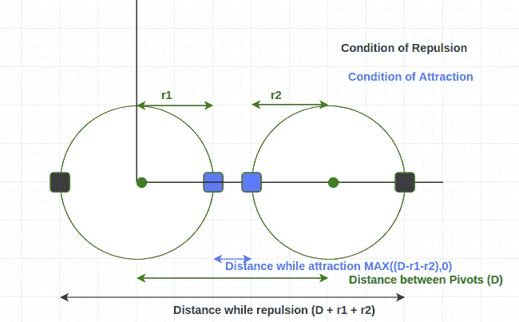

# 找出磁铁之间的最大和最小距离

> 原文:[https://www . geesforgeks . org/find-最大-最小-距离-磁铁/](https://www.geeksforgeeks.org/find-maximum-minimum-distance-magnets/)

给定坐标平面中两个枢轴点(x0，y0)和(x1，y1)的坐标。随着每个枢轴，两个不同的磁铁分别借助于一串长度为 r1 和 r2 的绳子绑在一起。找出两块磁铁相互排斥和相互吸引时的距离。

**示例:**

> 输入:x1=0，y1=0，x2=5，y2=0，r1=2，r2=2
> 输出:排斥时的距离= 9，吸引时的距离= 1
> 
> 输入:x1=0，y1=0，x2=5，y2=0，r1=3，r2=3
> 输出:排斥时的距离= 11，吸引时的距离= 0

众所周知，磁铁的性质是，当它们以同一个磁极面对时相互排斥，当它们以相反的磁极面对时相互吸引。此外，吸引力和排斥力总是在一条直线上。

我们在坐标上有两个支点，所以这些点之间的距离是**D =((x1-x2)<sup>2</sup>+(y1-y2)<sup>2</sup>)<sup>1/2</sup>**。
同样，我们可以得出磁体之间的距离最大，而斥力也最大，这也应该是枢轴之间的距离+两根弦的长度之和。

在吸引的情况下，我们有两种情况需要注意:
或者最小距离是枢轴之间的距离–两根弦的长度之和
或者最小距离应该为零，以防弦的长度之和大于枢轴点之间的距离。
图解说明:



## C++

```
// C++ program for max and min distance
#include <bits/stdc++.h>
using namespace std;

// Function for finding distance between pivots
int pivotDis(int x0, int y0, int x1, int y1)
{
    return sqrt((x1 - x0) * (x1 - x0) +
                (y1 - y0) * (y1 - y0));
}

// Function for minimum distance
int minDis(int D, int r1, int r2)
{
    return max((D - r1 - r2), 0);
}

// Function for maximum distance
int maxDis(int D, int r1, int r2)
{
    return D + r1 + r2;
}

// Drivers code
int main()
{
    int x0 = 0, y0 = 0, x1 = 8, y1 = 0, r1 = 4, r2 = 5;
    int D = pivotDis(x0, y0, x1, y1);
    cout << "Distance while repulsion = " << maxDis(D, r1, r2);
    cout << "\nDistance while attraction = " << minDis(D, r1, r2);
    return 0;
}
```

## Java 语言(一种计算机语言，尤用于创建网站)

```
// Java program for max
// and min distance
import java.io.*;

class GFG
{

// Function for finding
// distance between pivots
static int pivotDis(int x0, int y0,
                    int x1, int y1)
{
    return (int)Math.sqrt((x1 - x0) *
                          (x1 - x0) +
                          (y1 - y0) *
                          (y1 - y0));
}

// Function for
// minimum distance
static int minDis(int D, int r1, int r2)
{
    return Math.max((D - r1 - r2), 0);
}

// Function for
// maximum distance
static int maxDis(int D, int r1, int r2)
{
    return D + r1 + r2;
}

// Driver Code
public static void main (String[] args)
{
int x0 = 0, y0 = 0, x1 = 8,
    y1 = 0, r1 = 4, r2 = 5;
int D = pivotDis(x0, y0, x1, y1);
System.out.print( "Distance while " +
                     "repulsion = " +
                  maxDis(D, r1, r2));
System.out.print("\nDistance while " +
                     "attraction = " +
                   minDis(D, r1, r2));
}
}

// This code is contributed by anuj_67.
```

## 蟒蛇 3

```
# Python 3 program for max and min
# distance
import math

# Function for finding distance between
# pivots
def pivotDis(x0, y0, x1, y1):

    return math.sqrt((x1 - x0) * (x1 - x0)
                  + (y1 - y0) * (y1 - y0))

# Function for minimum distance
def minDis( D, r1, r2):

    return max((D - r1 - r2), 0)

# Function for maximum distance
def maxDis( D, r1, r2):

    return D + r1 + r2

# Drivers code
x0 = 0
y0 = 0
x1 = 8
y1 = 0
r1 = 4
r2 = 5
D = pivotDis(x0, y0, x1, y1)
print("Distance while repulsion = ",
               int(maxDis(D, r1, r2)))

print("Distance while attraction = ",
                    minDis(D, r1, r2))

# This code is contributed by Smitha
```

## C#

```
// C# program for max and min distance
using System;

class GFG {

    // Function for finding
    // distance between pivots
    static int pivotDis(int x0, int y0,
                        int x1, int y1)
    {
        return (int)Math.Sqrt((x1 - x0) *
                              (x1 - x0) +
                              (y1 - y0) *
                              (y1 - y0));
    }

    // Function for
    // minimum distance
    static int minDis(int D, int r1, int r2)
    {
        return Math.Max((D - r1 - r2), 0);
    }

    // Function for
    // maximum distance
    static int maxDis(int D, int r1, int r2)
    {
        return D + r1 + r2;
    }

    // Driver Code
    public static void Main ()
    {
    int x0 = 0, y0 = 0, x1 = 8,
        y1 = 0, r1 = 4, r2 = 5;
    int D = pivotDis(x0, y0, x1, y1);

    Console.WriteLine( "Distance while " +
                          "repulsion = " +
                       maxDis(D, r1, r2));
    Console.WriteLine("Distance while " +
                        "attraction = " +
                      minDis(D, r1, r2));
    }
}

// This code is contributed by anuj_67.
```

## 服务器端编程语言（Professional Hypertext Preprocessor 的缩写）

```
<?php
// PHP program for max and
// min distance

// Function for finding
// distance between pivots
function pivotDis($x0, $y0,
                  $x1, $y1)
{
    return sqrt(($x1 - $x0) *
                ($x1 - $x0) +
                ($y1 - $y0) *
                ($y1 - $y0));
}

// Function for minimum distance
function minDis( $D, $r1, $r2)
{
    return max(($D - $r1 - $r2), 0);
}

// Function for maximum distance
function maxDis( $D, $r1, $r2)
{
    return $D + $r1 + $r2;
}

    // Driver code
    $x0 = 0; $y0 = 0;
    $x1 = 8; $y1 = 0;
    $r1 = 4; $r2 = 5;
    $D = pivotDis($x0, $y0,
                  $x1, $y1);
    echo "Distance while repulsion = "
              , maxDis($D, $r1, $r2);
    echo "\nDistance while attraction = "
               , minDis($D, $r1, $r2);

// This code is contributed by anuj_67.
?>
```

## java 描述语言

```
<script>

// Javascript program for max and min distance

// Function for finding distance between pivots
function pivotDis(x0, y0, x1, y1)
{
    return Math.sqrt((x1 - x0) * (x1 - x0) +
                     (y1 - y0) * (y1 - y0));
}

// Function for minimum distance
function minDis(D, r1, r2)
{
    return Math.max((D - r1 - r2), 0);
}

// Function for maximum distance
function maxDis(D, r1,  r2)
{
    return D + r1 + r2;
}

// Driver code
let x0 = 0, y0 = 0, x1 = 8,
    y1 = 0, r1 = 4, r2 = 5;
let D = pivotDis(x0, y0, x1, y1);

document.write("Distance while repulsion = " +
               maxDis(D, r1, r2) + "</br>");
document.write("Distance while attraction = " +
               minDis(D, r1, r2));

// This code is contributed by jana_sayantan 

</script>
```

**Output:** 

```
Distance while repulsion = 17
Distance while attraction = 0
```