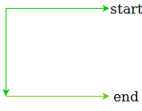

# 当只允许向左移动两次时，求 2D 矩阵中的最大路径和

> 原文:[https://www . geeksforgeeks . org/find-最大路径-2d 矩阵求和-何时允许精确向左移动两次/](https://www.geeksforgeeks.org/find-maximum-path-sum-in-a-2d-matrix-when-exactly-two-left-moves-are-allowed/)

给定尺寸为 **N * M** 的 2D 矩阵 **arr[][]** ，其中 **N** 是行数， **M** 是列数。任务是在这个矩阵中找到满足如下条件的最大路径和:

1.  我们只能从**开始，其中 0<=**1**T5 = n。**
2.  We end the path on the same side, such that we can take exactly 2 left turns.

    **例** :
    

    **示例:**

    ```
    Input : N = 3, M = 3
            arr[][] = {{1, 2, 3},
                       {3, 3, 1},
                       {4, 1, 6}}
    Output : 20
    Explanation : 
    If we follow this path then we get the sum 20.

    Input : N = 3, M = 3
            arr[][] = {{3, 7, 4},
                       {1, 9, 6},
                       {1, 7, 7}}
    Output : 34
    Explanation : 
    If we follow this path then we get the sum 34.

    ```

    其思路是利用[动态规划](https://www.geeksforgeeks.org/dynamic-programming/)，在矩阵中选择一个最优结构，即如下图所示的
    C 形结构。
    

    **步骤如下**:

    1.  首先，我们计算每行的后缀和，并将其存储在另一个 2D 矩阵中，称之为 **b[][]** ，这样，在每个有效索引处，我们都会得到从该索引开始的整行的和。

        > b[I][j]= arr[I][j]+b[I][j+1]

    2.  Now we check each consecutive two rows and find the sum of their corresponding columns and simultaneously updating the maximum sum variable. Till now we have found both horizontal lines from that above structure.

        > sum = max(sum，b[I][j]+b[I–1][j])

        我们需要找到连接这些水平线的垂直线，即列。

    3.  遍历每一行后，对于每个有效的索引，我们有两个选择，要么将这个索引链接到上面一行的相应索引，即添加到上一列，要么开始一个新列。
        无论哪个值最大，我们都会保留该值，并在该索引处更新该值。

        > b[i][j] = max(b[i][j]，b[I–1][j]+arr[I][j])

下面是上述方法的实现:

## C++

```
// C++ program to find maximum path sum
// in a 2D matrix when exactly two
// left moves are allowed
#include <bits/stdc++.h>
#define N 3
#define M 3
using namespace std;

// Function to return the maximum path sum
int findMaxSum(int arr[][M])
{
    int sum = 0;
    int b[N][M];

    // Copy last column i.e. starting and 
    // ending columns in another array
    for (int i = 0; i < N; i++) {
        b[i][M - 1] = arr[i][M - 1];
    }

    // Calculate suffix sum in each row
    for (int i = 0; i < N; i++) {
        for (int j = M - 2; j >= 0; j--) {
            b[i][j] = arr[i][j] + b[i][j + 1];
        }
    }

    // Select the path we are going to follow
    for (int i = 1; i < N; i++) {
        for (int j = 0; j < M; j++) {
            sum = max(sum, b[i][j] + b[i - 1][j]);

            b[i][j] = max(b[i][j], b[i - 1][j] + arr[i][j]);
        }
    }

    return sum;
}

// Driver Code
int main()
{
    int arr[N][M] = {{ 3, 7, 4 }, 
                     { 1, 9, 6 }, 
                     { 1, 7, 7 }};

    cout << findMaxSum(arr) << endl;

    return 0;
}
```

## Java 语言(一种计算机语言，尤用于创建网站)

```
// Java program to find maximum path sum
// in a 2D matrix when exactly two
// left moves are allowed
import java.io.*;

class GFG 
{

static int N = 3;
static int M = 3;

// Function to return the maximum path sum
static int findMaxSum(int arr[][])
{
    int sum = 0;
    int [][]b = new int [N][M];

    // Copy last column i.e. starting and 
    // ending columns in another array
    for (int i = 0; i < N; i++) 
    {
        b[i][M - 1] = arr[i][M - 1];
    }

    // Calculate suffix sum in each row
    for (int i = 0; i < N; i++) 
    {
        for (int j = M - 2; j >= 0; j--) 
        {
            b[i][j] = arr[i][j] + b[i][j + 1];
        }
    }

    // Select the path we are going to follow
    for (int i = 1; i < N; i++) 
    {
        for (int j = 0; j < M; j++) 
        {
            sum = Math.max(sum, b[i][j] + b[i - 1][j]);

            b[i][j] = Math.max(b[i][j], b[i - 1][j] + arr[i][j]);
        }
    }

    return sum;
}

// Driver Code
public static void main (String[] args) 
{

    int arr[][] = {{ 3, 7, 4 }, 
                    { 1, 9, 6 }, 
                    { 1, 7, 7 }};

    System.out.println (findMaxSum(arr));
}
}

// This code is contributed by ajit.
```

## 蟒蛇 3

```
# Python3 program to find maximum path sum 
# in a 2D matrix when exactly two 
# left moves are allowed 
import numpy as np
N = 3
M = 3

# Function to return the maximum path sum 
def findMaxSum(arr) : 

    sum = 0; 
    b = np.zeros((N, M)); 

    # Copy last column i.e. starting and 
    # ending columns in another array 
    for i in range(N) : 
        b[i][M - 1] = arr[i][M - 1]; 

    # Calculate suffix sum in each row 
    for i in range(N) :
        for j in range(M - 2, -1, -1) : 
            b[i][j] = arr[i][j] + b[i][j + 1]; 

    # Select the path we are going to follow 
    for i in range(1, N) :
        for j in range(M) :
            sum = max(sum, b[i][j] + b[i - 1][j]); 

            b[i][j] = max(b[i][j], 
                          b[i - 1][j] + arr[i][j]);

    return sum; 

# Driver Code 
if __name__ == "__main__" : 

    arr = [[ 3, 7, 4 ], 
           [ 1, 9, 6 ], 
           [ 1, 7, 7 ]]; 

    print(findMaxSum(arr)); 

# This code is contributed by AnkitRai01
```

## C#

```
// C# program to find maximum path sum
// in a 2D matrix when exactly two
// left moves are allowed
using System;

class GFG 
{

static int N = 3;
static int M = 3;

// Function to return the maximum path sum
static int findMaxSum(int [,]arr)
{
    int sum = 0;
    int [,]b = new int [N, M];

    // Copy last column i.e. starting and 
    // ending columns in another array
    for (int i = 0; i < N; i++) 
    {
        b[i, M - 1] = arr[i, M - 1];
    }

    // Calculate suffix sum in each row
    for (int i = 0; i < N; i++) 
    {
        for (int j = M - 2; j >= 0; j--) 
        {
            b[i, j] = arr[i, j] + b[i, j + 1];
        }
    }

    // Select the path we are going to follow
    for (int i = 1; i < N; i++) 
    {
        for (int j = 0; j < M; j++) 
        {
            sum = Math.Max(sum, b[i, j] + b[i - 1, j]);

            b[i, j] = Math.Max(b[i, j], b[i - 1, j] + arr[i, j]);
        }
    }

    return sum;
}

// Driver Code
public static void Main () 
{

    int [,]arr = {{ 3, 7, 4 }, 
                    { 1, 9, 6 }, 
                    { 1, 7, 7 }};

    Console.WriteLine(findMaxSum(arr));
}
}

/* This code contributed by PrinciRaj1992 */
```

**Output:**

```
34

```

**时间复杂度:** 