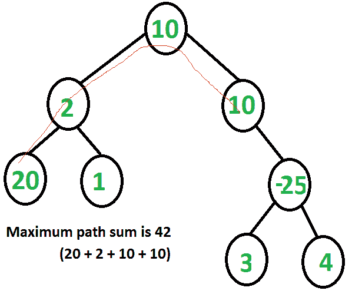

# 二叉树中的最大路径和

> 原文:[https://www . geesforgeks . org/find-最大路径-二叉树求和/](https://www.geeksforgeeks.org/find-maximum-path-sum-in-a-binary-tree/)

给定一棵二叉树，求最大路径和。路径可以在树中的任何节点开始和结束。
例:

```
Input: Root of below tree
       1
      / \
     2   3
Output: 6

See below diagram for another example.
1+2+3
```



对于每个节点，最大路径可以有四种方式通过节点:
1。仅节点
2。通过左子节点+节点
3 的最大路径。通过右子节点+节点
4 的最大路径。通过左子节点的最大路径+节点+通过右子节点的最大路径
想法是保持四条路径的轨迹，最后拾取最大的一条。需要注意的一点是，每个子树的根需要返回最大路径和，这样最多只涉及根的一个子树。这是父函数调用所需要的。在下面的代码中，这个总和存储在“max_single”中，并由递归函数返回。

## C++

```
// C/C++ program to find maximum path sum in Binary Tree
#include<bits/stdc++.h>
using namespace std;

// A binary tree node
struct Node
{
    int data;
    struct Node* left, *right;
};

// A utility function to allocate a new node
struct Node* newNode(int data)
{
    struct Node* newNode = new Node;
    newNode->data = data;
    newNode->left = newNode->right = NULL;
    return (newNode);
}

// This function returns overall maximum path sum in 'res'
// And returns max path sum going through root.
int findMaxUtil(Node* root, int &res)
{
    //Base Case
    if (root == NULL)
        return 0;

    // l and r store maximum path sum going through left and
    // right child of root respectively
    int l = findMaxUtil(root->left,res);
    int r = findMaxUtil(root->right,res);

    // Max path for parent call of root. This path must
    // include at-most one child of root
    int max_single = max(max(l, r) + root->data, root->data);

    // Max Top represents the sum when the Node under
    // consideration is the root of the maxsum path and no
    // ancestors of root are there in max sum path
    int max_top = max(max_single, l + r + root->data);

    res = max(res, max_top); // Store the Maximum Result.

    return max_single;
}

// Returns maximum path sum in tree with given root
int findMaxSum(Node *root)
{
    // Initialize result
    int res = INT_MIN;

    // Compute and return result
    findMaxUtil(root, res);
    return res;
}

// Driver program
int main(void)
{
    struct Node *root = newNode(10);
    root->left        = newNode(2);
    root->right       = newNode(10);
    root->left->left  = newNode(20);
    root->left->right = newNode(1);
    root->right->right = newNode(-25);
    root->right->right->left   = newNode(3);
    root->right->right->right  = newNode(4);
    cout << "Max path sum is " << findMaxSum(root);
    return 0;
}
```

## Java 语言(一种计算机语言，尤用于创建网站)

```
// Java program to find maximum path sum in Binary Tree

/* Class containing left and right child of current
 node and key value*/
class Node {

    int data;
    Node left, right;

    public Node(int item) {
        data = item;
        left = right = null;
    }
}

// An object of Res is passed around so that the
// same value can be used by multiple recursive calls.
class Res {
    public int val;
}

class BinaryTree {

    // Root of the Binary Tree
    Node root;

    // This function returns overall maximum path sum in 'res'
    // And returns max path sum going through root.
    int findMaxUtil(Node node, Res res)
    {

        // Base Case
        if (node == null)
            return 0;

        // l and r store maximum path sum going through left and
        // right child of root respectively
        int l = findMaxUtil(node.left, res);
        int r = findMaxUtil(node.right, res);

        // Max path for parent call of root. This path must
        // include at-most one child of root
        int max_single = Math.max(Math.max(l, r) + node.data,
                                  node.data);

        // Max Top represents the sum when the Node under
        // consideration is the root of the maxsum path and no
        // ancestors of root are there in max sum path
        int max_top = Math.max(max_single, l + r + node.data);

        // Store the Maximum Result.
        res.val = Math.max(res.val, max_top);

        return max_single;
    }

    int findMaxSum() {
        return findMaxSum(root);
    }

    // Returns maximum path sum in tree with given root
    int findMaxSum(Node node) {

        // Initialize result
        // int res2 = Integer.MIN_VALUE;
        Res res = new Res();
        res.val = Integer.MIN_VALUE;

        // Compute and return result
        findMaxUtil(node, res);
        return res.val;
    }

    /* Driver program to test above functions */
    public static void main(String args[]) {
        BinaryTree tree = new BinaryTree();
        tree.root = new Node(10);
        tree.root.left = new Node(2);
        tree.root.right = new Node(10);
        tree.root.left.left = new Node(20);
        tree.root.left.right = new Node(1);
        tree.root.right.right = new Node(-25);
        tree.root.right.right.left = new Node(3);
        tree.root.right.right.right = new Node(4);
        System.out.println("maximum path sum is : " +
                            tree.findMaxSum());
    }
}
```

## 计算机编程语言

```
# Python program to find maximum path sum in Binary Tree

# A Binary Tree Node
class Node:

    # Constructor to create a new node
    def __init__(self, data):
        self.data = data
        self.left = None
        self.right = None

# This function returns overall maximum path sum in 'res'
# And returns max path sum going through root
def findMaxUtil(root):

    # Base Case
    if root is None:
        return 0

    # l and r store maximum path sum going through left
    # and right child of root respectively
    l = findMaxUtil(root.left)
    r = findMaxUtil(root.right)

    # Max path for parent call of root. This path
    # must include at most one child of root
    max_single = max(max(l, r) + root.data, root.data)

    # Max top represents the sum when the node under
    # consideration is the root of the maxSum path and
    # no ancestor of root are there in max sum path
    max_top = max(max_single, l+r+ root.data)

    # Static variable to store the changes
    # Store the maximum result
    findMaxUtil.res = max(findMaxUtil.res, max_top)

    return max_single

# Return maximum path sum in tree with given root
def findMaxSum(root):

    # Initialize result
    findMaxUtil.res = float("-inf")

    # Compute and return result
    findMaxUtil(root)
    return findMaxUtil.res

# Driver program
root = Node(10)
root.left = Node(2)
root.right   = Node(10);
root.left.left  = Node(20);
root.left.right = Node(1);
root.right.right = Node(-25);
root.right.right.left   = Node(3);
root.right.right.right  = Node(4);
print "Max path sum is " ,findMaxSum(root);

# This code is contributed by Nikhil Kumar Singh(nickzuck_007)
```

## C#

```
// C# program to find maximum
// path sum in Binary Tree
using System;

/* Class containing left and
right child of current
node and key value*/
public class Node
{

    public int data;
    public Node left, right;

    public Node(int item)
    {
        data = item;
        left = right = null;
    }
}

// An object of Res is passed
// around so that the same value
// can be used by multiple recursive calls.
class Res
{
    public int val;
}

public class BinaryTree
{

    // Root of the Binary Tree
    Node root;

    // This function returns overall
    // maximum path sum in 'res' And
    // returns max path sum going through root.
    int findMaxUtil(Node node, Res res)
    {

        // Base Case
        if (node == null)
            return 0;

        // l and r store maximum path
        // sum going through left and
        // right child of root respectively
        int l = findMaxUtil(node.left, res);
        int r = findMaxUtil(node.right, res);

        // Max path for parent call of root.
        // This path must include
        // at-most one child of root
        int max_single = Math.Max(Math.Max(l, r) +
                            node.data, node.data);

        // Max Top represents the sum
        // when the Node under
        // consideration is the root
        // of the maxsum path and no
        // ancestors of root are there
        // in max sum path
        int max_top = Math.Max(max_single,
                        l + r + node.data);

        // Store the Maximum Result.
        res.val = Math.Max(res.val, max_top);

        return max_single;
    }

    int findMaxSum()
    {
        return findMaxSum(root);
    }

    // Returns maximum path
    // sum in tree with given root
    int findMaxSum(Node node)
    {

        // Initialize result
        // int res2 = int.MinValue;
        Res res = new Res();
        res.val = int.MinValue;

        // Compute and return result
        findMaxUtil(node, res);
        return res.val;
    }

    /* Driver code */
    public static void Main(String []args)
    {
        BinaryTree tree = new BinaryTree();
        tree.root = new Node(10);
        tree.root.left = new Node(2);
        tree.root.right = new Node(10);
        tree.root.left.left = new Node(20);
        tree.root.left.right = new Node(1);
        tree.root.right.right = new Node(-25);
        tree.root.right.right.left = new Node(3);
        tree.root.right.right.right = new Node(4);
        Console.WriteLine("maximum path sum is : " +
                            tree.findMaxSum());
    }
}

// This code is contributed Rajput-Ji.
```

## java 描述语言

```
<script>

    // JavaScript program to find maximum
    // path sum in Binary Tree

    class Node
    {
        constructor(item) {
           this.left = null;
           this.right = null;
           this.data = item;
        }
    }

    let val;

    // Root of the Binary Tree
    let root;

    // This function returns overall maximum path sum in 'res'
    // And returns max path sum going through root.
    function findMaxUtil(node)
    {

        // Base Case
        if (node == null)
            return 0;

        // l and r store maximum path sum going through left and
        // right child of root respectively
        let l = findMaxUtil(node.left);
        let r = findMaxUtil(node.right);

        // Max path for parent call of root. This path must
        // include at-most one child of root
        let max_single = Math.max(Math.max(l, r) + node.data,
                                  node.data);

        // Max Top represents the sum when the Node under
        // consideration is the root of the maxsum path and no
        // ancestors of root are there in max sum path
        let max_top = Math.max(max_single, l + r + node.data);

        // Store the Maximum Result.
        val = Math.max(val, max_top);

        return max_single;
    }

    function findMaxsum() {
        return findMaxSum(root);
    }

    // Returns maximum path sum in tree with given root
    function findMaxSum(node) {

        // Initialize result
        // int res2 = Integer.MIN_VALUE;
        val = Number.MIN_VALUE;

        // Compute and return result
        findMaxUtil(node);
        return val;
    }

    root = new Node(10);
    root.left = new Node(2);
    root.right = new Node(10);
    root.left.left = new Node(20);
    root.left.right = new Node(1);
    root.right.right = new Node(-25);
    root.right.right.left = new Node(3);
    root.right.right.right = new Node(4);
    document.write("Max path sum is : " + findMaxsum());

</script>
```

**输出:**

```
Max path sum is 42
```

**时间复杂度:** O(n)，其中 n 为二叉树中的节点数。

本文由 [**安摩尔·瓦什尼**](https://www.linkedin.com/pub/anmol-varshney/ba/44b/662) 供稿(FB 简介:[https://www.facebook.com/anmolvarshney695](https://www.facebook.com/anmolvarshney695))。如果您发现任何不正确的地方，请写评论，或者您想分享更多关于上面讨论的主题的信息