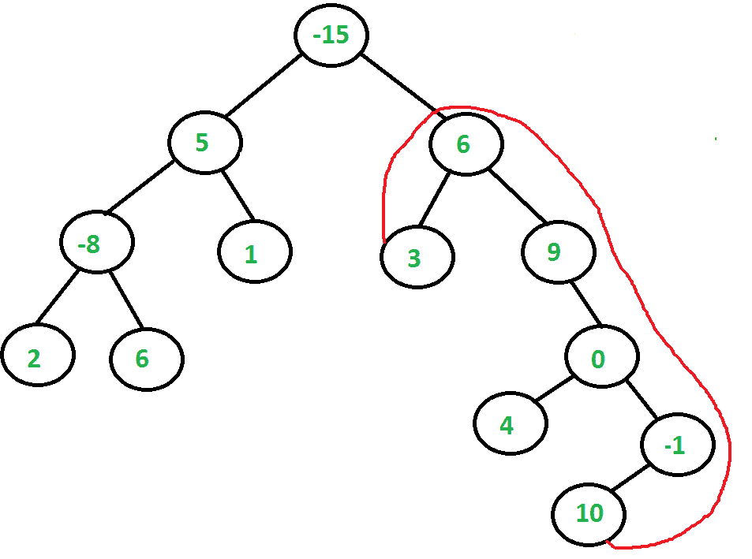

# 求二叉树两片叶子之间的最大路径和

> 原文:[https://www . geesforgeks . org/find-最大路径-和-两叶-二叉树/](https://www.geeksforgeeks.org/find-maximum-path-sum-two-leaves-binary-tree/)

给定一个二叉树，其中每个节点元素包含一个数字。找出从一个叶节点到另一个叶节点的最大可能和。
最大和路径可以通过根，也可以不通过根。例如，在下面的二叉树中，最大和是**27**(3+6+9+0–1+10)。预期时间复杂度为 0(n)。
如果根的一边是空的，那么函数应该返回负无穷大(在 C/C++的情况下为 INT _ MIN)



一个简单的解决方法是遍历树，并对每个遍历的节点 X 执行以下操作:
1)在 X 的左子树中找到从叶到根的最大和(我们可以使用[这篇文章](https://www.geeksforgeeks.org/find-the-maximum-sum-path-in-a-binary-tree/)来完成这个步骤和下一个步骤)
2)在 X 的右子树中找到从叶到根的最大和。
3)将上述两个计算值和 X- >数据相加，并将该和与目前获得的最大值进行比较，并更新最大值。
4)返回最大值。
以上解的时间复杂度为 O(n <sup>2</sup> )
**我们可以利用二叉树的单次遍历**找到最大和。其思想是在递归调用中维护两个值

(**注意:如果树是最右边或最左边的树，那么首先我们必须调整树，使得右边和左边都不为空。最左边表示树的超级根的右边为空，最右边表示树的超级根的左边为空。)**

1)根在当前节点下的子树的最大根到叶路径总和。
2)叶子之间的最大路径和(期望的输出)。
对于每个被访问的节点 X，我们在 X 的左右子树中找到最大根到叶和，我们将这两个值与 X- >数据相加，并将和与迄今为止找到的最大路径和进行比较。

以下是上述 O(n)解决方案的实现。

## C++

```
// C++ program to find maximum path
//sum between two leaves of  a binary tree
#include <bits/stdc++.h>
using namespace std;

// A binary tree node
struct Node
{
    int data;
    struct Node* left, *right;
};

// Utility function to allocate memory for a new node
struct Node* newNode(int data)
{
    struct Node* node = new(struct Node);
    node->data = data;
    node->left = node->right = NULL;
    return (node);
}

// Utility function to find maximum of two integers
int max(int a, int b)
{ return (a >= b)? a: b; }

// A utility function to find the maximum sum between any
// two leaves.This function calculates two values:
// 1) Maximum path sum between two leaves which is stored
//    in res.
// 2) The maximum root to leaf path sum which is returned.
// If one side of root is empty, then it returns INT_MIN
int maxPathSumUtil(struct Node *root, int &res)
{
    // Base cases
    if (root==NULL) return 0;
    if (!root->left && !root->right) return root->data;

    // Find maximum sum in left and right subtree. Also
    // find maximum root to leaf sums in left and right
    // subtrees and store them in ls and rs
    int ls = maxPathSumUtil(root->left, res);
    int rs = maxPathSumUtil(root->right, res);

    // If both left and right children exist
    if (root->left && root->right)
    {
        // Update result if needed
        res = max(res, ls + rs + root->data);

        // Return maximum possible value for root being
        // on one side
        return max(ls, rs) + root->data;
    }

    // If any of the two children is empty, return
    // root sum for root being on one side
    return (!root->left)? rs + root->data:
                          ls + root->data;
}

// The main function which returns sum of the maximum
// sum path between two leaves. This function mainly
// uses maxPathSumUtil()
int maxPathSum(struct Node *root)
{
    int res = INT_MIN;

    int val = maxPathSumUtil(root, res);

      //--- for test case ---
   //         7                
      //        /    \              
    //    Null   -3           
      //     (case - 1)        
      //   value of res will be INT_MIN but the answer is 4 , which is returned by the
      // function maxPathSumUtil().

      if(res == INT_MIN)
    {
      return val;
    }

    return res;
}

// Driver Code
int main()
{
    struct Node *root = newNode(-15);
    root->left = newNode(5);
    root->right = newNode(6);
    root->left->left = newNode(-8);
    root->left->right = newNode(1);
    root->left->left->left = newNode(2);
    root->left->left->right = newNode(6);
    root->right->left = newNode(3);
    root->right->right = newNode(9);
    root->right->right->right= newNode(0);
    root->right->right->right->left= newNode(4);
    root->right->right->right->right= newNode(-1);
    root->right->right->right->right->left= newNode(10);
    cout << "Max pathSum of the given binary tree is "
         << maxPathSum(root);
    return 0;
}
```

## Java 语言(一种计算机语言，尤用于创建网站)

```
// Java program to find maximum path sum between two leaves
// of a binary tree
class Node {

    int data;
    Node left, right;

    Node(int item) {
        data = item;
        left = right = null;
    }
}

// An object of Res is passed around so that the
// same value can be used by multiple recursive calls.
class Res {
    int val;
}

class BinaryTree {

    static Node root;
      Node setTree(Node root){

      Node temp = new Node(0);
      //if tree is left most
      if(root.right==null){
          root.right=temp;
      }
      else{    //if tree is right most
          root.left=temp;
      }

      return root;
    }

    // A utility function to find the maximum sum between any
    // two leaves.This function calculates two values:
    // 1) Maximum path sum between two leaves which is stored
    //    in res.
    // 2) The maximum root to leaf path sum which is returned.
    // If one side of root is empty, then it returns INT_MIN
    int maxPathSumUtil(Node node, Res res) {

        // Base cases
        if (node == null)
            return 0;
        if (node.left == null && node.right == null)
            return node.data;

        // Find maximum sum in left and right subtree. Also
        // find maximum root to leaf sums in left and right
        // subtrees and store them in ls and rs
        int ls = maxPathSumUtil(node.left, res);
        int rs = maxPathSumUtil(node.right, res);

        // If both left and right children exist
        if (node.left != null && node.right != null) {

            // Update result if needed
            res.val = Math.max(res.val, ls + rs + node.data);

            // Return maximum possible value for root being
            // on one side
            return Math.max(ls, rs) + node.data;
        }

        // If any of the two children is empty, return
        // root sum for root being on one side
        return (node.left == null) ? rs + node.data
                : ls + node.data;
    }

    // The main function which returns sum of the maximum
    // sum path between two leaves. This function mainly
    // uses maxPathSumUtil()
    int maxPathSum(Node node)
    {
        Res res = new Res();
        res.val = Integer.MIN_VALUE;

          if(root.left==null || root.right==null){
            root=setTree(root);
        }
          //if tree is left most or right most
          //call setTree() method to adjust tree first
        maxPathSumUtil(root, res);
        return res.val;
    }

    //Driver program to test above functions
    public static void main(String args[]) {
        BinaryTree tree = new BinaryTree();
        tree.root = new Node(-15);
        tree.root.left = new Node(5);
        tree.root.right = new Node(6);
        tree.root.left.left = new Node(-8);
        tree.root.left.right = new Node(1);
        tree.root.left.left.left = new Node(2);
        tree.root.left.left.right = new Node(6);
        tree.root.right.left = new Node(3);
        tree.root.right.right = new Node(9);
        tree.root.right.right.right = new Node(0);
        tree.root.right.right.right.left = new Node(4);
        tree.root.right.right.right.right = new Node(-1);
        tree.root.right.right.right.right.left = new Node(10);
        System.out.println("Max pathSum of the given binary tree is "
                + tree.maxPathSum(root));
    }
}

// This code is improved by Rahul Soni
```

## 计算机编程语言

```
# Python program to find maximumpath sum between two leaves
# of a binary tree

INT_MIN = -2**32

# A binary tree node

class Node:
    # Constructor to create a new node
    def __init__(self, data):
        self.data = data
        self.left = None
        self.right = None

# Utility function to find maximum sum between any
# two leaves. This function calculates two values:
# 1) Maximum path sum between two leaves which are stored
#    in res
# 2) The maximum root to leaf path sum which is returned
# If one side of root is empty, then it returns INT_MIN

def maxPathSumUtil(root, res):

    # Base Case
    if root is None:
        return 0

    # Find maximumsum in left and right subtree. Also
    # find maximum root to leaf sums in left and right
    # subtrees ans store them in ls and rs
    ls = maxPathSumUtil(root.left, res)
    rs = maxPathSumUtil(root.right, res)

    # If both left and right children exist
    if root.left is not None and root.right is not None:

        # update result if needed
        res[0] = max(res[0], ls + rs + root.data)

        # Return maximum possible value for root being
        # on one side
        return max(ls, rs) + root.data

    # If any of the two children is empty, return
    # root sum for root being on one side
    if root.left is None:
        return rs + root.data
    else:
        return ls + root.data

# The main function which returns sum of the maximum
# sum path betwee ntwo leaves. THis function mainly
# uses maxPathSumUtil()

def maxPathSum(root):
    res = [INT_MIN]
    maxPathSumUtil(root, res)
    return res[0]

# Driver program to test above function
root = Node(-15)
root.left = Node(5)
root.right = Node(6)
root.left.left = Node(-8)
root.left.right = Node(1)
root.left.left.left = Node(2)
root.left.left.right = Node(6)
root.right.left = Node(3)
root.right.right = Node(9)
root.right.right.right = Node(0)
root.right.right.right.left = Node(4)
root.right.right.right.right = Node(-1)
root.right.right.right.right.left = Node(10)

print "Max pathSum of the given binary tree is", maxPathSum(root)

# This code is contributed by Nikhil Kumar Singh(nickzuck_007)
```

## C#

```
using System;

// C# program to find maximum path sum between two leaves
// of a binary tree
public class Node
{

    public int data;
    public Node left, right;

    public Node(int item)
    {
        data = item;
        left = right = null;
    }
}

// An object of Res is passed around so that the
// same value can be used by multiple recursive calls.
public class Res
{
    public int val;
}

public class BinaryTree
{

    public static Node root;

    // A utility function to find the maximum sum between any
    // two leaves.This function calculates two values:
    // 1) Maximum path sum between two leaves which is stored
    //    in res.
    // 2) The maximum root to leaf path sum which is returned.
    // If one side of root is empty, then it returns INT_MIN
    public virtual int maxPathSumUtil(Node node, Res res)
    {

        // Base cases
        if (node == null)
        {
            return 0;
        }
        if (node.left == null && node.right == null)
        {
            return node.data;
        }

        // Find maximum sum in left and right subtree. Also
        // find maximum root to leaf sums in left and right
        // subtrees and store them in ls and rs
        int ls = maxPathSumUtil(node.left, res);
        int rs = maxPathSumUtil(node.right, res);

        // If both left and right children exist
        if (node.left != null && node.right != null)
        {

            // Update result if needed
            res.val = Math.Max(res.val, ls + rs + node.data);

            // Return maximum possible value for root being
            // on one side
            return Math.Max(ls, rs) + node.data;
        }

        // If any of the two children is empty, return
        // root sum for root being on one side
        return (node.left == null) ? rs + node.data : ls + node.data;
    }

    // The main function which returns sum of the maximum
    // sum path between two leaves. This function mainly
    // uses maxPathSumUtil()
    public virtual int maxPathSum(Node node)
    {
        Res res = new Res();
        res.val = int.MinValue;
        maxPathSumUtil(root, res);
        return res.val;
    }

    //Driver program to test above functions
    public static void Main(string[] args)
    {
        BinaryTree tree = new BinaryTree();
        BinaryTree.root = new Node(-15);
        BinaryTree.root.left = new Node(5);
        BinaryTree.root.right = new Node(6);
        BinaryTree.root.left.left = new Node(-8);
        BinaryTree.root.left.right = new Node(1);
        BinaryTree.root.left.left.left = new Node(2);
        BinaryTree.root.left.left.right = new Node(6);
        BinaryTree.root.right.left = new Node(3);
        BinaryTree.root.right.right = new Node(9);
        BinaryTree.root.right.right.right = new Node(0);
        BinaryTree.root.right.right.right.left = new Node(4);
        BinaryTree.root.right.right.right.right = new Node(-1);
        BinaryTree.root.right.right.right.right.left = new Node(10);
        Console.WriteLine("Max pathSum of the given binary tree is " + tree.maxPathSum(root));
    }
}

  // This code is contributed by Shrikant13
```

## java 描述语言

```
<script>
// javascript program to find maximum path sum between two leaves
// of a binary tree
class Node {
    constructor(val) {
        this.data = val;
        this.left = null;
        this.right = null;
    }
}

// An object of Res is passed around so that the
// same value can be used by multiple recursive calls.
class Res {
    constructor(){
    this.val = 0;
    }
}

var root;

function setTree(root) {

var temp = new Node(0);
        // if tree is left most
        if (root.right == null) {
            root.right = temp;
        } else { // if tree is right most
            root.left = temp;
        }

        return root;

    }

    // A utility function to find the maximum sum between any
    // two leaves.This function calculates two values:
    // 1) Maximum path sum between two leaves which is stored
    // in res.
    // 2) The maximum root to leaf path sum which is returned.
    // If one side of root is empty, then it returns INT_MIN
    function maxPathSumUtil(node, res) {

        // Base cases
        if (node == null)
            return 0;
        if (node.left == null && node.right == null)
            return node.data;

        // Find maximum sum in left and right subtree. Also
        // find maximum root to leaf sums in left and right
        // subtrees and store them in ls and rs
        var ls = maxPathSumUtil(node.left, res);
        var rs = maxPathSumUtil(node.right, res);

        // If both left and right children exist
        if (node.left != null && node.right != null) {

            // Update result if needed
            res.val = Math.max(res.val, ls + rs + node.data);

            // Return maximum possible value for root being
            // on one side
            return Math.max(ls, rs) + node.data;
        }

        // If any of the two children is empty, return
        // root sum for root being on one side
        return (node.left == null) ? rs + node.data : ls + node.data;
    }

    // The main function which returns sum of the maximum
    // sum path between two leaves. This function mainly
    // uses maxPathSumUtil()
    function maxPathSum(node) {
        var res = new Res();
        res.val = Number.MIN_VALUE;

        if (root.left == null || root.right == null) {
            root = setTree(root);
        }

        // if tree is left most or right most
        // call setTree() method to adjust tree first
        maxPathSumUtil(root, res);
        return res.val;
    }

    // Driver program to test above functions
        var root = new Node(-15);
        root.left = new Node(5);
        root.right = new Node(6);
        root.left.left = new Node(-8);
        root.left.right = new Node(1);
        root.left.left.left = new Node(2);
        root.left.left.right = new Node(6);
        root.right.left = new Node(3);
        root.right.right = new Node(9);
        root.right.right.right = new Node(0);
        root.right.right.right.left = new Node(4);
        root.right.right.right.right = new Node(-1);
        root.right.right.right.right.left = new Node(10);
        document.write("Max pathSum of the given binary tree is " + maxPathSum(root));

// This code is contributed by umadevi9616
</script>
```

**Output**

```
Max pathSum of the given binary tree is 27
```

感谢绍拉布·瓦兹对原始方法的修正建议。

本文由**克里帕尔·高拉夫**供稿。如果您发现任何不正确的地方，或者您想分享更多关于上面讨论的主题的信息，请写评论

这个代码是由 Rahul Soni 改进的。