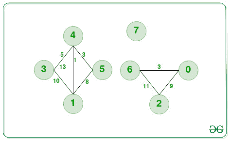
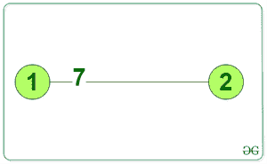

# 在图的每个分量中找到最大最短距离

> 原文:[https://www . geeksforgeeks . org/find-最大-最短-图形中每个组件的距离/](https://www.geeksforgeeks.org/find-maximum-shortest-distance-in-each-component-of-a-graph/)

给定由 **N 个**节点和正权重组成的加权图的[邻接矩阵](https://www.geeksforgeeks.org/graph-and-its-representations/) **图[][]** ，图的每个[连通分量的任务是在每对节点](https://www.geeksforgeeks.org/connected-components-in-an-undirected-graph/)之间的所有可能的[最短距离中找到最大值。](https://www.geeksforgeeks.org/floyd-warshall-algorithm-dp-16/)

**示例:**

> **输入:**
> 
> 
> 
> **输出:**
> 
> 8 0 11 
> 
> **说明**:图中有 a、b、c 三个分量，在分量(a)中最短路径如下:
> 
> 1.  3 和 4 之间的最短距离是 5 个单位。
> 2.  3 和 1 之间的最短距离是 1+5=6 个单位。
> 3.  3 和 5 之间的最短距离是 5+3=8 个单位。
> 4.  1 和 4 之间的最短距离是 1 个单位。
> 5.  1 和 5 之间的最短距离是 1+3=4 个单位。
> 6.  4 和 5 之间的最短距离是 3 个单位。
> 
> 在这些最短距离中:
> 组件(a)中的最大最短距离是节点 3 和节点 5 之间的 **8 个单位**。
> 同样，
> 组件(b)中最大最短距离为 **0 单位**。
> 组件(c)中的最大最短距离是节点 2 和 6 之间的 **11 个单位**。
> 
> **输入:**
> 
> 
> 
> **输出:**
> 
> seven
> 
> **说明:**因为，只有一个组件具有两个节点，它们之间的边距离为 7。因此，答案将是 7。

**方法:**这个给定的问题可以通过使用[DFS**T5】在图中找到连接的组件，并将组件存储在列表**](https://www.geeksforgeeks.org/depth-first-search-or-dfs-for-a-graph/)**[列表](https://www.geeksforgeeks.org/python-check-if-element-exists-in-list-of-lists/)中来解决。 [Floyd Warshall 的算法](https://www.geeksforgeeks.org/floyd-warshall-algorithm-dp-16/)可以用来寻找每个连接组件中的全对最短路径，该算法基于[动态规划](https://www.geeksforgeeks.org/dynamic-programming/)。在得到图中所有可能对的最短距离后，**为图中每个** [**和每个**](https://www.geeksforgeeks.org/maximum-sum-of-values-of-nodes-among-all-connected-components-of-an-undirected-graph/) **组件找到最大最短距离。**按照以下步骤解决问题:**

*   **定义一个函数**最大分量(向量< int >分量，向量<向量< int > >图形)**并执行以下步骤:

    *   将变量**最大距离**初始化为 **INT_MIN** ，将 **n** 初始化为组件的大小。
    *   [使用变量 **i** 迭代范围](https://www.geeksforgeeks.org/range-based-loop-c/)**【0，n)** ，并执行以下任务:
        *   [使用变量 **j** 迭代范围](https://www.geeksforgeeks.org/range-based-loop-c/)**【I+1，n】**，并将**最大距离**的值更新为**最大距离**或**图形【组件[i]】【组件[j]】**的最大值。
    *   返回**最大距离**的值作为答案。** 
*   **初始化一个向量**访问了 **N** 大小的**，并将值初始化为**假**。**
*   **初始化[向量](https://www.geeksforgeeks.org/initialize-a-vector-in-cpp-different-ways/)，比如**分量[][]** 和**温度[]** 来存储图形的每个分量。**
*   **使用**深度优先搜索(DFS)** 找到所有组件，并将其存储在向量**组件[][]** 中。**
*   **现在，调用[函数](https://www.geeksforgeeks.org/functions-in-c/) **floydWarshall(graph，V)** 来实现 floydWarshall 算法，以找到图的一个组成部分的所有对之间的最短距离。**
*   **初始化一个向量**结果[]** 来存储结果。**
*   **将变量**NumoComp**初始化为矢量 **分量[][]的[大小。](https://www.geeksforgeeks.org/vectorempty-vectorsize-c-stl/)****
*   **[使用变量 **i** 迭代范围](https://www.geeksforgeeks.org/range-based-loop-c/)**【0，numOfComp)** ，调用函数**maxintiscomponent(组件[i]，图形)**和[将其返回的值存储在向量](https://www.geeksforgeeks.org/vector-in-cpp-stl/)**result【】**中。**
*   **执行上述步骤后，打印矢量**结果[]** 的值作为答案。**

**下面是上述方法的实现:**

## **C++**

```
// C++ program for the above approach
#include <bits/stdc++.h>
using namespace std;

// Below dfs function will be used to
// get the connected components of a
// graph and stores all the connected
// nodes in the vector component
void dfs(int src, vector<bool>& visited,
         vector<vector<int> >& graph,
         vector<int>& component, int N)
{

    // Mark this vertex as visited
    visited[src] = true;

    // Put this node in component vector
    component.push_back(src);

    // For all other vertices in graph
    for (int dest = 0; dest < N; dest++) {

        // If there is an edge between
        // src and dest i.e., the value
        // of graph[u][v]!=INT_MAX
        if (graph[src][dest] != INT_MAX) {

            // If we haven't visited dest
            // then recursively apply
            // dfs on dest
            if (!visited[dest])
                dfs(dest, visited, graph,
                    component, N);
        }
    }
}

// Below is the Floyd Warshall Algorithm
// which is based on Dynamic Programming
void floydWarshall(
    vector<vector<int> >& graph, int N)
{

    // For every vertex of graph find
    // the shortest distance with
    // other vertices
    for (int k = 0; k < N; k++) {
        for (int i = 0; i < N; i++) {
            for (int j = 0; j < N; j++) {

                // Taking care of integer
                // overflow
                if (graph[i][k] != INT_MAX
                    && graph[k][j] != INT_MAX) {

                    // Update distance between
                    // vertex i and j if choosing
                    // k as an intermediate vertex
                    // make a shorter distance
                    if (graph[i][k] + graph[k][j]
                        < graph[i][j])
                        graph[i][j]
                            = graph[i][k] + graph[k][j];
                }
            }
        }
    }
}

// Function to find the maximum shortest
// path distance in a component by checking
// the shortest distances between all
// possible pairs of nodes
int maxInThisComponent(vector<int>& component,
                       vector<vector<int> >& graph)
{
    int maxDistance = INT_MIN;
    int n = component.size();
    for (int i = 0; i < n; i++) {
        for (int j = i + 1; j < n; j++) {
            maxDistance
                = max(maxDistance,
                      graph[component[i]][component[j]]);
        }
    }

    // If the maxDistance is still INT_MIN
    // then return 0 because this component
    // has a single element
    return (maxDistance == INT_MIN
                ? 0
                : maxDistance);
}

// Below function uses above two method
// to get the  maximum shortest distances
// in each component of the graph the
// function returns a vector, where each
// element denotes maximum shortest path
// distance for a component
vector<int> maximumShortesDistances(
    vector<vector<int> >& graph, int N)
{

    // Find the connected components
    vector<bool> visited(N, false);
    vector<vector<int> > components;

    // For storing the nodes in a
    // particular component
    vector<int> temp;

    // Now for each unvisited node run
    // the dfs to get the connected
    // component having this unvisited node
    for (int i = 0; i < N; i++) {
        if (!visited[i]) {

            // First of all clear the temp
            temp.clear();
            dfs(i, visited, graph, temp, N);
            components.push_back(temp);
        }
    }

    // Now for all-pair find the shortest
    // path distances using Floyd Warshall
    floydWarshall(graph, N);

    // Now for each component find the
    // maximum shortest distance and
    // store it in result
    vector<int> result;
    int numOfComp = components.size();
    int maxDistance;
    for (int i = 0; i < numOfComp; i++) {
        maxDistance
            = maxInThisComponent(components[i], graph);
        result.push_back(maxDistance);
    }
    return result;
}

// Driver Code
int main()
{
    int N = 8;
    const int inf = INT_MAX;

    // Adjacency Matrix for the first
    // graph in the examples
    vector<vector<int> > graph1 = {
        { 0, inf, 9, inf, inf, inf, 3, inf },
        { inf, 0, inf, 10, 1, 8, inf, inf },
        { 9, inf, 0, inf, inf, inf, 11, inf },
        { inf, 10, inf, 0, 5, 13, inf, inf },
        { inf, 1, inf, 5, 0, 3, inf, inf },
        { 8, inf, inf, 13, 3, 0, inf, inf },
        { 3, inf, 11, inf, inf, inf, 0, inf },
        { inf, inf, inf, inf, inf, inf, inf, 0 },
    };

    // Find the maximum shortest distances
    vector<int> result1
        = maximumShortesDistances(graph1, N);

    // Printing the maximum shortest path
    // distances for each components
    for (int mx1 : result1)
        cout << mx1 << ' ';

    return 0;
}
```

## **java 描述语言**

```
<script>
// Javascript program for the above approach

// Below dfs function will be used to
// get the connected components of a
// graph and stores all the connected
// nodes in the vector component
function dfs(src, visited, graph, component, N)
{

  // Mark this vertex as visited
  visited[src] = true;

  // Put this node in component vector
  component.push(src);

  // For all other vertices in graph
  for (let dest = 0; dest < N; dest++)
  {

    // If there is an edge between
    // src and dest i.e., the value
    // of graph[u][v]!=INT_MAX
    if (graph[src][dest] != Number.MAX_SAFE_INTEGER)
    {

      // If we haven't visited dest
      // then recursively apply
      // dfs on dest
      if (!visited[dest]) dfs(dest, visited, graph, component, N);
    }
  }
}

// Below is the Floyd Warshall Algorithm
// which is based on Dynamic Programming
function floydWarshall(graph, N)
{

  // For every vertex of graph find
  // the shortest distance with
  // other vertices
  for (let k = 0; k < N; k++)
  {
    for (let i = 0; i < N; i++)
    {
      for (let j = 0; j < N; j++)
      {
        // Taking care of integer
        // overflow
        if (graph[i][k] != Number.MAX_SAFE_INTEGER && graph[k][j] != Number.MAX_SAFE_INTEGER)
        {

          // Update distance between
          // vertex i and j if choosing
          // k as an intermediate vertex
          // make a shorter distance
          if (graph[i][k] + graph[k][j] < graph[i][j])
            graph[i][j] = graph[i][k] + graph[k][j];
        }
      }
    }
  }
}

// Function to find the maximum shortest
// path distance in a component by checking
// the shortest distances between all
// possible pairs of nodes
function maxInThisComponent(component, graph) {
  let maxDistance = Number.MIN_SAFE_INTEGER;
  let n = component.length;
  for (let i = 0; i < n; i++) {
    for (let j = i + 1; j < n; j++) {
      maxDistance = Math.max(maxDistance, graph[component[i]][component[j]]);
    }
  }

  // If the maxDistance is still INT_MIN
  // then return 0 because this component
  // has a single element
  return maxDistance == Number.MIN_SAFE_INTEGER ? 0 : maxDistance;
}

// Below function uses above two method
// to get the  maximum shortest distances
// in each component of the graph the
// function returns a vector, where each
// element denotes maximum shortest path
// distance for a component
function maximumShortesDistances(graph, N) {
  // Find the connected components
  let visited = new Array(N).fill(false);
  let components = new Array();

  // For storing the nodes in a
  // particular component
  let temp = [];

  // Now for each unvisited node run
  // the dfs to get the connected
  // component having this unvisited node
  for (let i = 0; i < N; i++) {
    if (!visited[i]) {
      // First of all clear the temp
      temp = [];
      dfs(i, visited, graph, temp, N);
      components.push(temp);
    }
  }

  // Now for all-pair find the shortest
  // path distances using Floyd Warshall
  floydWarshall(graph, N);

  // Now for each component find the
  // maximum shortest distance and
  // store it in result
  let result = [];
  let numOfComp = components.length;
  let maxDistance;
  for (let i = 0; i < numOfComp; i++) {
    maxDistance = maxInThisComponent(components[i], graph);
    result.push(maxDistance);
  }
  return result;
}

// Driver Code

let N = 8;
const inf = Number.MAX_SAFE_INTEGER;

// Adjacency Matrix for the first
// graph in the examples
let graph1 = [
  [0, inf, 9, inf, inf, inf, 3, inf],
  [inf, 0, inf, 10, 1, 8, inf, inf],
  [9, inf, 0, inf, inf, inf, 11, inf],
  [inf, 10, inf, 0, 5, 13, inf, inf],
  [inf, 1, inf, 5, 0, 3, inf, inf],
  [8, inf, inf, 13, 3, 0, inf, inf],
  [3, inf, 11, inf, inf, inf, 0, inf],
  [inf, inf, inf, inf, inf, inf, inf, 0],
];

// Find the maximum shortest distances
let result1 = maximumShortesDistances(graph1, N);

// Printing the maximum shortest path
// distances for each components
for (mx1 of result1) document.write(mx1 + " ");

// This code is contributed by gfgking.
</script>
```

****Output**

```
11 8 0 
```** 

*****时间复杂度:** O(N <sup>3</sup> ，其中N 为图中顶点数。*
***辅助空间:** O(N)***