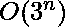

# 求数组任意子集划分为 2 个和相等的分区形成的最大子集和

> 原文:[https://www . geesforgeks . org/find-最大子集和-通过将数组的任意子集划分为 2 个具有相等和的分区而形成/](https://www.geeksforgeeks.org/find-maximum-subset-sum-formed-by-partitioning-any-subset-of-array-into-2-partitions-with-equal-sum/)

给定一个包含 N 个元素的**数组。将该数组的任何子集划分为两个不相交的子集，使得这两个子集具有相同的和。获取分区后可以获得的最大和。**

*注意:*没有必要对整个数组进行分区，也就是说，任何元素都可能对任何分区没有贡献。

**示例:**

> **输入:**A =【1，2，3，6】
> **输出:** 6
> **解释:**我们有两个不相交的子集{1，2，3}和{6}，它们具有相同的和= 6
> 
> **输入:** A = [1，2，3，4，5，6]
> **输出:** 10
> **解释:**我们有两个不相交的子集{2，3，5}和{4，6}，它们有相同的和= 10。
> 
> **输入:**A =【1，2】
> **输出:** 0
> **说明:**没有一个子集可以被划分成 2 个和相同的不相交的子集

**天真方法:**
上述问题可以通过**使用递归的蛮力方法**来解决。所有的元素都有三种可能。它要么对分区 1 或分区 2 有贡献，要么不包含在任何分区中。我们将对每个元素执行这三个操作，并在每个递归步骤中继续下一个元素。

下面是上述方法的实现:

## C++

```
// CPP implementation for the
// above mentioned recursive approach

#include <bits/stdc++.h>

using namespace std;

// Function to find the maximum subset sum
int maxSum(int p0, int p1, int a[], int pos, int n)
{
    if (pos == n) {
        if (p0 == p1)
            return p0;
        else
            return 0;
    }
    // Ignore the current element
    int ans = maxSum(p0, p1, a, pos + 1, n);

    // including element in partition 1
    ans = max(ans, maxSum(p0 + a[pos], p1, a, pos + 1, n));

    // including element in partition 2
    ans = max(ans, maxSum(p0, p1 + a[pos], a, pos + 1, n));
    return ans;
}

// Driver code
int main()
{
    // size of the array
    int n = 4;
    int a[n] = { 1, 2, 3, 6 };
    cout << maxSum(0, 0, a, 0, n);
    return 0;
}
```

## Java 语言(一种计算机语言，尤用于创建网站)

```
// Java implementation for the
// above mentioned recursive approach
class GFG {

    // Function to find the maximum subset sum
    static int maxSum(int p0, int p1, int a[], int pos, int n)
    {
        if (pos == n) {
            if (p0 == p1)
                return p0;
            else
                return 0;
        }

        // Ignore the current element
        int ans = maxSum(p0, p1, a, pos + 1, n);

        // including element in partition 1
        ans = Math.max(ans, maxSum(p0 + a[pos], p1, a, pos + 1, n));

        // including element in partition 2
        ans = Math.max(ans, maxSum(p0, p1 + a[pos], a, pos + 1, n));
        return ans;
    }

    // Driver code
    public static void main (String[] args)
    {
        // size of the array
        int n = 4;
        int a[] = { 1, 2, 3, 6 };
        System.out.println(maxSum(0, 0, a, 0, n));

    }
}

// This code is contributed by AnkitRai01
```

## 蟒蛇 3

```
# Python3 implementation for the
# above mentioned recursive approach

# Function to find the maximum subset sum
def maxSum(p0, p1, a, pos, n) :

    if (pos == n) :
        if (p0 == p1) :
            return p0;
        else :
            return 0;

    # Ignore the current element
    ans = maxSum(p0, p1, a, pos + 1, n);

    # including element in partition 1
    ans = max(ans, maxSum(p0 + a[pos], p1, a, pos + 1, n));

    # including element in partition 2
    ans = max(ans, maxSum(p0, p1 + a[pos], a, pos + 1, n));

    return ans;

# Driver code
if __name__ == "__main__" :

    # size of the array
    n = 4;
    a = [ 1, 2, 3, 6 ];

    print(maxSum(0, 0, a, 0, n));

# This code is contributed by AnkitRai01
```

## C#

```
// C# implementation for the
// above mentioned recursive approach

using System;

public class GFG {

    // Function to find the maximum subset sum
    static int maxSum(int p0, int p1, int []a, int pos, int n)
    {
        if (pos == n) {
            if (p0 == p1)
                return p0;
            else
                return 0;
        }

        // Ignore the current element
        int ans = maxSum(p0, p1, a, pos + 1, n);

        // including element in partition 1
        ans = Math.Max(ans, maxSum(p0 + a[pos], p1, a, pos + 1, n));

        // including element in partition 2
        ans = Math.Max(ans, maxSum(p0, p1 + a[pos], a, pos + 1, n));
        return ans;
    }

    // Driver code
    public static void Main (string[] args)
    {
        // size of the array
        int n = 4;
        int []a = { 1, 2, 3, 6 };
        Console.WriteLine(maxSum(0, 0, a, 0, n));

    }
}

// This code is contributed by AnkitRai01
```

## java 描述语言

```
<script>

// Javascript implementation for the
// above mentioned recursive approach

// Function to find the maximum subset sum
function maxSum(p0, p1, a, pos, n)
{
    if (pos == n)
    {
        if (p0 == p1)
            return p0;
        else
            return 0;
    }

    // Ignore the current element
    var ans = maxSum(p0, p1, a, pos + 1, n);

    // Including element in partition 1
    ans = Math.max(ans, maxSum(
        p0 + a[pos], p1, a, pos + 1, n));

    // Including element in partition 2
    ans = Math.max(ans, maxSum(
        p0, p1 + a[pos], a, pos + 1, n));
    return ans;
}

// Driver code

// Size of the array
var n = 4;
var a = [ 1, 2, 3, 6 ];

document.write(maxSum(0, 0, a, 0, n));

// This code is contributed by importantly

</script>
```

**Output:** 

```
6
```

**时间复杂度:** 
**辅助空间:** O(n)

**有效途径:**
上述方法可以使用[动态规划](https://www.geeksforgeeks.org/dynamic-programming/)方法进行优化。
我们将定义我们的差压状态如下:

> dp[i][j] =考虑前 I 个元素的组 g0 的最大和，使得，
> G0 和 g1 的和之差为(所有元素的和–j)，其中 j 为差。
> 所以，答案应该是 dp[n][sum]

现在我们可能会遇到，和之间的差是负的，在[-sum，+sum]的范围内，其中*和*是所有元素的和。当一个子集为空而另一个子集包含所有元素时出现的最小和最大范围。因此，在 DP 状态下，我们将 j 定义为(sum–diff)。因此，j 的范围为[0，2*sum]。

下面是上述方法的实现:

## C++

```
// CPP implementation for the above mentioned
// Dynamic Programming  approach

#include <bits/stdc++.h>

using namespace std;

// Function to find the maximum subset sum
int maxSum(int a[], int n)
{
    // sum of all elements
    int sum = 0;
    for (int i = 0; i < n; i++)
        sum += a[i];

    int limit = 2 * sum + 1;

    // bottom up lookup table;
    int dp[n + 1][limit];

    // initialising dp table with INT_MIN
    // where, INT_MIN means no solution
    for (int i = 0; i < n + 1; i++) {
        for (int j = 0; j < limit; j++)
            dp[i][j] = INT_MIN;
    }

    // Case when diff is 0
    dp[0][sum] = 0;
    for (int i = 1; i <= n; i++) {
        for (int j = 0; j < limit; j++) {

            // Putting ith element in g0
            if ((j - a[i - 1]) >= 0 && dp[i - 1][j - a[i - 1]] != INT_MIN)

                dp[i][j] = max(dp[i][j], dp[i - 1][j - a[i - 1]]
                                             + a[i - 1]);

            // Putting ith element in g1
            if ((j + a[i - 1]) < limit && dp[i - 1][j + a[i - 1]] != INT_MIN)

                dp[i][j] = max(dp[i][j], dp[i - 1][j + a[i - 1]]);

            // Ignoring ith element
            if (dp[i - 1][j] != INT_MIN)

                dp[i][j] = max(dp[i][j], dp[i - 1][j]);
        }
    }

    return dp[n][sum];
}

// Driver code

int main()
{
    int n = 4;
    int a[n] = { 1, 2, 3, 6 };
    cout << maxSum(a, n);
    return 0;
}
```

## Java 语言(一种计算机语言，尤用于创建网站)

```
// Java implementation for the above mentioned
// Dynamic Programming approach
class GFG {

    final static int INT_MIN = Integer.MIN_VALUE;

    // Function to find the maximum subset sum
    static int maxSum(int a[], int n)
    {
        // sum of all elements
        int sum = 0;
        for (int i = 0; i < n; i++)
            sum += a[i];

        int limit = 2 * sum + 1;

        // bottom up lookup table;
        int dp[][] = new int[n + 1][limit];

        // initialising dp table with INT_MIN
        // where, INT_MIN means no solution
        for (int i = 0; i < n + 1; i++) {
            for (int j = 0; j < limit; j++)
                dp[i][j] = INT_MIN;
        }

        // Case when diff is 0
        dp[0][sum] = 0;
        for (int i = 1; i <= n; i++) {
            for (int j = 0; j < limit; j++) {

                // Putting ith element in g0
                if ((j - a[i - 1]) >= 0 && dp[i - 1][j - a[i - 1]] != INT_MIN)

                    dp[i][j] = Math.max(dp[i][j], dp[i - 1][j - a[i - 1]]
                                                + a[i - 1]);

                // Putting ith element in g1
                if ((j + a[i - 1]) < limit && dp[i - 1][j + a[i - 1]] != INT_MIN)

                    dp[i][j] = Math.max(dp[i][j], dp[i - 1][j + a[i - 1]]);

                // Ignoring ith element
                if (dp[i - 1][j] != INT_MIN)

                    dp[i][j] = Math.max(dp[i][j], dp[i - 1][j]);
            }
        }

        return dp[n][sum];
    }

    // Driver code
    public static void main (String[] args)
    {
        int n = 4;
        int []a = { 1, 2, 3, 6 };
        System.out.println(maxSum(a, n));
    }
}

// This code is contributed by AnkitRai01
```

## 蟒蛇 3

```
# Python3 implementation for the above mentioned
# Dynamic Programming approach
import numpy as np
import sys

INT_MIN = -(sys.maxsize - 1)

# Function to find the maximum subset sum
def maxSum(a, n) :

    # sum of all elements
    sum = 0;
    for i in range(n) :
        sum += a[i];

    limit = 2 * sum + 1;

    # bottom up lookup table;
    dp = np.zeros((n + 1,limit));

    # initialising dp table with INT_MIN
    # where, INT_MIN means no solution
    for i in range(n + 1) :
        for j in range(limit) :
            dp[i][j] = INT_MIN;

    # Case when diff is 0
    dp[0][sum] = 0;
    for i in range(1, n + 1) :
        for j in range(limit) :

            # Putting ith element in g0
            if ((j - a[i - 1]) >= 0 and dp[i - 1][j - a[i - 1]] != INT_MIN) :

                dp[i][j] = max(dp[i][j], dp[i - 1][j - a[i - 1]]
                                            + a[i - 1]);

            # Putting ith element in g1
            if ((j + a[i - 1]) < limit and dp[i - 1][j + a[i - 1]] != INT_MIN) :

                dp[i][j] = max(dp[i][j], dp[i - 1][j + a[i - 1]]);

            # Ignoring ith element
            if (dp[i - 1][j] != INT_MIN) :

                dp[i][j] = max(dp[i][j], dp[i - 1][j]);

    return dp[n][sum];

# Driver code

if __name__ == "__main__" :

    n = 4;
    a = [ 1, 2, 3, 6 ];
    print(maxSum(a, n));

# This code is contributed by Yash_R
```

## C#

```
// C# implementation for the above mentioned
// Dynamic Programming approach
using System;

class GFG {

    static int INT_MIN = int.MinValue;

    // Function to find the maximum subset sum
    static int maxSum(int []a, int n)
    {
        // sum of all elements
        int sum = 0;
        for (int i = 0; i < n; i++)
            sum += a[i];

        int limit = 2 * sum + 1;

        // bottom up lookup table;
        int [,]dp = new int[n + 1,limit];

        // initialising dp table with INT_MIN
        // where, INT_MIN means no solution
        for (int i = 0; i < n + 1; i++) {
            for (int j = 0; j < limit; j++)
                dp[i,j] = INT_MIN;
        }

        // Case when diff is 0
        dp[0,sum] = 0;
        for (int i = 1; i <= n; i++) {
            for (int j = 0; j < limit; j++) {

                // Putting ith element in g0
                if ((j - a[i - 1]) >= 0 && dp[i - 1,j - a[i - 1]] != INT_MIN)

                    dp[i,j] = Math.Max(dp[i,j], dp[i - 1,j - a[i - 1]]
                                                + a[i - 1]);

                // Putting ith element in g1
                if ((j + a[i - 1]) < limit && dp[i - 1,j + a[i - 1]] != INT_MIN)

                    dp[i,j] = Math.Max(dp[i,j], dp[i - 1,j + a[i - 1]]);

                // Ignoring ith element
                if (dp[i - 1,j] != INT_MIN)

                    dp[i,j] = Math.Max(dp[i,j], dp[i - 1,j]);
            }
        }

        return dp[n,sum];
    }

    // Driver code
    public static void Main()
    {
        int n = 4;
        int []a = { 1, 2, 3, 6 };
        Console.WriteLine(maxSum(a, n));
    }
}

// This code is contributed by Yash_R
```

## java 描述语言

```
<script>

// JavaScript implementation for the above mentioned
// Dynamic Programming  approach

// Function to find the maximum subset sum
function maxSum(a, n)
{
    // sum of all elements
    var sum = 0;
    for (var i = 0; i < n; i++)
        sum += a[i];

    var limit = 2 * sum + 1;

    // bottom up lookup table;
    var dp = Array.from(Array(n+1), ()=>Array(limit));

    // initialising dp table with -1000000000
    // where, -1000000000 means no solution
    for (var i = 0; i < n + 1; i++) {
        for (var j = 0; j < limit; j++)
            dp[i][j] = -1000000000;
    }

    // Case when diff is 0
    dp[0][sum] = 0;
    for (var i = 1; i <= n; i++) {
        for (var j = 0; j < limit; j++) {

            // Putting ith element in g0
            if ((j - a[i - 1]) >= 0 &&
            dp[i - 1][j - a[i - 1]] != -1000000000)

                dp[i][j] = Math.max(dp[i][j],
                dp[i - 1][j - a[i - 1]] + a[i - 1]);

            // Putting ith element in g1
            if ((j + a[i - 1]) < limit &&
            dp[i - 1][j + a[i - 1]] != -1000000000)

                dp[i][j] = Math.max(dp[i][j],
                dp[i - 1][j + a[i - 1]]);

            // Ignoring ith element
            if (dp[i - 1][j] != -1000000000)

                dp[i][j] = Math.max(dp[i][j], dp[i - 1][j]);
        }
    }

    return dp[n][sum];
}

// Driver code
var n = 4;
var a = [1, 2, 3, 6];
document.write( maxSum(a, n));

</script>
```

**Output:** 

```
6
```

**时间复杂度:** ，其中 Sum 表示所有数组元素的和。
**辅助空间:** 