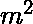

# 求长度小于等于 m 的最大和数组

> 原文:[https://www . geesforgeks . org/find-max-sum-array-length-less-equal-m/](https://www.geeksforgeeks.org/find-maximum-sum-array-length-less-equal-m/)

给定 n 个由整数组成的不同长度的阵列，目标是从一个阵列中选取一个子阵列，使得所有选取的子阵列的组合长度不大于 m，并且它们的元素之和最大。(同样假设 n 的值不能超过 100)

**先决条件:** [背包问题](https://www.geeksforgeeks.org/knapsack-problem/)

**示例:**

```
Input :
n = 5, m = 6
arr[][m] = {{3, 2, 3, 5},
            {2, 7, -1},
            {2, 8, 10},
            {4, 5, 2, 6, 1},
            {3, 2, 3, -2}};
Output : Maximum sum can be obtained is 39
Explanation : We are allowed to pick at most
one subarray from every array. 
We get total sum 39 as ((5) + (7) + (8 + 10) + 
(4 + 5))

Input :
n = 3, m = 4
arr[][m] = {{2, 3, 2},  
            {3, -1, 7, 10},
            {4, 8, 10, -5, 3}};
Output : Maximum sum can be obtained is 35

```

这个问题类似于[背包问题](https://www.geeksforgeeks.org/knapsack-problem/)。你要么选择一个元素，要么放弃它。我们会有同样的策略。
假设这 n 个阵列中的元素总数是 10^5.大气还知道 m 是 10^3 大气，输入数组可以包含负数。首先，制作一个大小为 n * m 的 DP 表(2D 数组)，然后，预先计算一个数组的累积和，以便可以容易地计算该数组从 1 到 n 的每个长度的最大和，从而对于每个给定的数组，长度 k 可以有一个最大的连续和，其中 k 是从 1 到数组的长度。
详细来说，逐个处理输入数组。首先，计算从 1 到长度的所有尺寸的已处理阵列的子阵列的最大和。然后，用这些值更新我们的动态编程表，我们开始处理下一个数组。

**算法:**

1.  从 n 个数组中选择一个数组并开始处理。
2.  计算长度 k 的最大连续和，k 是从 1 到数组的长度，并将其保存在数组 maxSum 中。
3.  现在，通过存储每 0 到 m 长度的最大可能总和来填充 DP 表。
4.  In the last step we traverse last row(nth row) of DP table and pick maximum sum possible and return it.

    **以下是上述方法的实施:**

    ## C++

    ```
    // A Dynamic Programming based C++ program to find 
    // maximum sum of array of size less than or 
    // equal to m from given n arrays 
    #include <bits/stdc++.h> 
    using namespace std; 

    /* N and M to define sizes of arr, 
    dp, current_arr and maxSum */
    #define N 105 
    #define M 1001 

    // INF to define min value 
    #define INF -1111111111 

    // Function to find maximum sum 
    int maxSum(int arr[][N]) 
    { 
        // dp array of size N x M 
        int dp[N][M]; 

        // current_arr of size M 
        int current_arr[M]; 

        // maxsum of size M 
        int maxsum[M]; 

        memset(dp, -1, sizeof(dp[0][0]) * N * M); 

        current_arr[0] = 0; 

        // if we have 0 elements 
        // from 0th array 
        dp[0][0] = 0; 

        for (int i = 1; i <= 5; i++) { 
            int len = arr[i - 1][0]; 

            // compute the cumulative sum array 
            for (int j = 1; j <= len; j++) { 
                current_arr[j] = arr[i - 1][j]; 
                current_arr[j] += current_arr[j - 1]; 
                maxsum[j] = INF; 
            } 

            // calculating the maximum contiguous 
            // array for every length j, j is from 
            // 1 to lengtn of the array 
            for (int j = 1; j <= len && j <= 6; j++) 
                for (int k = 1; k <= len; k++) 
                    if (j + k - 1 <= len) 
                        maxsum[j] = max(maxsum[j], 
                                    current_arr[j + k - 1] - 
                                    current_arr[k - 1]); 

            // every state is depending on 
            // its previous state 
            for (int j = 0; j <= 6; j++) 
                dp[i][j] = dp[i - 1][j]; 

            // computation of dp table similar 
            // approach as knapsack problem 
            for (int j = 1; j <= 6; j++) 
                for (int cur = 1; cur <= j && cur <= len; cur++) 
                    dp[i][j] = max(dp[i][j], 
                                dp[i - 1][j - cur] + 
                                            maxsum[cur]); 
        } 

        // now we have done processing with 
        // the last array lets find out 
        // what is the maximum sum possible 
        int ans = 0; 
        for (int i = 0; i <= 6; i++) 
            ans = max(ans, dp[5][i]);     

        return ans; 
    } 

    // Driver program 
    int main() 
    { 
        // first element of each 
        // row is the size of that row 
        int arr[][N] = { { 3, 2, 3, 5 }, 
                        { 2, 7, -1 }, 
                        { 2, 8, 10 }, 
                        { 4, 5, 2, 6, 1 }, 
                        { 3, 2, 3, -2 } }; 

        cout << "Maximum sum can be obtained "
            << "is : " << maxSum(arr) << "\n"; 
    } 
    ```

    ## Java 语言(一种计算机语言，尤用于创建网站)

    ```
    // Java program to find maximum sum 
    // of array of size less than or 
    // equal to m from given n arrays 
    import java.io.*; 

    public class GFG 
    { 
        /* N and M to define 
        sizes of arr, 
        dp, current_arr 
        and maxSum */
        static int N = 105; 
        static int M = 1001; 

        // INF to define 
        // min value 
        static int INF = -1111111111; 

        // Function to find 
        // maximum sum 
        static int maxSum(int [][]arr) 
        { 
            // dp array of size N x M 
            int [][]dp = new int[N][M]; 

            // current_arr of size M 
            int []current_arr = new int[M]; 

            // maxsum of size M 
            int []maxsum = new int[M]; 

            for (int i = 0; i < N; i++) 
            { 
                for (int j = 0; j < M ; j++) 
                    dp[i][j] = -1; 
            } 

            current_arr[0] = 0; 

            // if we have 0 elements 
            // from 0th array 
            dp[0][0] = 0; 

            for (int i = 1; i <= 5; i++) 
            { 
                int len = arr[i - 1][0]; 

                // compute the cumulative 
                // sum array 
                for (int j = 1; j <= len; j++) 
                { 
                    current_arr[j] = arr[i - 1][j]; 
                    current_arr[j] += current_arr[j - 1]; 
                    maxsum[j] = INF; 
                } 

                // calculating the maximum 
                // contiguous array for every 
                // length j, j is from 1 to 
                // lengtn of the array 
                for (int j = 1; j <= len && j <= 6; j++) 
                    for (int k = 1; k <= len; k++) 
                        if (j + k - 1 <= len) 
                            maxsum[j] = Math.max(maxsum[j], 
                                        current_arr[j + k - 1] - 
                                        current_arr[k - 1]); 

                // every state is depending 
                // on its previous state 
                for (int j = 0; j <= 6; j++) 
                    dp[i][j] = dp[i - 1][j]; 

                // computation of dp table 
                // similar approach as 
                // knapsack problem 
                for (int j = 1; j <= 6; j++) 
                    for (int cur = 1; cur <= j && 
                                    cur <= len; cur++) 
                        dp[i][j] = Math.max(dp[i][j], 
                                            dp[i - 1][j - cur] + 
                                                maxsum[cur]); 
            } 

            // now we have done processing 
            // with the last array lets 
            // find out what is the maximum 
            // sum possible 
            int ans = 0; 
            for (int i = 0; i <= 6; i++) 
                ans = Math.max(ans, dp[5][i]); 

            return ans; 
        } 

        // Driver Code 
        public static void main(String args[]) 
        { 
            // first element of each 
            // row is the size of that row 
            int[][] arr = { 
                    { 3, 2, 3, 5 }, 
                    { 2, 7, -1 }, 
                    { 2, 8, 10 }, 
                    { 4, 5, 2, 6, 1 }, 
                    { 3, 2, 3, -2 } 
            }; 
            System.out.println("Maximum sum can be " + 
                                "obtained is : " + 
                        maxSum(arr)); 
        } 
    } 

    // This code is contributed by 
    // Manish Shaw(manishshaw1) 
    ```

    ## 蟒蛇 3

    ```
    # A Dynamic Programming based Python3 
    # program to find maximum sum of array
    # of size less than or equal to m from
    # given n arrays

    # N and M to define sizes of arr,
    # dp, current_arr and maxSum 
    N = 105
    M = 1001

    # INF to define min value
    INF = -1111111111

    # Function to find maximum sum
    def maxSum(arr):

        # dp array of size N x M
        dp = [[-1 for x in range(M)]
                  for y in range(N)]

        # current_arr of size M
        current_arr = [0] * M

        # maxsum of size M
        maxsum = [0] * M

        current_arr[0] = 0

        # If we have 0 elements
        # from 0th array
        dp[0][0] = 0

        for i in range(1, 6):
            len = arr[i - 1][0]

            # Compute the cumulative sum array
            for j in range(1, len + 1):
                current_arr[j] = arr[i - 1][j]
                current_arr[j] += current_arr[j - 1]
                maxsum[j] = INF

            # Calculating the maximum contiguous
            # array for every length j, j is from
            # 1 to lengtn of the array
            j = 1
            while j <= len and j <= 6:
                for k in range(1, len + 1):
                    if (j + k - 1 <= len):
                        maxsum[j] = max(maxsum[j],
                                   current_arr[j + k - 1] -
                                   current_arr[k - 1])

                j += 1

            # Every state is depending on
            # its previous state
            for j in range(7):
                dp[i][j] = dp[i - 1][j]

            # computation of dp table similar
            # approach as knapsack problem
            for j in range(1, 7):
                cur = 1
                while cur <= j and cur <= len:
                    dp[i][j] = max(dp[i][j],
                                   dp[i - 1][j - cur] +
                                          maxsum[cur])

                    cur += 1

        # Now we have done processing with
        # the last array lets find out
        # what is the maximum sum possible
        ans = 0
        for i in range(7):
            ans = max(ans, dp[5][i]) 

        return ans

    # Driver code
    if __name__ == "__main__":

        # First element of each
        # row is the size of that row
        arr = [ [ 3, 2, 3, 5 ],
                [ 2, 7, -1 ],
                [ 2, 8, 10 ],
                [ 4, 5, 2, 6, 1 ],
                [ 3, 2, 3, -2 ] ]

        print("Maximum sum can be obtained", 
              "is : ", maxSum(arr))

    # This code is contributed by chitranayal
    ```

    ## C#

    ```
    // C# program to find maximum sum 
    // of array of size less than or 
    // equal to m from given n arrays 
    using System; 

    class GFG 
    { 
        /* N and M to define 
        sizes of arr, 
        dp, current_arr 
        and maxSum */
        static int N = 105; 
        static int M = 1001; 

        // INF to define 
        // min value 
        static int INF = -1111111111; 

        // Function to find 
        // maximum sum 
        static int maxSum(int [][]arr) 
        { 
            // dp array of size N x M 
            int [,]dp = new int[N, M]; 

            // current_arr of size M 
            int []current_arr = new int[M]; 

            // maxsum of size M 
            int []maxsum = new int[M]; 

            for (int i = 0; i < N; i++) 
            { 
                for (int j = 0; j < M ; j++) 
                    dp[i, j] = -1; 
            } 

            current_arr[0] = 0; 

            // if we have 0 elements 
            // from 0th array 
            dp[0, 0] = 0; 

            for (int i = 1; i <= 5; i++) 
            { 
                int len = arr[i - 1][0]; 

                // compute the cumulative 
                // sum array 
                for (int j = 1; j <= len; j++) 
                { 
                    current_arr[j] = arr[i - 1][j]; 
                    current_arr[j] += current_arr[j - 1]; 
                    maxsum[j] = INF; 
                } 

                // calculating the maximum 
                // contiguous array for every 
                // length j, j is from 1 to 
                // lengtn of the array 
                for (int j = 1; j <= len && j <= 6; j++) 
                    for (int k = 1; k <= len; k++) 
                        if (j + k - 1 <= len) 
                            maxsum[j] = Math.Max(maxsum[j], 
                                        current_arr[j + k - 1] - 
                                        current_arr[k - 1]); 

                // every state is depending 
                // on its previous state 
                for (int j = 0; j <= 6; j++) 
                    dp[i, j] = dp[i - 1, j]; 

                // computation of dp table 
                // similar approach as 
                // knapsack problem 
                for (int j = 1; j <= 6; j++) 
                    for (int cur = 1; cur <= j && 
                                    cur <= len; cur++) 
                        dp[i, j] = Math.Max(dp[i, j], 
                                            dp[i - 1, j - cur] + 
                                                maxsum[cur]); 
            } 

            // now we have done processing 
            // with the last array lets 
            // find out what is the maximum 
            // sum possible 
            int ans = 0; 
            for (int i = 0; i <= 6; i++) 
                ans = Math.Max(ans, dp[5, i]); 

            return ans; 
        } 

        // Driver Code 
        static void Main() 
        { 
            // first element of each 
            // row is the size of that row 
            int[][] arr = new int[][] 
            { 
                new int[]{ 3, 2, 3, 5 }, 
                new int[]{ 2, 7, -1 }, 
                new int[]{ 2, 8, 10 }, 
                new int[]{ 4, 5, 2, 6, 1 }, 
                new int[]{ 3, 2, 3, -2 } 
            }; 
            Console.Write ("Maximum sum can be " + 
                                "obtained is : " + 
                            maxSum(arr) + "\n"); 
        } 
    } 

    // This code is contributed by 
    // Manish Shaw(manishshaw1) 
    ```

    **Output :**

    ```
    Maximum sum can be obtained is : 39

    ```

    **时间复杂度:** O(  n)