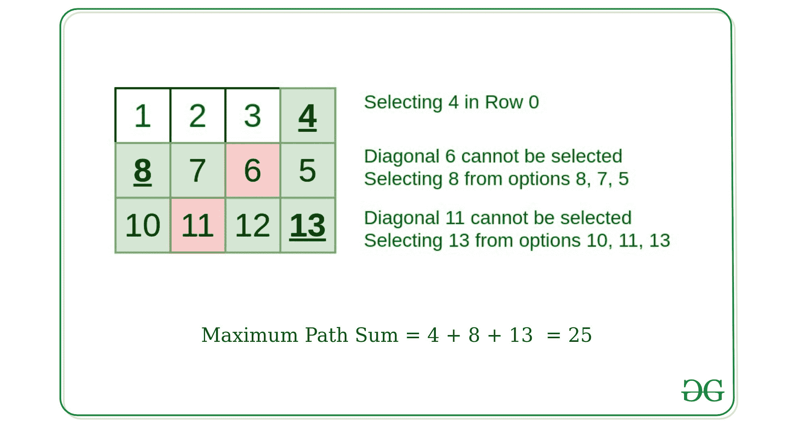

# 在没有相邻对角线元素的情况下，从上至下寻找最大和

> 原文:[https://www . geesforgeks . org/find-从上到下的最大和-没有相邻对角线元素的行/](https://www.geeksforgeeks.org/find-maximum-sum-from-top-to-bottom-row-with-no-adjacent-diagonal-elements/)

给定一个 **N * M** 的矩阵 **A[][]** ，任务是在每一行中选择一个没有相邻对角元素的元素后，求从顶行到底行的最大和。

**示例:**

> **输入:** A = { {1，2，3，4}，{8，7，6，5}，{10，11，12，13} }
> **输出:** 25
> **解释:**
> 所选元素给出最大和–
> 行 0 = 4
> 行 1 = 8
> 行 2 = 13
> 和= 25
> 
> **输入:** A = { {1，6}、{5，3}、{11，7} }
> **输出:** 17
> **解释:**
> 所选元素给出最大和–
> 第 0 行= 1
> 第 1 行= 5
> 第 2 行= 11

**说明:**选择任意元素如果我们选择了 A[i][j]，那么元素 A[i+1][j+1]和 A[i+1][j-1]就不能选择。
在给定的示例中，从顶行选择最大元素，在这种情况下 4 是最大值，那么元素 A[1][2]不能选择为 6，从可用选项中选择最大值的元素 8。同样，元素 11 不能从第 3 <sup>行</sup>中选择。选择元素 13，得到最大值 25。



**天真方法:**从每行中选择 1 个元素后，生成 N 个元素的所有组合，并选择产生最大和的组合。

**高效方法:**思路是以自下而上的方式使用[动态规划](https://www.geeksforgeeks.org/dynamic-programming/)的概念。从给定矩阵的最下面一行开始，重复下面的过程，直到我们到达最上面一行。

*   创建一个最底部行元素的辅助[数组](https://www.geeksforgeeks.org/introduction-to-arrays/)，并为其分配相应的索引。
*   [排序](https://www.geeksforgeeks.org/merge-sort/)辅助阵。
*   迭代辅助数组，并为每个元素从上面的行中找到要添加到当前元素的最大元素，以产生最大和，使得对于每个 **A[i][j]** ，所选元素不是 **A[i-1][j+1]** 或 **A[i-1][j-1]** 。
*   重复此操作，直到到达给定矩阵数组的最上面一行。
*   从顶行找到最大元素以获得最大总和

下面是上述方法的实现。

## C++

```
// C++ implementation to find
// maximum sum from top to bottom
// row with no adjacent diagonal elements

#include <bits/stdc++.h>
using namespace std;

// Function to find the maximum
// path sum from top to bottom row
int maxSum(vector<vector<int> >& V,
                       int n, int m){
    int ans = 0;
    for (int i = n - 2; i >= 0; --i) {
        // Create an auxiliary array of next row
        // with the element and it's position
        vector<pair<int, int> > aux;

        for (int j = 0; j < m; ++j) {
            aux.push_back({ V[i + 1][j],
                                    j });
        }

        // Sort the auxiliary array
        sort(aux.begin(), aux.end());
        reverse(aux.begin(), aux.end());

        // Find maximum from row above to
        // be added to the current element
        for (int j = 0; j < m; ++j) {

            // Find the maximum element from
            // the next row that can be added
            // to current row element
            for (int k = 0; k < m; ++k) {
                if (aux[k].second - j == 0 ||
                   abs(aux[k].second - j) > 1) {
                    V[i][j] += aux[k].first;
                    break;
                }
            }
        }
    }

    // Find the maximum sum
    for (int i = 0; i < m; ++i) {
        ans = max(ans, V[0][i]);
    }
    return ans;
}

// Driver Code
int main()
{

    vector<vector<int> > V{{ 1, 2, 3, 4 },
                           { 8, 7, 6, 5 },
                           { 10, 11, 12, 13 }};
    int n = V.size();
    int m = V[0].size();

    // Function to find maximum path
    cout << maxSum(V, n, m);

    return 0;
}
```

## Java 语言(一种计算机语言，尤用于创建网站)

```
// Java implementation to find maximum
// sum from top to bottom row with no
// adjacent diagonal elements
import java.util.*;
import java.lang.*;
import java.io.*;

class GFG{

// Function to find the maximum
// path sum from top to bottom row
static int maxSum(int[][] V,
                  int n, int m)
{
    int ans = 0;
    for(int i = n - 2; i >= 0; --i)
    {

        // Create an auxiliary array of next row
        // with the element and it's position
        ArrayList<int[]> aux = new ArrayList<>();

        for(int j = 0; j < m; ++j)
        {
            aux.add(new int[]{V[i + 1][j], j});
        }

        // Sort the auxiliary array
        Collections.sort(aux, (a, b) -> b[0] - a[0]);

        // Find maximum from row above to
        // be added to the current element
        for(int j = 0; j < m; ++j)
        {

            // Find the maximum element from
            // the next row that can be added
            // to current row element
            for(int k = 0; k < m; ++k)
            {
                if (aux.get(k)[1] - j == 0 ||
                    Math.abs(aux.get(k)[1] - j) > 1)
                {
                    V[i][j] += aux.get(k)[0];
                    break;
                }
            }
        }
    }

    // Find the maximum sum
    for(int i = 0; i < m; ++i)
    {
        ans = Math.max(ans, V[0][i]);
    }
    return ans;
}

// Driver code
public static void main(String[] args)
{
    int[][] V = { { 1, 2, 3, 4 },
                  { 8, 7, 6, 5 },
                  { 10, 11, 12, 13 } };

    int n = V.length;
    int m = V[0].length;

    // Function to find maximum path
    System.out.println(maxSum(V, n, m));
}
}

// This code is contributed by offbeat
```

## 蟒蛇 3

```
# Python3 implementation to find
# maximum sum from top to bottom
# row with no adjacent diagonal elements

# Function to find the maximum
# path sum from top to bottom row
def maxSum(V, n, m):
    ans = 0
    for i in range(n - 2, -1, -1):

        # Create an auxiliary array of next row
        # with the element and it's position
        aux = []

        for j in range(m):
            aux.append([V[i + 1][j], j])

        # Sort the auxiliary array
        aux = sorted(aux)
        aux = aux[::-1]

        # Find maximum from row above to
        # be added to the current element
        for j in range(m):

            # Find the maximum element from
            # the next row that can be added
            # to current row element
            for k in range(m):
                if (aux[k][1] - j == 0 or
                abs(aux[k][1] - j) > 1):
                    V[i][j] += aux[k][0]
                    break

    # Find the maximum sum
    for i in range(m):
        ans = max(ans, V[0][i])

    return ans

# Driver Code
if __name__ == '__main__':

    V=[[ 1, 2, 3, 4 ],
    [ 8, 7, 6, 5 ],
    [ 10, 11, 12, 13]]
    n = len(V)
    m = len(V[0])

    # Function to find maximum path
    print(maxSum(V, n, m))

# This code is contributed by mohit kumar 29
```

## C#

```
// C# implementation to find
// maximum sum from top to bottom
// row with no adjacent diagonal elements
using System;
using System.Collections.Generic;
class GFG {

  // Function to find the maximum
  // path sum from top to bottom row
  static int maxSum(int[,] V, int n, int m){
    int ans = 0;
    for (int i = n - 2; i >= 0; --i) {
      // Create an auxiliary array of next row
      // with the element and it's position
      List<Tuple<int,int>> aux = new List<Tuple<int,int>>();

      for (int j = 0; j < m; ++j) {
        aux.Add(new Tuple<int,int>(V[i + 1, j], j));
      }

      // Sort the auxiliary array
      aux.Sort();
      aux.Reverse();

      // Find maximum from row above to
      // be added to the current element
      for (int j = 0; j < m; ++j) {

        // Find the maximum element from
        // the next row that can be added
        // to current row element
        for (int k = 0; k < m; ++k) {
          if (aux[k].Item2 - j == 0 ||
              Math.Abs(aux[k].Item2 - j) > 1) {
            V[i, j] += aux[k].Item1;
            break;
          }
        }
      }
    }

    // Find the maximum sum
    for (int i = 0; i < m; ++i) {
      ans = Math.Max(ans, V[0,i]);
    }
    return ans;
  }

  // Driver code
  static void Main()
  {
    int[,] V =  {{ 1, 2, 3, 4 },
                 { 8, 7, 6, 5 },
                 { 10, 11, 12, 13 }};
    int n = V.GetLength(0);
    int m = V.GetLength(1);

    // Function to find maximum path
    Console.WriteLine(maxSum(V, n, m));
  }
}

// This code is contributed by divyesh072019.
```

## java 描述语言

```
<script>
// Javascript implementation to find
// maximum sum from top to bottom
// row with no adjacent diagonal elements

// Function to find the maximum
// path sum from top to bottom row
function maxSum(V, n, m){
    let ans = 0;
    for (let i = n - 2; i >= 0; --i) {
        // Create an auxiliary array of next row
        // with the element and it's position
        let aux = new Array();

        for (let j = 0; j < m; ++j) {
            aux.push([ V[i + 1][j], j ]);
        }

        // Sort the auxiliary array
        aux.sort((a, b) => a[0] - b[0]);
        aux.reverse();

        // Find maximum from row above to
        // be added to the current element
        for (let j = 0; j < m; ++j) {

            // Find the maximum element from
            // the next row that can be added
            // to current row element
            for (let k = 0; k < m; ++k) {
                if (aux[k][1] - j == 0 ||
                Math.abs(aux[k][1] - j) > 1) {
                    V[i][j] += aux[k][0];
                    break;
                }
            }
        }
    }

    // Find the maximum sum
    for (let i = 0; i < m; ++i) {
        ans = Math.max(ans, V[0][i]);
    }
    return ans;
}

// Driver Code

    let V = [[ 1, 2, 3, 4 ],
                        [ 8, 7, 6, 5 ],
                        [ 10, 11, 12, 13 ]];
    let n = V.length;
    let m = V[0].length;

    // Function to find maximum path
    document.write(maxSum(V, n, m));

    // This code is contributed by _saurabh_jaiswal
</script>
```

**Output:** 

```
25
```