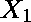
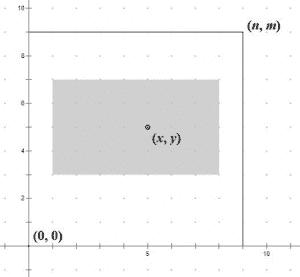
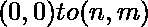

# 寻找覆盖给定点的最佳拟合矩形

> 原文:[https://www . geesforgeks . org/find-最佳拟合-矩形-封面-给定点/](https://www.geeksforgeeks.org/finding-best-fit-rectangle-covers-given-point/)

我们有一个 2D 平面和一个点(、)。我们必须找到一个矩形(、、、)使其
包含给定点(、)。选择的矩形必须满足给定的条件。如果
多个矩形是可能的，我们必须选择矩形中心和点之间欧几里德距离最小的一个(、)。



图片来源–[代号](http://codeforces.com/problemset/problem/303/B?locale=ru)
**示例:**

```
Input : 70 10 20 5 5 3
Output :12 0 27 9

Input :100 100 32 63 2 41
Output :30 18 34 100
```

问题背后的逻辑如下。首先我们通过将 a 和 b 除以将简化为最低不可约形式。我们以两个独立的维度和独立思考这个问题。我们通过将 a 和 b 除以它们的 gcd 找到，从而找到我们在范围内可以安全行驶的最大距离。由于我们必须找到中心距点(、)距离最小的矩形，因此我们从假设点(、)是我们的中心开始。然后我们通过对减去和加上一半的长度来找到和。如果或超出范围，我们相应地移动坐标，使其在范围内。同样，我们继续计算和。
根据上述逻辑，第一个例子的答案是。

## C++

```
#include <cmath>
#include <iostream>
using namespace std;

// Function to calculate
// GCD of a and b
int gcd(int a, int b)
{
    if (a == 0)
        return b;
    else
        return gcd(b % a, a);
}

// Function to calculate the
// coordinates of the rectangle
void solve(int n, int m, int x, int y, int a, int b)
{

    int k, g;
    int x1, y1, x2, y2;
    g = gcd(a, b);

    // Reducing the ratio to
    // lowest irreducible form
    a /= g;
    b /= g;

    // Finding the maximum multiple
    // of length that can be chosen
    k = min(n / a, m / b);

    // Assuming the point (X, Y) as the
    // centre of the required rectangle
    // Finding the lower X coordinate by
    // subtracting half of total length from X
    x1 = x - (k * a - k * a / 2);

    // Finding the upper X coordinate
    // by adding half of total length to X
    x2 = x + k * a / 2;

    // Finding lower Y coordinate by
    // subtracting half of breadth from Y
    y1 = y - (k * b - k * b / 2);

    // Finding upper Y coordinate
    // by adding half of breadth to Y
    y2 = y + k * b / 2;

    // If lower X coordinate
    // goes below 0 then we shift
    // the lower coordinate to 0
    // and the upper coordinate
    // accordingly to bring lower
    // coordinate in range
    // and to keep center as
    // close as possible to X, Y
    if (x1 < 0) {
        x2 -= x1;
        x1 = 0;
    }

    // If upper X coordinate goes
    // beyond n, then we shift the
    // upper X coordinate ton
    // and we shift the lower coordinate
    // accordingly to bring the upper
    // coordinate in range
    if (x2 > n) {
        x1 -= x2 - n;
        x2 = n;
    }

    // If lower Y coordinate goes
    // below 0 then we shift the
    // lower coordinate to 0
    // and the upper coordinate
    // accordingly to bring lower
    // coordinate in range
    // and to keep center as
    // close as possible to X, Y
    if (y1 < 0) {
        y2 -= y1;
        y1 = 0;
    }

    // If upper Y coordinate goes
    // beyond n, then we shift the
    // upper X coordinate
    // to n and we shift the lower
    // coordinate accordingly to
    // bring the upper
    // coordinate in range
    if (y2 > m) {
        y1 -= y2 - m;
        y2 = m;
    }

    cout << x1 << " " << y1 << " " << x2
         << " " << y2 << endl;
}

// Driver function
int main()
{
    int n = 70, m = 10, x = 20, y = 5, a = 5, b = 3;
    solve(n, m, x, y, a, b);
    return 0;
}
```

## Java 语言(一种计算机语言，尤用于创建网站)

```
class GFG {

    // Function to calculate
    // GCD of a and b
    public static int gcd(int a, int b)
    {
        if (a == 0)
            return b;
        else
            return gcd(b % a, a);
    }

    // Function to calculate the
    // coordinates of the rectangle
    public static void solve(int n, int m,
                             int x, int y,
                             int a, int b)
    {

        int k, g;
        int x1, y1, x2, y2;
        g = gcd(a, b);

        // Reducing the ratio to
        // lowest irreducible form
        a /= g;
        b /= g;

        // Finding the maximum multiple
        // of length that can be chosen
        k = Math.min(n / a, m / b);

        // Assuming the point (X, Y) as the
        // centre of the required rectangle
        // Finding the lower X coordinate by
        // subtracting half of total length
        // from X
        x1 = x - (k * a - k * a / 2);

        // Finding the upper X coordinate
        // by adding half of total length
        // to X
        x2 = x + k * a / 2;

        // Finding lower Y coordinate by
        // subtracting half of breadth
        // from Y
        y1 = y - (k * b - k * b / 2);

        // Finding upper Y coordinate
        // by adding half of breadth
        // to Y
        y2 = y + k * b / 2;

        // If lower X coordinate
        // goes below 0 then we shift
        // the lower coordinate to 0
        // and the upper coordinate
        // accordingly to bring lower
        // coordinate in range
        // and to keep center as
        // close as possible to X, Y
        if (x1 < 0) {
            x2 -= x1;
            x1 = 0;
        }

        // If upper X coordinate goes
        // beyond n, then we shift the
        // upper X coordinate ton
        // and we shift the lower coordinate
        // accordingly to bring the upper
        // coordinate in range
        if (x2 > n) {
            x1 -= x2 - n;
            x2 = n;
        }

        // If lower Y coordinate goes
        // below 0 then we shift the
        // lower coordinate to 0
        // and the upper coordinate
        // accordingly to bring lower
        // coordinate in range
        // and to keep center as
        // close as possible to X, Y
        if (y1 < 0) {
            y2 -= y1;
            y1 = 0;
        }

        // If upper Y coordinate goes
        // beyond n, then we shift the
        // upper X coordinate
        // to n and we shift the lower
        // coordinate accordingly to
        // bring the upper
        // coordinate in range
        if (y2 > m) {
            y1 -= y2 - m;
            y2 = m;
        }

        System.out.println(x1 + " " + y1 + " " + x2
                           + " " + y2);
    }

    // Driver Code
    public static void main(String args[])
    {
        int n = 70, m = 10;
        int x = 20, y = 5;
        int a = 5, b = 3;
        solve(n, m, x, y, a, b);
    }
}

// This code is contributed by - vkz6198
```

## 蟒蛇 3

```
# Function to calculate
# GCD of a and b
def gcd(a, b):

    if (a == 0):
        return b
    else:
        return gcd(b % a, a)

# Function to calculate the
# coordinates of the rectangle
def solve(n, m, x, y, a, b):

    g = int(gcd(a, b))

    # Reducing the ratio to
    # lowest irreducible form
    a /= g
    b /= g

    # Finding the maximum multiple
    # of length that can be chosen
    k = int(min(n / a, m / b))

    # Assuming the point (X, Y) as the
    # centre of the required rectangle
    # Finding the lower X coordinate by
    # subtracting half of total length
    # from X
    x1 = int(x - (k * a - k * a / 2))

    # Finding the upper X coordinate
    # by adding half of total length
    # to X
    x2 = int(x + k * a / 2)

    # Finding lower Y coordinate by
    # subtracting half of breadth from Y
    y1 = int(y - (k * b - k * b / 2))

    # Finding upper Y coordinate
    # by adding half of breadth to Y
    y2 = int(y + k * b / 2)

    # If lower X coordinate
    # goes below 0 then we shift
    # the lower coordinate to 0
    # and the upper coordinate
    # accordingly to bring lower
    # coordinate in range
    # and to keep center as
    # close as possible to X, Y
    if (int(x1) < 0):
        x2 -= x1
        x1 = 0

    # If upper X coordinate goes
    # beyond n, then we shift the
    # upper X coordinate ton
    # and we shift the lower coordinate
    # accordingly to bring the upper
    # coordinate in range
    if (int(x2) > n):
        x1 -= x2 - n
        x2 = n

    # If lower Y coordinate goes
    # below 0 then we shift the
    # lower coordinate to 0
    # and the upper coordinate
    # accordingly to bring lower
    # coordinate in range
    # and to keep center as
    # close as possible to X, Y
    if (int(y1) < 0) :
        y2 -= y1
        y1 = 0

    # If upper Y coordinate goes
    # beyond n, then we shift the
    # upper X coordinate
    # to n and we shift the lower
    # coordinate accordingly to
    # bring the upper
    # coordinate in range
    if (int(y2) > m):
        y1 -= y2 - m
        y2 = m

    print(x1 , " " , y1 , " " , x2
        , " " , y2,sep="")

# Driver function
n = 70
m = 10
x = 20
y = 5
a = 5
b = 3
solve(n, m, x, y, a, b)

# This code is contributed by Smitha
```

## C#

```
using System;

class GFG {

    // Function to calculate
    // GCD of a and b
    public static int gcd(int a, int b)
    {
        if (a == 0)
            return b;
        else
            return gcd(b % a, a);
    }

    // Function to calculate the
    // coordinates of the rectangle
    public static void solve(int n, int m,
                            int x, int y,
                            int a, int b)
    {

        int k, g;
        int x1, y1, x2, y2;
        g = gcd(a, b);

        // Reducing the ratio to
        // lowest irreducible form
        a /= g;
        b /= g;

        // Finding the maximum multiple
        // of length that can be chosen
        k = Math.Min(n / a, m / b);

        // Assuming the point (X, Y) as the
        // centre of the required rectangle
        // Finding the lower X coordinate by
        // subtracting half of total length
        // from X
        x1 = x - (k * a - k * a / 2);

        // Finding the upper X coordinate
        // by adding half of total length
        // to X
        x2 = x + k * a / 2;

        // Finding lower Y coordinate by
        // subtracting half of breadth
        // from Y
        y1 = y - (k * b - k * b / 2);

        // Finding upper Y coordinate
        // by adding half of breadth
        // to Y
        y2 = y + k * b / 2;

        // If lower X coordinate
        // goes below 0 then we shift
        // the lower coordinate to 0
        // and the upper coordinate
        // accordingly to bring lower
        // coordinate in range
        // and to keep center as
        // close as possible to X, Y
        if (x1 < 0) {
            x2 -= x1;
            x1 = 0;
        }

        // If upper X coordinate goes
        // beyond n, then we shift the
        // upper X coordinate ton
        // and we shift the lower coordinate
        // accordingly to bring the upper
        // coordinate in range
        if (x2 > n) {
            x1 -= x2 - n;
            x2 = n;
        }

        // If lower Y coordinate goes
        // below 0 then we shift the
        // lower coordinate to 0
        // and the upper coordinate
        // accordingly to bring lower
        // coordinate in range
        // and to keep center as
        // close as possible to X, Y
        if (y1 < 0) {
            y2 -= y1;
            y1 = 0;
        }

        // If upper Y coordinate goes
        // beyond n, then we shift the
        // upper X coordinate
        // to n and we shift the lower
        // coordinate accordingly to
        // bring the upper
        // coordinate in range
        if (y2 > m) {
            y1 -= y2 - m;
            y2 = m;
        }

        Console.Write(x1 + " " + y1 +
                 " " + x2 + " " + y2);
    }

    // Driver Code
    public static void Main()
    {
        int n = 70, m = 10;
        int x = 20, y = 5;
        int a = 5, b = 3;
        solve(n, m, x, y, a, b);
    }
}

// This code is contributed by Smitha
```

## 服务器端编程语言（Professional Hypertext Preprocessor 的缩写）

```
<?php
// Function to calculate
// GCD of a and b

function gcd($a, $b)
{
    if ($a == 0)
        return $b;
    else
        return gcd($b % $a, $a);
}

// Function to calculate the
// coordinates of the rectangle
function solve($n, $m, $x, $y, $a, $b)
{

    $k; $g;
    $x1; $y1; $x2; $y2;
    $g = gcd($a, $b);

    // Reducing the ratio to
    // lowest irreducible form
    $a /= $g;
    $b /= $g;

    // Finding the maximum multiple
    // of length that can be chosen
    $k = min($n / $a, $m / $b);

    // Assuming the point (X, Y)
    // as the centre of the required
    // rectangle Finding the lower
    // X coordinate by subtracting
    // half of total length from X
    $x1 = $x - ($k * $a - $k * $a / 2);

    // Finding the upper X
    // coordinate by adding
    // half of total length to X
    $x2 = $x + $k * $a / 2;

    // Finding lower Y coordinate by
    // subtracting half of breadth from Y
    $y1 = $y - ($k * $b - $k * $b / 2);

    // Finding upper Y coordinate
    // by adding half of breadth to Y
    $y2 = $y + $k * $b / 2;

    // If lower X coordinate
    // goes below 0 then we shift
    // the lower coordinate to 0
    // and the upper coordinate
    // accordingly to bring lower
    // coordinate in range
    // and to keep center as
    // close as possible to X, Y
    if ($x1 < 0)
    {
        $x2 -= $x1;
        $x1 = 0;
    }

    // If upper X coordinate goes
    // beyond n, then we shift the
    // upper X coordinate ton
    // and we shift the lower coordinate
    // accordingly to bring the upper
    // coordinate in range
    if ($x2 > $n)
    {
        $x1 -= $x2 - $n;
        $x2 = $n;
    }

    // If lower Y coordinate goes
    // below 0 then we shift the
    // lower coordinate to 0
    // and the upper coordinate
    // accordingly to bring lower
    // coordinate in range
    // and to keep center as
    // close as possible to X, Y
    if ($y1 < 0)
    {
        $y2 -= $y1;
        $y1 = 0;
    }

    // If upper Y coordinate goes
    // beyond n, then we shift the
    // upper X coordinate
    // to n and we shift the lower
    // coordinate accordingly to
    // bring the upper
    // coordinate in range
    if ($y2 > $m)
    {
        $y1 -= $y2 - $m;
        $y2 = $m;
    }

    echo $x1, " ", $y1, " ",
         $x2, " ", $y2, "\n";
}

// Driver Code
$n = 70; $m = 10; $x = 20;
$y = 5; $a = 5; $b = 3;
solve($n, $m, $x, $y, $a, $b);

// This code is contributed by aj_36
?>
```

## java 描述语言

```
<script>
    // Function to calculate
    // GCD of a and b
    function gcd(a, b)
    {
        if (a == 0)
            return b;
        else
            return gcd(b % a, a);
    }

    // Function to calculate the
    // coordinates of the rectangle
    function solve(n, m, x, y, a, b)
    {

        let k, g;
        let x1, y1, x2, y2;
        g = gcd(a, b);

        // Reducing the ratio to
        // lowest irreducible form
        a = a / g;
        b = b / g;

        // Finding the maximum multiple
        // of length that can be chosen
        k = Math.min(parseInt(n / a, 10), parseInt(m / b, 10));

        // Assuming the point (X, Y) as the
        // centre of the required rectangle
        // Finding the lower X coordinate by
        // subtracting half of total length
        // from X
        x1 = x - (k * a - k * parseInt(a / 2, 10));

        // Finding the upper X coordinate
        // by adding half of total length
        // to X
        x2 = x + k * parseInt(a / 2, 10);

        // Finding lower Y coordinate by
        // subtracting half of breadth
        // from Y
        y1 = y - (k * b - k * parseInt(b / 2, 10));

        // Finding upper Y coordinate
        // by adding half of breadth
        // to Y
        y2 = y + k * parseInt(b / 2, 10);

        // If lower X coordinate
        // goes below 0 then we shift
        // the lower coordinate to 0
        // and the upper coordinate
        // accordingly to bring lower
        // coordinate in range
        // and to keep center as
        // close as possible to X, Y
        if (x1 < 0) {
            x2 -= x1;
            x1 = 0;
        }

        // If upper X coordinate goes
        // beyond n, then we shift the
        // upper X coordinate ton
        // and we shift the lower coordinate
        // accordingly to bring the upper
        // coordinate in range
        if (x2 > n) {
            x1 -= x2 - n;
            x2 = n;
        }

        x1 += 1; x2 += 1;

        // If lower Y coordinate goes
        // below 0 then we shift the
        // lower coordinate to 0
        // and the upper coordinate
        // accordingly to bring lower
        // coordinate in range
        // and to keep center as
        // close as possible to X, Y
        if (y1 < 0) {
            y2 -= y1;
            y1 = 0;
        }

        // If upper Y coordinate goes
        // beyond n, then we shift the
        // upper X coordinate
        // to n and we shift the lower
        // coordinate accordingly to
        // bring the upper
        // coordinate in range
        if (y2 > m) {
            y1 -= y2 - m;
            y2 = m;
        }

        document.write(x1 + " " + y1 + " " + x2 + " " + y2);
    }

    let n = 70, m = 10;
    let x = 20, y = 5;
    let a = 5, b = 3;
    solve(n, m, x, y, a, b);

</script>
```

**输出:**

```
12 0 27 9
```