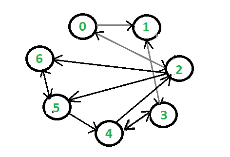

# 求图中所有顶点的进出度

> 原文:[https://www . geeksforgeeks . org/查找图中所有顶点的进出度/](https://www.geeksforgeeks.org/finding-in-and-out-degrees-of-all-vertices-in-a-graph/)

给定一个有向图，任务是计算图的每个顶点的进出度。
**例:**

```
Input:
```



```
Output:
Vertex    In    Out
0         1    2
1          2    1
2          2    3
3          2    2
4          2    2
5          2    2
6          2    1
```

**逼近:**遍历每个顶点的邻接表，如果顶点的邻接表 **i** 的大小是 **x** ，那么 **i 的出度= x** 并且从 **i** 开始增加每个有引入边的顶点的入度。对每个顶点重复上述步骤，最后打印所有顶点的入度和出度。
以下是上述方法的实施:

## C++

```
// C++ program to find the in and out degrees
// of the vertices of the given graph
#include <bits/stdc++.h>
using namespace std;

// Function to print the in and out degrees
// of all the vertices of the given graph
void findInOutDegree(vector<vector<int>> adjlist,
                     int n)
{
    vector<int> iN(n,0);
      vector<int> ouT(n,0);

    for(int i=0;i<n;i++)
    {
        // Out degree for ith vertex will be the count
        // of direct paths from i to other vertices
       ouT[i] = adjlist[i].size();
          // Every vertex that has an incoming
            // edge from i
           for(int j=0;j<adjlist[i].size();j++)
          iN[adjlist[i][j]]++;
     }

    cout << "Vertex\t\tIn\t\tOut" << endl;
    for(int k = 0; k < n; k++)
    {
        cout << k << "\t\t"
             << iN[k] << "\t\t"
             << ouT[k] << endl;
    }
}

// Driver code
int main()
{

    // Adjacency list representation of the graph
    vector<vector<int>> adjlist;

    // Vertices 1 and 2 have an incoming edge
    // from vertex 0
    vector<int> tmp;
    tmp.push_back(1);
    tmp.push_back(2);
    adjlist.push_back(tmp);
    tmp.clear();

    // Vertex 3 has an incoming edge
    // from vertex 1
    tmp.push_back(3);
    adjlist.push_back(tmp);
    tmp.clear();

    // Vertices 0, 5 and 6 have an incoming
    // edge from vertex 2
    tmp.push_back(0);
    tmp.push_back(5);
    tmp.push_back(6);
    adjlist.push_back(tmp);
    tmp.clear();

    // Vertices 1 and 4 have an incoming
    // edge from vertex 3
    tmp.push_back(1);
    tmp.push_back(4);
    adjlist.push_back(tmp);
    tmp.clear();

    // Vertices 2 and 3 have an incoming
    // edge from vertex 4
    tmp.push_back(2);
    tmp.push_back(3);
    adjlist.push_back(tmp);
    tmp.clear();

    // Vertices 4 and 6 have an incoming
    // edge from vertex 5
    tmp.push_back(4);
    tmp.push_back(6);
    adjlist.push_back(tmp);
    tmp.clear();

    // Vertex 5 has an incoming
    // edge from vertex 6
    tmp.push_back(5);
    adjlist.push_back(tmp);
    tmp.clear();

    int n = adjlist.size();

    findInOutDegree(adjlist, n);
}

// This code is contributed by saurabhgpta248   
```

## Java 语言(一种计算机语言，尤用于创建网站)

```
// Java program to find the in and out degrees
// of the vertices of the given graph
import java.util.*;

class GFG {

    // Function to print the in and out degrees
    // of all the vertices of the given graph
    static void findInOutDegree(List<List<Integer> > adjList, int n)
    {
        int in[] = new int[n];
        int out[] = new int[n];

        for (int i = 0; i < adjList.size(); i++) {

            List<Integer> list = adjList.get(i);

            // Out degree for ith vertex will be the count
            // of direct paths from i to other vertices
            out[i] = list.size();
            for (int j = 0; j < list.size(); j++)

                // Every vertex that has an incoming
                // edge from i
                in[list.get(j)]++;
        }

        System.out.println("Vertex\tIn\tOut");
        for (int k = 0; k < n; k++) {
            System.out.println(k + "\t" + in[k] + "\t" + out[k]);
        }
    }

    // Driver code
    public static void main(String args[])
    {
        // Adjacency list representation of the graph
        List<List<Integer> > adjList = new ArrayList<>();

        // Vertices 1 and 2 have an incoming edge
        // from vertex 0
        List<Integer> tmp =
           new ArrayList<Integer>(Arrays.asList(1, 2));
        adjList.add(tmp);

        // Vertex 3 has an incoming edge from vertex 1
        tmp = new ArrayList<Integer>(Arrays.asList(3));
        adjList.add(tmp);

        // Vertices 0, 5 and 6 have an incoming
        // edge from vertex 2
        tmp =
          new ArrayList<Integer>(Arrays.asList(0, 5, 6));
        adjList.add(tmp);

        // Vertices 1 and 4 have an incoming edge
        // from vertex 3
        tmp = new ArrayList<Integer>(Arrays.asList(1, 4));
        adjList.add(tmp);

        // Vertices 2 and 3 have an incoming edge
        // from vertex 4
        tmp = new ArrayList<Integer>(Arrays.asList(2, 3));
        adjList.add(tmp);

        // Vertices 4 and 6 have an incoming edge
        // from vertex 5
        tmp = new ArrayList<Integer>(Arrays.asList(4, 6));
        adjList.add(tmp);

        // Vertex 5 has an incoming edge from vertex 6
        tmp = new ArrayList<Integer>(Arrays.asList(5));
        adjList.add(tmp);

        int n = adjList.size();
        findInOutDegree(adjList, n);
    }
}
```

## 蟒蛇 3

```
# Python3 program to find the in and out
# degrees of the vertices of the given graph

# Function to print the in and out degrees
# of all the vertices of the given graph
def findInOutDegree(adjList, n):

    _in = [0] * n
    out = [0] * n

    for i in range(0, len(adjList)):

        List = adjList[i]

        # Out degree for ith vertex will be the count
        # of direct paths from i to other vertices
        out[i] = len(List)
        for j in range(0, len(List)):

            # Every vertex that has
            # an incoming edge from i
            _in[List[j]] += 1

    print("Vertex\tIn\tOut")
    for k in range(0, n):
        print(str(k) + "\t" + str(_in[k]) +
                       "\t" + str(out[k]))

# Driver code
if __name__ == "__main__":

    # Adjacency list representation of the graph
    adjList = []

    # Vertices 1 and 2 have an incoming edge
    # from vertex 0
    adjList.append([1, 2])

    # Vertex 3 has an incoming edge from vertex 1
    adjList.append([3])

    # Vertices 0, 5 and 6 have an
    # incoming edge from vertex 2
    adjList.append([0, 5, 6])

    # Vertices 1 and 4 have an
    # incoming edge from vertex 3
    adjList.append([1, 4])

    # Vertices 2 and 3 have an
    # incoming edge from vertex 4
    adjList.append([2, 3])

    # Vertices 4 and 6 have an
    # incoming edge from vertex 5
    adjList.append([4, 6])

    # Vertex 5 has an incoming edge from vertex 6
    adjList.append([5])

    n = len(adjList)
    findInOutDegree(adjList, n)

# This code is contributed by Rituraj Jain
```

## C#

```
// C# program to find the in and out degrees
// of the vertices of the given graph
using System;
using System.Collections.Generic;   

class GFG
{

// Function to print the in and out degrees
// of all the vertices of the given graph
static void findInOutDegree(List<List<int>> adjList, int n)
{
    int []iN = new int[n];
    int []ouT = new int[n];

    for (int i = 0; i < adjList.Count; i++)
    {

        List<int> list = adjList[i];

        // Out degree for ith vertex will be the count
        // of direct paths from i to other vertices
        ouT[i] = list.Count;
        for (int j = 0; j < list.Count; j++)

            // Every vertex that has an incoming
            // edge from i
            iN[list[j]]++;
    }

    Console.WriteLine("Vertex\t\tIn\t\tOut");
    for (int k = 0; k < n; k++)
    {
        Console.WriteLine(k + "\t\t" +
                      iN[k] + "\t\t" + ouT[k]);
    }
}

// Driver code
public static void Main(String []args)
{
    // Adjacency list representation of the graph
    List<List<int> > adjList = new List<List<int>>();

    // Vertices 1 and 2 have an incoming edge
    // from vertex 0
    List<int> tmp =
    new List<int>{1, 2};
    adjList.Add(tmp);

    // Vertex 3 has an incoming edge from vertex 1
    tmp = new List<int>{3};
    adjList.Add(tmp);

    // Vertices 0, 5 and 6 have an incoming
    // edge from vertex 2
    tmp =
    new List<int>{0, 5, 6};
    adjList.Add(tmp);

    // Vertices 1 and 4 have an incoming edge
    // from vertex 3
    tmp = new List<int>{1, 4};
    adjList.Add(tmp);

    // Vertices 2 and 3 have an incoming edge
    // from vertex 4
    tmp = new List<int>{2, 3};
    adjList.Add(tmp);

    // Vertices 4 and 6 have an incoming edge
    // from vertex 5
    tmp = new List<int>{4, 6};
    adjList.Add(tmp);

    // Vertex 5 has an incoming edge from vertex 6
    tmp = new List<int>{5};
    adjList.Add(tmp);

    int n = adjList.Count;
    findInOutDegree(adjList, n);
}
}

// This code is contributed by 29AjayKumar
```

**Output:** 

```
Vertex    In    Out
0    1    2
1    2    1
2    2    3
3    2    2
4    2    2
5    2    2
6    2    1
```

**时间复杂度** : O(V + E)，其中 V 和 E 分别是图中的顶点数和边数。
**辅助空间** : O(V + E)。