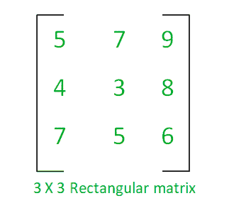
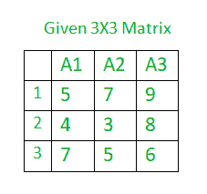

# 使用高斯-乔丹法求矩阵的逆|集合 2

> 原文:[https://www . geeksforgeeks . org/find-矩阵求逆-使用-高斯-乔丹-法/](https://www.geeksforgeeks.org/finding-inverse-of-a-matrix-using-gauss-jordan-method/)

给定一个[矩阵](https://www.geeksforgeeks.org/matrix/)，任务是使用高斯-乔丹方法找到这个矩阵的[逆。](https://www.geeksforgeeks.org/adjoint-inverse-matrix/)

**什么是矩阵？**

矩阵是有序的矩形数字阵列。



[**可以对矩阵进行的运算有:**](https://www.geeksforgeeks.org/different-operation-matrices/) **:** 加、减、[乘](https://www.geeksforgeeks.org/c-program-multiply-two-matrices/)或[转置矩阵](https://www.geeksforgeeks.org/program-to-find-transpose-of-a-matrix/)等。

### 矩阵的逆:

给定一个非奇异的方阵 A(意味着 A 的行列式非零)；那么就存在一个矩阵


这就是所谓的矩阵 a 的逆

只有当这样的性质成立时，矩阵的逆才有可能:

1.  矩阵必须是正方形矩阵。
2.  该矩阵必须是非奇异矩阵，
3.  存在一个恒等式矩阵 1


一般来说，n×n 矩阵 A 的逆矩阵可以用这个简单的公式求出:


其中，Adj(A)表示矩阵的[伴随，Det(A)是矩阵](https://www.geeksforgeeks.org/adjoint-inverse-matrix/) A 的[行列式](https://www.geeksforgeeks.org/determinant-of-a-matrix/)

### 求矩阵逆的方法:

求 2×2 矩阵的逆是一个简单的任务，但求更大矩阵(如 3×3、4×4 等)的逆是一个艰巨的任务，因此可以使用以下方法:

1.  初等行运算(高斯-乔丹法)**(高效)**
2.  未成年人、辅助因素和广告方法(低效)

### 初等行运算(高斯-乔丹法):

高斯-乔丹法是高斯消元法的一种变形，它通过行归约运算来求矩阵的逆。

**使用高斯-乔丹法求矩阵逆的步骤:**
为了求矩阵逆，需要遵循以下步骤:

1.  由单位矩阵构成增广矩阵。
2.  对该扩充矩阵执行行缩减操作，以生成矩阵的行缩减梯次形式。
3.  需要时，对扩充矩阵执行以下行操作:
    *   交换任意两行。
    *   将行的每个元素乘以一个非零整数。
    *   将一行替换为其自身和矩阵另一行的常数倍数之和。

**示例:**



*   增广矩阵形成为 A:B


*   应用高斯-乔丹消去法后:


下面是使用高斯-乔丹法求矩阵逆的 C++程序:

## C++

```
// C++ program to find the inverse of Matrix.

#include <iostream>
#include <vector>
using namespace std;

// Function to Print matrix.
void PrintMatrix(float** ar, int n, int m)
{
    for (int i = 0; i < n; i++) {
        for (int j = 0; j < m; j++) {
            cout << ar[i][j] << "  ";
        }
        printf("\n");
    }
    return;
}

// Function to Print inverse matrix
void PrintInverse(float** ar, int n, int m)
{
    for (int i = 0; i < n; i++) {
        for (int j = n; j < m; j++) {
            printf("%.3f  ", ar[i][j]);
        }
        printf("\n");
    }
    return;
}

// Function to perform the inverse operation on the matrix.
void InverseOfMatrix(float** matrix, int order)
{
    // Matrix Declaration.

    float temp;

    // PrintMatrix function to print the element
    // of the matrix.
    printf("=== Matrix ===\n");
    PrintMatrix(matrix, order, order);

    // Create the augmented matrix
    // Add the identity matrix
    // of order at the end of original matrix.
    for (int i = 0; i < order; i++) {

        for (int j = 0; j < 2 * order; j++) {

            // Add '1' at the diagonal places of
            // the matrix to create a identity matrix
            if (j == (i + order))
                matrix[i][j] = 1;
        }
    }

    // Interchange the row of matrix,
    // interchanging of row will start from the last row
    for (int i = order - 1; i > 0; i--) {

        // Swapping each and every element of the two rows
        // if (matrix[i - 1][0] < matrix[i][0])
        // for (int j = 0; j < 2 * order; j++) {
        //
        //        // Swapping of the row, if above
        //        // condition satisfied.
        // temp = matrix[i][j];
        // matrix[i][j] = matrix[i - 1][j];
        // matrix[i - 1][j] = temp;
        //    }

        // Directly swapping the rows using pointers saves
        // time

        if (matrix[i - 1][0] < matrix[i][0]) {
            float* temp = matrix[i];
            matrix[i] = matrix[i - 1];
            matrix[i - 1] = temp;
        }
    }

    // Print matrix after interchange operations.
    printf("\n=== Augmented Matrix ===\n");
    PrintMatrix(matrix, order, order * 2);

    // Replace a row by sum of itself and a
    // constant multiple of another row of the matrix
    for (int i = 0; i < order; i++) {

        for (int j = 0; j < order; j++) {

            if (j != i) {

                temp = matrix[j][i] / matrix[i][i];
                for (int k = 0; k < 2 * order; k++) {

                    matrix[j][k] -= matrix[i][k] * temp;
                }
            }
        }
    }

    // Multiply each row by a nonzero integer.
    // Divide row element by the diagonal element
    for (int i = 0; i < order; i++) {

        temp = matrix[i][i];
        for (int j = 0; j < 2 * order; j++) {

            matrix[i][j] = matrix[i][j] / temp;
        }
    }

    // print the resultant Inverse matrix.
    printf("\n=== Inverse Matrix ===\n");
    PrintInverse(matrix, order, 2 * order);

    return;
}

// Driver code
int main()
{
    int order;

    // Order of the matrix
    // The matrix must be a square a matrix
    order = 3;
    /*
float matrix[20][20] = { { 5, 7, 9 },
                         { 4, 3, 8 },
                         { 7, 5, 6 },
                         { 0 } };
*/
    float** matrix = new float*[20];
    for (int i = 0; i < 20; i++)
        matrix[i] = new float[20];

    matrix[0][0] = 5;
    matrix[0][1] = 7;
    matrix[0][2] = 9;
    matrix[1][0] = 4;
    matrix[1][1] = 3;
    matrix[1][2] = 8;
    matrix[2][0] = 7;
    matrix[2][1] = 5;
    matrix[2][2] = 6;

    // Get the inverse of matrix
    InverseOfMatrix(matrix, order);

    return 0;
}
```

**Output:** 

```
=== Matrix ===
5  7  9  
4  3  8  
7  5  6  

=== Augmented Matrix ===
7  5  6  0  0  1  
5  7  9  1  0  0  
4  3  8  0  1  0  

=== Inverse Matrix ===
-0.210  0.029  0.276  
0.305  -0.314  -0.038  
-0.010  0.229  -0.124
```