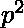

# 求 n 中素数 p 的幂！

> 原文:[https://www . geesforgeks . org/find-power-prime-number-p-n/](https://www.geeksforgeeks.org/finding-power-prime-number-p-n/)

给定一个数字“n”和一个质数“p”。我们需要找出‘p’在 n 的素分解中的幂！
**例:**

```
Input  : n = 4, p = 2
Output : 3
         Power of 2 in the prime factorization
         of 2 in 4! = 24 is 3

Input  : n = 24, p = 2
Output : 22
```

**天真法**
天真法是找出从 1 到 n 的每个数字中 p 的幂，然后相加。因为我们知道在乘法过程中，幂是相加的。

## C++

```
// C++ implementation of finding
// power of p in n!
#include <bits/stdc++.h>

using namespace std;

// Returns power of p in n!
int PowerOFPINnfactorial(int n, int p)
{
    // initializing answer
    int ans = 0;

    // initializing
    int temp = p;

    // loop until temp<=n
    while (temp <= n) {

        // add number of numbers divisible by n
        ans += n / temp;

        // each time multiply temp by p
        temp = temp * p;
    }
    return ans;
}

// Driver function
int main()
{
    cout << PowerOFPINnfactorial(4, 2) << endl;
    return 0;
}
```

## Java 语言(一种计算机语言，尤用于创建网站)

```
// Java implementation of naive approach

public class GFG
{
    // Method to calculate the power of prime number p in n!
    static int PowerOFPINnfactorial(int n, int p)
    {
        // initializing answer
        int ans = 0;

        // finding power of p from 1 to n
        for (int i = 1; i <= n; i++) {

            // variable to note the power of p in i
            int count = 0, temp = i;

            // loop until temp is equal to i
            while (temp % p == 0) {
                count++;
                temp = temp / p;
            }

            // adding count to i
            ans += count;
        }
        return ans;
    }

    // Driver Method
    public static void main(String[] args)
    {
        System.out.println(PowerOFPINnfactorial(4, 2));
    }
}
```

## 蟒蛇 3

```
# Python3 implementation of
# finding power of p in n!

# Returns power of p in n!
def PowerOFPINnfactorial(n, p):

    # initializing answer
    ans = 0;

    # initializing
    temp = p;

    # loop until temp<=n
    while (temp <= n):

        # add number of numbers
        # divisible by n
        ans += n / temp;

        # each time multiply
        # temp by p
        temp = temp * p;

    return ans;

# Driver Code
print(PowerOFPINnfactorial(4, 2));

# This code is contributed by
# mits
```

## C#

```
// C# implementation of naive approach
using System;

public class GFG
{
    // Method to calculate power
    // of prime number p in n!
    static int PowerOFPINnfactorial(int n, int p)
    {
        // initializing answer
        int ans = 0;

        // finding power of p from 1 to n
        for (int i = 1; i <= n; i++) {

            // variable to note the power of p in i
            int count = 0, temp = i;

            // loop until temp is equal to i
            while (temp % p == 0) {
                count++;
                temp = temp / p;
            }

            // adding count to i
            ans += count;
        }
        return ans;
    }

    // Driver Code
    public static void Main(String []args)
    {
        Console.WriteLine(PowerOFPINnfactorial(4, 2));
    }
}

// This code is contributed by vt_m.
```

## 服务器端编程语言（Professional Hypertext Preprocessor 的缩写）

```
<?php
// PHP implementation of
// finding power of p in n!

// Returns power of p in n!
function PowerOFPINnfactorial($n, $p)
{
    // initializing answer
    $ans = 0;

    // initializing
    $temp = $p;

    // loop until temp<=n
    while ($temp <= $n)
    {

        // add number of numbers
        // divisible by n
        $ans += $n / $temp;

        // each time multiply
        // temp by p
        $temp = $temp * $p;
    }
    return $ans;
}

// Driver Code
echo PowerOFPINnfactorial(4, 2) . "\n";

// This code is contributed by
// Akanksha Rai(Abby_akku)
?>
```

## java 描述语言

```
<script>

// Javascript implementation of
// finding power of p in n!

// Returns power of p in n!
function PowerOFPINnfactorial(n, p)
{
    // initializing answer
    let ans = 0;

    // initializing
    let temp = p;

    // loop until temp<=n
    while (temp <= n)
    {

        // add number of numbers
        // divisible by n
        ans += n / temp;

        // each time multiply
        // temp by p
        temp = temp * p;
    }
    return ans;
}

// Driver Code
document.write(PowerOFPINnfactorial(4, 2));

// This code is contributed by _saurabh_jaiswal

</script>
```

**输出:**

```
3
```

**有效方法**
在讨论有效方法之前，让我们讨论一个问题，给定两个数字 n，m，从 1 到 n 有多少个数字可以被 m 整除，答案是 floor(n/m)。
现在回到我们最初的问题，寻找 p 在 n 中的力量！我们要做的是计算从 1 到 n 可以被 p 整除，然后被整除，然后被整除，直到 > n 整除的数，然后把它们相加。这将是我们需要的答案。

```
   Powerofp(n!) = floor(n/p) + floor(n/p^2) + floor(n/p^3)........ 
```

下面是上述步骤的实现。

## C++

```
// C++ implementation of finding power of p in n!
#include <bits/stdc++.h>

using namespace std;

// Returns power of p in n!
int PowerOFPINnfactorial(int n, int p)
{
    // initializing answer
    int ans = 0;

    // initializing
    int temp = p;

    // loop until temp<=n
    while (temp <= n) {

        // add number of numbers divisible by n
        ans += n / temp;

        // each time multiply temp by p
        temp = temp * p;
    }
    return ans;
}

// Driver function
int main()
{
    cout << PowerOFPINnfactorial(4, 2) << endl;
    return 0;
}
```

## Java 语言(一种计算机语言，尤用于创建网站)

```
// Java implementation of finding power of p in n!

public class GFG
{
    // Method to calculate the power of prime number p in n!
    static int PowerOFPINnfactorial(int n, int p)
    {
        // initializing answer
        int ans = 0;

        // initializing
        int temp = p;

        // loop until temp<=n
        while (temp <= n) {

            // add number of numbers divisible by n
            ans += n / temp;

            // each time multiply temp by p
            temp = temp * p;
        }
        return ans;
    }

    // Driver Method
    public static void main(String[] args)
    {
        System.out.println(PowerOFPINnfactorial(4, 2));
    }
}
```

## 蟒蛇 3

```
# Python3 implementation of
# finding power of p in n!

# Returns power of p in n!
def PowerOFPINnfactorial(n, p):

    # initializing answer
    ans = 0

    # initializing
    temp = p

    # loop until temp<=n
    while (temp <= n) :

        # add number of numbers
        # divisible by n
        ans += n / temp

        # each time multiply
        # temp by p
        temp = temp * p

    return int(ans)

# Driver Code
print(PowerOFPINnfactorial(4, 2))

# This code is contributed
# by Smitha
```

## C#

```
// C# implementation of finding
// power of p in n!
using System;

public class GFG
{

    // Method to calculate power
    // of prime number p in n!
    static int PowerOFPINnfactorial(int n, int p)
    {
        // initializing answer
        int ans = 0;

        // initializing
        int temp = p;

        // loop until temp <= n
        while (temp <= n) {

            // add number of numbers divisible by n
            ans += n / temp;

            // each time multiply temp by p
            temp = temp * p;
        }
        return ans;
    }

    // Driver Code
    public static void Main(String []args)
    {
        Console.WriteLine(PowerOFPINnfactorial(4, 2));
    }
}

// This code is contributed by vt_m.
```

## 服务器端编程语言（Professional Hypertext Preprocessor 的缩写）

```
<?php
// PHP implementation of
// finding power of p in n!

// Returns power of p in n!
function PowerOFPINnfactorial($n, $p)
{
    // initializing answer
    $ans = 0;

    // initializing
    $temp = $p;

    // loop until temp<=n
    while ($temp <= $n)
    {

        // add number of numbers divisible by n
        $ans += $n / $temp;

        // each time multiply temp by p
        $temp = $temp * $p;
    }
    return $ans;
}

// Driver function
echo PowerOFPINnfactorial(4, 2) . "\n";

// This code is contributed
// by Akanksha Rai(Abby_akku)
?>
```

## java 描述语言

```
<script>

// Javascript implementation of
// finding power of p in n!

// Returns power of p in n!
function PowerOFPINnfactorial(n, p)
{
    // initializing answer
    let ans = 0;

    // initializing
    let temp = p;

    // loop until temp<=n
    while (temp <= n)
    {

        // add number of numbers divisible by n
        ans += n / temp;

        // each time multiply temp by p
        temp = temp * p;
    }
    return ans;
}

// Driver function
document.write(PowerOFPINnfactorial(4, 2));

// This code is contributed by _saurabh_jaiswal

</script>
```

**输出:**

```
3
```

**时间复杂度** :O(  (n))
本文由**阿育什·贾**供稿。如果你喜欢 GeeksforGeeks 并想投稿，你也可以使用[contribute.geeksforgeeks.org](http://www.contribute.geeksforgeeks.org)写一篇文章或者把你的文章邮寄到 contribute@geeksforgeeks.org。看到你的文章出现在极客博客主页上，帮助其他极客。
如果发现有不正确的地方，或者想分享更多关于上述话题的信息，请写评论。