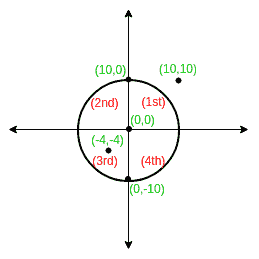
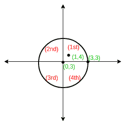
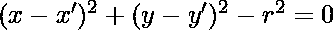
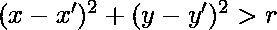
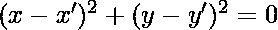
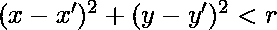

# 求坐标相对于圆的象限

> 原文:[https://www . geesforgeks . org/find-quadrant-coordinate-敬意-circle/](https://www.geeksforgeeks.org/finding-quadrant-coordinate-respect-circle/)

给定圆心的半径和坐标。如果点位于圆内，求另一个给定坐标(X，Y)相对于圆心的象限。否则打印错误“位于圆圈之外”。
如果该点位于圆心，输出 0，或者如果该点位于任意轴上，并且在圆内，输出反时钟方向的下一个象限。

**示例:**

> 输入:中心= (0，0)，半径= 10
> (X，Y) = (10，10)
> 输出:位于圆外
> 
> 
> 
> 输入:中心= (0，3)，半径= 2
> (X，Y) = (1，4)
> 输出:1 (I 象限)
> 
> 

**逼近:**
让中心为(x’，y’)
圆的方程为**–(方程。1)** 
根据该等式，
如果点(x，y)位于圆之外
如果点(x，y)位于圆之上
如果点(x，y)位于圆之内
检查点相对于圆的位置:-

```
1\. Put given coordinates in equation 1.
2\. If it is greater than 0 coordinate lies outside circle.
3\. If point lies inside circle find the quadrant within the circle. Check the point 
   with respect to centre of circle. 
```

以下是上述想法的实现:

## C++

```
// CPP Program to find the quadrant of
// a given coordinate with respect to the
// centre of a circle
#include <bits/stdc++.h>

using namespace std;

// Thus function returns the quadrant number
int getQuadrant(int X, int Y, int R, int PX, int PY)
{
    // Coincides with center
    if (PX == X && PY == Y)
        return 0;

    int val = pow((PX - X), 2) + pow((PY - Y), 2);

    // Outside circle
    if (val > pow(R, 2))
        return -1;

    // 1st quadrant
    if (PX > X && PY >= Y)
        return 1;

    // 2nd quadrant
    if (PX <= X && PY > Y)
        return 2;

    // 3rd quadrant
    if (PX < X && PY <= Y)
        return 3;

    // 4th quadrant
    if (PX >= X && PY < Y)
        return 4;
}

// Driver Code
int main()
{
    // Coordinates of centre
    int X = 0, Y = 3;

    // Radius of circle
    int R = 2;

    // Coordinates of the given point
    int PX = 1, PY = 4;

    int ans = getQuadrant(X, Y, R, PX, PY);
    if (ans == -1)
        cout << "Lies Outside the circle" << endl;
    else if (ans == 0)
        cout << "Coincides with centre" << endl;
    else
        cout << ans << " Quadrant" << endl;
    return 0;
}
```

## Java 语言(一种计算机语言，尤用于创建网站)

```
// Java Program to find the quadrant of
// a given coordinate with respect to the
// centre of a circle
import java.io.*;
class GFG {

// Thus function returns
// the quadrant number
static int getQuadrant(int X, int Y,
                       int R, int PX,
                       int PY)
{

    // Coincides with center
    if (PX == X && PY == Y)
        return 0;

    int val = (int)Math.pow((PX - X), 2) +
              (int)Math.pow((PY - Y), 2);

    // Outside circle
    if (val > Math.pow(R, 2))
        return -1;

    // 1st quadrant
    if (PX > X && PY >= Y)
        return 1;

    // 2nd quadrant
    if (PX <= X && PY > Y)
        return 2;

    // 3rd quadrant
    if (PX < X && PY <= Y)
        return 3;

    // 4th quadrant
    if (PX >= X && PY < Y)
        return 4;
        return 0;
}

    // Driver Code
    public static void main (String[] args)
    {

        // Coordinates of centre
        int X = 0, Y = 3;

        // Radius of circle
        int R = 2;

        // Coordinates of the given point
        int PX = 1, PY = 4;

        int ans = getQuadrant(X, Y, R, PX, PY);
        if (ans == -1)
            System.out.println( "Lies Outside the circle");
        else if (ans == 0)
            System.out.println( "Coincides with centre");
        else
            System.out.println( ans +" Quadrant");
    }
}

// This code is contributed by anuj_67.
```

## 蟒蛇 3

```
# Python3 Program to find the
# quadrant of a given coordinate
# w.rt. the centre of a circle
import math

# Thus function returns the
# quadrant number
def getQuadrant(X, Y, R, PX, PY):

    # Coincides with center
    if (PX == X and PY == Y):
        return 0;

    val = (math.pow((PX - X), 2) +
           math.pow((PY - Y), 2));

    # Outside circle
    if (val > pow(R, 2)):
        return -1;

    # 1st quadrant
    if (PX > X and PY >= Y):
        return 1;

    # 2nd quadrant
    if (PX <= X and PY > Y):
        return 2;

    # 3rd quadrant
    if (PX < X and PY <= Y):
        return 3;

    # 4th quadrant
    if (PX >= X and PY < Y):
        return 4;

# Driver Code
# Coordinates of centre
X = 0;
Y = 3;

# Radius of circle
R = 2;

# Coordinates of the given po
PX = 1;
PY = 4;

ans = getQuadrant(X, Y, R, PX, PY);
if (ans == -1) : print("Lies Outside the circle");
elif (ans == 0) : print("Coincides with centre");
else:print(ans, "Quadrant");

# This code is contributed by mits
```

## C#

```
// C# Program to find the quadrant of
// a given coordinate with respect to
// the centre of a circle
using System;

class GFG {

    // Thus function returns
    // the quadrant number
    static int getQuadrant(int X, int Y,
                  int R, int PX, int PY)
    {

        // Coincides with center
        if (PX == X && PY == Y)
            return 0;

        int val = (int)Math.Pow((PX - X), 2)
               + (int)Math.Pow((PY - Y), 2);

        // Outside circle
        if (val > Math.Pow(R, 2))
            return -1;

        // 1st quadrant
        if (PX > X && PY >= Y)
            return 1;

        // 2nd quadrant
        if (PX <= X && PY > Y)
            return 2;

        // 3rd quadrant
        if (PX < X && PY <= Y)
            return 3;

        // 4th quadrant
        if (PX >= X && PY < Y)
            return 4;
            return 0;
    }

    // Driver Code
    public static void Main ()
    {

        // Coordinates of centre
        int X = 0, Y = 3;

        // Radius of circle
        int R = 2;

        // Coordinates of the given point
        int PX = 1, PY = 4;

        int ans =
             getQuadrant(X, Y, R, PX, PY);
        if (ans == -1)
            Console.WriteLine( "Lies Outside"
                            + " the circle");
        else if (ans == 0)
            Console.WriteLine( "Coincides "
                          + "with centre");
        else
            Console.WriteLine( ans +
                               " Quadrant");
    }
}

// This code is contributed by anuj_67.
```

## 服务器端编程语言（Professional Hypertext Preprocessor 的缩写）

```
<?php
// PHP Program to find the quadrant of
// a given coordinate with respect to the
// centre of a circle

// Thus function returns the
// quadrant number
function getQuadrant($X, $Y, $R,
                      $PX, $PY)
{

    // Coincides with center
    if ($PX == $X and $PY == $Y)
        return 0;

    $val = pow(($PX - $X), 2) +
           pow(($PY - $Y), 2);

    // Outside circle
    if ($val > pow($R, 2))
        return -1;

    // 1st quadrant
    if ($PX > $X and $PY >= $Y)
        return 1;

    // 2nd quadrant
    if ($PX <= $X and $PY > $Y)
        return 2;

    // 3rd quadrant
    if ($PX < $X and $PY <= $Y)
        return 3;

    // 4th quadrant
    if ($PX >= $X and $PY < $Y)
        return 4;
}

    // Driver Code
    // Coordinates of centre
    $X = 0; $Y = 3;

    // Radius of circle
    $R = 2;

    // Coordinates of the given po$
    $PX = 1;
    $PY = 4;

    $ans = getQuadrant($X, $Y, $R,
                         $PX, $PY);
    if ($ans == -1)
        echo "Lies Outside the circle" ;
    else if ($ans == 0)
        echo "Coincides with centre" ;
    else
        echo $ans , " Quadrant" ;

// This code is contributed by anuj_67.
?>
```

## java 描述语言

```
<script>

// Javascript Program to find the quadrant of
// a given coordinate with respect to the
// centre of a circle

// Thus function returns the quadrant number
function getQuadrant( X, Y, R, PX, PY)
{
    // Coincides with center
    if (PX == X && PY == Y)
        return 0;

    let val = Math.pow((PX - X), 2) + Math.pow((PY - Y), 2);

    // Outside circle
    if (val > Math.pow(R, 2))
        return -1;

    // 1st quadrant
    if (PX > X && PY >= Y)
        return 1;

    // 2nd quadrant
    if (PX <= X && PY > Y)
        return 2;

    // 3rd quadrant
    if (PX < X && PY <= Y)
        return 3;

    // 4th quadrant
    if (PX >= X && PY < Y)
        return 4;
}

// Driver Code

// Coordinates of centre
let X = 0, Y = 3;

// Radius of circle
let R = 2;

// Coordinates of the given point
let PX = 1, PY = 4;

let ans = getQuadrant(X, Y, R, PX, PY);
if (ans == -1)
    document.write("Lies Outside the circle" + "</br>");
else if (ans == 0)
    document.write("Coincides with centre" + "</br>");
else
    document.write(ans + " Quadrant" + "</br>");

</script>
```

**输出:**

```
1 Quadrant
```