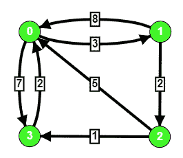

# 使用弗洛伊德沃肖尔算法

寻找任意两个节点之间的最短路径

> 原文:[https://www . geeksforgeeks . org/find-任意两个节点之间的最短路径-使用-floyd-warshall-algorithm/](https://www.geeksforgeeks.org/finding-shortest-path-between-any-two-nodes-using-floyd-warshall-algorithm/)

给定一个**图**和两个节点 **u** 和 **v** ，任务是使用[弗洛伊德·沃肖尔算法](https://www.geeksforgeeks.org/dynamic-programming-set-16-floyd-warshall-algorithm/)打印 u 和 v 之间的最短路径。

**示例:**

> **输入:** u = 1，v = 3
> 
> 
> 
> **输出:** 1 - > 2 - > 3
> **说明:**
> 从 1 到 3 的最短路径是通过顶点 2，总代价为 3。
> 第一条边为 1 - > 2，成本为 2，第二条边为 2 - > 3，成本为 1。
> 
> **输入:** u = 0，v = 2
> 
> 
> 
> **输出:** 0 - > 1 - > 2
> **说明:**
> 从 0 到 2 的最短路径是通过顶点 1，总成本= 5

**进场:**

*   这里的主要思想是使用一个矩阵(2D 阵列)，如果任何一对节点的最短路径发生变化，该矩阵将跟踪下一个节点。最初，任意两个节点 u 和 v 之间的最短路径是 v(即从 u -> v 开始的直接边)。

*   初始化**下一个**数组

> 如果路径存在于两个节点之间，则 **Next[u][v] = v**
> 否则我们设置 **Next[u][v] = -1**

*   弗洛伊德·沃肖尔算法的改进

> 在 Floyd Warshall 算法的 **if 条件中，我们将添加一条语句 Next[i][j] = Next[i][k]
> (这意味着我们找到了 I，j 之间通过中间节点 k 的最短路径)。**

*   这就是我们的 **if 条件**的样子

```
if(dis[i][j] > dis[i][k] + dis[k][j])
{
    dis[i][j] = dis[i][k] + dis[k][j];
    Next[i][j] = Next[i][k];    
}
```

*   为了使用这些节点构建路径，我们将简单地开始循环通过节点 **u** ，同时将其值更新为下一个【u】【v】，直到我们到达节点 **v** 。

```
path = [u]
while u != v:
    u = Next[u][v]
    path.append(u)
```

下面是上述方法的实现。

## C++

```
// C++ program to find the shortest
// path between any two nodes using
// Floyd Warshall Algorithm.
#include <bits/stdc++.h>
using namespace std;

#define MAXN 100
// Infinite value for array
const int INF = 1e7;

int dis[MAXN][MAXN];
int Next[MAXN][MAXN];

// Initializing the distance and
// Next array
void initialise(int V,
                vector<vector<int> >& graph)
{
    for (int i = 0; i < V; i++) {
        for (int j = 0; j < V; j++) {
            dis[i][j] = graph[i][j];

            // No edge between node
            // i and j
            if (graph[i][j] == INF)
                Next[i][j] = -1;
            else
                Next[i][j] = j;
        }
    }
}

// Function construct the shortest
// path between u and v
vector<int> constructPath(int u,
                        int v)
{
    // If there's no path between
    // node u and v, simply return
    // an empty array
    if (Next[u][v] == -1)
        return {};

    // Storing the path in a vector
    vector<int> path = { u };
    while (u != v) {
        u = Next[u][v];
        path.push_back(u);
    }
    return path;
}

// Standard Floyd Warshall Algorithm
// with little modification Now if we find
// that dis[i][j] > dis[i][k] + dis[k][j]
// then we modify next[i][j] = next[i][k]
void floydWarshall(int V)
{
    for (int k = 0; k < V; k++) {
        for (int i = 0; i < V; i++) {
            for (int j = 0; j < V; j++) {

                // We cannot travel through
                // edge that doesn't exist
                if (dis[i][k] == INF
                    || dis[k][j] == INF)
                    continue;

                if (dis[i][j] > dis[i][k]
                                    + dis[k][j]) {
                    dis[i][j] = dis[i][k]
                                + dis[k][j];
                    Next[i][j] = Next[i][k];
                }
            }
        }
    }
}

// Print the shortest path
void printPath(vector<int>& path)
{
    int n = path.size();
    for (int i = 0; i < n - 1; i++)
        cout << path[i] << " -> ";
    cout << path[n - 1] << endl;
}

// Driver code
int main()
{

    int V = 4;
    vector<vector<int> > graph
        = { { 0, 3, INF, 7 },
            { 8, 0, 2, INF },
            { 5, INF, 0, 1 },
            { 2, INF, INF, 0 } };

    // Function to initialise the
    // distance and Next array
    initialise(V, graph);

    // Calling Floyd Warshall Algorithm,
    // this will update the shortest
    // distance as well as Next array
    floydWarshall(V);
    vector<int> path;

    // Path from node 1 to 3
    cout << "Shortest path from 1 to 3: ";
    path = constructPath(1, 3);
    printPath(path);

    // Path from node 0 to 2
    cout << "Shortest path from 0 to 2: ";
    path = constructPath(0, 2);
    printPath(path);

    // path from node 3 to 2
    cout << "Shortest path from 3 to 2: ";
    path = constructPath(3, 2);
    printPath(path);

    return 0;
}
```

## Java 语言(一种计算机语言，尤用于创建网站)

```
// Java program to find the shortest
// path between any two nodes using
// Floyd Warshall Algorithm.
import java.util.*;

class GFG{

static final int MAXN = 100;

// Infinite value for array
static int INF = (int) 1e7;

static int [][]dis = new int[MAXN][MAXN];
static int [][]Next = new int[MAXN][MAXN];

// Initializing the distance and
// Next array
static void initialise(int V,
                    int [][] graph)
{
    for(int i = 0; i < V; i++)
    {
    for(int j = 0; j < V; j++)
    {
        dis[i][j] = graph[i][j];

        // No edge between node
        // i and j
        if (graph[i][j] == INF)
            Next[i][j] = -1;
        else
            Next[i][j] = j;
    }
    }
}

// Function construct the shortest
// path between u and v
static Vector<Integer> constructPath(int u,
                                    int v)
{

    // If there's no path between
    // node u and v, simply return
    // an empty array
    if (Next[u][v] == -1)
        return null;

    // Storing the path in a vector
    Vector<Integer> path = new Vector<Integer>();
    path.add(u);

    while (u != v)
    {
        u = Next[u][v];
        path.add(u);
    }
    return path;
}

// Standard Floyd Warshall Algorithm
// with little modification Now if we find
// that dis[i][j] > dis[i][k] + dis[k][j]
// then we modify next[i][j] = next[i][k]
static void floydWarshall(int V)
{
    for(int k = 0; k < V; k++)
    {
    for(int i = 0; i < V; i++)
    {
        for(int j = 0; j < V; j++)
        {

            // We cannot travel through
            // edge that doesn't exist
            if (dis[i][k] == INF ||
                dis[k][j] == INF)
                continue;

            if (dis[i][j] > dis[i][k] +
                            dis[k][j])
            {
                dis[i][j] = dis[i][k] +
                            dis[k][j];
                Next[i][j] = Next[i][k];
            }
        }
    }
    }
}

// Print the shortest path
static void printPath(Vector<Integer> path)
{
    int n = path.size();
    for(int i = 0; i < n - 1; i++)
    System.out.print(path.get(i) + " -> ");
    System.out.print(path.get(n - 1) + "\n");
}

// Driver code
public static void main(String[] args)
{
    int V = 4;
    int [][] graph = { { 0, 3, INF, 7 },
                    { 8, 0, 2, INF },
                    { 5, INF, 0, 1 },
                    { 2, INF, INF, 0 } };

    // Function to initialise the
    // distance and Next array
    initialise(V, graph);

    // Calling Floyd Warshall Algorithm,
    // this will update the shortest
    // distance as well as Next array
    floydWarshall(V);
    Vector<Integer> path;

    // Path from node 1 to 3
    System.out.print("Shortest path from 1 to 3: ");
    path = constructPath(1, 3);
    printPath(path);

    // Path from node 0 to 2
    System.out.print("Shortest path from 0 to 2: ");
    path = constructPath(0, 2);
    printPath(path);

    // Path from node 3 to 2
    System.out.print("Shortest path from 3 to 2: ");
    path = constructPath(3, 2);
    printPath(path);
}
}

// This code is contributed by Amit Katiyar
```

## 蟒蛇 3

```
# Python3 program to find the shortest
# path between any two nodes using
# Floyd Warshall Algorithm.

# Initializing the distance and
# Next array
def initialise(V):
    global dis, Next

    for i in range(V):
        for j in range(V):
            dis[i][j] = graph[i][j]

            # No edge between node
            # i and j
            if (graph[i][j] == INF):
                Next[i][j] = -1
            else:
                Next[i][j] = j

# Function construct the shortest
# path between u and v
def constructPath(u, v):
    global graph, Next

    # If there's no path between
    # node u and v, simply return
    # an empty array
    if (Next[u][v] == -1):
        return {}

    # Storing the path in a vector
    path = [u]
    while (u != v):
        u = Next[u][v]
        path.append(u)

    return path

# Standard Floyd Warshall Algorithm
# with little modification Now if we find
# that dis[i][j] > dis[i][k] + dis[k][j]
# then we modify next[i][j] = next[i][k]
def floydWarshall(V):
    global dist, Next
    for k in range(V):
        for i in range(V):
            for j in range(V):

                # We cannot travel through
                # edge that doesn't exist
                if (dis[i][k] == INF or dis[k][j] == INF):
                    continue
                if (dis[i][j] > dis[i][k] + dis[k][j]):
                    dis[i][j] = dis[i][k] + dis[k][j]
                    Next[i][j] = Next[i][k]

# Print the shortest path
def printPath(path):
    n = len(path)
    for i in range(n - 1):
        print(path[i], end=" -> ")
    print (path[n - 1])

# Driver code
if __name__ == '__main__':
    MAXM,INF = 100,10**7
    dis = [[-1 for i in range(MAXM)] for i in range(MAXM)]
    Next = [[-1 for i in range(MAXM)] for i in range(MAXM)]

    V = 4
    graph = [ [ 0, 3, INF, 7 ],
            [ 8, 0, 2, INF ],
            [ 5, INF, 0, 1 ],
            [ 2, INF, INF, 0 ] ]

    # Function to initialise the
    # distance and Next array
    initialise(V)

    # Calling Floyd Warshall Algorithm,
    # this will update the shortest
    # distance as well as Next array
    floydWarshall(V)
    path = []

    # Path from node 1 to 3
    print("Shortest path from 1 to 3: ", end = "")
    path = constructPath(1, 3)
    printPath(path)

    # Path from node 0 to 2
    print("Shortest path from 0 to 2: ", end = "")
    path = constructPath(0, 2)
    printPath(path)

    # Path from node 3 to 2
    print("Shortest path from 3 to 2: ", end = "")
    path = constructPath(3, 2)
    printPath(path)

    # This code is contributed by mohit kumar 29
```

## C#

```
// C# program to find the shortest
// path between any two nodes using
// Floyd Warshall Algorithm.
using System;
using System.Collections.Generic;

class GFG{

static readonly int MAXN = 100;

// Infinite value for array
static int INF = (int)1e7;

static int [,]dis = new int[MAXN, MAXN];
static int [,]Next = new int[MAXN, MAXN];

// Initializing the distance and
// Next array
static void initialise(int V,
                       int [,] graph)
{
    for(int i = 0; i < V; i++)
    {
        for(int j = 0; j < V; j++)
        {
            dis[i, j] = graph[i, j];

            // No edge between node
            // i and j
            if (graph[i, j] == INF)
                Next[i, j] = -1;
            else
                Next[i, j] = j;
        }
    }
}

// Function construct the shortest
// path between u and v
static List<int> constructPath(int u, int v)
{

    // If there's no path between
    // node u and v, simply return
    // an empty array
    if (Next[u, v] == -1)
        return null;

    // Storing the path in a vector
    List<int> path = new List<int>();
    path.Add(u);

    while (u != v)
    {
        u = Next[u, v];
        path.Add(u);
    }
    return path;
}

// Standard Floyd Warshall Algorithm
// with little modification Now if we find
// that dis[i,j] > dis[i,k] + dis[k,j]
// then we modify next[i,j] = next[i,k]
static void floydWarshall(int V)
{
    for(int k = 0; k < V; k++)
    {
        for(int i = 0; i < V; i++)
        {
            for(int j = 0; j < V; j++)
            {

                // We cannot travel through
                // edge that doesn't exist
                if (dis[i, k] == INF || 
                    dis[k, j] == INF)
                    continue;

                if (dis[i, j] > dis[i, k] +
                                dis[k, j])
                {
                    dis[i, j] = dis[i, k] + 
                                dis[k, j];
                    Next[i, j] = Next[i, k];
                }
            }
        }
    }
}

// Print the shortest path
static void printPath(List<int> path)
{
    int n = path.Count;

    for(int i = 0; i < n - 1; i++)
        Console.Write(path[i] + " -> ");

    Console.Write(path[n - 1] + "\n");
}

// Driver code
public static void Main(String[] args)
{
    int V = 4;
    int [,] graph = { { 0, 3, INF, 7 },
                      { 8, 0, 2, INF },
                      { 5, INF, 0, 1 },
                      { 2, INF, INF, 0 } };

    // Function to initialise the
    // distance and Next array
    initialise(V, graph);

    // Calling Floyd Warshall Algorithm,
    // this will update the shortest
    // distance as well as Next array
    floydWarshall(V);
    List<int> path;

    // Path from node 1 to 3
    Console.Write("Shortest path from 1 to 3: ");
    path = constructPath(1, 3);
    printPath(path);

    // Path from node 0 to 2
    Console.Write("Shortest path from 0 to 2: ");
    path = constructPath(0, 2);
    printPath(path);

    // Path from node 3 to 2
    Console.Write("Shortest path from 3 to 2: ");
    path = constructPath(3, 2);
    printPath(path);
}
}

// This code is contributed by Amit Katiyar
```

## java 描述语言

```
<script>

// Javascript program to find the shortest
// path between any two nodes using
// Floyd Warshall Algorithm.
let MAXN = 100;

// Infinite value for array
let INF =  1e7;
let dis = new Array(MAXN);
let Next = new Array(MAXN);
for(let i = 0; i < MAXN; i++)
{
    dis[i] = new Array(MAXN);
    Next[i] = new Array(MAXN);
}

// Initializing the distance and
// Next array
function initialise(V, graph)
{
    for(let i = 0; i < V; i++)
    {
        for(let j = 0; j < V; j++)
        {
            dis[i][j] = graph[i][j];

            // No edge between node
            // i and j
            if (graph[i][j] == INF)
                Next[i][j] = -1;
            else
                Next[i][j] = j;
        }
    }
}

// Function construct the shortest
// path between u and v
function constructPath(u, v)
{

    // If there's no path between
    // node u and v, simply return
    // an empty array
    if (Next[u][v] == -1)
        return null;

    // Storing the path in a vector
    let path = [];
    path.push(u);

    while (u != v)
    {
        u = Next[u][v];
        path.push(u);
    }
    return path;
}

// Standard Floyd Warshall Algorithm
// with little modification Now if we find
// that dis[i][j] > dis[i][k] + dis[k][j]
// then we modify next[i][j] = next[i][k]
function floydWarshall(V)
{
    for(let k = 0; k < V; k++)
    {
        for(let i = 0; i < V; i++)
        {
            for(let j = 0; j < V; j++)
            {

                // We cannot travel through
                // edge that doesn't exist
                if (dis[i][k] == INF ||
                    dis[k][j] == INF)
                    continue;

                if (dis[i][j] > dis[i][k] +
                                dis[k][j])
                {
                    dis[i][j] = dis[i][k] +
                                dis[k][j];
                    Next[i][j] = Next[i][k];
                }
            }
        }
    }
}

// Print the shortest path
function printPath(path)
{
    let n = path.length;
    for(let i = 0; i < n - 1; i++)
        document.write(path[i] + " -> ");

    document.write(path[n - 1] + "<br>");
}

// Driver code
let V = 4;
let graph = [ [ 0, 3, INF, 7 ],
              [ 8, 0, 2, INF ],
              [ 5, INF, 0, 1 ],
              [ 2, INF, INF, 0 ] ];

// Function to initialise the
// distance and Next array
initialise(V, graph);

// Calling Floyd Warshall Algorithm,
// this will update the shortest
// distance as well as Next array
floydWarshall(V);
let path;

// Path from node 1 to 3
document.write("Shortest path from 1 to 3: ");
path = constructPath(1, 3);
printPath(path);

// Path from node 0 to 2
document.write("Shortest path from 0 to 2: ");
path = constructPath(0, 2);
printPath(path);

// Path from node 3 to 2
document.write("Shortest path from 3 to 2: ");
path = constructPath(3, 2);
printPath(path);

// This code is contributed by unknown2108

</script>
```

**Output:** 

```
Shortest path from 1 to 3: 1 -> 2 -> 3
Shortest path from 0 to 2: 0 -> 1 -> 2
Shortest path from 3 to 2: 3 -> 0 -> 1 -> 2
```

**复杂度分析:**

*   Floyd Warshall 算法的时间复杂度为 **O(V <sup>3</sup> )**
*   对于寻找最短路径，每次查询的时间复杂度为 **O(V)** 。

**注意:**当您的图包含几百个顶点，并且您需要回答与最短路径相关的多个查询时，使用弗洛伊德·沃肖尔算法会很有效。