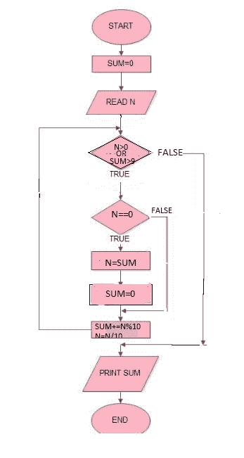

# 求一个数的位数的和，直到和变成一位数

> 原文:[https://www . geesforgeks . org/find-一个数字的数字总和-直到总和变成一位数/](https://www.geeksforgeeks.org/finding-sum-of-digits-of-a-number-until-sum-becomes-single-digit/)

给定一个数字 **n** ，我们需要求其位数的和，这样:

```
If n < 10    
    digSum(n) = n
Else         
    digSum(n) = Sum(digSum(n))
```

**示例:**

```
Input : 1234
Output : 1
Explanation : The sum of 1+2+3+4 = 10, 
              digSum(x) == 10
              Hence ans will be 1+0 = 1

Input : 5674
Output : 4 
```

一种**蛮力**方法是将所有数字相加，直到相加< 10。
T3】流程图:



下面是求和的蛮力程序。

## C++

```
// C++ program to find sum of
// digits of a number until
// sum becomes single digit.
#include<bits/stdc++.h>

using namespace std;

int digSum(int n)
{
    int sum = 0;

    // Loop to do sum while
    // sum is not less than
    // or equal to 9
    while(n > 0 || sum > 9)
    {
        if(n == 0)
        {
            n = sum;
            sum = 0;
        }
        sum += n % 10;
        n /= 10;
    }
    return sum;
}

// Driver program to test the above function
int main()
{
    int n = 1234;
    cout << digSum(n);
    return 0;
}
```

## Java 语言(一种计算机语言，尤用于创建网站)

```
// Java program to find sum of
// digits of a number until
// sum becomes single digit.
import java.util.*;

public class GfG {

    static int digSum(int n)
    {
        int sum = 0;

        // Loop to do sum while
        // sum is not less than
        // or equal to 9
        while (n > 0 || sum > 9)
        {
            if (n == 0) {
                n = sum;
                sum = 0;
            }
            sum += n % 10;
            n /= 10;
        }
        return sum;
    }

    // Driver code
    public static void main(String argc[])
    {
        int n = 1234;
        System.out.println(digSum(n));
    }
}

// This code is contributed by Gitanjali.
```

## 计算机编程语言

```
# Python program to find sum of
# digits of a number until
# sum becomes single digit.
import math

# method to find sum of digits
# of a number until sum becomes
# single digit
def digSum( n):
    sum = 0

    while(n > 0 or sum > 9):

        if(n == 0):
            n = sum
            sum = 0

        sum += n % 10
        n /= 10

    return sum

# Driver method
n = 1234
print (digSum(n))

# This code is contributed by Gitanjali.
```

## C#

```
// C# program to find sum of
// digits of a number until
// sum becomes single digit.
using System;

class GFG {

    static int digSum(int n)
    {
        int sum = 0;

        // Loop to do sum while
        // sum is not less than
        // or equal to 9
        while (n > 0 || sum > 9)
        {
            if (n == 0)
            {
                n = sum;
                sum = 0;
            }
            sum += n % 10;
            n /= 10;
        }
        return sum;
    }

    // Driver code
    public static void Main()
    {
        int n = 1234;
        Console.Write(digSum(n));
    }
}

// This code is contributed by nitin mittal
```

## 服务器端编程语言（Professional Hypertext Preprocessor 的缩写）

```
<?php
// PHP program to find sum of
// digits of a number until
// sum becomes single digit.

function digSum( $n)
{
    $sum = 0;

    // Loop to do sum while
    // sum is not less than
    // or equal to 9
    while($n > 0 || $sum > 9)
    {
        if($n == 0)
        {
            $n = $sum;
            $sum = 0;
        }
        $sum += $n % 10;
        $n = (int)$n / 10;
    }
    return $sum;
}

// Driver Code
$n = 1234;
echo digSum($n);

// This code is contributed
// by aj_36
?>
```

## java 描述语言

```
<script>
// Javascript program to find sum of
// digits of a number until
// sum becomes single digit.
    let n = 1234;
    //Function to get sum of digits
    function getSum(n) {
        let sum = 0;
        while (n > 0 || sum > 9) {
             if(n == 0) {
                n = sum;
                sum = 0;
             }
             sum = sum + n % 10;
             n = Math.floor(n / 10);
        }
        return sum;
    }
 //function call  
    document.write(getSum(n));

//This code is contributed by Surbhi Tyagi
</script>
```

**输出:**

```
1
```

对此也有一个**简单而优雅的 O(1)解**。ans 简单地由下式给出

```
If n == 0
   return 0;

If n % 9 == 0      
    digSum(n) = 9
Else               
    digSum(n) = n % 9 
```

**以上逻辑是如何工作的？**
如果一个数 n 能被 9 整除，那么它的数字之和直到和变成个位数都是 9。例如
Let，n = 2880
位数之和= 2 + 8 + 8 = 18: 18 = 1 + 8 = 9
一个数字可以是 9x 或 9x + k 的形式，对于第一种情况，答案总是 9。对于第二种情况，并且总是 k。

下面是上述想法的实现:

## C++

```
#include<bits/stdc++.h>
using namespace std;

int digSum(int n)
{
    if (n == 0)
       return 0;
    return (n % 9 == 0) ? 9 : (n % 9);
}

// Driver program to test the above function
int main()
{
    int n = 9999;
    cout<<digSum(n);
    return 0;
}
```

## Java 语言(一种计算机语言，尤用于创建网站)

```
import java.io.*;

class GFG {

    static int digSum(int n)
    {
        if (n == 0)
        return 0;
        return (n % 9 == 0) ? 9 : (n % 9);
    }

    // Driver program to test the above function
    public static void main (String[] args)
    {
        int n = 9999;
        System.out.println(digSum(n));
    }
}

// This code is contributed by anuj_67.
```

## 蟒蛇 3

```
def digSum(n):

    if (n == 0):
        return 0
    if (n % 9 == 0):
        return 9
    else:
       return (n % 9)

# Driver program to test the above function
n = 9999
print(digSum(n))

# This code is contributed by
# Smitha Dinesh Semwal
```

## C#

```
using System;

class GFG
{
    static int digSum(int n)
    {
        if (n == 0)
        return 0;
        return (n % 9 == 0) ? 9 : (n % 9);
    }

    // Driver Code
    public static void Main ()
    {
        int n = 9999;
        Console.Write(digSum(n));

    }
}

// This code is contributed by aj_36
```

## 服务器端编程语言（Professional Hypertext Preprocessor 的缩写）

```
<?php

function digSum($n)
{
    if ($n == 0)
        return 0;
    return ($n % 9 == 0) ? 9 : ($n % 9);
}

// Driver program to test the above function
$n = 9999;
echo digSum($n);

//This code is contributed by anuj_67.
?>
```

## java 描述语言

```
<script>

function digSum(n)
{
    if (n == 0)
        return 0;

    return (n % 9 == 0) ? 9 : (n % 9);
}

// Driver code
n = 9999;
document.write(digSum(n));

// This code is contributed by code_hunt

</script>
```

**输出:**

```
9
```

**相关帖子:**
[https://www . geeksforgeeks . org/digital-root repeated-digital-sum-given-integer/](https://www.geeksforgeeks.org/digital-rootrepeated-digital-sum-given-integer/)

本文由 [**阿育什·坎德里**](https://in.linkedin.com/in/ayush-khanduri-b4ab87106) 供稿。如果你喜欢 GeeksforGeeks 并想投稿，你也可以使用[write.geeksforgeeks.org](https://write.geeksforgeeks.org)写一篇文章或者把你的文章邮寄到 review-team@geeksforgeeks.org。看到你的文章出现在极客博客主页上，帮助其他极客。
如果发现有不正确的地方，或者想分享更多关于上述话题的信息，请写评论。