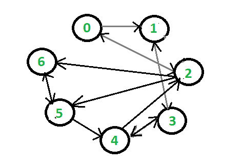
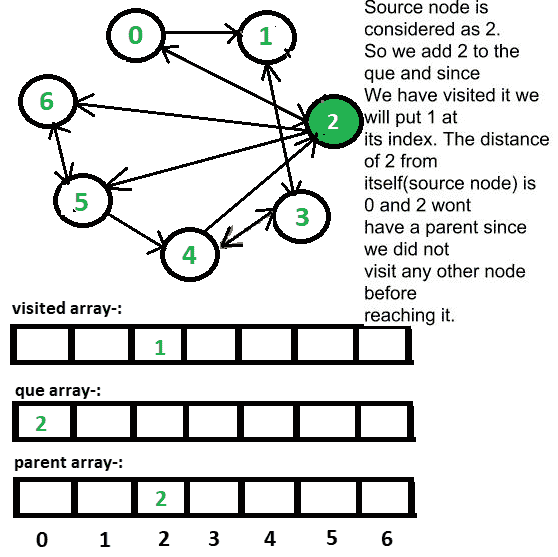
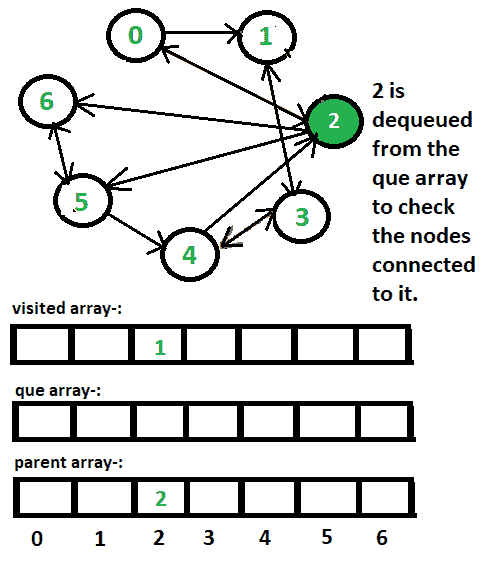
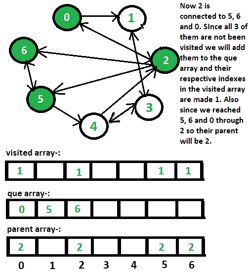
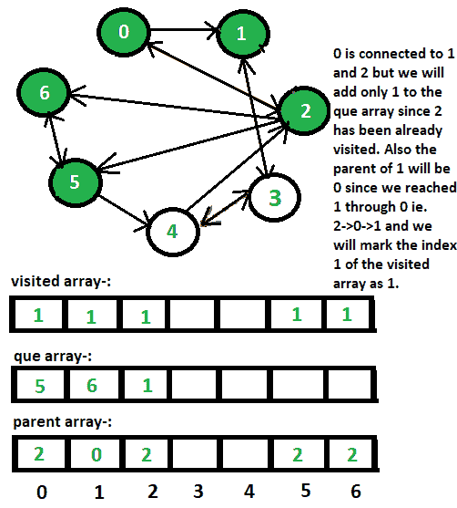
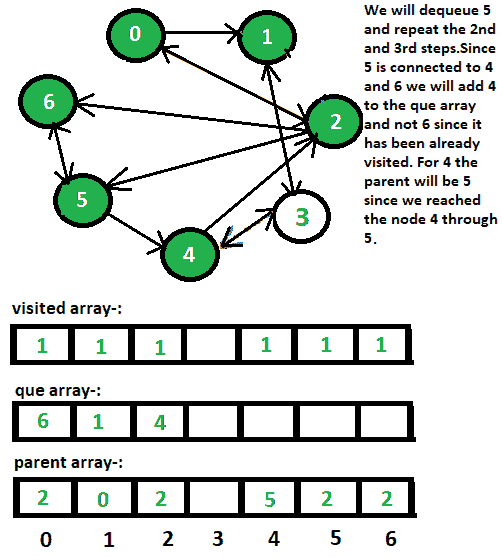
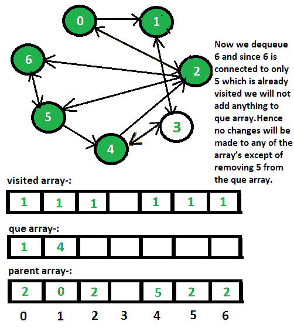
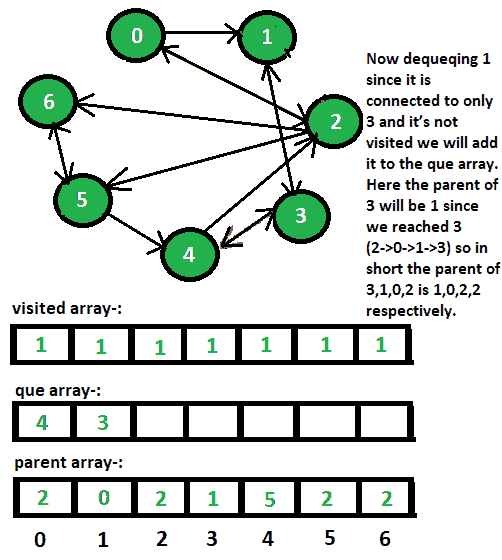
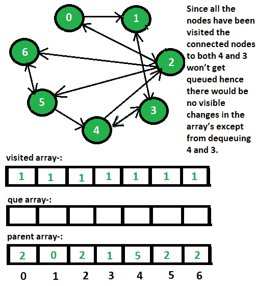

# 使用 BFS 找到从一个顶点到静止的路径

> 原文:[https://www . geesforgeks . org/find-路径-从一个顶点到静止-使用-bfs/](https://www.geeksforgeeks.org/finding-the-path-from-one-vertex-to-rest-using-bfs/)

给定有向图的邻接表表示，任务是使用 [BFS](https://www.geeksforgeeks.org/breadth-first-traversal-for-a-graph/) 找到从源到图中每个其他节点的路径。
**例:**

```
Input:
```



```
Output:
0 <- 2
1 <- 0 <- 2
2
3 <- 1 <- 0 <- 2
4 <- 5 <- 2
5 <- 2
6 <- 2
```

**进场:**下图中:

*   **que【】**数组存储到达的顶点，只有当一个顶点没有被访问时，我们才会**将它入队**,一旦考虑了它的所有子节点，我们就会**将它出队**。
*   为了区分该节点是否被访问过，我们将把 **1** 放在相应索引处的**已访问【】**数组中，以表示它已经被访问过，如果在给定索引处 **0** 存在，则表示它没有被访问过。
*   父数组是存储每个顶点的父节点。为了前任。如果 0 连接到 2，2 将是 0 的父节点，我们将把 2 放在父数组的索引 0 处。

















以下是上述方法的实现:

## C++14

```
// C++ implementation of the approach
#include <bits/stdc++.h>
using namespace std;

// Function to print the path from
// source (s) to destination (d)
void print(vector<int> parent, int s, int d)
{

  // The while loop will stop only when the
  // destination and the source node become equal
  while (s != d)
  {

      // Print the destination and store the parent
      // of the node in the destination since parent
      // stores the node through which
      // the current node has been reached
      cout << d << " <- ";
      d = parent[d];
  }
  cout << d << endl;
}

// Finding Path using BFS ALgorithm
void bfs(vector<vector<int> > adjList, int source, int n)
{
    vector<int> parent(n, 0);
    vector<int> que(n, 0);

    int front = -1, rear = -1;
    vector<int> visited(n, 0);

    //Arrays.fill(visited, 0);
    visited = 1;
    parent = source;

    // To add any non visited node we will increment the rear
    // and add that vertex to the end of the array (enqueuing)
    que[++rear] = source;
    int k;

    // The loop will continue till the rear and front are equal
    while (front != rear)
    {

        // Here Dequeuing is nothing but to increment the front int
        k = que[++front];

        //L<Integer> list = adjList.get(k);
        for (int j:adjList[k])
        {
            if (visited[j] == 0)
            {
                que[++rear] = j;
                visited[j] = 1;
                parent[j] = k;
            }
        }
    }

    // Print the path from source to every other node
    for (k = 0; k < n; k++)
        print(parent, source, k);
}

// Driver code
int main()
{

    // Adjacency list representation of the graph
    vector<vector<int> > adjList;

    // Vertices 1 and 2 have an incoming edge
    // from vertex 0
    adjList.push_back({1, 2});

    // Vertex 3 has an incoming edge
    // from vertex 1
    adjList.push_back({3});

    // Vertices 0, 5 and 6 have an incoming
    // edge from vertex 2
    adjList.push_back({0, 5, 6});

    // Vertices 1 and 4 have an incoming edge
    // from vertex 3
    adjList.push_back({1, 4});

    // Vertices 2 and 3 have an incoming edge
    // from vertex 4
    adjList.push_back({2, 3});

    // Vertices 4 and 6 have an incoming edge
    // from vertex 5
    adjList.push_back({4, 6});

    // Vertex 5 has an incoming edge
    // from vertex 6
    adjList.push_back({5});
    int n = adjList.size();
    int source = 2;
    bfs(adjList, source, n);
}

// This code is contributed by mohit kumar 29.
```

## Java 语言(一种计算机语言，尤用于创建网站)

```
// Java implementation of the approach
import java.util.ArrayList;
import java.util.Arrays;
import java.util.List;

class GFG
{

    // Function to print the path from
    // source (s) to destination (d)
    static void print(int parent[], int s, int d)
    {
        // The while loop will stop only when the
        // destination and the source node become equal
        while (s != d) {

            // Print the destination and store the parent
            // of the node in the destination since parent
            // stores the node through which
            // the current node has been reached
            System.out.print(d + " <- ");
            d = parent[d];
        }

        System.out.println(d);
    }

    // Finding Path using BFS ALgorithm
    static void bfs(List<List<Integer> > adjList, int source, int n)
    {
        int parent[] = new int[n];
        int que[] = new int[n];
        Arrays.fill(parent, 0);
        Arrays.fill(que, 0);

        int front = -1, rear = -1;
        int visited[] = new int[n];
        Arrays.fill(visited, 0);
        visited = 1;
        parent = source;

        // To add any non visited node we will increment the rear
        // and add that vertex to the end of the array (enqueuing)
        que[++rear] = source;

        int k;

        // The loop will continue till the rear and front are equal
        while (front != rear) {

            // Here Dequeuing is nothing but to increment the front int
            k = que[++front];
            List<Integer> list = adjList.get(k);
            for (int i = 0; i < list.size(); i++) {
                int j = list.get(i);
                if (visited[j] == 0) {
                    que[++rear] = j;
                    visited[j] = 1;
                    parent[j] = k;
                }
            }
        }

        // Print the path from source to every other node
        for (k = 0; k < n; k++)
            print(parent, source, k);
    }

    // Driver code
    public static void main(String args[])
    {

        // Adjacency list representation of the graph
        List<List<Integer> > adjList = new ArrayList<>();

        // Vertices 1 and 2 have an incoming edge
        // from vertex 0
        List<Integer> tmp = new ArrayList<Integer>(Arrays.asList(1, 2));
        adjList.add(tmp);

        // Vertex 3 has an incoming edge from vertex 1
        tmp = new ArrayList<Integer>(Arrays.asList(3));
        adjList.add(tmp);

        // Vertices 0, 5 and 6 have an incoming
        // edge from vertex 2
        tmp = new ArrayList<Integer>(Arrays.asList(0, 5, 6));
        adjList.add(tmp);

        // Vertices 1 and 4 have an incoming edge
        // from vertex 3
        tmp = new ArrayList<Integer>(Arrays.asList(1, 4));
        adjList.add(tmp);

        // Vertices 2 and 3 have an incoming edge
        // from vertex 4
        tmp = new ArrayList<Integer>(Arrays.asList(2, 3));
        adjList.add(tmp);

        // Vertices 4 and 6 have an incoming edge
        // from vertex 5
        tmp = new ArrayList<Integer>(Arrays.asList(4, 6));
        adjList.add(tmp);

        // Vertex 5 has an incoming edge from vertex 6
        tmp = new ArrayList<Integer>(Arrays.asList(5));
        adjList.add(tmp);

        int n = adjList.size();

        int source = 2;
        bfs(adjList, source, n);
    }
}
```

## 蟒蛇 3

```
# Python3 implementation of the approach

# Function to print the path from
# src (s) to destination (d)
def printfunc(parent, s, d):

    # The while loop will stop only when
    # the destination and the src node
    # become equal
    while s != d:

        # Print the destination and store
        # the parent of the node in the
        # destination since parent stores
        # the node through which the current
        # node has been reached
        print(str(d) + " <-", end = " ")
        d = parent[d]

    print(d)

# Finding Path using BFS ALgorithm
def bfs(adjList, src, n):

    parent = [0] * (n)
    que = [0] * (n)

    front, rear = -1, -1
    visited = [0] * (n)
    visited[src] = 1
    parent[src] = src

    # To add any non visited node we will
    # increment the rear and add that vertex
    # to the end of the array (enqueuing)
    rear += 1
    que[rear] = src

    # The loop will continue till the rear
    # and front are equal
    while front != rear:

        # Here Dequeuing is nothing but to
        # increment the front int
        front += 1
        k = que[front]
        List = adjList[k]
        for i in range(0, len(List)):
            j = List[i]

            if visited[j] == 0:
                rear += 1
                que[rear] = j
                visited[j] = 1
                parent[j] = k

    # Print the path from src to every
    # other node
    for k in range(0, n):
        printfunc(parent, src, k)

# Driver code
if __name__ == "__main__":

    # Adjacency list representation
    # of the graph
    adjList = []

    # Vertices 1 and 2 have an incoming edge
    # from vertex 0
    adjList.append([1, 2])

    # Vertex 3 has an incoming edge
    # from vertex 1
    adjList.append([3])

    # Vertices 0, 5 and 6 have an incoming
    # edge from vertex 2
    adjList.append([0, 5, 6])

    # Vertices 1 and 4 have an incoming edge
    # from vertex 3
    adjList.append([1, 4])

    # Vertices 2 and 3 have an incoming edge
    # from vertex 4
    adjList.append([2, 3])

    # Vertices 4 and 6 have an incoming edge
    # from vertex 5
    adjList.append([4, 6])

    # Vertex 5 has an incoming edge
    # from vertex 6
    adjList.append([5])

    n = len(adjList)

    src = 2
    bfs(adjList, src, n)

# This code is contributed by Rituraj Jain
```

## java 描述语言

```
<script>

// JavaScript implementation of the approach

    // Function to print the path from
    // source (s) to destination (d)
    function print(parent,s,d)
    {
        // The while loop will stop only when the
        // destination and the source node become equal
        while (s != d) {

            // Print the destination and store the parent
            // of the node in the destination since parent
            // stores the node through which
            // the current node has been reached
            document.write(d + " <- ");
            d = parent[d];
        }

        document.write(d+"<br>");
    }

    // Finding Path using BFS ALgorithm
    function bfs( adjList,source,n)
    {
        let parent = new Array(n);
        let que = new Array(n);
        for(let i=0;i<n;i++)
        {
            parent[i]=0;
            que[i]=0;
        }

        let front = -1, rear = -1;
        let visited = new Array(n);
        for(let i=0;i<n;i++)
        {
            visited[i]=0;
        }
        visited = 1;
        parent = source;

        // To add any non visited node we will increment the rear
        // and add that vertex to the end of the array (enqueuing)
        que[++rear] = source;

        let k;

        // The loop will continue till the rear
        // and front are equal
        while (front != rear) {

            // Here Dequeuing is nothing but
            // to increment the front int
            k = que[++front];
            let list = adjList[k];
            for (let i = 0; i < list.length; i++) {
                let j = list[i];
                if (visited[j] == 0) {
                    que[++rear] = j;
                    visited[j] = 1;
                    parent[j] = k;
                }
            }
        }

        // Print the path from source to every other node
        for (k = 0; k < n; k++)
            print(parent, source, k);
    }

     // Driver code

    // Adjacency list representation of the graph
        let adjList = [];

        // Vertices 1 and 2 have an incoming edge
        // from vertex 0
        adjList.push([1, 2])

        // Vertex 3 has an incoming edge from vertex 1
        adjList.push([3])

        // Vertices 0, 5 and 6 have an incoming
        // edge from vertex 2
        adjList.push([0, 5, 6])

        // Vertices 1 and 4 have an incoming edge
        // from vertex 3
        adjList.push([1, 4])

        // Vertices 2 and 3 have an incoming edge
        // from vertex 4
        adjList.push([2, 3])

        // Vertices 4 and 6 have an incoming edge
        // from vertex 5
        adjList.push([4, 6])

        // Vertex 5 has an incoming edge from vertex 6
        adjList.push([5])

        let n = adjList.length;

        let source = 2;
        bfs(adjList, source, n);

// This code is contributed by unknown2108

</script>
```

**Output:** 

```
0 <- 2
1 <- 0 <- 2
2
3 <- 1 <- 0 <- 2
4 <- 5 <- 2
5 <- 2
6 <- 2
```

**时间复杂度** : O(V + E)，其中 V 和 E 分别是图中的顶点数和边数。
**辅助空间** : O(V + E)。