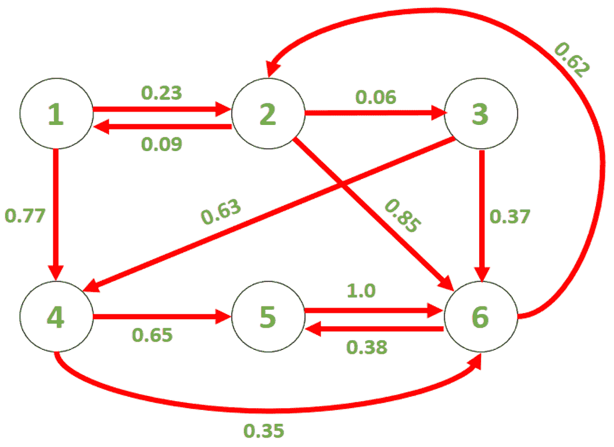

# 在马尔可夫链中找到给定时间的状态概率|集合 2

> 原文:[https://www . geeksforgeeks . org/find-马尔可夫链中给定时间的状态概率集-2/](https://www.geeksforgeeks.org/finding-the-probability-of-a-state-at-a-given-time-in-a-markov-chain-set-2/)

给定一个马氏链 G，如果我们在时间 t = 0 从状态 S 开始，我们可以找到在时间 t = T 到达状态 F 的概率。
马尔可夫链是一个随机过程，由各种状态和从一种状态移动到另一种状态的概率组成。我们可以用有向图来表示它，其中节点代表状态，边代表从一个节点到另一个节点的概率。从一个节点移动到另一个节点需要单位时间。每个节点的输出边的相关概率之和为 1。
考虑给定的马尔可夫链(G)，如下图所示:



**示例** :

```
Input : S = 1, F = 2, T = 1
Output: 0.23
We start at state 1 at t = 0, 
so there is a probability of 0.23 
that we reach state 2 at t = 1.

Input: S = 4, F = 2, T = 100
Output: 0.284992
```

在[之前的文章](https://www.geeksforgeeks.org/find-the-probability-of-a-state-at-a-given-time-in-a-markov-chain-set-1/)中，讨论了时间复杂度为 O(N <sup>2</sup> T)的动态规划方法，其中 N 是状态数。
**矩阵求幂法**:我们可以为马尔可夫链建立一个邻接矩阵来表示状态之间的转移概率。例如，上面给出的图的邻接矩阵是:

![\[ M= \left[ {\begin{array}{cccccc} 0 & 0.09 & 0 & 0 & 0 & 0 \\ 0.23 & 0 & 0 & 0 & 0 & 0.62 \\ 0 & 0.06 & 0 & 0 & 0 & 0 \\ 0.77 & 0 & 0.63 & 0 & 0 & 0 \\ 0 & 0 & 0 & 0.65 & 0 & 0.38 \\ 0 & 0.85 & 0.37 & 0.35 & 1.0 & 0 \\ \end{array} } \right] \]    ](img/754c0514408f8d11af5e1b9d25fe1fb4.png "Rendered by QuickLaTeX.com")

我们可以观察到，时间 t 的概率分布由**P(t)= M * P(t–1)**给出，初始概率分布 P(0)是一个零向量，S <sup>第</sup>个元素为 1。利用这些结果，我们可以求出 P(t)的递归表达式。例如，如果我们假设 S 为 3，那么 P(t)由下式给出:

![\[ P(t)= M^t \left[ {\begin{array}{c} 0 \\ 0 \\ 1 \\ 0 \\ 0 \\ 0 \\ \end{array} } \right] \]    ](img/3a117012a83475adda870c2480d12fdd.png "Rendered by QuickLaTeX.com")

如果我们使用有效的矩阵求幂技术，那么这种方法的时间复杂度是 O(N <sup>3</sup> * log T)。如果 T 的值明显高于状态数，即 n
，则该方法的性能优于动态规划方法。以下是上述方法的实现:

## C++

```
// C++ implementation of the above approach
#include <bits/stdc++.h>
using namespace std;

// Macro to define a vector of float
#define vf vector<float>

// Function to multiply two matrices A and B
vector<vf > multiply(vector<vf > A,    vector<vf > B, int N)
{
    vector<vf > C(N, vf(N, 0));
    for (int i = 0; i < N; ++i)
        for (int j = 0; j < N; ++j)
            for (int k = 0; k < N; ++k)
                C[i][j] += A[i][k] * B[k][j];
    return C;
}

// Function to calculate the power of a matrix
vector<vf > matrix_power(vector<vf > M, int p, int n)
{
    vector<vf > A(n, vf(n, 0));
    for (int i = 0; i < n; ++i)
        A[i][i] = 1;

    while (p) {
        if (p % 2)
            A = multiply(A, M, n);
        M = multiply(M, M, n);
        p /= 2;
    }

    return A;
}

// Function to calculate the probability of
// reaching F at time T after starting from S
float findProbability(vector<vf > M, int N, int F,
                                        int S, int T)
{
    // Storing M^T in MT
    vector<vf > MT = matrix_power(M, T, N);

    // Returning the answer
    return MT[F - 1][S - 1];
}

// Driver code
int main()
{
    // Adjacency matrix
    // The edges have been stored in the row
    // corresponding to their end-point
    vector<vf > G{ { 0, 0.09, 0, 0, 0, 0 },
                   { 0.23, 0, 0, 0, 0, 0.62 },
                   { 0, 0.06, 0, 0, 0, 0 },
                   { 0.77, 0, 0.63, 0, 0, 0 },
                   { 0, 0, 0, 0.65, 0, 0.38 },
                   { 0, 0.85, 0.37, 0.35, 1.0, 0 }};

    // N is the number of states
    int N = 6;

    int S = 4, F = 2, T = 100;

    cout << "The probability of reaching " << F << " at time "
                << T << "\nafter starting from " << S << " is "
                << findProbability(G, N, F, S, T);

    return 0;
}
```

## Java 语言(一种计算机语言，尤用于创建网站)

```
// Java implementation of the above approach
class GFG
{

    // Function to multiply two matrices A and B
    static double[][] multiply(double[][] A,
            double[][] B, int N)
    {
        double[][] C = new double[N][N];
        for (int i = 0; i < N; ++i)
            for (int j = 0; j < N; ++j)
                for (int k = 0; k < N; ++k)
                    C[i][j] += A[i][k] * B[k][j];
        return C;
    }

    // Function to calculate the power of a matrix
    static double[][] matrix_power(double[][] M, int p, int n)
    {
        double[][] A = new double[n][n];
        for (int i = 0; i < n; ++i)
            A[i][i] = 1;

        while (p > 0)
        {
            if (p % 2 == 1)
                A = multiply(A, M, n);
            M = multiply(M, M, n);
            p /= 2;
        }
        return A;
    }

    // Function to calculate the probability of
    // reaching F at time T after starting from S
    static double findProbability(double[][] M,
                    int N, int F, int S, int T)
    {
        // Storing M^T in MT
        double[][] MT = matrix_power(M, T, N);

        // Returning the answer
        return MT[F - 1][S - 1];
    }

    // Driver code
    public static void main(String[] args)
    {
        // Adjacency matrix
        // The edges have been stored in the row
        // corresponding to their end-point
        double[][] G = { { 0, 0.09, 0, 0, 0, 0 },
                        { 0.23, 0, 0, 0, 0, 0.62 },
                        { 0, 0.06, 0, 0, 0, 0 },
                        { 0.77, 0, 0.63, 0, 0, 0 },
                        { 0, 0, 0, 0.65, 0, 0.38 },
                        { 0, 0.85, 0.37, 0.35, 1.0, 0 } };

        // N is the number of states
        int N = 6;

        int S = 4, F = 2, T = 100;

        System.out.printf(
                "The probability of reaching " + F +
                " at time " + T + "\nafter starting from " +
                        S + " is %f",
                findProbability(G, N, F, S, T));
    }
}

// This code is contributed by Rajput-Ji
```

## 蟒蛇 3

```
# Python implementation of the above approach
from typing import List

# Function to multiply two matrices A and B
def multiply(A: List[List[float]], B: List[List[float]],
             N: int) -> List[List[float]]:
    C = [[0 for _ in range(N)] for _ in range(N)]
    for i in range(N):
        for j in range(N):
            for k in range(N):
                C[i][j] += A[i][k] * B[k][j]
    return C

# Function to calculate the power of a matrix
def matrix_power(M: List[List[float]], p: int, n: int) -> List[List[float]]:
    A = [[0 for _ in range(n)] for _ in range(n)]
    for i in range(n):
        A[i][i] = 1
    while (p):
        if (p % 2):
            A = multiply(A, M, n)
        M = multiply(M, M, n)
        p //= 2
    return A

# Function to calculate the probability of
# reaching F at time T after starting from S
def findProbability(M: List[List[float]], N: int, F: int, S: int,
                    T: int) -> float:

    # Storing M^T in MT
    MT = matrix_power(M, T, N)

    # Returning the answer
    return MT[F - 1][S - 1]

# Driver code
if __name__ == "__main__":

    # Adjacency matrix
    # The edges have been stored in the row
    # corresponding to their end-point
    G = [[0, 0.09, 0, 0, 0, 0], [0.23, 0, 0, 0, 0, 0.62],
         [0, 0.06, 0, 0, 0, 0], [0.77, 0, 0.63, 0, 0, 0],
         [0, 0, 0, 0.65, 0, 0.38], [0, 0.85, 0.37, 0.35, 1.0, 0]]

    # N is the number of states
    N = 6
    S = 4
    F = 2
    T = 100

    print(
        "The probability of reaching {} at time {}\nafter starting from {} is {}\n"
        .format(F, T, S, findProbability(G, N, F, S, T)))

# This code is contributed by sanjeev2552
```

## C#

```
// C# implementation of the above approach
using System;

class GFG
{

    // Function to multiply two matrices A and B
    static double[,] multiply(double[,] A,
                            double[,] B, int N)
    {
        double[,] C = new double[N, N];
        for (int i = 0; i < N; ++i)
            for (int j = 0; j < N; ++j)
                for (int k = 0; k < N; ++k)
                    C[i, j] += A[i, k] * B[k, j];
        return C;
    }

    // Function to calculate the power of a matrix
    static double[,] matrix_power(double[,] M, int p, int n)
    {
        double[,] A = new double[n,n];
        for (int i = 0; i < n; ++i)
            A[i, i] = 1;

        while (p > 0)
        {
            if (p % 2 == 1)
                A = multiply(A, M, n);
            M = multiply(M, M, n);
            p /= 2;
        }
        return A;
    }

    // Function to calculate the probability of
    // reaching F at time T after starting from S
    static double findProbability(double[,] M,
                    int N, int F, int S, int T)
    {
        // Storing M^T in MT
        double[,] MT = matrix_power(M, T, N);

        // Returning the answer
        return MT[F - 1, S - 1];
    }

    // Driver code
    public static void Main(String[] args)
    {
        // Adjacency matrix
        // The edges have been stored in the row
        // corresponding to their end-point
        double[,] G = { { 0, 0.09, 0, 0, 0, 0 },
                        { 0.23, 0, 0, 0, 0, 0.62 },
                        { 0, 0.06, 0, 0, 0, 0 },
                        { 0.77, 0, 0.63, 0, 0, 0 },
                        { 0, 0, 0, 0.65, 0, 0.38 },
                        { 0, 0.85, 0.37, 0.35, 1.0, 0 } };

        // N is the number of states
        int N = 6;

        int S = 4, F = 2, T = 100;

        Console.Write("The probability of reaching " + F +
                " at time " + T + "\nafter starting from " +
                        S + " is {0:F6}",
                findProbability(G, N, F, S, T));
    }
}

// This code is contributed by 29AjayKumar
```

## java 描述语言

```
<script>

// Javascript implementation of the above approach
// Function to multiply two matrices A and B
function multiply(A, B, N)
{
    var C = Array.from(Array(N), ()=>Array(N).fill(0));
    for (var i = 0; i < N; ++i)
        for (var j = 0; j < N; ++j)
            for (var k = 0; k < N; ++k)
                C[i][j] += A[i][k] * B[k][j];
    return C;
}

// Function to calculate the power of a matrix
function matrix_power(M, p, n)
{
    var A = Array.from(Array(n), ()=>Array(n).fill(0));
    for (var i = 0; i < n; ++i)
        A[i][i] = 1;
    while (p > 0)
    {
        if (p % 2 == 1)
            A = multiply(A, M, n);
        M = multiply(M, M, n);
        p = parseInt(p/2);
    }
    return A;
}

// Function to calculate the probability of
// reaching F at time T after starting from S
function findProbability(M, N, F, S, T)
{

    // Storing M^T in MT
    var MT = matrix_power(M, T, N);

    // Returning the answer
    return MT[F - 1][ S - 1];
}

// Driver code
// Adjacency matrix
// The edges have been stored in the row
// corresponding to their end-point
var G = [ [ 0, 0.09, 0, 0, 0, 0 ],
                [ 0.23, 0, 0, 0, 0, 0.62 ],
                [ 0, 0.06, 0, 0, 0, 0 ],
                [ 0.77, 0, 0.63, 0, 0, 0 ],
                [ 0, 0, 0, 0.65, 0, 0.38 ],
                [ 0, 0.85, 0.37, 0.35, 1.0, 0 ] ];

// N is the number of states
var N = 6;
var S = 4, F = 2, T = 100;
document.write("The probability of reaching " + F +
        " at time " + T + "<br>after starting from " +
                S + " is " +
        findProbability(G, N, F, S, T).toFixed(6));

// This code is contributed by rrrtnx.
</script>
```

**Output:** 

```
The probability of reaching 2 at time 100
after starting from 4 is 0.284991
```

**时间复杂度**:O(N<sup>3</sup>* logT)
T5】空间复杂度 : O(N <sup>2</sup> )