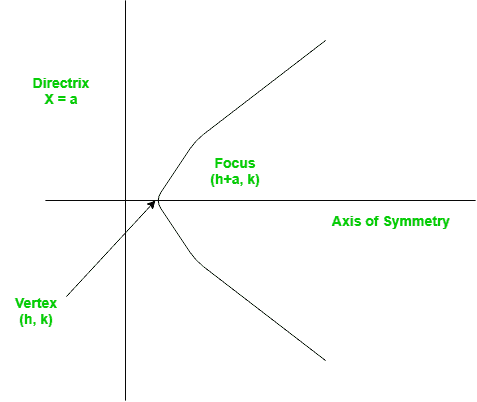
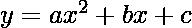

# 求抛物线的顶点、焦点和准线

> 原文:[https://www . geesforgeks . org/finding-顶点-焦点-准线-抛物线/](https://www.geeksforgeeks.org/finding-vertex-focus-directrix-parabola/)

**问题–**求抛物线方程系数给定时的顶点、焦点和准线。
平面上形成曲线的一组点，该曲线上与焦点等距的任何点都是**抛物线。**
**抛物线的顶点**是进行最急转弯的坐标，而 a 是用于生成曲线的直线。



抛物线方程的标准形式是。给定 a、b 和 c 的值；我们的任务是找到顶点、焦点的坐标和准线的方程。
**示例–**

```
Input : 5 3 2
Output : Vertex:(-0.3, 1.55)
         Focus: (-0.3, 1.6)
         Directrix: y=-198
Consult the formula below for explanation.
```

这个问题是公式实现的一个简单例子。下面给出了一组必要的公式，可以帮助我们解决这个问题。

```
For a parabola in the form 
Vertex: 
Focus: 
Directrix: 
```

## C++

```
#include <iostream>
using namespace std;

// Function to calculate Vertex, Focus and Directrix
void parabola(float a, float b, float c)
{
    cout << "Vertex: (" << (-b / (2 * a)) << ", "
         << (((4 * a * c) - (b * b)) / (4 * a))
         << ")" << endl;
    cout << "Focus: (" << (-b / (2 * a)) << ", "
         << (((4 * a * c) - (b * b) + 1) / (4 * a))
         << ")" << endl;
    cout << "Directrix: y="
         << c - ((b * b) + 1) * 4 * a << endl;
}

// Driver Function
int main()
{
    float a = 5, b = 3, c = 2;
    parabola(a, b, c);
    return 0;
}
```

## Java 语言(一种计算机语言，尤用于创建网站)

```
// Java program to find the vertex,
// focus and directrix of a parabola

class GFG {

    // Function to calculate Vertex,
    // Focus and Directrix
    static void parabola(float a,
                         float b, float c)
    {

        System.out.println("Vertex: (" +
                          (-b / (2 * a)) + ", " +
                          (((4 * a * c) - (b * b)) /
                          (4 * a)) + ")");

        System.out.println("Focus: (" +
                          (-b / (2 * a)) + ", "    +
                          (((4 * a * c) - (b * b) + 1) /
                          (4 * a)) + ")");

        System.out.println("Directrix:" + " y=" +
                          (int)(c - ((b * b) + 1) *
                          4 * a));
    }

    // Driver Function
    public static void main(String[] args)
    {
        float a = 5, b = 3, c = 2;

        // Function calling
        parabola(a, b, c);
    }
}

// This code is contributed by
// Smitha Dinesh Semwal
```

## 蟒蛇 3

```
# Function to calculate Vertex,
# Focus and Directrix
def parabola(a, b, c):

    print("Vertex: (" , (-b / (2 * a)),
        ", ", (((4 * a * c) - (b * b))
            / (4 * a)), ")", sep = "")

    print("Focus: (" , (-b / (2 * a)),
    ", ", (((4 * a * c) - (b * b) + 1)
            / (4 * a)), ")", sep = "")

    print("Directrix: y=", c - ((b * b)
                + 1) * 4 * a, sep = "")

# Driver Function
a = 5
b = 3
c = 2
parabola(a, b, c)

# This code is contributed by Smitha.
```

## C#

```
// C# program to find the vertex,
// focus and directrix of a parabola
using System;

class GFG {

    // Function to calculate Vertex,
    // Focus and Directrix
    static void parabola(float a,
                         float b, float c)
    {
        Console.WriteLine("Vertex: (" +
                         (-b / (2 * a)) + ", " +
                         (((4 * a * c) - (b * b)) /
                         (4 * a)) + ")");

        Console.WriteLine("Focus: (" +
                         (-b / (2 * a)) + ", " +
                         (((4 * a * c) - (b * b) + 1) /
                         (4 * a)) + ")");

        Console.Write("Directrix:" + " y=" +
                     (int)(c - ((b * b) + 1) * 4 * a));
    }

    // Driver Function
    public static void Main()
    {
        float a = 5, b = 3, c = 2;

        // Function calling
        parabola(a, b, c);
    }
}

// This code is contributed by nitin mittal
```

## 服务器端编程语言（Professional Hypertext Preprocessor 的缩写）

```
<?php
// PHP program to Find the vertex,
// focus and directrix of a parabola

// Function to calculate Vertex,
// Focus and Directrix
function parabola($a, $b, $c)
{

    echo "Vertex: (" , (-$b / (2 * $a)) , ", ",
        (((4 * $a * $c) - ($b * $b)) / (4 * $a)),
                                      ")", "\n" ;
    echo "Focus: (" , (-$b / (2 * $a)) , ", ",
        (((4 * $a * $c) - ($b * $b) + 1) / (4 * $a))
                                        , ")"," \n" ;
    echo "Directrix: y=",
        $c - (($b * $b) + 1) * 4 * $a ;
}

    // Driver Code
    $a = 5; $b = 3; $c = 2;
    parabola($a, $b, $c);

// This code is contributed by vt_m.
?>
```

## java 描述语言

```
<script>

// JavaScript program to find the vertex,
// focus and directrix of a parabola

    // Function to calculate Vertex,
    // Focus and Directrix
    function parabola(a, b, c)
    {

        document.write("Vertex: (" +
                          (-b / (2 * a)) + ", " +
                          (((4 * a * c) - (b * b)) /
                          (4 * a)) + ")" + "<br/>");

       document.write("Focus: (" +
                          (-b / (2 * a)) + ", "    +
                          (((4 * a * c) - (b * b) + 1) /
                          (4 * a)) + ")" + "<br/>");

        document.write("Directrix:" + " y=" +
                          (c - ((b * b) + 1) *
                          4 * a) + "<br/>");
    }

// Driver code

        let a = 5, b = 3, c = 2;

        // Function calling
        parabola(a, b, c);

            // This code is contributed by code_hunt.
</script>
```

**输出–**

```
Vertex:(-0.3, 1.55)
Focus: (-0.3, 1.6)
Directrix: y=-198
```