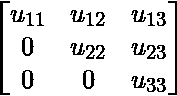
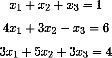
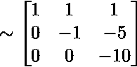

# 数学|线性方程组的 L ^ U 分解

> 原文:[https://www . geesforgeks . org/l-u-分解-系统-线性-方程/](https://www.geeksforgeeks.org/l-u-decomposition-system-linear-equations/)

矩阵的 LU 分解是把给定的方阵分解成两个三角矩阵，一个上三角矩阵和一个下三角矩阵，这样这两个矩阵的乘积就给出了原矩阵。它是由艾伦·图灵在 1948 年提出的，他也创造了图灵机。

这种将矩阵分解为两个三角矩阵乘积的方法有各种应用，例如解方程组，它本身是许多应用的组成部分，例如求电路中的电流和解离散动力系统问题；求矩阵的逆和矩阵的行列式。
基本上，只要有可能把要解决的问题建模成矩阵形式，LU 分解方法就派上用场了。转换成矩阵形式并用三角矩阵求解，使得在求解的过程中进行计算变得容易。

正方形矩阵 A 可以被分解成两个正方形矩阵 L 和 U，使得 A = L U，其中 U 是作为对 A 应用高斯消去法的结果而形成的上三角形矩阵，L 是对角线元素等于 1 的下三角形矩阵。

对于 A = ，我们有 L = 和 U =；使得α= 1u

<center>![\left[\begin{array}{lll} a_{11} & a_{12} & a_{13} \\ a_{21} & a_{22} & a_{23} \\ a_{31} & a_{32} & a_{33} \end{array}\right]=\left[\begin{array}{lll} 1 & 0 & 0 \\ l_{21} & 1 & 0 \\ l_{31} & l_{32} & 0 \end{array}\right] *\left[\begin{array}{ccc} u_{11} & u_{12} & u_{13} \\ 0 & u_{22} & u_{23} \\ 0 & 0 & u_{33} \end{array}\right]](img/5569e9aae37d9a116ccc20da260541c0.png "Rendered by QuickLaTeX.com")</center>

这里可以对比找到 l <sub>21</sub> 、u <sub>11</sub> 等数值。

**高斯消元法**
根据高斯消元法:

1.  任何零行都应该在矩阵的底部。
2.  每行的第一个非零条目应该在前一行的第一个非零条目的右侧。该方法将矩阵简化为行梯队形式。

**逻辑单元分解的步骤:**

*   给定一组线性方程，首先把它们转换成矩阵形式 A X = C 其中 A 是系数矩阵，X 是变量矩阵，C 是方程右边的数字矩阵。
*   现在，使用高斯消元法，将系数矩阵 A，即从所有给定方程中的变量系数获得的矩阵，简化为行梯队形式，对于‘n’个变量，我们有一个 nXn 矩阵。这样得到的矩阵是 u
*   要找到 L，我们有两种方法。第一种是把剩下的元素假设为一些人工变量，用 A = L U 做方程，求解得到那些人工变量。
    另一种方法是，剩余的元素是乘数系数，因为乘数系数，U 矩阵中的各个位置变为零。(这种方法用文字理解有点棘手，但在下面的例子中会变得清晰)
*   现在，我们有 A(NxN 系数矩阵)、L(NxN 下三角矩阵)、U(NxN 上三角矩阵)、X(nX1 变量矩阵)和 C(等式右侧的 Nx1 数字矩阵)。
*   给定的方程组是 A X = C。我们用 A = L U 代替。因此，我们有 L U X = C。
    我们把 Z = U X，其中 Z 是矩阵或人工变量，首先求解 L Z = C，然后求解 U X = Z，以找到 X 或变量的值，这是必需的。

**示例:**
使用 LU 分解方法求解以下方程组:



解决方案:在这里，我们有

A = 和使得 A X = C

现在我们先考虑，用高斯消元法转换成行梯队形式。

所以，通过这样做

(1) 

(2) 

我们得到

 

现在，通过做

(3) 

我们得到



(请记住始终在中间保留“–”符号，用两个“–”符号替换“+”符号)

因此，我们得到 L = 和 U = 

(注意在 L 矩阵中，是从(1)是从(2)是从(3)】

现在，我们假设 Z 并求解 L Z = C。

 

所以，我们有  

求解，得到、、。

现在，我们求解 U X = Z

 

因此，我们得到

因此，给定线性方程组的解是、、，因此矩阵 X = 

**练习:**
在矩阵的 LU 分解中

```
| 2  2 |
| 4  9 |
```

，如果 U 的对角线元素都为 1，那么 L 的下对角线条目 l22 为(GATE CS 2015)
(A)4
(B)5
(C)6
(D)7
解决方案见[https://www . geekesforgeks . org/GATE-GATE-CS-2015-set-1-question-28/](https://www.geeksforgeeks.org/gate-gate-cs-2015-set-1-question-28/)

本文由 Nishant Arora 编辑。如果你发现任何不正确的地方，或者你想分享更多关于上面讨论的话题的信息，请写评论。