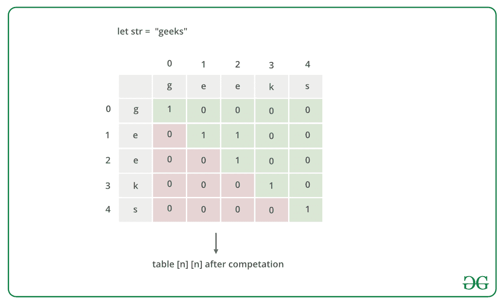

# 最长回文子串的长度

> 原文:[https://www . geeksforgeeks . org/length-最长回文-substring/](https://www.geeksforgeeks.org/length-of-longest-palindrome-substring/)

给定一个长度为 **N** 的字符串 **S** ，任务是从给定的字符串中找到[最长回文子串](https://www.geeksforgeeks.org/longest-palindrome-substring-set-1/)的长度。

**示例:**

> **输入:** S = "abcbab"
> **输出:** 5
> **解释:**
> 字符串“abcba”是长度为 5 的回文中最长的子字符串。
> 
> **输入:** S = "abcdaa"
> **输出:** 2
> **解释:**
> 字符串“aa”是长度为 2 的回文中最长的子字符串。

**天真方法:**解决问题最简单的方法是[生成给定字符串](https://www.geeksforgeeks.org/program-print-substrings-given-string/)的所有可能的子串，并打印[最长子串](https://www.geeksforgeeks.org/length-of-the-longest-valid-substring/)的长度，这是一个[回文](https://www.geeksforgeeks.org/tag/palindrome/)。

下面是上述方法的实现:

## C++

```
// C++ program for the above approach
#include <bits/stdc++.h>
using namespace std;

// Function to obtain the length of
// the longest palindromic substring
int longestPalSubstr(string str)
{
    // Length of given string
    int n = str.size();

    // Stores the maximum length
    int maxLength = 1, start = 0;

    // Iterate over the string
    for (int i = 0;
         i < str.length(); i++) {

        // Iterate over the string
        for (int j = i;
             j < str.length(); j++) {
            int flag = 1;

            // Check for palindrome
            for (int k = 0;
                 k < (j - i + 1) / 2; k++)
                if (str[i + k]
                    != str[j - k])
                    flag = 0;

            // If string [i, j - i + 1]
            // is palindromic
            if (flag
                && (j - i + 1) > maxLength) {
                start = i;
                maxLength = j - i + 1;
            }
        }
    }

    // Return length of LPS
    return maxLength;
}

// Driver Code
int main()
{
    // Given string
    string str = "forgeeksskeegfor";

    // Function Call
    cout << longestPalSubstr(str);
    return 0;
}
```

## Java 语言(一种计算机语言，尤用于创建网站)

```
// Java program for the above approach
import java.io.*;

class GFG{

// Function to obtain the length of
// the longest palindromic substring
static int longestPalSubstr(String str)
{

    // Length of given string
    int n = str.length();

    // Stores the maximum length
    int maxLength = 1, start = 0;

    // Iterate over the string
    for(int i = 0; i < str.length(); i++)
    {

        // Iterate over the string
        for(int j = i; j < str.length(); j++)
        {
            int flag = 1;

            // Check for palindrome
            for(int k = 0;
                    k < (j - i + 1) / 2; k++)
                if (str.charAt(i + k) !=
                    str.charAt(j - k))
                    flag = 0;

            // If string [i, j - i + 1]
            // is palindromic
            if (flag != 0 &&
               (j - i + 1) > maxLength)
            {
                start = i;
                maxLength = j - i + 1;
            }
        }
    }

    // Return length of LPS
    return maxLength;
}

// Driver Code
public static void main (String[] args)
{

    // Given string
    String str = "forgeeksskeegfor";

    // Function call
    System.out.print(longestPalSubstr(str));
}
}

// This code is contributed by code_hunt
```

## 蟒蛇 3

```
# Python3 program for the above approach

# Function to obtain the length of
# the longest palindromic substring
def longestPalSubstr(str):

    # Length of given string
    n = len(str)

    # Stores the maximum length
    maxLength = 1
    start = 0

    # Iterate over the string
    for i in range(len(str)):

        # Iterate over the string
        for j in range(i, len(str), 1):
            flag = 1

            # Check for palindrome
            for k in range((j - i + 1) // 2):
                if (str[i + k] != str[j - k]):
                    flag = 0

            # If string [i, j - i + 1]
            # is palindromic
            if (flag != 0 and
               (j - i + 1) > maxLength):
                start = i
                maxLength = j - i + 1

    # Return length of LPS
    return maxLength

# Driver Code

# Given string
str = "forgeeksskeegfor"

# Function call
print(longestPalSubstr(str))

# This code is contributed by code_hunt
```

## C#

```
// C# program for the above approach 
using System;

class GFG{

// Function to obtain the length of
// the longest palindromic substring
static int longestPalSubstr(string str)
{

    // Length of given string
    int n = str.Length;

    // Stores the maximum length
    int maxLength = 1, start = 0;

    // Iterate over the string
    for(int i = 0; i < str.Length; i++)
    {

        // Iterate over the string
        for(int j = i; j < str.Length; j++)
        {
            int flag = 1;

            // Check for palindrome
            for(int k = 0;
                    k < (j - i + 1) / 2; k++)
                if (str[i + k] != str[j - k])
                    flag = 0;

            // If string [i, j - i + 1]
            // is palindromic
            if (flag != 0 &&
               (j - i + 1) > maxLength)
            {
                start = i;
                maxLength = j - i + 1;
            }
        }
    }

    // Return length of LPS
    return maxLength;
}

// Driver Code
public static void Main ()
{

    // Given string
    string str = "forgeeksskeegfor";

    // Function call
    Console.Write(longestPalSubstr(str));
}
}

// This code is contributed by code_hunt
```

## java 描述语言

```
<script>

// JavaScript program for the above approach

// Function to obtain the length of
// the longest palindromic substring
function longestPalSubstr(str)
{
    // Length of given string
    var n = str.length;

    // Stores the maximum length
    var maxLength = 1, start = 0;

    // Iterate over the string
    for (var i = 0;
         i < str.length; i++) {

        // Iterate over the string
        for (var j = i;
             j < str.length; j++) {
            var flag = 1;

            // Check for palindrome
            for (var k = 0;
                 k < (j - i + 1) / 2; k++)
                if (str[i + k]
                    != str[j - k])
                    flag = 0;

            // If string [i, j - i + 1]
            // is palindromic
            if (flag
                && (j - i + 1) > maxLength) {
                start = i;
                maxLength = j - i + 1;
            }
        }
    }

    // Return length of LPS
    return maxLength;
}

// Driver Code

// Given string
var str = "forgeeksskeegfor";

// Function Call
document.write( longestPalSubstr(str));

</script>
```

**Output:** 

```
10
```

***时间复杂度:** O(N <sup>3</sup> ，其中 N 为给定字符串的长度。*
***辅助空间:** O(N)*

[**【动态规划】**](https://www.geeksforgeeks.org/dynamic-programming/) **方法:**上述方法可以通过存储[重叠子问题](https://www.geeksforgeeks.org/overlapping-subproblems-property-in-dynamic-programming-dp-1/)的结果进行优化。想法和[这个帖子](https://www.geeksforgeeks.org/archives/19155)差不多。以下是步骤:

1.  维护一个自下而上填充的布尔**表【N】【N】**。
2.  如果子串是回文，**表[i][j]** 的值为真，否则为假。
3.  要计算**表【I】【j】**，请检查**表【I+1】【j–1】**的值，如果该值为真且**str【I】**与**str【j】**相同，则更新**表【I】【j】**为真。
4.  否则**表【I】【j】**的值更新为假。

以下是字符串**“极客”**的图示:



下面是上述方法的实现:

## C++

```
// C++ program for the above approach

#include <bits/stdc++.h>
using namespace std;

// Function to find the length of
// the longest palindromic substring
int longestPalSubstr(string str)
{
    // Length of string str
    int n = str.size();

    // Stores the dp states
    bool table[n][n];

    // Initialise table[][] as false
    memset(table, 0, sizeof(table));

    // All substrings of length 1
    // are palindromes
    int maxLength = 1;

    for (int i = 0; i < n; ++i)
        table[i][i] = true;

    // Check for sub-string of length 2
    int start = 0;

    for (int i = 0; i < n - 1; ++i) {

        // If adjacent character are same
        if (str[i] == str[i + 1]) {

            // Update table[i][i + 1]
            table[i][i + 1] = true;
            start = i;
            maxLength = 2;
        }
    }

    // Check for lengths greater than 2
    // k is length of substring
    for (int k = 3; k <= n; ++k) {

        // Fix the starting index
        for (int i = 0; i < n - k + 1; ++i) {

            // Ending index of substring
            // of length k
            int j = i + k - 1;

            // Check for palindromic
            // substring str[i, j]
            if (table[i + 1][j - 1]
                && str[i] == str[j]) {

                // Mark true
                table[i][j] = true;

                // Update the maximum length
                if (k > maxLength) {
                    start = i;
                    maxLength = k;
                }
            }
        }
    }

    // Return length of LPS
    return maxLength;
}

// Driver Code
int main()
{
    // Given string str
    string str = "forgeeksskeegfor";

    // Function Call
    cout << longestPalSubstr(str);

    return 0;
}
```

## Java 语言(一种计算机语言，尤用于创建网站)

```
// Java program for the above approach
import java.util.*;

class GFG{

// Function to find the length of
// the longest palindromic subString
static int longestPalSubstr(String str)
{

    // Length of String str
    int n = str.length();

    // Stores the dp states
    boolean [][]table = new boolean[n][n];

    // All subStrings of length 1
    // are palindromes
    int maxLength = 1;

    for(int i = 0; i < n; ++i)
        table[i][i] = true;

    // Check for sub-String of length 2
    int start = 0;

    for(int i = 0; i < n - 1; ++i)
    {

        // If adjacent character are same
        if (str.charAt(i) == str.charAt(i + 1))
        {

            // Update table[i][i + 1]
            table[i][i + 1] = true;
            start = i;
            maxLength = 2;
        }
    }

    // Check for lengths greater than 2
    // k is length of subString
    for(int k = 3; k <= n; ++k)
    {

        // Fix the starting index
        for(int i = 0; i < n - k + 1; ++i)
        {

            // Ending index of subString
            // of length k
            int j = i + k - 1;

            // Check for palindromic
            // subString str[i, j]
            if (table[i + 1][j - 1] &&
                str.charAt(i) == str.charAt(j))
            {

                // Mark true
                table[i][j] = true;

                // Update the maximum length
                if (k > maxLength)
                {
                    start = i;
                    maxLength = k;
                }
            }
        }
    }

    // Return length of LPS
    return maxLength;
}

// Driver Code
public static void main(String[] args)
{

    // Given String str
    String str = "forgeeksskeegfor";

    // Function Call
    System.out.print(longestPalSubstr(str));
}
}

// This code is contributed by Amit Katiyar
```

## C#

```
// C# program for
// the above approach
using System;
class GFG{

// Function to find the length of
// the longest palindromic subString
static int longestPalSubstr(String str)
{
  // Length of String str
  int n = str.Length;

  // Stores the dp states
  bool [,]table = new bool[n, n];

  // All subStrings of length 1
  // are palindromes
  int maxLength = 1;

  for(int i = 0; i < n; ++i)
    table[i, i] = true;

  // Check for sub-String
  // of length 2
  int start = 0;

  for(int i = 0; i < n - 1; ++i)
  {
    // If adjacent character are same
    if (str[i] == str[i + 1])
    {
      // Update table[i,i + 1]
      table[i, i + 1] = true;
      start = i;
      maxLength = 2;
    }
  }

  // Check for lengths greater than 2
  // k is length of subString
  for(int k = 3; k <= n; ++k)
  {
    // Fix the starting index
    for(int i = 0; i < n - k + 1; ++i)
    {
      // Ending index of subString
      // of length k
      int j = i + k - 1;

      // Check for palindromic
      // subString str[i, j]
      if (table[i + 1, j - 1] &&
          str[i] == str[j])
      {
        // Mark true
        table[i, j] = true;

        // Update the maximum length
        if (k > maxLength)
        {
          start = i;
          maxLength = k;
        }
      }
    }
  }

  // Return length of LPS
  return maxLength;
}

// Driver Code
public static void Main(String[] args)
{
  // Given String str
  String str = "forgeeksskeegfor";

  // Function Call
  Console.Write(longestPalSubstr(str));
}
}

// This code is contributed by Rajput-Ji
```

## 蟒蛇 3

```
# Python program for the above approach

# Function to find the length of
# the longest palindromic subString
def longestPalSubstr(str):
    # Length of String str
    n = len(str);

    # Stores the dp states
    table = [[False for i in range(n)] for j in range(n)];

    # All subStrings of length 1
    # are palindromes
    maxLength = 1;

    for i in range(n):
        table[i][i] = True;

    # Check for sub-String of length 2
    start = 0;

    for i in range(n - 1):

        # If adjacent character are same
        if (str[i] == str[i + 1]):
            # Update table[i][i + 1]
            table[i][i + 1] = True;
            start = i;
            maxLength = 2;

    # Check for lengths greater than 2
    # k is length of subString
    for k in range(3, n + 1):

        # Fix the starting index
        for i in range(n - k + 1):

            # Ending index of subString
            # of length k
            j = i + k - 1;

            # Check for palindromic
            # subString str[i, j]
            if (table[i + 1][j - 1] and str[i] == str[j]):

                # Mark True
                table[i][j] = True;

                # Update the maximum length
                if (k > maxLength):
                    start = i;
                    maxLength = k;

    # Return length of LPS
    return maxLength;

# Driver Code
if __name__ == '__main__':
    # Given String str
    str = "forgeeksskeegfor";

    # Function Call
    print(longestPalSubstr(str));

# This code is contributed by 29AjayKumar
```

## java 描述语言

```
<script>
// javascript program for the above approach

    // Function to find the length of
    // the longest palindromic subString
    function longestPalSubstr(str) {

        // Length of String str
        var n = str.length;

        // Stores the dp states
        var table = Array(n).fill().map(()=>Array(n).fill(false));

        // All subStrings of length 1
        // are palindromes
        var maxLength = 1;

        for (var i = 0; i < n; ++i)
            table[i][i] = true;

        // Check for sub-String of length 2
        var start = 0;

        for (i = 0; i < n - 1; ++i) {

            // If adjacent character are same
            if (str.charAt(i) == str.charAt(i + 1)) {

                // Update table[i][i + 1]
                table[i][i + 1] = true;
                start = i;
                maxLength = 2;
            }
        }

        // Check for lengths greater than 2
        // k is length of subString
        for (k = 3; k <= n; ++k) {

            // Fix the starting index
            for (i = 0; i < n - k + 1; ++i) {

                // Ending index of subString
                // of length k
                var j = i + k - 1;

                // Check for palindromic
                // subString str[i, j]
                if (table[i + 1][j - 1] && str.charAt(i) == str.charAt(j)) {

                    // Mark true
                    table[i][j] = true;

                    // Update the maximum length
                    if (k > maxLength) {
                        start = i;
                        maxLength = k;
                    }
                }
            }
        }

        // Return length of LPS
        return maxLength;
    }

    // Driver Code

        // Given String str
        var str = "forgeeksskeegfor";

        // Function Call
        document.write(longestPalSubstr(str));

// This code is contributed by umadevi9616
</script>
```

**Output:** 

```
10
```

***时间复杂度:** O(N <sup>2</sup> ，其中 N 为给定字符串的长度。*
***辅助空间:** O(N)*

**高效方法:**对上述方法进行优化，思路是使用[马纳切尔算法](https://www.geeksforgeeks.org/manachers-algorithm-linear-time-longest-palindromic-substring-part-1/)。利用该算法，对于每个字符 **c** ，可以找到以 **c** 为中心的长度为奇数的最长回文子串。但是最长的回文子串也可以有偶数长度，没有任何中心。因此，可以在每个字符之间添加一些特殊字符。

> 例如，如果给定的字符串是**“abababc”**，那么它将变成**“$ # a # b # a # b # a # b # c # @”**。现在，注意在这种情况下，对于每个字符 **c** ，中心为 **c** 的最长回文子串将具有奇数长度。

以下是步骤:

1.  如上所述，在给定字符串 **S** 中添加特殊字符，并将其长度设为 **N** 。
2.  用 **0** 初始化数组 **d[]** 、中心和 **r** ，其中 **d[i]** 存储回文左边部分的长度，其中 **S[i]** 是中心， **r** 表示最右边的访问边界，中心表示当前字符索引，它是这个最右边边界的中心。
3.  在遍历字符串 **S** 时，对于每个索引 *i* ，如果 **i 小于 r** ，则它的答案已经被预先计算过，并且**d【I】**可以被设置为等于在 **i** 处的角色镜像的答案，其中心可以被计算为**(2 *中心–I)**。
4.  现在，检查在 r 之后是否有一些字符使得回文变得更长。
5.  如果 **(i + d[i])大于 r** ，则更新 r = **(i + d[i])** ，中心为 **i** 。
6.  在找到每个字符最长的回文 **c** 为中心后，打印 **(2*d[i] + 1)/2** 的最大值，其中 **0 ≤ i < N** ，因为 **d[i]** 只存储回文的左边部分。

下面是上述方法的实现:

## 蟒蛇 3

```
# Python program for the above approach

# Function that placed '#' intermediately
# before and after each character
def UpdatedString(string):

    newString = ['#']

# Traverse the string
    for char in string:
        newString += [char, '#']

# Return the string
    return ''.join(newString)

# Function that finds the length of
# the longest palindromic substring
def Manacher(string):

    # Update the string
    string = UpdatedString(string)

    # Stores the longest proper prefix
    # which is also a suffix
    LPS = [0 for _ in range(len(string))]
    C = 0
    R = 0

    for i in range(len(string)):
        imir = 2 * C - i

        # Find the minimum length of
        # the palindrome
        if R > i:
            LPS[i] = min(R-i, LPS[imir])
        else:

            # Find the actual length of
            # the palindrome
            LPS[i] = 0

        # Exception Handling
        try:
            while string[i + 1 + LPS[i]] \
            == string[i - 1 - LPS[i]]:
                LPS[i] += 1
        except:
            pass

        # Update C and R
        if i + LPS[i] > R:
            C = i
            R = i + LPS[i]

    r, c = max(LPS), LPS.index(max(LPS))

    # Return the length r
    return r

# Driver code

# Given string str
str = "forgeeksskeegfor"

# Function Call
print(Manacher(str))
```

**Output:** 

```
10
```

***时间复杂度:** O(N)，其中 N 是给定字符串的长度。*
***辅助空间:** O(N)*