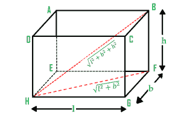
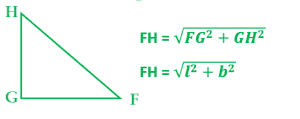
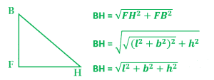

# 可装入长方体的最长杆的长度

> 原文:[https://www . geeksforgeeks . org/可装入长方体的最长杆的长度/](https://www.geeksforgeeks.org/length-of-longest-rod-that-can-fit-into-a-cuboid/)

给定一个长方体的长度、宽度和高度，任务是找到一个长方体中能容纳的最长杆的长度。
**例:**

```
Input: length = 12, breadth = 9, height = 8
Output: 17

Input: length = 22, breadth = 19, height = 8
Output: 30.1496
```



**说明:图中**

```
GH = length, GF = breadth, FB= height
```

最长的杆的长度是 BH。因此，为了计算 BH，我们可以在三角形 BHF 中应用毕达哥拉斯定理。从三角形 HGF 我们可以计算出 FH 的长度。



在得到 FH 的长度后，我们可以利用三角形 BHF 中的毕达哥拉斯定理求出 BH 的长度。



**以下是上述方法的实施:**

## C++

```
// C++ program to find the longest rod
// that can fit in a cuboid
#include <bits/stdc++.h>
using namespace std;

// Function to find the length
double longestRodInCuboid(int length,
                        int breadth, int height)
{
    double result;
    int temp;

    // temporary variable to hold
    // the intermediate result
    temp = length * length + breadth * breadth
           + height * height;

    // length of longest rod is calculated
    // using square root function
    result = sqrt(temp);

    return result;
}

// Driver code
int main()
{
    int length = 12, breadth = 9, height = 8;

    // calling longestRodInCuboid() function to
    // get the length of longest rod
    cout << longestRodInCuboid(length, breadth, height);

    return 0;
}
```

## Java 语言(一种计算机语言，尤用于创建网站)

```
// Java program to find the longest
// rod that can fit in a cuboid
class GFG
{

// Function to find the length
static double longestRodInCuboid(int length,
                                 int breadth,
                                 int height)
{
    double result;
    int temp;

    // temporary variable to hold
    // the intermediate result
    temp = length * length + breadth *
           breadth + height * height;

    // length of longest rod is calculated
    // using square root function
    result = Math.sqrt(temp);

    return result;
}

// Driver Code
public static void main(String[] args)
{
    int length = 12,
        breadth = 9,
        height = 8;

    // calling longestRodInCuboid()
    // function to get the length
    // of longest rod
    System.out.println((int)longestRodInCuboid(length,
                                    breadth, height));
}
}

// This code is contributed by ChitraNayal
```

## 蟒蛇 3

```
# Python 3 program to find the longest rod
# that can fit in a cuboid

# from math lib. import everything
from math import *

# Function to find the length
def longestRodInCuboid(length, breadth, height) :

    # temporary variable to hold
    # the intermediate result
    temp = length * length + breadth  * breadth + height * height

    #  length of longest rod is calculated
    # using square root function
    result = sqrt(temp)

    return result

# Driver Code
if __name__ == "__main__" :

    length, breadth, height = 12, 9, 8

    # calling longestRodInCuboid() function to
    # get the length of longest rod
    print(longestRodInCuboid(length, breadth, height))

# This code is contributed by ANKITRAI1
```

## C#

```
// C# program to find the longest
// rod that can fit in a cuboid
using System;
class GFG
{

// Function to find the length
static double longestRodInCuboid(int length,
                                int breadth,
                                int height)
{
    double result;
    int temp;

    // temporary variable to hold
    // the intermediate result
    temp = length * length + breadth *
        breadth + height * height;

    // length of longest rod is calculated
    // using square root function
    result = Math.Sqrt(temp);

    return result;
}

// Driver Code
public static void Main()
{
    int length = 12,
        breadth = 9,
        height = 8;

    // calling longestRodInCuboid()
    // function to get the length
    // of longest rod
    Console.WriteLine((int)longestRodInCuboid(length,
                                    breadth, height));
}
}

// This code is contributed by inder_verma..
```

## 服务器端编程语言（Professional Hypertext Preprocessor 的缩写）

```
<?php
// PHP program to find the longest
// rod that can fit in a cuboid

// Function to find the length
function longestRodInCuboid($length,
                            $breadth,
                            $height)
{
    $result;
    $temp;

    // temporary variable to hold
    // the intermediate result
    $temp = $length * $length +
            $breadth * $breadth +
            $height * $height;

    // length of longest rod is
    // calculated using square
    // root function
    $result = sqrt($temp);

    return $result;
}

// Driver code

$length = 12; $breadth = 9;
$height = 8;

// calling longestRodInCuboid()
// function to get the length
// of longest rod
echo longestRodInCuboid($length,
                        $breadth, $height);

// This code is contributed
// by inder_verma..
?>
```

## java 描述语言

```
<script>

// JavaScript program to find the longest rod
// that can fit in a cuboid

// Function to find the length
function longestRodInCuboid(length, breadth, height)
{
    let result;
    let temp;

    // temporary variable to hold
    // the intermediate result
    temp = length * length + breadth * breadth
        + height * height;

    // length of longest rod is calculated
    // using square root function
    result = Math.sqrt(temp);

    return result;
}

// Driver code

    let length = 12, breadth = 9, height = 8;

    // calling longestRodInCuboid() function to
    // get the length of longest rod
    document.write(longestRodInCuboid(length, breadth,
                                      height));

// This code is contributed by Surbhi Tyagi.

</script>
```

**Output:** 

```
17
```

**时间复杂度:** O(1)

**辅助空间:** O(1)