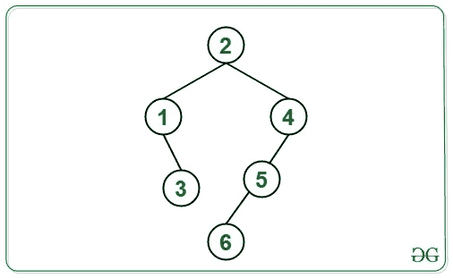
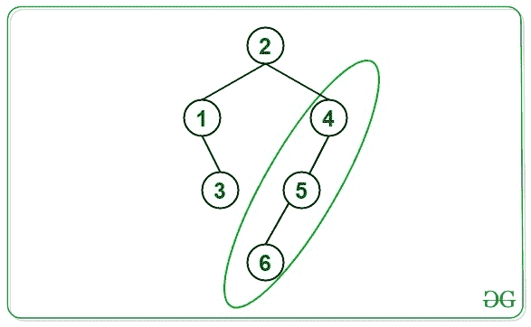
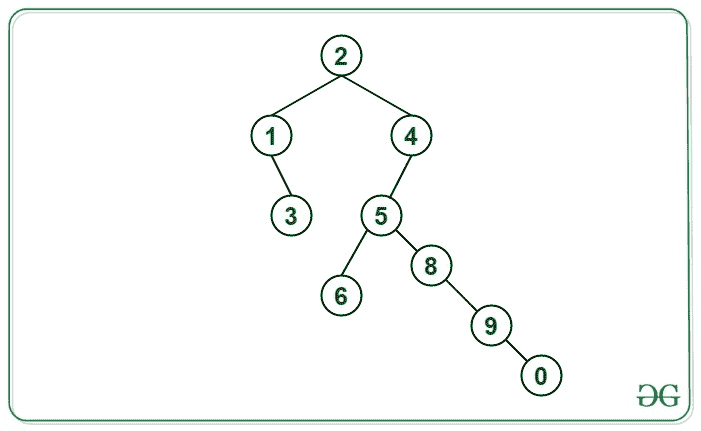
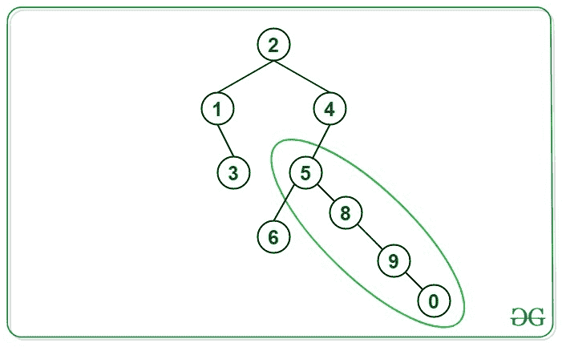

# 给定二叉树最长直线路径的长度

> 原文:[https://www . geeksforgeeks . org/给定二叉树的最长直线路径长度/](https://www.geeksforgeeks.org/length-of-longest-straight-path-from-a-given-binary-tree/)

给定一棵[二叉树](https://www.geeksforgeeks.org/binary-tree-data-structure/)，任务是求给定二叉树最长直线路径的长度。

> **直线路径**定义为从任意节点开始并在树中的另一个节点结束的路径，使得从源节点到目的节点的遍历方向始终保持不变，即向左或向右，没有任何方向的变化，即向左- >向左- >向左或向右- >向右- >向右。

**示例:**

> **输入:**
> 
> [](https://media.geeksforgeeks.org/wp-content/cdn-uploads/20200908165530/Ex1-graph.jpg)
> 
> **输出:** 2
> **说明:**
> 绿色显示的路径是从 4 到 6 的最长直线路径，长度为 2。
> 
> 
> 
> **输入:**
> 
> [](https://media.geeksforgeeks.org/wp-content/cdn-uploads/20200908165715/Ex2graph.jpg)
> 
> **输出:** 3
> **说明:**
> 绿色显示的路径是从 5 到 0 的最长直线路径，长度为 3。
> 
> 

**方法:**思路是使用[后序遍历](https://www.geeksforgeeks.org/tree-traversals-inorder-preorder-and-postorder/)。按照以下步骤解决问题:

1.  对于每个节点，检查当前节点的方向(左或右)，并检查其子节点的哪个方向为该节点提供了其下方最长的长度。
2.  如果当前节点的方向和给出最长长度的子节点的方向不相同，则保存该子节点的结果，并将另一个子节点的长度传递给其父节点。
3.  使用上述步骤，在每个节点找到最长的直线路径，并将结果保存，以打印所有直线路径中的**最大值**。
4.  完成上述步骤后，打印最大路径。

下面是上述方法的实现:

码组

**Output:** 

```
2
```

***时间复杂度:**O(N)*
T5**辅助空间:** O(1)