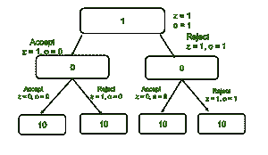

# 字符串数组中由 A0 和 B1 组成的最长子集的长度

> 原文:[https://www . geesforgeks . org/最长子集长度-由字符串数组中的-a-0s 和-b-1s 组成/](https://www.geeksforgeeks.org/length-of-longest-subset-consisting-of-a-0s-and-b-1s-from-an-array-of-strings/)

给定一个由**N**T6】二进制字符串和两个整数 **A** 和 **B** 组成的[数组 **arr[]** ，任务是找到最长子集的长度，该子集最多由 **A** **0** s 和 **B** **1** s 组成。](https://www.geeksforgeeks.org/introduction-to-arrays/)

**示例:**

> **输入:**arr[]= {“1”、“0”、“0001”、“10”、“111001”}，A = 5，B = 3
> **输出:** 4
> **解释:**
> 一种可能的方法是选择子集{arr[0]、arr[1]、arr[2]、arr[3]}。所有这些字符串中 0 和 1 的总数量分别为 5 和 3。
> 同样，4 是可能的最长子集的长度。
> 
> **输入:**arr[]= {“0”，“1”，“10”}，A = 1，B = 1
> **输出:** 2
> **解释:**
> 一种可能的方法是选择子集{arr[0]，arr[1]}。
> 所有这些字符串中 0 和 1 的总数分别为 1 和 1。
> 同样，2 是可能的最长子集的长度。

**天真方法:**解决上述问题最简单的方法就是使用[递归](https://www.geeksforgeeks.org/recursion/)。在每次递归调用时，想法是包含或排除当前字符串。一旦考虑了所有可能性，打印获得的子集的最大长度。

下面是上述方法的实现:

## C++

```
// C++ program for the above approach
#include <bits/stdc++.h>
using namespace std;

// Function to count 0's in a string
int count0(string s)
{
    // Stores count of 0s
    int count = 0;

    // Iterate over characters of string
    for (int i = 0; i < s.size(); i++) {

        // If current character is '0'
        if (s[i] == '0') {
            count++;
        }
    }
    return count;
}

// Recursive function to find the length of
// longest subset from an array of strings
// with at most A 0's and B 1's
int solve(vector<string> vec,
          int A, int B, int idx)
{
    // If idx is equal to N
    // or A + B is equal to 0
    if (idx == vec.size() || A + B == 0) {
        return 0;
    }

    // Stores the count of 0's in arr[idx]
    int zero = count0(vec[idx]);

    // Stores the count of 1's in arr[idx]
    int one = vec[idx].size() - zero;

    // Stores the length of the
    // subset if arr[i] is included
    int inc = 0;

    // If zero is less than or equal to A
    // and one is less than or equal to B
    if (zero <= A && one <= B) {
        inc = 1 + solve(vec, A - zero,
                        B - one, idx + 1);
    }

    // Stores the length of the subset
    // if arr[i] is excluded
    int exc = solve(vec, A, B, idx + 1);

    // Returns max of inc and exc
    return max(inc, exc);
}

// Function to find the length of the
// longest subset from an array of
// strings with at most A 0's and B 1's
int MaxSubsetlength(vector<string> arr,
                    int A, int B)
{
    // Return
    return solve(arr, A, B, 0);
}

// Driver Code
int main()
{
    vector<string> arr = { "1", "0", "10" };
    int A = 1, B = 1;

    cout << MaxSubsetlength(arr, A, B);
    return 0;
}
```

## Java 语言(一种计算机语言，尤用于创建网站)

```
// Java program for the above approach
import java.util.*;

class GFG {
// Function to count 0's in a string
static int count0(String s)
{
    // Stores count of 0s
    int count = 0;

    // Iterate over characters of string
    for (int i = 0; i < s.length(); i++) {

        // If current character is '0'
        if (s.charAt(i) == '0') {
            count++;
        }
    }
    return count;
}

// Recursive function to find the length of
// longest subset from an array of strings
// with at most A 0's and B 1's
static int solve(String[] vec,
          int A, int B, int idx)
{
    // If idx is equal to N
    // or A + B is equal to 0
    if (idx == vec.length || A + B == 0) {
        return 0;
    }

    // Stores the count of 0's in arr[idx]
    int zero = count0(vec[idx]);

    // Stores the count of 1's in arr[idx]
    int one = vec[idx].length() - zero;

    // Stores the length of the
    // subset if arr[i] is included
    int inc = 0;

    // If zero is less than or equal to A
    // and one is less than or equal to B
    if (zero <= A && one <= B) {
        inc = 1 + solve(vec, A - zero,
                        B - one, idx + 1);
    }

    // Stores the length of the subset
    // if arr[i] is excluded
    int exc = solve(vec, A, B, idx + 1);

    // Returns max of inc and exc
    return Math.max(inc, exc);
}

// Function to find the length of the
// longest subset from an array of
// strings with at most A 0's and B 1's
static int MaxSubsetlength(String[] arr,
                    int A, int B)
{
    // Return
    return solve(arr, A, B, 0);
}

    public static void main (String[] args) {
    String[] arr = { "1", "0", "10" };
    int A = 1, B = 1;

    System.out.print(MaxSubsetlength(arr, A, B));
    }
}
// This code is contributed by offbeat
```

## 蟒蛇 3

```
# Python3 program for the above approach

# Function to count 0's in a string
def count0(s):

    # Stores count of 0s
    count = 0

    # Iterate over characters of string
    for i in range(len(s)):

        # If current character is '0'
        if (s[i] == '0'):
            count += 1

    return count

# Recursive function to find the length of
# longest subset from an array of strings
# with at most A 0's and B 1's
def solve(vec, A, B, idx):

    # If idx is equal to N
    # or A + B is equal to 0
    if (idx == len(vec) or A + B == 0):
        return 0

    # Stores the count of 0's in arr[idx]
    zero = count0(vec[idx])

    # Stores the count of 1's in arr[idx]
    one = len(vec[idx]) - zero

    # Stores the length of the
    # subset if arr[i] is included
    inc = 0

    # If zero is less than or equal to A
    # and one is less than or equal to B
    if (zero <= A and one <= B):
        inc = 1 + solve(vec, A - zero,
                             B - one, idx + 1)

    # Stores the length of the subset
    # if arr[i] is excluded
    exc = solve(vec, A, B, idx + 1)

    # Returns max of inc and exc
    return max(inc, exc)

# Function to find the length of the
# longest subset from an array of
# strings with at most A 0's and B 1's
def MaxSubsetlength(arr, A, B):

    # Return
    return solve(arr, A, B, 0)

# Driver Code
if __name__ == '__main__':

    arr = [ "1", "0", "10" ]
    A = 1
    B = 1

    print(MaxSubsetlength(arr, A, B))

# This code is contributed by SURENDRA_GANGWAR
```

## C#

```
// C# program for the above approach
using System;
using System.Collections.Generic;

class GFG{

// Function to count 0's in a string
static int count0(string s)
{

    // Stores count of 0s
    int count = 0;

    // Iterate over characters of string
    for(int i = 0; i < s.Length; i++)
    {

        // If current character is '0'
        if (s[i] == '0')
        {
            count++;
        }
    }
    return count;
}

// Recursive function to find the length of
// longest subset from an array of strings
// with at most A 0's and B 1's
static int solve(List<string> vec, int A, int B,
                 int idx)
{

    // If idx is equal to N
    // or A + B is equal to 0
    if (idx == vec.Count || A + B == 0)
    {
        return 0;
    }

    // Stores the count of 0's in arr[idx]
    int zero = count0(vec[idx]);

    // Stores the count of 1's in arr[idx]
    int one = vec[idx].Length - zero;

    // Stores the length of the
    // subset if arr[i] is included
    int inc = 0;

    // If zero is less than or equal to A
    // and one is less than or equal to B
    if (zero <= A && one <= B)
    {
        inc = 1 + solve(vec, A - zero,
                             B - one, idx + 1);
    }

    // Stores the length of the subset
    // if arr[i] is excluded
    int exc = solve(vec, A, B, idx + 1);

    // Returns max of inc and exc
    return Math.Max(inc, exc);
}

// Function to find the length of the
// longest subset from an array of
// strings with at most A 0's and B 1's
static int MaxSubsetlength(List<string> arr, int A,
                           int B)
{

    // Return
    return solve(arr, A, B, 0);
}

// Driver Code
public static void Main()
{
    List<string> arr = new List<string>{ "1", "0", "10" };
    int A = 1, B = 1;

    Console.WriteLine(MaxSubsetlength(arr, A, B));
}
}

// This code is contributed by ukasp
```

## java 描述语言

```
<script>

// JavaScript program to implement
// the above approach

// Function to count 0's in a string
function count0(s)
{
    // Stores count of 0s
    let count = 0;

    // Iterate over characters of string
    for (let i = 0; i < s.length; i++) {

        // If current character is '0'
        if (s[i] == '0') {
            count++;
        }
    }
    return count;
}

// Recursive function to find the length of
// longest subset from an array of strings
// with at most A 0's and B 1's
function solve(vec, A, B, idx)
{
    // If idx is equal to N
    // or A + B is equal to 0
    if (idx == vec.length || A + B == 0) {
        return 0;
    }

    // Stores the count of 0's in arr[idx]
    let zero = count0(vec[idx]);

    // Stores the count of 1's in arr[idx]
    let one = vec[idx].length - zero;

    // Stores the length of the
    // subset if arr[i] is included
    let inc = 0;

    // If zero is less than or equal to A
    // and one is less than or equal to B
    if (zero <= A && one <= B) {
        inc = 1 + solve(vec, A - zero,
                        B - one, idx + 1);
    }

    // Stores the length of the subset
    // if arr[i] is excluded
    let exc = solve(vec, A, B, idx + 1);

    // Returns max of inc and exc
    return Math.max(inc, exc);
}

// Function to find the length of the
// longest subset from an array of
// strings with at most A 0's and B 1's
function MaxSubsetlength(arr, A, B)
{
    // Return
    return solve(arr, A, B, 0);
}

// Driver code

    let arr = [ "1", "0", "10" ];
    let A = 1, B = 1;

    document.write(MaxSubsetlength(arr, A, B));

</script>
```

**Output:** 

```
2
```

***时间复杂度:**O(2<sup>N</sup>)*
***辅助空间:** O(1)*

**有效方法:**上述方法可以使用[记忆](https://www.geeksforgeeks.org/memoization-1d-2d-and-3d/)进行优化，基于以下观察:

> 
> 
> 递归树
> 
> *   It can be observed that there are [overlapping subproblems](https://www.geeksforgeeks.org/overlapping-subproblems-property-in-dynamic-programming-dp-1/) and [optimal substructure](https://www.geeksforgeeks.org/optimal-substructure-property-in-dynamic-programming-dp-2/) properties.
>     Therefore, the idea is to use [dynamic programming](https://www.geeksforgeeks.org/dynamic-programming/) to optimize the above methods.
> *   The idea is to use three-dimensional state dynamic planning.
> *   Let **DP (I, a, b)** represent the maximum length of a subset with at most **a** 0s and **b** 1s.
> *   You can define the transition of the state by selecting the character string at the index of **I** <sup>th</sup> or not selecting the character string.
>     *   **Dp(i，a，B) = Max(1+Dp(i+1，A- Z，B-O)、Dp(i+1，a，b))，**T2]云娥 **Z** 切**或** s 你好**阿云**

下面是上述方法的实现:

## C++

```
// C++ program for the above approach
#include <bits/stdc++.h>
using namespace std;

// Function to count number
// of 0s present in the string
int count0(string s)
{
    // Stores the count of 0s
    int count = 0;

    // Iterate over characters of string
    for (int i = 0; i < s.size(); i++) {

        // If current character is '0'
        if (s[i] == '0') {
            count++;
        }
    }
    return count;
}
// Recursive Function to find the length of
// longest subset from given array of strings
// with at most A 0s and B 1s
int solve(vector<string> vec, int A,
          int B, int idx,
          vector<vector<vector<int> > >& dp)
{
    // If idx is equal to N or
    // A + B is equal to 0
    if (idx == vec.size() || A + B == 0) {
        return 0;
    }
    // If the state is already calculated
    if (dp[A][B][idx] > 0) {
        return dp[A][B][idx];
    }

    // Stores the count of 0's
    int zero = count0(vec[idx]);

    // Stores the count of 1's
    int one = vec[idx].size() - zero;

    // Stores the length of longest
    // by including arr[idx]
    int inc = 0;

    // If zero is less than A
    // and one is less than B
    if (zero <= A && one <= B) {
        inc = 1
              + solve(vec, A - zero,
                      B - one, idx + 1, dp);
    }

    // Stores the length of longest subset
    // by excluding arr[idx]
    int exc = solve(vec, A, B, idx + 1, dp);

    // Assign
    dp[A][B][idx] = max(inc, exc);

    // Return
    return dp[A][B][idx];
}

// Function to find the length of the
// longest subset of an array of strings
// with at most A 0s and B 1s
int MaxSubsetlength(vector<string> arr,
                    int A, int B)
{
    // Stores all Dp-states
    vector<vector<vector<int> > > dp(
        A + 1,
        vector<vector<int> >(B + 1,
                             vector<int>(arr.size() + 1,
                                         0)));
    // Return
    return solve(arr, A, B, 0, dp);
}

// Driver Code
int main()
{
    vector<string> arr = { "1", "0", "10" };
    int A = 1, B = 1;

    cout << MaxSubsetlength(arr, A, B);
    return 0;
}
```

## Java 语言(一种计算机语言，尤用于创建网站)

```
// Java program for the above approach

import java.io.*;

class GFG {

// Function to count number
// of 0s present in the string
static int count0(String s)
{
    // Stores the count of 0s
    int count = 0;

    // Iterate over characters of string
    for (int i = 0; i < s.length(); i++) {

        // If current character is '0'
        if (s.charAt(i) == '0') {
            count++;
        }
    }
    return count;
}

// Recursive Function to find the length of
// longest subset from given array of strings
// with at most A 0s and B 1s
static int solve(String []vec, int A,
          int B, int idx,
          int dp[][][])
{
    // If idx is equal to N or
    // A + B is equal to 0
    if (idx == vec.length || A + B == 0) {
        return 0;
    }
    // If the state is already calculated
    if (dp[A][B][idx] > 0) {
        return dp[A][B][idx];
    }

    // Stores the count of 0's
    int zero = count0(vec[idx]);

    // Stores the count of 1's
    int one = vec[idx].length() - zero;

    // Stores the length of longest
    // by including arr[idx]
    int inc = 0;

    // If zero is less than A
    // and one is less than B
    if (zero <= A && one <= B) {
        inc = 1
              + solve(vec, A - zero,
                      B - one, idx + 1, dp);
    }

    // Stores the length of longest subset
    // by excluding arr[idx]
    int exc = solve(vec, A, B, idx + 1, dp);

    // Assign
    dp[A][B][idx] = Math.max(inc, exc);

    // Return
    return dp[A][B][idx];
}

// Function to find the length of the
// longest subset of an array of strings
// with at most A 0s and B 1s
static int MaxSubsetlength(String []arr,
                    int A, int B)
{
    // Stores all Dp-states
      int dp[][][] = new int[A+1][B+1][arr.length+1];

    // Return
    return solve(arr, A, B, 0, dp);
}

// Driver Code
public static void main (String[] args) {
    String arr[] = { "1", "0", "10" };
    int A = 1, B = 1;

    System.out.println(MaxSubsetlength(arr, A, B));
}
}

// This code is contributed by Dharanendra L V.
```

## 蟒蛇 3

```
# Python3 program for the above approach

# Function to count number
# of 0s present in the string
def count0(s):

    # Stores the count of 0s
    count = 0

    # Iterate over characters of string
    for i in range(len(s)):

        # If current character is '0'
        if (s[i] == '0'):
            count+=1
    return count

# Recursive Function to find the length of
# longest subset from given array of strings
# with at most A 0s and B 1s
def solve(vec, A, B, idx, dp):

    # If idx is equal to N or
    # A + B is equal to 0
    if (idx == len(vec) or (A + B) == 0):
        return 0

    # If the state is already calculated
    if (dp[A][B][idx] > 0):
        return dp[A][B][idx]

    # Stores the count of 0's
    zero = count0(vec[idx])

    # Stores the count of 1's
    one = len(vec[idx]) - zero

    # Stores the length of longest
    # by including arr[idx]
    inc = 0

    # If zero is less than A
    # and one is less than B
    if (zero <= A and one <= B):
        inc = 1 + solve(vec, A - zero, B - one, idx + 1, dp)

    # Stores the length of longest subset
    # by excluding arr[idx]
    exc = solve(vec, A, B, idx + 1, dp)

    # Assign
    dp[A][B][idx] = max(inc, exc)

    # Return
    return dp[A][B][idx]

# Function to find the length of the
# longest subset of an array of strings
# with at most A 0s and B 1s
def MaxSubsetlength(arr, A, B):
    # Stores all Dp-states
    dp = [[ [0 for col in range(len(arr) + 1)] for col in range(B + 1)] for row in range(A + 1)]

    # Return
    return solve(arr, A, B, 0, dp)

arr = [ "1", "0", "10" ]
A, B = 1, 1
print(MaxSubsetlength(arr, A, B))

# This code is contributed by suresh07.
```

## C#

```
using System;

public class GFG{

    // Function to count number
// of 0s present in the string
static int count0(string s)
{
    // Stores the count of 0s
    int count = 0;

    // Iterate over characters of string
    for (int i = 0; i < s.Length; i++) {

        // If current character is '0'
        if (s[i] == '0') {
            count++;
        }
    }
    return count;
}

// Recursive Function to find the length of
// longest subset from given array of strings
// with at most A 0s and B 1s
static int solve(string []vec, int A,
          int B, int idx,
          int[,,] dp)
{
    // If idx is equal to N or
    // A + B is equal to 0
    if (idx == vec.Length || A + B == 0) {
        return 0;
    }
    // If the state is already calculated
    if (dp[A,B,idx] > 0) {
        return dp[A,B,idx];
    }

    // Stores the count of 0's
    int zero = count0(vec[idx]);

    // Stores the count of 1's
    int one = vec[idx].Length - zero;

    // Stores the length of longest
    // by including arr[idx]
    int inc = 0;

    // If zero is less than A
    // and one is less than B
    if (zero <= A && one <= B) {
        inc = 1
              + solve(vec, A - zero,
                      B - one, idx + 1, dp);
    }

    // Stores the length of longest subset
    // by excluding arr[idx]
    int exc = solve(vec, A, B, idx + 1, dp);

    // Assign
    dp[A,B,idx] = Math.Max(inc, exc);

    // Return
    return dp[A,B,idx];
}

// Function to find the length of the
// longest subset of an array of strings
// with at most A 0s and B 1s
static int MaxSubsetlength(string []arr,
                    int A, int B)
{
    // Stores all Dp-states
      int[,,] dp = new int[A+1,B+1,arr.Length+1];

    // Return
    return solve(arr, A, B, 0, dp);
}

// Driver Code   
    static public void Main ()
    {

        string[] arr = { "1", "0", "10" };
    int A = 1, B = 1;

    Console.WriteLine(MaxSubsetlength(arr, A, B));

    }
}

// This code is contributed by rag2127
```

## java 描述语言

```
<script>
// Javascript program for the above approach

// Function to count number
// of 0s present in the string
function count0(s)
{

    // Stores the count of 0s
    let count = 0;

    // Iterate over characters of string
    for (let i = 0; i < s.length; i++) {

        // If current character is '0'
        if (s[i] == '0') {
            count++;
        }
    }
    return count;
}

// Recursive Function to find the length of
// longest subset from given array of strings
// with at most A 0s and B 1s
function solve(vec, A, B, idx, dp)
{

    // If idx is equal to N or
    // A + B is equal to 0
    if (idx == vec.length || A + B == 0)
    {
        return 0;
    }

    // If the state is already calculated
    if (dp[A][B][idx] > 0) {
        return dp[A][B][idx];
    }

    // Stores the count of 0's
    let zero = count0(vec[idx]);

    // Stores the count of 1's
    let one = vec[idx].length - zero;

    // Stores the length of longest
    // by including arr[idx]
    let inc = 0;

    // If zero is less than A
    // and one is less than B
    if (zero <= A && one <= B) {
        inc = 1
              + solve(vec, A - zero,
                      B - one, idx + 1, dp);
    }

    // Stores the length of longest subset
    // by excluding arr[idx]
    let exc = solve(vec, A, B, idx + 1, dp);

    // Assign
    dp[A][B][idx] = Math.max(inc, exc);

    // Return
    return dp[A][B][idx];
}

// Function to find the length of the
// longest subset of an array of strings
// with at most A 0s and B 1s
function MaxSubsetlength(arr, A, B)
{

    // Stores all Dp-states
      let dp = new Array(A+1);
    for(let i = 0; i < A + 1; i++)
    {
        dp[i] = new Array(B+1);
        for(let j = 0; j < B+1;j++)
        {
            dp[i][j] = new Array(arr.length+1);
            for(let k = 0; k < arr.length + 1; k++)
            {
                dp[i][j][k] = 0;
            }
        }
    }

    // Return
    return solve(arr, A, B, 0, dp);
}

// Driver Code
let arr = [ "1", "0", "10" ];
let  A = 1, B = 1;
document.write(MaxSubsetlength(arr, A, B));

// This code is contributed by avanitrachhadiya2155
</script>
```

**Output:** 

```
2
```

***时间复杂度:** O(N*A*B)*
***辅助空间:** O(N*A*B)*