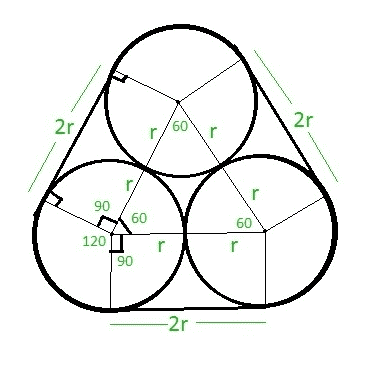

# 相互接触的三个相等圆圈周围的绳索长度

> 原文:[https://www . geesforgeks . org/绳子长度-绕三个相等的圈-相互接触/](https://www.geeksforgeeks.org/length-of-rope-tied-around-three-equal-circles-touching-each-other/)

给定 **r** 是三个相等的圆相互接触的半径。任务是找到系在圆圈周围的绳子的长度，如下所示:



**示例:**

> **输入:**r = 7
> T3】输出: 86
> 
> **输入:**r = 14
> T3】输出: 172

**进场:**从上图可以清楚的看到，绳子长度中没有碰到圆圈的部分是 **2r + 2r + 2r = 6r** 。
绳子接触圆圈的部分在每个圆圈上形成 120 度的扇形。因此，每个 120 度的三个扇区可以被认为是一个完整的 360 度的圆。
因此，绳索接触圆的长度为 **2 * PI * r** ，其中 **PI = 22 / 7** ， **r** 为圆的半径。
因此，绳索的总长度将为 **( 2 * PI * r ) + 6r** 。

下面是上述方法的实现:

## C++

```
// C++ program to find the length
// of rope
#include<bits/stdc++.h>
using namespace std;
#define PI 3.14159265

// Function to find the length
// of rope
float length_rope( float r )
{
    return ( ( 2 * PI * r ) + 6 * r );
}

// Driver code
int main()
{
    float r = 7;
    cout<<ceil(length_rope( r ))<<endl;
    return 0;
}
```

## C

```
// C program to find the length
// of rope
#include <stdio.h>
#define PI 3.14159265

// Function to find the length
// of rope
float length_rope( float r )
{
    return ( ( 2 * PI * r ) + 6 * r );
}

// Driver code
int main()
{
    float r = 7;
    printf("%f",
           length_rope( r ));
    return 0;
}
```

## Java 语言(一种计算机语言，尤用于创建网站)

```
// Java code to find the length
// of rope
import java.lang.*;

class GFG {

    static double PI = 3.14159265;

    // Function to find the length
    // of rope
    public static double length_rope(double r)
    {
        return ((2 * PI * r) + 6 * r);
    }

    // Driver code
    public static void main(String[] args)
    {
        double r = 7;
        System.out.println(length_rope(r));
    }
}
```

## 蟒蛇 3

```
# Python3 code to find the length
# of rope
PI = 3.14159265

# Function to find the length
# of rope
def length_rope( r ):
    return ( ( 2 * PI * r ) + 6 * r )

# Driver code
r = 7
print( length_rope( r ))
```

## C#

```
// C# code to find the length
// of rope
using System;

class GFG {
    static double PI = 3.14159265;

    // Function to find the length
    // of rope
    public static double length_rope(double r)
    {
        return ((2 * PI * r) + 6 * r);
    }

    // Driver code
    public static void Main()
    {
        double r = 7.0;
        Console.Write(length_rope(r));
    }
}
```

## 服务器端编程语言（Professional Hypertext Preprocessor 的缩写）

```
<?php
// PHP program to find the
// length of rope
$PI = 3.14159265;

// Function to find the length
// of rope
function length_rope( $r )
{
    global $PI;
    return ( ( 2 * $PI * $r ) + 6 * $r );
}

// Driver code
$r=7;
echo(length_rope( $r ));
?>
```

## java 描述语言

```
<script>

// Javascript program to find the length
// of rope
const PI = 3.14159265;

// Function to find the length
// of rope
function length_rope(r)
{
    return((2 * PI * r) + 6 * r);
}

// Driver code
let r = 7;
document.write(Math.ceil(length_rope(r)));

// This code is contributed by souravmahato348

</script>
```

**Output:** 

```
86
```