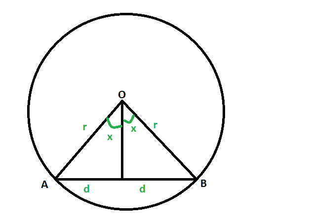
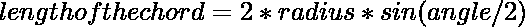

# 圆的弦长，圆的半径和弦对着圆心的角度为

> 原文:[https://www . geeksforgeeks . org/弦的长度圆的半径和角对着弦的中心给出/](https://www.geeksforgeeks.org/length-of-the-chord-of-the-circle-whose-radius-and-the-angle-subtended-at-the-center-by-the-chord-is-given/)

给定一个圆，它的半径和弦对着圆心的角度是给定的。任务是找到和弦的长度。
**例:**

```
Input: r = 4, x = 63 
Output: 4.17809

Input:: r = 9, x = 71
Output:: 10.448
```



**接近** :

1.  让圆以 **O** 为中心，半径为 **r** ，其弦为 **AB** 。
2.  弦长为 **2d** ，其对中的角度为 **2x** 度。
3.  当弦上的垂线将弦一分为二时，垂线也将对向角 **2x** 等分为 **x** 度。
4.  所以，从图上看，
    **d/r = sin(x*π/180)** (这里 x 度是以弧度换算的)
5.  于是， **d = rsin(x*π/180)**
    因此，**2d = 2rsin(x *π/180)**t5]
6.  所以，

以下是上述方法的实现:

## C++

```
// C++ program to find the length chord
// of the circle whose radius
// and the angle subtended at the centre
// is also given

#include <bits/stdc++.h>
using namespace std;

// Function to find the length of the chord
void length_of_chord(double r, double x)
{
    cout << "The length of the chord"
         << " of the circle is "
         << 2 * r * sin(x * (3.14 / 180))
         << endl;
}

// Driver code
int main()
{
    double r = 4, x = 63;
    length_of_chord(r, x);
    return 0;
}
```

## Java 语言(一种计算机语言，尤用于创建网站)

```
// Java program to find the length chord
// of the circle whose radius
// and the angle subtended at the centre
// is also given

class GFG
{

// Function to find the length of the chord
static void length_of_chord(double r, double x)
{
    System.out.println("The length of the chord"
        + " of the circle is "
        + 2 * r * Math.sin(x * (3.14 / 180)));
}

// Driver code
public static void main(String[] args)
{
    double r = 4, x = 63;
    length_of_chord(r, x);
}
}

// This code contributed by Rajput-Ji
```

## 蟒蛇 3

```
# Python3 program to find the length chord
# of the circle whose radius
# and the angle subtended at the centre
# is also given

import math as mt

# Function to find the length of the chord
def length_of_chord(r, x):

    print("The length of the chord"
        ," of the circle is "
        ,2 * r * mt.sin(x * (3.14 / 180)))

# Driver code
r = 4
x = 63;
length_of_chord(r, x)

# This code is contributed by mohit kumar
```

## C#

```
// C# program to find the length chord
// of the circle whose radius
// and the angle subtended at the centre
// is also given
using System;

class GFG
{

    // Function to find the length of the chord
    static void length_of_chord(double r, double x)
    {
        Console.WriteLine("The length of the chord" +
                        " of the circle is " +
                        2 * r * Math.Sin(x * (3.14 / 180)));

    }

    // Driver code
    public static void Main(String[] args)
    {
        double r = 4, x = 63;
        length_of_chord(r, x);
    }
}

// This code is Contributed by Naman_Garg
```

## 服务器端编程语言（Professional Hypertext Preprocessor 的缩写）

```
<?php
// PHP program to find the length chord
// of the circle whose radius and the
// angle subtended at the centre
// is also given

// Function to find the length of the chord
function length_of_chord($r, $x)
{
    echo "The length of the chord",
    " of the circle is "
    ,2 * $r * sin($x * (3.14 / 180)) ;

}
    // Driver code
    $r = 4; $x = 63;
    length_of_chord($r, $x);

    // This code is contributed by Ryuga

?>
```

## java 描述语言

```
<script>

// JavaScript program to find the length chord
// of the circle whose radius
// and the angle subtended at the centre
// is also given

// Function to find the length of the chord
function length_of_chord(r, x)
{
    document.write("The length of the chord"
        + " of the circle is "
        + 2 * r * Math.sin(x * (3.14 / 180))
        + "<br>");
}

// Driver code

    let r = 4, x = 63;
    length_of_chord(r, x);

// This code is contributed by Surbhi Tyagi.

</script>
```

**Output:** 

```
The length of the chord of the circle is 7.12603
```