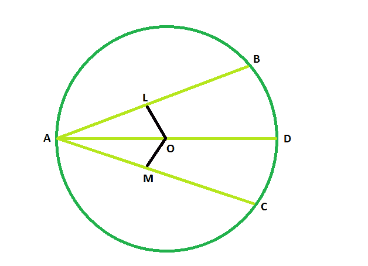

# 弦的长度如果给定了另一个弦的长度，该弦在直径上同样倾斜

> 原文:[https://www . geeksforgeeks . org/弦长-圆-如果给定另一个弦的长度，该弦同样倾斜穿过直径/](https://www.geeksforgeeks.org/length-of-the-chord-the-circle-if-length-of-the-another-chord-which-is-equally-inclined-through-the-diameter-is-given/)

给出了两个弦，这两个弦沿圆的直径相等地倾斜。给出了一个弦的长度。任务是找到另一个和弦的长度。
**例:**

```
Input: z = 48
Output: 48 degrees

Input: z = 93
Output: 93 degrees
```



**接近** :

*   设 **AB** 和 **AC** 为圆心在 **O** 的圆的两个弦。
*   现在，在我们看到的图中，
    **OL** 垂直于**AB****OM**垂直于 **AC**
*   在三角形 **OLA** 和三角形 **OMA** 、
    T5】中，角度 OLA =角度 OMA = 90 度
    **角度 OAL =角度 OAM** (因为弦通过直径相等倾斜)
    **OA = OA** (公共侧)
*   因此三角形 **OLA** 和三角形 **OMA** 彼此全等。
*   所以， **OL = 关于**
*   而且我们知道，等和弦与中心等距，所以 **AB** 和 **AC** 的长度会相同。

> **如果两个弦通过同一个圆的直径相等地倾斜，那么它们的长度相等。**

以下是上述方法的实现:

## C++

```
// C++ program to find
// the length of the chord the circle
// if length of the another chord
// which is equally inclined
// through the diameter is given

#include <bits/stdc++.h>
using namespace std;

void lengchord(int z)
{
    cout << "The length is "
         << z << endl;
}

// Driver code
int main()
{
    int z = 48;
    lengchord(z);
    return 0;
}
```

## Java 语言(一种计算机语言，尤用于创建网站)

```
// Java program to find
// the length of the chord the circle
// if length of the another chord
// which is equally inclined
// through the diameter is given
import java.io.*;

class GFG
{

static void lengchord(int z)
{
    System.out.println ("The length is "+ z );
}

// Driver code
public static void main (String[] args)
{

    int z = 48;
    lengchord(z);
}
}

// The code has been contributed by ajit.
```

## 蟒蛇 3

```
# Python3 program to find
# the length of the chord of the circle
# if length of the other chord
# which is equally inclined
# through the diameter is given
def lengchord(z):
    print("The length is ", end = "");
    print(z);

# Driver code
z = 48;
lengchord(z);

# This code is contributed
# by Princi Singh
```

## C#

```
// C# program to find
// the length of the chord the circle
// if length of the another chord
// which is equally inclined
// through the diameter is given
using System;

class GFG
{

static void lengchord(int z)
{
    Console.WriteLine("The length is "+ z );
}

// Driver code
static public void Main ()
{

    int z = 48;
    lengchord(z);
}
}

// The code has been contributed by Tushil
```

## java 描述语言

```
<script>

// javascript program to find
// the length of the chord the circle
// if length of the another chord
// which is equally inclined
// through the diameter is given

function lengchord(z)
{
    document.write("The length is "+ z );
}

// Driver code

var z = 48;
lengchord(z);

// This code is contributed by Amit Katiyar

</script>
```

**Output:** 

```
The length is 48
```