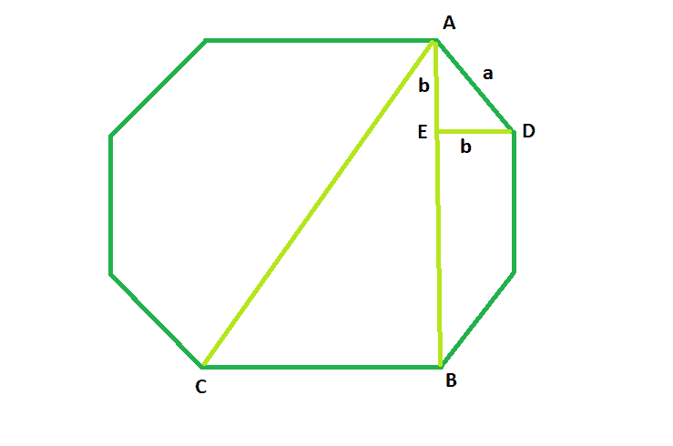

# 八边形对角线的长度

> 原文:[https://www . geesforgeks . org/八角对角线长度/](https://www.geeksforgeeks.org/length-of-the-diagonal-of-the-octagon/)

这里给出的是边长为 **a** 的正八边形，任务是求它的对角线长度。
**例:**

```
Input: a = 4
Output: 10.4525

Input: a = 5
Output: 13.0656
```



**接近**:从图中可以明显看出，

> **AB^2 + BC^2 = AC^2**
> 此处，在三角形 **AED、**t5**b^2+b^2 = a^2**t8】or、 **b=a/√2** ( [请参考](https://www.geeksforgeeks.org/program-to-find-the-side-of-the-octagon-inscribed-within-the-square/) )
> So、 **AB = a + 2b = a + √2a**
> 和、 **BC = a**
> So、对角线 **AC = a√**

以下是上述方法的实现:

## C++

```
// C++ Program to find the diagonal
// of the octagon
#include <bits/stdc++.h>
using namespace std;

// Function to find the diagonal
// of the octagon
float octadiagonal(float a)
{

    // side cannot be negative
    if (a < 0)
        return -1;

    // diagonal of the octagon
    return a * sqrt(4 + (2 * sqrt(2)));
}

// Driver code
int main()
{
    float a = 4;
    cout << octadiagonal(a) << endl;

    return 0;
}
```

## Java 语言(一种计算机语言，尤用于创建网站)

```
// Java  Program to find the diagonal
// of the octagon
import java.util.*;
class solution
{

// Function to find the diagonal
// of the octagon
static double octadiagonal(double a)
{

    // side cannot be negative
    if (a < 0)
        return -1;

    // diagonal of the octagon
    return a * Math.sqrt(4 + (2 * Math.sqrt(2)));
}

// Driver code
public static void main(String args[])
{
    double a = 4;
    System.out.println( octadiagonal(a));

}
}
//contributed by Arnab Kundu
```

## 蟒蛇 3

```
# Python3 Program to find the diagonal
# of the octagon
import math
# Function to find the diagonal
# of the octagon
def octadiagonal(a):

    # side cannot be negative
    if (a < 0):
        return -1;

    # diagonal of the octagon
    return a * math.sqrt(4 + (2 * math.sqrt(2)))

# Driver code
if __name__=='__main__':
    a = 4
    print (octadiagonal(a))

# This code is contributed by
# Shivi_Aggarwal
```

## C#

```
// C# Program to find the diagonal
// of the octagon
using System;

class GFG
{

// Function to find the diagonal
// of the octagon
static double octadiagonal(double a)
{

    // side cannot be negative
    if (a < 0)
        return -1;

    // diagonal of the octagon
    return a * Math.Sqrt(4 +
          (2 * Math.Sqrt(2)));
}

// Driver code
public static void Main()
{
    double a = 4;
    Console.WriteLine(octadiagonal(a));
}
}

// This code is contributed
// by inder_verma
```

## 服务器端编程语言（Professional Hypertext Preprocessor 的缩写）

```
<?php
// PHP program to find the diagonal
// of the octagon

// Function to find the diagonal
// of the octagon
function octadiagonal($a)
{

    // side cannot be negative
    if ($a < 0)
        return -1;

    // diagonal of the octagon
    return $a * sqrt(4 + (2 * sqrt(2)));
}

// Driver code

    $a = 4;
    echo octadiagonal($a) ;

// This code is contributed
// by inder_verma

?>
```

## java 描述语言

```
<script>
// javascript  Program to find the diagonal
// of the octagon

// Function to find the diagonal
// of the octagon
function octadiagonal(a)
{

    // side cannot be negative
    if (a < 0)
        return -1;

    // diagonal of the octagon
    return a * Math.sqrt(4 + (2 * Math.sqrt(2)));
}

var a = 4;
document.write( octadiagonal(a).toFixed(5));

// This code is contributed by 29AjayKumar
</script>
```

**Output:** 

```
10.4525
```