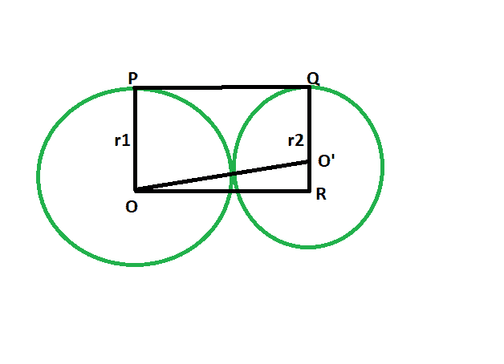
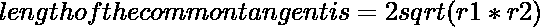

# 两个外部接触圆之间的直接公共切线的长度

> 原文:[https://www . geeksforgeeks . org/两个外部接触圆之间的直接公共切线长度/](https://www.geeksforgeeks.org/length-of-the-direct-common-tangent-between-two-externally-touching-circles/)

给定半径的两个圆，它们在外部相互接触。任务是找到圆之间的直接公共切线的长度。
**例:**

```
Input: r1 = 5, r2 = 9
Output: 13.4164

Input: r1 = 11, r2 = 13
Output: 23.9165
```



**接近**T2】

*   让半径分别为 **r1** & **r2** 。
*   画一条线**或**平行于 **PQ**
*   **角度 OPQ = 90 度**
    **角度奥 QP = 90 度**
    {圆心到接触点的连线与切线成 90 度角}
*   **角度 OPQ +角度 O ' qp = 180**
    T3】OP | | QR
*   由于对边平行，内角为 90°，因此 **OPQR** 为矩形。
*   所以 **OP = QR = r1** 和 **PQ = OR = r1+r2**
*   在三角形中**oo’r**
    **angle oro’= 90**
    由**勾股定理**
    **or^2+o'r^2 = oo'^2**
    **oo'^2 =(r1+r2)^2+(r1-r2)^2**
*   于是，**oo ' = 2r(R1 * R2)**
    

以下是上述方法的实现:

## C++

```
// C++ program to find the length of the direct
// common tangent between two circles
// which externally touch each other

#include <bits/stdc++.h>
using namespace std;

// Function to find the length
// of the direct common tangent
void lengtang(double r1, double r2)
{
    cout << "The length of the "
         << "direct common tangent is "
         << 2 * sqrt(r1 * r2) << endl;
}

// Driver code
int main()
{
    double r1 = 5, r2 = 9;
    lengtang(r1, r2);
    return 0;
}
```

## Java 语言(一种计算机语言，尤用于创建网站)

```
// Java program to find the length of the direct
// common tangent between two circles
// which externally touch each other
class GFG
{

    // Function to find the length 
    // of the direct common tangent
    static void lengtang(double r1, double r2)
    {
        System.out.println("The length of the "
                + "direct common tangent is "
                + (2 * Math.sqrt(r1 * r2)));
    }

    // Driver code
    public static void main(String[] args)
    {
        double r1 = 5, r2 = 9;
        lengtang(r1, r2);
    }
}

// This code contributed by Rajput-Ji
```

## 蟒蛇 3

```
# Python3 program to find the length
# of the direct common tangent
# between two circles which
# externally touch each other

# Function to find the length
# of the direct common tangent
def lengtang(r1, r2):
    print("The length of the direct",
                 "common tangent is",
             2 * (r1 * r2)**(1 / 2));

# Driver code
r1 = 5; r2 = 9;
lengtang(r1, r2);

# This code contributed
# by PrinciRaj1992
```

## C#

```
// C# program to find the length of the direct
// common tangent between two circles
// which externally touch each other
using System;

class GFG
{
    // Function to find the length
    // of the direct common tangent
    static void lengtang(double r1, double r2)
    {
        Console.WriteLine("The length of the "
                + "direct common tangent is "
                + (2 * Math.Sqrt(r1 * r2)));
    }

    // Driver code
    static public void Main ()
    {
        double r1 = 5, r2 = 9;
        lengtang(r1, r2);
    }
}

// This code contributed by ajit.
```

## 服务器端编程语言（Professional Hypertext Preprocessor 的缩写）

```
<?php
// PHP program to find the length of the direct
// common tangent between two circles
// which externally touch each other

// Function to find the length
// of the direct common tangent
function lengtang($r1, $r2)
{
    echo "The length of the "
        , "direct common tangent is "
        , 2 * sqrt($r1 * $r2) ;
}

// Driver code
$r1 = 5; $r2 = 9;
lengtang($r1, $r2);

// This code is contributed by AnkitRai01

?>
```

## java 描述语言

```
<script>

// javascript program to find the length of the direct
// common tangent between two circles
// which externally touch each other

// Function to find the length 
// of the direct common tangent
function lengtang(r1 , r2)
{
    document.write("The length of the "
            + "direct common tangent is "
            + (2 * Math.sqrt(r1 * r2)).toFixed(5));
}

// Driver code
var r1 = 5, r2 = 9;
lengtang(r1, r2);

// This code contributed by Princi Singh

</script>
```

**Output:** 

```
The length of the direct common tangent is 13.4164
```