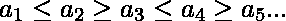
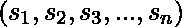
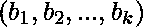
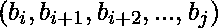
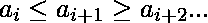
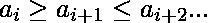
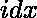
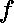
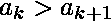
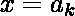

# 插入一个整数后向上向下的最长子段的长度

> 原文:[https://www . geeksforgeeks . org/最长子段长度-插入后是-up down-atmat-one-integer/](https://www.geeksforgeeks.org/length-of-the-longest-subsegment-which-is-updown-after-inserting-atmost-one-integer/)

如果不等式成立，整数序列被称为向上向下。
给你一个序列。您最多可以在序列中插入一个整数。它可以是任何整数。在添加一个向上向下的整数(或选择不添加)后，找到新序列最长的子片段的长度。
亚片段是序列的连续部分。也就是说，的一个子片段对于一些和将是的形式。
这个问题是在[2019 分区计算奥林匹克](https://www.iarcs.org.in/inoi/2019/zco2019/zco2019-question-paper.pdf)中问的。
**示例:**

> **输入:** arr[] = {1，10，3，20，25，24}
> **输出:** 7
> 假设我们在 20 和 25 之间插入 5，整个序列(1，10，3，20，5，25，24)
> 变成一个 UpDown 序列，因此答案是 7。
> **输入:** arr[] = {100，1，10，3，4，6，11}
> **输出:** 6
> 假设我们在 4 和 6 之间插入 4，序列(1，10，3，4，4，6)变成了 UpDown
> 序列，因此答案是 6。我们可以验证这是最好的可能
> 解决方案。

**方法:**让我们首先定义两种类型的序列:-

1.  **上升下降序列(UD) :** 形式的序列也就是说，该序列首先从增加开始。
2.  **向下向上序列(DU) :** 形式的序列也就是说，序列首先从递减开始。

让我们先找出 UD 和 DU 序列的长度，而不考虑问题的其他部分。为此，让我们将定义为从开始的最长上升序列，将定义为从开始的最长下降序列。
重复关系为:-

(1) 

这里，N 是序列的长度，状态是 1 或 2，分别代表 UD 和 DU 序列。在形成递归关系时，我们使用了这样的事实:在 UD 序列中

```
*** QuickLaTeX cannot compile formula:

*** Error message:
Error: Nothing to show, formula is empty

```

***，零件***

```
*** QuickLaTeX cannot compile formula:

*** Error message:
Error: Nothing to show, formula is empty

```

***是阿杜序列，反之亦然*** 。我们可以使用动态编程来计算的值，然后将我们的结果存储在数组 *dp[N][2]* 中。
现在，请注意，总是可以在 UpDown 序列的末尾插入一个整数，以将序列的长度增加 1，同时保留 UpDown 不等式。为什么呢？假设一个 UD 序列在处中断，因为在我们预计的时候是。我们可以在和之间插入一个整数。现在，满足了。
对于 UD 序列在中断的情况，我们可以给出类似的论点，因为是我们预期的。但是我们不需要插入任何东西。我们只需要找到可能的最长 UD 序列的长度。
观察 UD 序列是:-
的组合

1.  ***UD 序列 I + x + UD 序列 II**T3】如果 UD 序列 I 的长度是奇数*
2.  ***UD 序列 I + x + DU 序列 I**T3】如果 UD 序列 I 的长度是偶数*

其中，x 是插入的元素。
所以对于每个 I，我们计算从 I 开始的最长 UD 序列的长度。让该长度为 y。
如果 y 是奇数，我们在那里插入一个元素(理论上)，并计算从 i+y 开始的最长 UD 序列的长度。因此，插入元素后从 I 开始的最长 UD 序列是 *dp[i][1] + 1 + dp[i+y][1]* 。
如果 y 是偶数，我们在那里插入一个元素(理论上)，计算从 i+y 开始的最长 DU 序列的长度，因此插入元素后从 I 开始的最长 UD 序列是 *dp[i][1] + 1 + dp[i+y][2]* 。
最终答案是所有 I 中最大值

## C++

```
// C++ implementation of the approach
#include <bits/stdc++.h>
using namespace std;

// Function to recursively fill the dp array
int f(int i, int state, int A[], int dp[][3], int N)
{
    if (i >= N)
        return 0;

    // If f(i, state) is already calculated
    // then return the value
    else if (dp[i][state] != -1) {
        return dp[i][state];
    }

    // Calculate f(i, state) according to the
    // recurrence relation and store in dp[][]
    else {
        if (i == N - 1)
            dp[i][state] = 1;
        else if (state == 1 && A[i] > A[i + 1])
            dp[i][state] = 1;
        else if (state == 2 && A[i] < A[i + 1])
            dp[i][state] = 1;
        else if (state == 1 && A[i] <= A[i + 1])
            dp[i][state] = 1 + f(i + 1, 2, A, dp, N);
        else if (state == 2 && A[i] >= A[i + 1])
            dp[i][state] = 1 + f(i + 1, 1, A, dp, N);
        return dp[i][state];
    }
}

// Function that calls the resucrsive function to
// fill the dp array and then returns the result
int maxLenSeq(int A[], int N)
{
    int i, tmp, y, ans;

    // dp[][] array for storing result
    // of f(i, 1) and f(1, 2)
    int dp[1000][3];

    // Populating the array dp[] with -1
    memset(dp, -1, sizeof dp);

    // Make sure that longest UD and DU
    // sequence starting at each
    // index is calculated
    for (i = 0; i < N; i++) {
        tmp = f(i, 1, A, dp, N);
        tmp = f(i, 2, A, dp, N);
    }

    // Assume the answer to be -1
    // This value will only increase
    ans = -1;
    for (i = 0; i < N; i++) {

        // y is the length of the longest
        // UD sequence starting at i
        y = dp[i][1];

        if (i + y >= N)
            ans = max(ans, dp[i][1] + 1);

        // If length is even then add an integer
        // and then a DU sequence starting at i + y
        else if (y % 2 == 0) {
            ans = max(ans, dp[i][1] + 1 + dp[i + y][2]);
        }

        // If length is odd then add an integer
        // and then a UD sequence starting at i + y
        else if (y % 2 == 1) {
            ans = max(ans, dp[i][1] + 1 + dp[i + y][1]);
        }
    }
    return ans;
}

// Driver code
int main()
{
    int A[] = { 1, 10, 3, 20, 25, 24 };
    int n = sizeof(A) / sizeof(int);

    cout << maxLenSeq(A, n);

    return 0;
}
```

## Java 语言(一种计算机语言，尤用于创建网站)

```
// Java implementation of the approach
class GFG
{

    // Function to recursively fill the dp array
    static int f(int i, int state, int A[],
                 int dp[][], int N)
    {
        if (i >= N)
            return 0;

        // If f(i, state) is already calculated
        // then return the value
        else if (dp[i][state] != -1)
        {
            return dp[i][state];
        }

        // Calculate f(i, state) according to the
        // recurrence relation and store in dp[][]
        else
        {
            if (i == N - 1)
                dp[i][state] = 1;
            else if (state == 1 && A[i] > A[i + 1])
                dp[i][state] = 1;
            else if (state == 2 && A[i] < A[i + 1])
                dp[i][state] = 1;
            else if (state == 1 && A[i] <= A[i + 1])
                dp[i][state] = 1 + f(i + 1, 2, A, dp, N);
            else if (state == 2 && A[i] >= A[i + 1])
                dp[i][state] = 1 + f(i + 1, 1, A, dp, N);
            return dp[i][state];
        }
    }

    // Function that calls the resucrsive function to
    // fill the dp array and then returns the result
    static int maxLenSeq(int A[], int N)
    {
        int i,j, tmp, y, ans;

        // dp[][] array for storing result
        // of f(i, 1) and f(1, 2)
        int dp[][] = new int[1000][3];

        // Populating the array dp[] with -1
        for(i= 0; i < 1000; i++)
            for(j = 0; j < 3; j++)
                dp[i][j] = -1;

        // Make sure that longest UD and DU
        // sequence starting at each
        // index is calculated
        for (i = 0; i < N; i++)
        {
            tmp = f(i, 1, A, dp, N);
            tmp = f(i, 2, A, dp, N);
        }

        // Assume the answer to be -1
        // This value will only increase
        ans = -1;
        for (i = 0; i < N; i++)
        {

            // y is the length of the longest
            // UD sequence starting at i
            y = dp[i][1];

            if (i + y >= N)
                ans = Math.max(ans, dp[i][1] + 1);

            // If length is even then add an integer
            // and then a DU sequence starting at i + y
            else if (y % 2 == 0)
            {
                ans = Math.max(ans, dp[i][1] + 1 + dp[i + y][2]);
            }

            // If length is odd then add an integer
            // and then a UD sequence starting at i + y
            else if (y % 2 == 1)
            {
                ans = Math.max(ans, dp[i][1] + 1 + dp[i + y][1]);
            }
        }
        return ans;
    }

    // Driver code
    public static void main (String[] args)
    {
        int A[] = { 1, 10, 3, 20, 25, 24 };
        int n = A.length;

        System.out.println(maxLenSeq(A, n));
    }
}

// This code is contributed by AnkitRai01
```

## 蟒蛇 3

```
# Python3 implementation of the approach

# Function to recursively fill the dp array
def f(i, state, A, dp, N):
    if i >= N:
        return 0

    # If f(i, state) is already calculated
    # then return the value
    elif dp[i][state] != -1:
        return dp[i][state]

    # Calculate f(i, state) according to the
    # recurrence relation and store in dp[][]
    else:
        if i == N - 1:
            dp[i][state] = 1
        elif state == 1 and A[i] > A[i + 1]:
            dp[i][state] = 1
        elif state == 2 and A[i] < A[i + 1]:
            dp[i][state] = 1
        elif state == 1 and A[i] <= A[i + 1]:
            dp[i][state] = 1 + f(i + 1, 2, A, dp, N)
        elif state == 2 and A[i] >= A[i + 1]:
            dp[i][state] = 1 + f(i + 1, 1, A, dp, N)

        return dp[i][state]

# Function that calls the resucrsive function to
# fill the dp array and then returns the result
def maxLenSeq(A, N):

    # dp[][] array for storing result
    # of f(i, 1) and f(1, 2)
    # Populating the array dp[] with -1
    dp = [[-1, -1, -1] for i in range(1000)]

    # Make sure that longest UD and DU
    # sequence starting at each
    # index is calculated
    for i in range(N):
        tmp = f(i, 1, A, dp, N)
        tmp = f(i, 2, A, dp, N)

    # Assume the answer to be -1
    # This value will only increase
    ans = -1
    for i in range(N):

        # y is the length of the longest
        # UD sequence starting at i
        y = dp[i][1]
        if (i + y) >= N:
            ans = max(ans, dp[i][1] + 1)

        # If length is even then add an integer
        # and then a DU sequence starting at i + y
        elif y % 2 == 0:
            ans = max(ans, dp[i][1] + 1 + dp[i + y][2])

        # If length is odd then add an integer
        # and then a UD sequence starting at i + y
        elif y % 2 == 1:
            ans = max(ans, dp[i][1] + 1 + dp[i + y][1])

    return ans

# Driver Code
if __name__ == "__main__":
    A = [1, 10, 3, 20, 25, 24]
    n = len(A)
    print(maxLenSeq(A, n))

# This code is contributed by
# sanjeev2552
```

## C#

```
// C# implementation of the approach
using System;

class GFG
{

    // Function to recursively fill the dp array
    static int f(int i, int state, int []A,
                 int [,]dp, int N)
    {
        if (i >= N)
            return 0;

        // If f(i, state) is already calculated
        // then return the value
        else if (dp[i, state] != -1)
        {
            return dp[i, state];
        }

        // Calculate f(i, state) according to the
        // recurrence relation and store in dp[,]
        else
        {
            if (i == N - 1)
                dp[i, state] = 1;
            else if (state == 1 && A[i] > A[i + 1])
                dp[i, state] = 1;
            else if (state == 2 && A[i] < A[i + 1])
                dp[i, state] = 1;
            else if (state == 1 && A[i] <= A[i + 1])
                dp[i, state] = 1 + f(i + 1, 2, A, dp, N);
            else if (state == 2 && A[i] >= A[i + 1])
                dp[i, state] = 1 + f(i + 1, 1, A, dp, N);
            return dp[i, state];
        }
    }

    // Function that calls the resucrsive function to
    // fill the dp array and then returns the result
    static int maxLenSeq(int []A, int N)
    {
        int i, j, tmp, y, ans;

        // dp[,] array for storing result
        // of f(i, 1) and f(1, 2)
        int [,]dp = new int[1000, 3];

        // Populating the array dp[] with -1
        for(i = 0; i < 1000; i++)
            for(j = 0; j < 3; j++)
                dp[i, j] = -1;

        // Make sure that longest UD and DU
        // sequence starting at each
        // index is calculated
        for (i = 0; i < N; i++)
        {
            tmp = f(i, 1, A, dp, N);
            tmp = f(i, 2, A, dp, N);
        }

        // Assume the answer to be -1
        // This value will only increase
        ans = -1;
        for (i = 0; i < N; i++)
        {

            // y is the length of the longest
            // UD sequence starting at i
            y = dp[i, 1];

            if (i + y >= N)
                ans = Math.Max(ans, dp[i, 1] + 1);

            // If length is even then add an integer
            // and then a DU sequence starting at i + y
            else if (y % 2 == 0)
            {
                ans = Math.Max(ans, dp[i, 1] + 1 +
                                    dp[i + y, 2]);
            }

            // If length is odd then add an integer
            // and then a UD sequence starting at i + y
            else if (y % 2 == 1)
            {
                ans = Math.Max(ans, dp[i, 1] + 1 +
                                    dp[i + y, 1]);
            }
        }
        return ans;
    }

    // Driver code
    public static void Main (String[] args)
    {
        int []A = { 1, 10, 3, 20, 25, 24 };
        int n = A.Length;

        Console.WriteLine(maxLenSeq(A, n));
    }
}

// This code is contributed by 29AjayKumar
```

## java 描述语言

```
<script>
    // Javascript implementation of the approach

    // Function to recursively fill the dp array
    function f(i, state, A, dp, N)
    {
        if (i >= N)
            return 0;

        // If f(i, state) is already calculated
        // then return the value
        else if (dp[i][state] != -1)
        {
            return dp[i][state];
        }

        // Calculate f(i, state) according to the
        // recurrence relation and store in dp[][]
        else
        {
            if (i == N - 1)
                dp[i][state] = 1;
            else if (state == 1 && A[i] > A[i + 1])
                dp[i][state] = 1;
            else if (state == 2 && A[i] < A[i + 1])
                dp[i][state] = 1;
            else if (state == 1 && A[i] <= A[i + 1])
                dp[i][state] = 1 + f(i + 1, 2, A, dp, N);
            else if (state == 2 && A[i] >= A[i + 1])
                dp[i][state] = 1 + f(i + 1, 1, A, dp, N);
            return dp[i][state];
        }
    }

    // Function that calls the resucrsive function to
    // fill the dp array and then returns the result
    function maxLenSeq(A, N)
    {
        let i,j, tmp, y, ans;

        // dp[][] array for storing result
        // of f(i, 1) and f(1, 2)
        let dp = new Array(1000);

        // Populating the array dp[] with -1
        for(i= 0; i < 1000; i++)
        {
            dp[i] = new Array(3);
            for(j = 0; j < 3; j++)
            {
                dp[i][j] = -1;
            }
        }

        // Make sure that longest UD and DU
        // sequence starting at each
        // index is calculated
        for (i = 0; i < N; i++)
        {
            tmp = f(i, 1, A, dp, N);
            tmp = f(i, 2, A, dp, N);
        }

        // Assume the answer to be -1
        // This value will only increase
        ans = -1;
        for (i = 0; i < N; i++)
        {

            // y is the length of the longest
            // UD sequence starting at i
            y = dp[i][1];

            if (i + y >= N)
                ans = Math.max(ans, dp[i][1] + 1);

            // If length is even then add an integer
            // and then a DU sequence starting at i + y
            else if (y % 2 == 0)
            {
                ans = Math.max(ans, dp[i][1] + 1 + dp[i + y][2]);
            }

            // If length is odd then add an integer
            // and then a UD sequence starting at i + y
            else if (y % 2 == 1)
            {
                ans = Math.max(ans, dp[i][1] + 1 + dp[i + y][1]);
            }
        }
        return ans;
    }

    let A = [ 1, 10, 3, 20, 25, 24 ];
    let n = A.length;

    document.write(maxLenSeq(A, n));

</script>
```

**Output:** 

```
7
```

**时间复杂度:**O(n)
T3】空间复杂度: O(n)