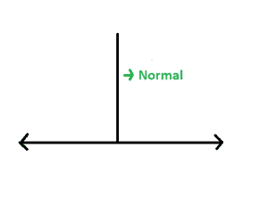
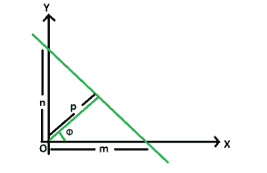

# 截距给定的直线上从原点开始的法线长度

> 原文:[https://www . geeksforgeeks . org/直线上正常原点的长度-其截距是给定的/](https://www.geeksforgeeks.org/length-of-the-normal-from-origin-on-a-straight-line-whose-intercepts-are-given/)

给定两个轴上直线的截距为 **m** 和 **n** 。任务是从原点找到这条直线上法线的长度。
**例:**

> **输入:** m = 5，n = 3
> **输出:** 2.57248
> **输入:** m = 13，n = 9
> **输出:** 7.39973

**接近:**直线的法线是从垂直于给定直线的点画出的线段。



设 **p** 为从原点到直线所画法线的长度，该直线与 x 轴正方向成一角度**θ**，如下。



然后，我们有**cosθ= p/m**和**sinθ= p/n**
既然，**sin<sup>2</sup>θ+cos<sup>2</sup>θ= 1**
所以，**(p/m)<sup>2</sup>+(p/n)<sup>2</sup>= 1**
我们得到， **p = m * n / √(m)**

## C++

```
// C++ implementation of the approach
#include <bits/stdc++.h>
using namespace std;

// Function to find the normal
// of the straight line
float normal(float m, float n)
{
    // Length of the normal
    float N = (fabsf(m) * fabsf(n))
              / sqrt((fabsf(m) * fabsf(m))
                     + (fabsf(n) * fabsf(n)));

    return N;
}

// Driver code
int main()
{
    float m = -5, n = 3;
    cout << normal(m, n);

    return 0;
}
```

## Java 语言(一种计算机语言，尤用于创建网站)

```
// Java implementation of the approach
class GFG
{

// Function to find the normal
// of the straight line
static float normal(float m, float n)
{
    // Length of the normal
    float N = (float) ((Math.abs(m) * Math.abs(n))
            / Math.sqrt((Math.abs(m) * Math.abs(m))
                    + (Math.abs(n) * Math.abs(n))));

    return N;
}

// Driver code
public static void main(String[] args)
{
    float m = -5, n = 3;
    System.out.println(normal(m, n));
}
}

// This code has been contributed by 29AjayKumar
```

## 蟒蛇 3

```
# Python3 implementation of the approach
import math;

# Function to find the normal
# of the straight line
def normal(m, n):

    # Length of the normal
    N = ((abs(m) * abs(n)) /
        math.sqrt((abs(m) * abs(m)) +
                  (abs(n) * abs(n))));

    return N;

# Driver code
m = -5; n = 3;
print(normal(m, n));

# This code is contributed
# by Akanksha Rai
```

## C#

```
// C# implementation of the approach
using System;

class GFG
{

// Function to find the normal
// of the straight line
static float normal(float m, float n)
{
    // Length of the normal
    float N = (float)((Math.Abs(m) * Math.Abs(n)) /
                       Math.Sqrt((Math.Abs(m) * Math.Abs(m)) +
                                 (Math.Abs(n) * Math.Abs(n))));

    return N;
}

// Driver code
public static void Main()
{
    float m = -5, n = 3;
    Console.Write(normal(m, n));
}
}

// This code is contributed by Akanksha Rai
```

## 服务器端编程语言（Professional Hypertext Preprocessor 的缩写）

```
<?php
// PHP implementation of the approach

// Function to find the normal
// of the straight line
function normal($m, $n)
{
    // Length of the normal
    $N = (abs($m) * abs($n))  /
              sqrt((abs($m) * abs($m))  +
                   (abs($n) * abs($n)));

    return $N;
}

// Driver code
$m = -5; $n = 3;
echo normal($m, $n);

// This code is contributed by Ryuga
?>
```

## java 描述语言

```
<script>

// javascript implementation of the approach

// Function to find the normal
// of the straight line
function normal(m , n)
{
    // Length of the normal
    var N =  ((Math.abs(m) * Math.abs(n))
            / Math.sqrt((Math.abs(m) * Math.abs(m))
                    + (Math.abs(n) * Math.abs(n))));

    return N;
}

// Driver code
var m = -5, n = 3;
document.write(normal(m, n).toFixed(5));

// This code is contributed by Amit Katiyar

</script>
```

**Output:** 

```
2.57248
```