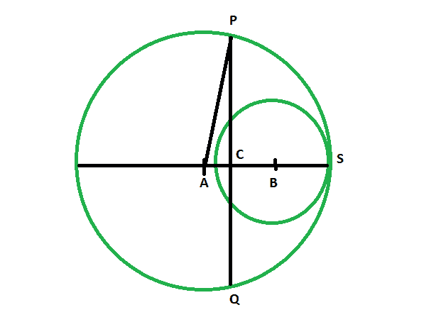

# 连接两个圆中心的直线的垂直平分线长度

> 原文:[https://www . geeksforgeeks . org/连接两个圆心的直线的垂直平分线长度/](https://www.geeksforgeeks.org/length-of-the-perpendicular-bisector-of-the-line-joining-the-centers-of-two-circles/)

给定两个圆，它们的半径是给定的，这样较小的圆完全位于较大的圆内，它们在一点上相互接触。我们必须找到连接圆心的直线的垂直平分线的长度。
**例:**

```
Input: r1 = 5, r2 = 3
Output: 9.79796

Input: r1 = 8, r2 = 4
Output: 15.4919
```



**接近** :

*   让两个圆以 **A** 和 **B** 为中心。垂直平分线 **PQ** ，在 **C** 处平分直线。

*   让大圆半径= **r1**
    小圆半径=**R2**T5】
*   所以， **AB = r1-r2** ，

*   因此，**AC =(R1-R2)/2**T2】
*   在，图中，我们看到
    **PA = r1**

*   在三角形 **ACP** 、
    **PC ^ 2+AC ^ 2 = pa ^ 2****【PC ^ 2 = pa ^ 2–AC ^ 2****【PC ^ 2 = R1 ^ 2-(R1-R2)】**
*   于是，**pq = 2 *√2-(R1-R2)^ 2/4)**

> **垂直平分线的长度= 2 * sqrt(r1^2 –( R1-R2)*(R1-R2)/4)**

以下是上述方法的实现:

## C++

```
// C++ program to find the Length
// of the perpendicular bisector
// of the line joining the centers
// of two circles in which one lies
// completely inside touching the
// bigger circle at one point

#include <bits/stdc++.h>
using namespace std;

void lengperpbisect(double r1, double r2)
{
    double z = 2 * sqrt((r1 * r1)
                        - ((r1 - r2)
                           * (r1 - r2) / 4));

    cout << "The length of the "
         << "perpendicular bisector is "
         << z << endl;
}

// Driver code
int main()
{
    double r1 = 5, r2 = 3;
    lengperpbisect(r1, r2);
    return 0;
}
```

## Java 语言(一种计算机语言，尤用于创建网站)

```
// Java program to find the Length
// of the perpendicular bisector
// of the line joining the centers
// of two circles in which one lies
// completely inside touching the
// bigger circle at one point

class GFG {

static void lengperpbisect(double r1, double r2)
{
    double z = 2 * Math.sqrt((r1 * r1)
                        - ((r1 - r2)
                        * (r1 - r2) / 4));

    System.out.println("The length of the "
        + "perpendicular bisector is "
        + z );
}

// Driver code
public static void main(String[] args)
{
    double r1 = 5, r2 = 3;
    lengperpbisect(r1, r2);
}
}

// This code has been contributed by 29AjayKumar
```

## 蟒蛇 3

```

# Python program to find the Length
# of the perpendicular bisector
# of the line joining the centers
# of two circles in which one lies
# completely inside touching the
# bigger circle at one point

def lengperpbisect(r1, r2):
    z = 2 * (((r1 * r1) - ((r1 - r2) * (r1 - r2) / 4))**(1/2));

    print("The length of the perpendicular bisector is ", z);

# Driver code
r1 = 5; r2 = 3;
lengperpbisect(r1, r2);

# This code contributed by PrinciRaj1992
```

## C#

```
// C# program to find the Length
// of the perpendicular bisector
// of the line joining the centers
// of two circles in which one lies
// completely inside touching the
// bigger circle at one point
using System;

class GFG
{

static void lengperpbisect(double r1, double r2)
{
    double z = 2 * Math.Sqrt((r1 * r1)
                        - ((r1 - r2)
                        * (r1 - r2) / 4));

    Console.WriteLine("The length of the "
        + "perpendicular bisector is "
        + z );
}

// Driver code
public static void Main()
{
    double r1 = 5, r2 = 3;
    lengperpbisect(r1, r2);
}
}

// This code has been contributed by anuj_67..
```

## java 描述语言

```
<script>
// javascript program to find the Length
// of the perpendicular bisector
// of the line joining the centers
// of two circles in which one lies
// completely inside touching the
// bigger circle at one point

function lengperpbisect(r1 , r2)
{
    var z = 2 * Math.sqrt((r1 * r1)
                        - ((r1 - r2)
                        * (r1 - r2) / 4));

    document.write("The length of the "
        + "perpendicular bisector is "
        + z.toFixed(5) );
}

// Driver code

var r1 = 5, r2 = 3;
lengperpbisect(r1, r2);

// This code is contributed by 29AjayKumar
</script>
```

**Output:** 

```
The length of the perpendicular bisector is 9.79796
```